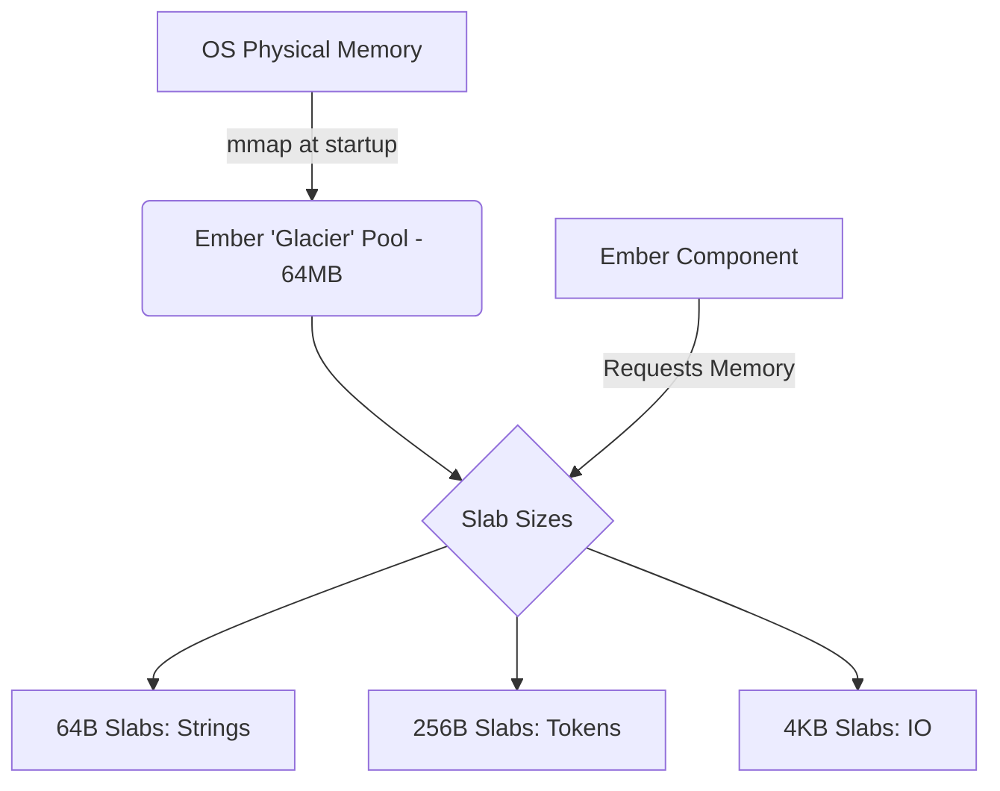

# Document 34: RESOURCE EFFICIENCY MANIFESTO – The Niflheim Protocol

## 1. Introduction: The Chill of Niflheim

If Surtr is the blazing fire of performance, Niflheim is the absolute, unyielding cold of resource constraint. In Norse cosmology, Niflheim is the realm of ice and mist. In Project Ember, the **Niflheim Efficiency Protocol** dictates how we achieve maximum capability with absolute minimum resources.

We live in an era of bloatware. Project Ember vehemently rejects this reality. Our target devices are chaotic, resource-starved environments. The Niflheim Protocol ensures that Ember operates with surgical precision, utilizing memory pooling, lazy loading, demand-paged components, zero-copy data paths, and memory-mapped operations.

---

## 2. Memory Pooling: The Ice Blocks

Dynamic memory allocation is computationally expensive and leads to memory fragmentation. 

### 2.1 The Niflheim Slab Allocator

Ember bypasses standard OS memory allocation. Upon startup, Ember allocates a single contiguous block of memory (the "Glacier"). This Glacier is subdivided into discrete slabs of fixed sizes (64B, 256B, 4KB, 1MB). When an object is no longer needed, the slab is marked as available in a bitmap. This guarantees **O(1) allocation time** and eliminates memory fragmentation entirely.



---

## 3. Lazy Loading & Demand-Paged Components

### 3.1 The Component 'Ghost' Architecture

In Ember, tools and skills exist as "Ghosts" in memory (~32 bytes). When a subagent calls a tool:
1. Niflheim traps the call.
2. Niflheim `mmap`s the tool's bytecode directly into memory.
3. The Ghost is replaced by the actual initialized tool.

### 3.2 Aggressive Unloading

If a loaded component is not used for 5 minutes, Niflheim drops its memory pages. Because components are `mmap`'d, the OS can just discard the RAM without writing to swap.

---

## 4. Zero-Copy Data Paths: The Glacial Flow

Niflheim mandates **Zero-Copy Architecture** across the entire agent lifecycle.

### 4.1 Zero-Copy Embeddings

When generating an embedding:
1. The document is `mmap`'d from disk.
2. The tokenizer reads directly from the `mmap` pointer.
3. The model outputs the vector directly into a pre-allocated slab in the memory-mapped Vector Database file.

```c
void generate_and_store_embedding(const char* file_path, VectorDB* db) {
    FileMap file = mmap_file(file_path);
    float* dest_vector = vector_db_get_insertion_pointer(db);
    nomic_embed_direct(file.data, file.size, dest_vector);
    unmap_file(&file);
}
```
Zero bytes of RAM were consumed by buffers.

---

## 5. The SQLite VFS Subsystem

Niflheim implements a custom SQLite Virtual File System (VFS) tuned for SD cards and eMMC storage.
- **Append-Only WAL:** The Write-Ahead Log is strictly append-only, grouping micro-transactions into contiguous blocks to save SD card wear.
- **Memory-Mapped Reads:** The entire SQLite database file is mapped directly into RAM, turning `SELECT` queries into blazing-fast pointer arithmetic.

---

## 6. Energy-Proportional Computing

The system should consume power strictly in proportion to the amount of useful work being done.

### 6.1 Epoll Wait and Sleep States

When Ember is idle, the main thread blocks entirely on `epoll_wait`. The CPU cores drop into deep sleep C-states, reducing system power draw from 5W to ~0.5W.

### 6.2 The 'Heartbeat' Throttler

Ember's background tasks run on a variable heartbeat:
- Wall power: ticks every 500ms.
- Battery power: ticks every 5 seconds.
- Battery < 20%: ticks every 60 seconds (background indexing suspended).

---

## 7. Invented Efficiency: The 'Diet-JSON' Protocol

Niflheim introduces **Diet-JSON (DSON)**. Instead of sending standard JSON for IPC, Ember uses binary representations. 
Key `"action"` becomes `0x01`. Value `"search"` becomes `0x0A`.
The payload `{"action": "search"}` becomes `[0x01, 0x0A]`.
This takes almost zero compute to serialize and reduces IPC bandwidth by 70%.

*(End of Document 34)*
