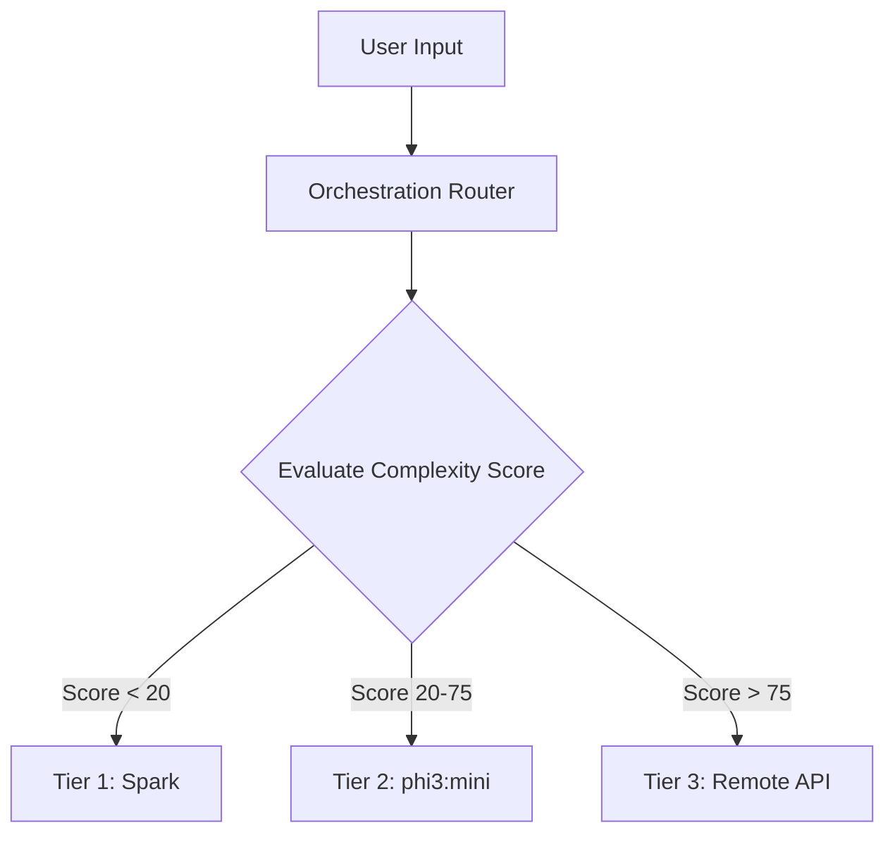

# Document 35: DYNAMIC MODEL ORCHESTRATION – The Flame Intensity Control

## 1. Introduction: The Flame Intensity

Project Ember is not bound to a single monolithic model. The **Flame Intensity Control** acts as an intelligent router, a resource evaluator, and a fallback mechanism. It ensures that the compute applied is perfectly matched to the cognitive demand of the task.

---

## 2. The Model Hierarchy

Ember conceptualizes available models in a tiered hierarchy:

### 2.1 Tier 1: The Sparks (Tiny/Edge Models)
- **Size:** < 1B Parameters (e.g., Qwen1.5-0.5B).
- **Use Case:** Intent classification, tool routing, fast entity extraction.
- **Cost:** Practically zero.

### 2.2 Tier 2: The Core Flame (Default Local Models)
- **Size:** 3B - 8B Parameters (e.g., `phi3:mini`).
- **Use Case:** General conversation, coding tasks, multi-step planning.
- **Cost:** Moderate. Uses the device's edge GPU/CPU resources.

### 2.3 Tier 3: The Inferno (Large/Remote Models)
- **Size:** 30B+ Parameters (e.g., GPT-4o, Llama-3-70B on cluster).
- **Use Case:** Complex mathematics, heavy synthesis.
- **Cost:** High (API/network cost).

---

## 3. The Orchestration Router

When a prompt enters Ember, it goes to the **Orchestration Router**, which executes a micro-second evaluation to determine the "Flame Intensity".

### 3.1 The Cognitive Complexity Heuristic

The Router scores the prompt on Context Depth, Logical Rigor, and Tool Dependency using a TF-IDF heuristic and a Tier 1 Spark model.

### 3.2 Dynamic Fallback and Escalation

If `phi3:mini` hits a cognitive ceiling (e.g., failing a task loop twice), the Orchestrator escalates the exact error state and context to a Tier 3 model.

---

## 4. Seamless Model Hot-Swapping

### 4.1 Speculative Loading

While the Tier 1 Spark model processes the immediate intent (streaming "I'm looking into that..."), the Orchestrator starts memory-mapping the Tier 2 model in the background. By the time the Spark finishes, `phi3:mini` is ready.

### 4.2 Context Portability

When escalating, Ember sends a highly compressed, synthesized "state vector" summary generated by `phi3:mini` to the Tier 3 model, ensuring the larger model starts with perfect structural understanding without re-reading 10,000 tokens.

---

## 5. Hardware-Aware Routing

The Flame Intensity Control probes the system to build a Hardware Profile Matrix.
- If the device is overheating, it shifts to Cloud Tier 3.
- If an NPU is available, it offloads INT8 Tier 2 models directly to the NPU.
- If RAM is < 1GB, it forces Tier 1 or heavily quantized Q2 models.

---

## 6. Invented Method: "Schizophrenic Decoding" (Multi-Model Consensus)

For precise tasks, Ember employs **Schizophrenic Decoding**. The Orchestrator instantiates multiple diverse smaller models locally (e.g., a Q4 Phi-3, Q4 Llama-3-8B).
1. All models generate simultaneously.
2. The Orchestrator reads logits from all models.
3. The token is selected based on a weighted average confidence score.

This "Ensemble of Experts" exceeds the logical rigor of a single 30B model entirely locally.

*(End of Document 35)*
