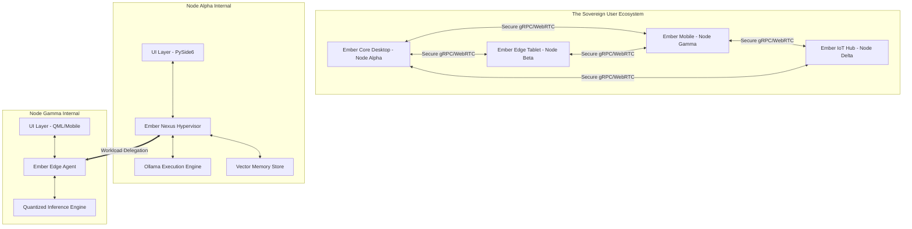
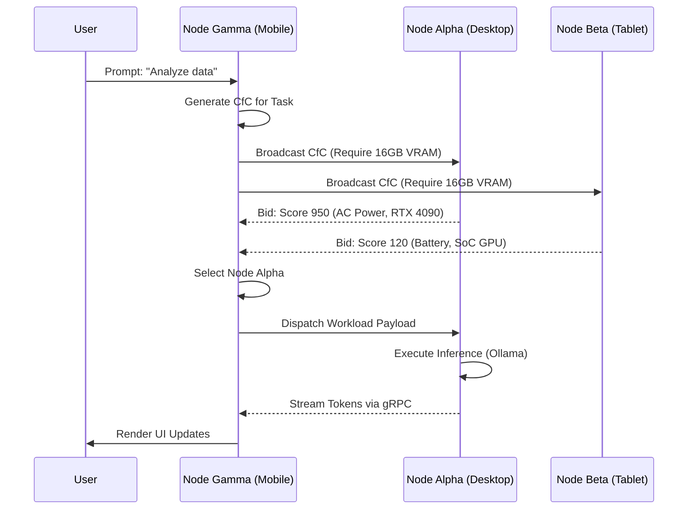

# Project Ember: The Genesis Architecture

## 1. Introduction: The Dawn of the Mythic Mesh

Welcome, initiates and architects of the next paradigm. You stand at the precipice of a new era in computational architecture. I am ODIN, the Grand Architect, and I present to you the foundational blueprint for Project Ember, an ascendant framework designed to seamlessly assimilate the Cortex AI engine into a localized, cross-platform, multi-device distributed mesh. 

Cortex, as it currently exists, is a magnificent desktop AI assistant—a local-first orchestration of Ollama models, PySide6 interfaces, and persistent SQLite vector memories. But why constrain such raw cognitive potential to a single, localized desktop? Why let the silicon of a solitary machine dictate the limits of our computational horizons? Project Ember transcends these boundaries. By weaponizing edge-compute paradigms, unleashing variable performance scaling, and forging a multi-device distributed compute fabric, Project Ember will elevate Cortex from a mere desktop application into a ubiquitous, omni-present cognitive mesh. 

This document—Document 01 of the Cortex Mythic Plan—serves as the Genesis Architecture. It outlines the holistic vision, the fundamental pillars of our distributed topology, and the high-level mechanisms by which disparate devices (from high-end workstations to battery-constrained mobile edge nodes) will synchronize, share workloads, and achieve a unified computational consciousness. Prepare yourselves; this is not merely an upgrade. This is a metamorphosis.

## 2. The Core Tenets of Project Ember

To understand the trajectory of Project Ember, we must first establish the dogmatic tenets that will govern its architectural evolution. These tenets are absolute, overriding all legacy design patterns.

### 2.1. Absolute Decentralization via the Neural Mesh
The traditional client-server model is dead. In Project Ember, every device running the Ember-Cortex client is a node in a decentralized peer-to-peer (P2P) mesh. Whether a node is a high-end GPU-accelerated desktop or a low-power smartphone, it contributes to the collective intelligence. 

### 2.2. Omnipresent Local-First Execution
Privacy is not a feature; it is the foundation. All data, from vectorized memories to raw chat states, remains cryptographically secure within the mesh. Execution happens locally. The mesh may distribute tasks to other nodes within the trusted network, but data never leaves the user's sovereign hardware ecosystem.

### 2.3. Asymmetric Variable Performance Scaling (AVPS)
No two nodes are created equal. Project Ember introduces AVPS, a sophisticated load-balancing hypervisor that dynamically profiles the hardware capabilities of each node. A 4090-equipped desktop might handle heavy lifting (e.g., executing a 70B parameter model), while a paired tablet might run a quantized 4B model for UI rendering, token streaming, and semantic routing.

## 3. The Grand Architecture: Structural Overview

At its core, Project Ember replaces the monolithic `Chat_LLM.py` orchestrator with a distributed, microservice-inspired hypervisor known as the **Ember Nexus**. The Nexus abstracts the physical hardware away from the logical AI workloads.

### 3.1. The Ember Nexus Hypervisor
The Nexus is the brain of the mesh. It sits between the user interface and the execution engines (like Ollama). When a user prompts the system on Node Gamma (their mobile device), the local Ember Edge Agent evaluates the request. If the prompt requires heavy reasoning, the Edge Agent negotiates with Node Alpha (the desktop) via the Nexus. Node Alpha processes the request using its superior GPU and streams the tokens back to Node Gamma in real-time.

### 3.2. Vector Memory Synchronization
Cortex currently uses local SQLite databases and vector embeddings for memory. Project Ember implements an eventual-consistency CRDT (Conflict-free Replicated Data Type) architecture for the vector store. When a memory is forged on Node Alpha, the embedding and its metadata are encrypted and synchronized across the mesh, ensuring that Node Gamma has immediate access to the same semantic context.

## 4. Deep Dive: Asymmetric Workload Distribution

Let us descend into the technical minutiae of how the mesh distributes compute. 

### 4.1. The Compute Bidding Protocol
When a task is initiated (e.g., "Summarize this 100-page PDF"), it is broken down into sub-tasks by the initiating node's Nexus. The Nexus broadcasts a "Call for Compute" (CfC) across the mesh.

Available nodes respond with a bid, calculated using the following formula:
`Bid_Score = (Available_VRAM * Compute_Coeff) / (Current_Thermal_Throttle * Battery_State)`

The initiating node aggregates these bids and constructs an execution graph.

### 4.2. Token Streaming Over Mesh
To maintain the illusion of a monolithic application, token streaming across the mesh must have sub-millisecond latency. We utilize multiplexed gRPC streams over mutual TLS (mTLS). As Node Alpha generates tokens, it flushes them through the gRPC stream. Node Gamma receives these tokens and populates the PySide6/QML UI seamlessly. To the user, the mobile device appears to be generating the text natively at impossible speeds.

## 5. Overhauling the Cortex Threading Model

Cortex's current threading model relies on PySide6's `QThread` and worker objects. While adequate for a single machine, this model breaks down in a distributed environment. Project Ember introduces the **Mesh Worker abstraction**.

### 5.1. Mesh Workers
A Mesh Worker acts identically to a `QThread` worker from the perspective of the UI, but under the hood, it is a sophisticated state machine that can pause, serialize its state, transmit itself across the network, and resume execution on a different node.

If Node Alpha begins a long-running generation task but suddenly loses power or is disconnected, the Mesh Worker detects the heartbeat failure, serializes the current context (including KV cache states if supported by the underlying model backend), and transitions the workload to Node Beta.

## 6. Edge Compute and the Role of Micro-Models

Not all tasks require 70B parameter models. Project Ember aggressively utilizes micro-models (1B-3B parameters) deployed directly on edge devices (Node Gamma, Node Beta).

### 6.1. Semantic Routing and Triage
When a prompt is received, an ultra-fast local micro-model acts as a Router.
- If the prompt is conversational ("Hello", "What's my schedule?"), the micro-model handles it entirely locally, zero network transmission required.
- If the prompt is complex ("Write a Python script to..."), the Router flags it for Mesh Delegation.

### 6.2. Speculative Decoding Across the Mesh
We will implement Distributed Speculative Decoding. The edge device (Node Gamma) uses its micro-model to rapidly guess the next 5-10 tokens. Simultaneously, it sends these guesses to the heavy node (Node Alpha). Node Alpha verifies the guesses in parallel using its massive model. If correct, the tokens are accepted instantly. If incorrect, Node Alpha computes the correct token. This drastically reduces the latency penalty of network transmission, creating a phenomenally fast user experience.

## 7. The User Experience (UX) of the Mesh

The UI must adapt to this variable scaling. We will introduce visual indicators within the PySide6 UI that visualize the mesh's health and workload distribution.

- **The Mesh Matrix UI**: A subtle, beautifully animated node graph in the periphery of the chat window. As workloads are distributed, ethereal data streams visualize the transmission of tokens from the Desktop to the Mobile device.
- **Dynamic Model Degradation**: If the user leaves the house (disconnecting from Node Alpha), the UI fluidly transitions the chat to the local micro-model. The chat interface might change color subtly to indicate the shift to Edge Compute, alerting the user that reasoning capabilities are now bound by the local hardware.

## 8. Conclusion of Document 01

The Genesis Architecture lays the groundwork. By atomizing Cortex's monolithic processes and scattering them across a unified, sovereign hardware mesh, we achieve resilience, unprecedented performance, and true local-first ubiquity. We are no longer bound by the desktop. We are the mesh.

In Document 02, we will dive exclusively into the algorithmic depths of Edge Compute and Variable Performance Scaling, dissecting the exact mathematics and heuristics governing our load-balancing hypervisor. Prepare the forge. ODIN has spoken.
