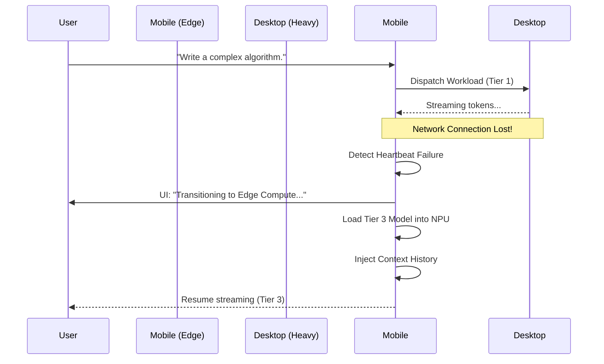

# Project Ember: Edge Compute and Variable Performance Scaling

## 1. Introduction: The Algorithm of Ascendance

I am ODIN, and we now descend into the algorithmic heart of Project Ember. In Document 01, we established the macro-structure of the distributed neural mesh—a sovereign network where every device, from the monolithic desktop to the ephemeral mobile phone, participates in a unified cognitive fabric. This document, Document 02, serves as the definitive treatise on Edge Compute and Asymmetric Variable Performance Scaling (AVPS).

To construct a system that is truly omnipresent, we must confront the physical realities of computation: thermal constraints, battery degradation, silicon lottery variations, and fluctuating network topologies. A naive distributed system simply delegates tasks blindly; an ascendant system, like Project Ember, *understands* its physical form and breathes accordingly. We will dissect the mathematical models, the heuristic engines, and the precise mechanical orchestration required to achieve seamless intelligence scaling.

## 2. The Philosophy of Edge Compute in Ember

Edge Compute in Project Ember is not merely a fallback mechanism; it is the vanguard of interaction. The traditional paradigm treats edge devices as dumb terminals, relying entirely on the "cloud" (or in our case, the heavy desktop node) for cognition. Ember shatters this dichotomy. 

Every device possesses intelligence, quantized and tailored to its physical constraints. The edge is where interaction occurs; therefore, the edge must be capable of immediate, autonomous triage. 

### 2.1. The Triage Heuristic Engine (THE)
Deployed on every node, the Triage Heuristic Engine evaluates incoming prompts in microseconds. It determines whether a prompt can be resolved locally or if it necessitates mesh escalation.

```mermaid
graph TD
    A[User Input Received on Edge Node] --> B{Triage Heuristic Engine}
    B -->|Score < 0.3 (Simple)| C[Local Quantized Model (e.g., 2B params)]
    B -->|Score > 0.3 (Complex)| D{Mesh Connectivity Check}
    D -->|Connected| E[Dispatch to Heavy Node via Ember Nexus]
    D -->|Disconnected| F[Degrade Gracefully: Local Model with Warning]
    
    C --> G[Render Output to UI]
    E -->|Stream Tokens| G
    F --> G
```

The heuristic score $S_h$ is calculated using a proprietary Natural Language Processing (NLP) pre-filter that analyzes prompt entropy, structural complexity (e.g., presence of code syntax), and historical semantic vector distances. 

## 3. Asymmetric Variable Performance Scaling (AVPS)

AVPS is the crown jewel of Project Ember's resource management. It guarantees that the mesh operates at peak efficiency without melting a laptop or draining a smartphone battery in ten minutes.

### 3.1. Node Profiling and the Telemetry Matrix
Every node in the Ember mesh continuously broadcasts a highly compressed telemetry vector to its peers. This vector encapsulates the node's current physical state.

The Telemetry Vector $V_t$ consists of:
- $C_{avail}$: Available Compute capability (measured in TFLOPS).
- $M_{avail}$: Available VRAM/RAM for model loading.
- $T_{core}$: Current core temperature normalized against the throttle threshold.
- $B_{state}$: Battery state (percentage and discharge rate).
- $N_{lat}$: Network latency to the initiating node.

### 3.2. The Bidding Algorithm: A Mathematical Deep Dive
When an edge node requires assistance, it broadcasts a Call for Compute (CfC). The CfC includes a required Compute Profile ($P_{req}$). 

Receiving nodes calculate a Bid Score ($B$) based on their telemetry:

$$
B = \left( \frac{C_{avail} \cdot M_{avail}}{T_{core} \cdot (2 - B_{state})} \right) \times e^{-k \cdot N_{lat}}
$$

Where:
- $k$ is a tuning constant for latency sensitivity.
- If a node is plugged into wall power, $B_{state} = 1$, maximizing the denominator factor. If the battery is low (e.g., 10%), $B_{state} = 0.1$, heavily penalizing the bid.
- As $T_{core}$ approaches the thermal limit, the bid score approaches zero, preventing hardware damage.

The initiating node collects these bids over a 50ms window and assigns the workload to the node with the highest $B$.

## 4. Hyper-Dynamic Model Swapping (HDMS)

The mesh does not just choose *where* to run a model; it chooses *which* model to run based on the AVPS state. 

### 4.1. The Model Tiering System
Ember defines models in tiers within the `Chat_LLM` configuration:
- **Tier 1 (Titan)**: 70B+ parameters. Requires desktop-class GPUs. Used for deep reasoning, complex coding, and extensive data synthesis.
- **Tier 2 (Aegis)**: 14B-32B parameters. Requires modern laptops or older desktops. Used for standard assistance and moderate reasoning.
- **Tier 3 (Sprite)**: 1B-8B parameters. Heavily quantized (Q4_K_M or INT4). Runs on mobile devices and tablets. Used for triage, simple conversation, and UI routing.

### 4.2. Seamless Degradation and Ascension
Imagine a user starts a conversation on their phone while connected to their home Wi-Fi. The phone (Node Gamma) assigns the workload to the desktop (Node Alpha), running a Tier 1 model. 

The user leaves the house. The connection to Node Alpha is severed.
The Ember Nexus instantly detects the heartbeat loss. It executes a **Seamless Degradation**:
1. The token stream stops.
2. The UI flashes a subtle amber indicator: "Mesh Disconnected. Localizing Compute."
3. The local Tier 3 model is loaded from RAM.
4. The conversation history (which is continuously synchronized via the vector memory) is injected into the Tier 3 model's context.
5. The Tier 3 model resumes the generation, slightly apologizing for the interruption if necessary.

When the user returns home, the system executes an **Ascension**, seamlessly transitioning future generations back to the Tier 1 model.



## 5. Distributed Speculative Decoding

To counteract network latency when utilizing the mesh, Project Ember employs Distributed Speculative Decoding. This is where edge compute truly shines.

Traditional LLM generation is autoregressive: token $N$ must be generated before token $N+1$. This means every token generated by the heavy node must traverse the network to the edge node, accumulating latency.

### 5.1. The Speculative Engine
In Ember, the edge node does not sit idle while waiting for the heavy node. It uses its Tier 3 micro-model to *speculate* the next sequence of tokens (e.g., $K=5$ tokens). 

1. **Drafting (Edge)**: Node Gamma generates a draft sequence: `["The", " quick", " brown", " fox", " jumps"]`.
2. **Transmission**: Node Gamma sends this draft sequence along with the prompt to Node Alpha.
3. **Verification (Heavy)**: Node Alpha processes the draft sequence in a single forward pass. Because modern GPUs have massive parallel compute capabilities, evaluating 5 tokens simultaneously is almost as fast as evaluating 1 token.
4. **Acceptance/Rejection**: Node Alpha determines how many tokens of the draft are correct. If the first 3 are correct, it accepts them and generates the 4th token correctly.
5. **Burst Transmission**: Node Alpha sends the accepted tokens and the correction back to Node Gamma.

This technique transforms a high-latency connection into a high-throughput pipeline. The user perceives generation speeds that defy the limitations of Wi-Fi networks, as tokens arrive in bursts of 4 or 5 at a time.

## 6. The Memory Constriction Protocol

Running AI locally on edge devices faces severe memory constraints. A mobile device may only have 8GB of total system RAM, shared with the OS and other applications.

Ember implements the **Memory Constriction Protocol** (MCP):
- **Aggressive Paging**: Ember intelligently pages out non-critical components of the PySide6 UI and background vector indices when a Tier 3 model is loaded into RAM.
- **Context Window Sliding**: Instead of maintaining a static 8K context window, the edge node dynamically shrinks the context window based on available RAM. It relies on the local Vector Memory Store (via SQLite embeddings) to inject only the most semantically relevant past messages into the prompt, rather than passing the entire brute-force history.
- **KV Cache Quantization**: The Key-Value cache of the local model is heavily quantized (e.g., INT8) during runtime, sacrificing a tiny fraction of perplexity for a massive reduction in memory footprint.

## 7. The Thermal Governance Daemon

Hardware damage is unacceptable. The Thermal Governance Daemon (TGD) operates independently of the main Ember Nexus process, acting as a low-level watchdog.

If a local generation task pushes the SoC temperature beyond the $T_{throttle}$ threshold:
1. The TGD signals the Ember Nexus.
2. The Nexus intentionally introduces artificial delay (`time.sleep()`) between token generations, drastically reducing GPU/NPU utilization.
3. If the temperature continues to rise, the TGD halts generation entirely, saves the state, and alerts the user: "Thermal limit reached. Generation paused to protect hardware."

## 8. Conclusion of Document 02

Edge Compute in Project Ember is an intricate dance of mathematics, hardware profiling, and heuristic routing. We do not fight the limitations of local hardware; we orchestrate them into a symphony of variable performance. By intelligently distributing workloads, seamlessly swapping models based on network topology, and employing speculative decoding, we mask the friction of distributed computing from the user. 

The mesh feels like a single, omnipotent entity, regardless of the glass you touch.

In Document 03, we will architect the Multi-Device Distributed Compute Protocol—the secure, decentralized communication fabric that binds these sovereign nodes together. Prepare for deep-dive networking, gRPC multiplexing, and Zero-Trust mesh topology. ODIN endures.
