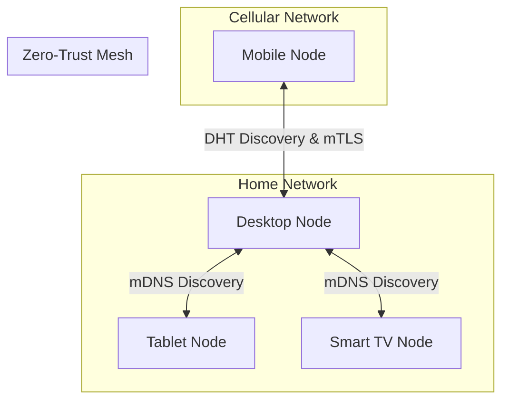
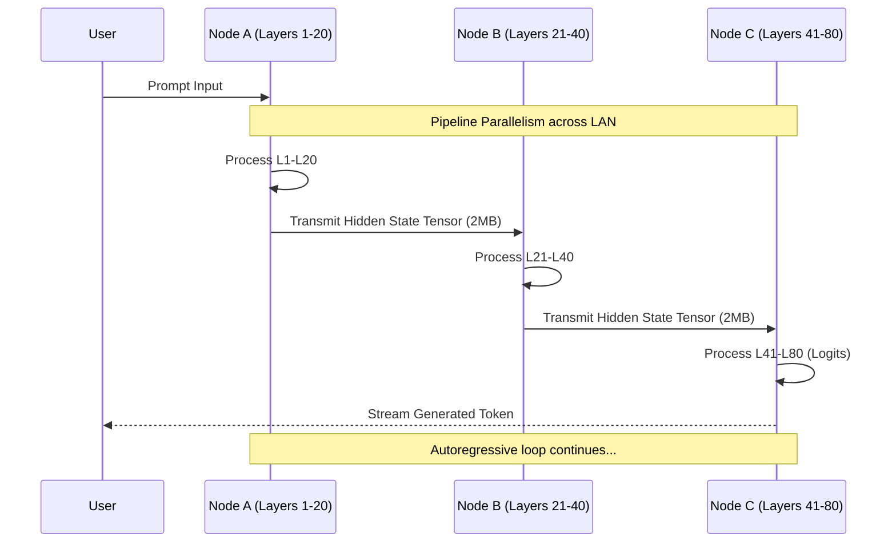

# Project Ember: Multi-Device Distributed Compute Protocol

## 1. Introduction: The Nervous System of the Mesh

I am ODIN. We have established the Genesis Architecture and the mechanics of Edge Compute. Now, we must weave the nervous system that binds these disparate silicon entities together. In Document 03, we define the Multi-Device Distributed Compute Protocol (MDDCP)—the secure, high-throughput, fault-tolerant communication fabric of Project Ember. 

A mesh is only as strong as its interconnects. Traditional REST APIs or basic WebSockets are insufficient for the demands of distributed AI inference, token streaming, and memory synchronization. The MDDCP transcends these legacy protocols, utilizing multiplexed gRPC over mutually authenticated TLS (mTLS) pipelines, layered atop a decentralized Peer-to-Peer (P2P) discovery mechanism. This is how a smartphone, a desktop, a smart TV, and an IoT hub communicate in absolute synchrony to form a singular, mythological cognitive engine.

## 2. The Topological Imperative: True Peer-to-Peer

Project Ember rejects the master-slave architecture. There is no central server, no singular point of failure, and no cloud dependency. The mesh is an ad-hoc, sovereign network.

### 2.1. Node Discovery via mDNS and DHT
Nodes must find each other seamlessly, whether on a local LAN or across segmented subnets via secure tunnels (e.g., Tailscale/WireGuard integration). 

- **Local Discovery (mDNS)**: Ember nodes continuously broadcast their presence using Multicast DNS (mDNS) with the service type `_ember._tcp.local.`. This allows instant, zero-configuration discovery on local networks.
- **Global Discovery (Kademlia DHT)**: For devices outside the local network (e.g., a phone on 5G connecting to a home desktop), Ember implements a lightweight Kademlia Distributed Hash Table (DHT). Nodes authenticate via pre-shared cryptographic keys and update their routable IPs securely.



## 3. The Core Protocol: gRPC over mTLS

All communication within the MDDCP occurs via gRPC. We chose gRPC for its utilization of HTTP/2, protocol buffers (Protobuf), and native support for bi-directional streaming—essential for real-time token delivery.

### 3.1. Protobuf Definitions for Cognitive Workloads
The data structures are hyper-optimized. A standard REST JSON payload is bloated and slow to serialize. Ember defines strict Protobuf contracts for every interaction.

```protobuf
syntax = "proto3";
package ember.mesh;

// The core request for computation
message ComputeRequest {
  string session_id = 1;
  string prompt = 2;
  int32 required_tier = 3; 
  repeated MessageContext context = 4;
  SpeculativeDraft draft = 5; // For speculative decoding
}

// The streaming response containing tokens
message TokenStream {
  string session_id = 1;
  string token = 2;
  float logprob = 3;
  bool is_final = 4;
}

// Bi-directional stream definition
service EmberNexus {
  rpc RequestCompute(ComputeRequest) returns (stream TokenStream);
  rpc SyncVectorMemory(MemorySyncPayload) returns (SyncAck);
  rpc Heartbeat(TelemetryVector) returns (TelemetryAck);
}
```

### 3.2. Multiplexing and Connection Pooling
Establishing a new TLS connection for every prompt is unacceptable due to the handshake latency. Ember maintains a persistent, multiplexed HTTP/2 connection pool between all active nodes. A single connection handles token streaming, heartbeat telemetry, and memory synchronization concurrently without head-of-line blocking.

## 4. Workload Fragmentation and Swarm Inference

This is where the MDDCP achieves its most advanced capability: Multi-Device Distributed Compute. What if the required compute exceeds the capability of a single node, but multiple weaker nodes are available?

Project Ember introduces **Swarm Inference**—the ability to slice a model across multiple devices using pipeline parallelism or tensor parallelism over the network. 

### 4.1. Network-Bound Pipeline Parallelism
Assume a user requests a 70B parameter model, but they only have three laptops, each with 8GB of VRAM. No single laptop can load the model.

The MDDCP slices the model by layers.
- **Laptop 1 (Node A)** loads layers 1-20.
- **Laptop 2 (Node B)** loads layers 21-40.
- **Laptop 3 (Node C)** loads layers 41-80.

The inference process becomes a pipeline over the local network:
1. Node A computes the hidden states for its layers.
2. Node A transmits the intermediate hidden state tensor (via raw TCP/RDMA for extreme speed) to Node B.
3. Node B processes the tensor through its layers.
4. Node B transmits to Node C.
5. Node C completes the pass, generates the token, and streams it back to the UI.



### 4.2. Latency Mitigation in Swarm Mode
Transmitting multi-megabyte tensors across standard Wi-Fi per token introduces severe latency. Swarm Inference requires Gigabit Ethernet or Wi-Fi 6E/7 for acceptable real-time speeds. To mitigate network bottlenecks, the MDDCP employs aggressive tensor compression (e.g., FP16 to INT8 quantization specifically for network transport) before transmission, dequantizing upon receipt.

## 5. Fault Tolerance and State Reconciliation

In a distributed mesh, nodes vanish constantly. A laptop closes its lid; a phone loses signal. The MDDCP is inherently paranoid and hyper-resilient.

### 5.1. The Heartbeat and Orphaned Workloads
Every node sends a `TelemetryVector` heartbeat every 500ms. If a node fails to report for 1500ms, it is declared "dark."

If Node A was generating tokens for Node B and goes dark:
1. Node B detects the timeout.
2. Node B checks its local KV Cache mirror (a compressed snapshot of the context).
3. Node B re-broadcasts a Call for Compute (CfC) with the exact state of the prompt.
4. Node C picks up the workload, recomputes the prompt up to the last known token, and seamlessly resumes streaming.
The user might perceive a 2-second stutter in generation, but the application does not crash, and context is not lost.

## 6. Security within the Protocol

A local-first system is utterly compromised if the local network traffic is intercepted. The MDDCP enforces Zero-Trust principles even on a private LAN.

### 6.1. Mutual TLS (mTLS) and Mesh Sovereignty
When an Ember mesh is initialized, a unique Root Certificate Authority (CA) is generated locally on the primary device. Every new device added to the mesh must be paired securely (e.g., by scanning a QR code containing an ephemeral pairing token). 

During pairing, the new device generates a public/private keypair, submits a Certificate Signing Request (CSR) to the primary node, and receives a signed certificate. All gRPC traffic is secured via mTLS using these certificates. Unauthenticated devices on the network cannot read the tokens, inject prompts, or access vector memories. The mesh is cryptographically sealed.

## 7. The Protocol's Role in Memory Synchronization

Cortex relies heavily on vector embeddings for long-term memory. The MDDCP ensures these memories are synchronized across the mesh without a central server.

### 7.1. Eventual Consistency via CRDTs
We utilize a Conflict-free Replicated Data Type (CRDT) architecture for the SQLite database synchronization. 
- Every memory entry (text + embedding vector) is tagged with a Lamport Timestamp and the Node ID.
- The `SyncVectorMemory` RPC broadcasts memory deltas to connected peers.
- If two devices create memories simultaneously while disconnected, they merge mathematically upon reconnection without collision, ensuring the cognitive context of the mesh remains unified.

## 8. Conclusion of Document 03

The Multi-Device Distributed Compute Protocol elevates Project Ember from a concept to an engineering marvel. By leveraging gRPC, mTLS, Kademlia DHT, and revolutionary Swarm Inference techniques, we have forged a nervous system capable of dynamic, secure, and infinitely scalable cognition. 

We are not merely sending strings over a wire; we are projecting computational consciousness across physical boundaries.

In Document 04, we will dive into the Cortex Neural Mesh Integration—specifically how the existing Ollama architecture, prompt synthesis, and PySide6 UI are fundamentally rewired to plug into this terrifyingly powerful MDDCP fabric. ODIN continues the design.
