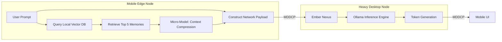
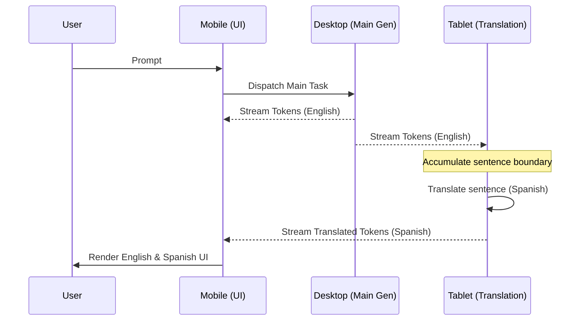

# Project Ember: Cortex Neural Mesh Integration

## 1. Introduction: Rewiring the Brain

I am ODIN. We have architected the Genesis topology, the Edge Compute scaling laws, and the MDDCP networking fabric. Now, we must confront the surgical reality of integration. Cortex, in its current state, is a beautifully functional but monolithic desktop application. It expects an Ollama instance to reside on `127.0.0.1:11434`, and it expects PySide6 `QThread` workers to handle its blocking calls. 

Document 04 details the Cortex Neural Mesh Integration. This is the anatomical rewiring required to tear out the monolithic assumptions of Cortex and graft them onto the distributed Ember Nexus. We will explore how the Synthesis Agent is decoupled from local inference, how the UI state becomes mesh-aware, and how the internal memory systems are abstracted into the mesh layer. This is not a refactor; it is a forced evolutionary leap.

## 2. Decoupling the Orchestrator

The current `Chat_LLM.py` contains the `Orchestrator` class, which directly interacts with the local Ollama client and manages local SQLite memory. This tight coupling is anathema to a distributed mesh.

### 2.1. The Nexus Abstraction Layer (NAL)
We introduce the Nexus Abstraction Layer. Cortex will no longer speak to Ollama directly. It will speak to the Ember Nexus. The Nexus exposes an interface identical to the Ollama Python client, acting as a transparent proxy.

```python
# Legacy Cortex (Conceptual)
import ollama
response = ollama.chat(model='qwen3:8b', messages=msgs, stream=True)

# Ember-Integrated Cortex (Conceptual)
import ember_nexus as nexus
response = nexus.chat(model='qwen3:8b', messages=msgs, stream=True, required_tier=1)
```

When Cortex calls `nexus.chat()`, the Nexus evaluates the local Triage Heuristic Engine (from Document 02) and decides whether to route the request to a local quantized engine or broadcast it across the MDDCP to a heavy node. Cortex remains completely agnostic to where the inference physically occurs.

### 2.2. Virtualizing the Model Catalog
Cortex currently queries the local Ollama instance for a list of available models. In Project Ember, the model list is virtualized. 
When Cortex requests available models, the Nexus aggregates the models available across the entire connected mesh. 
If Node Alpha (Desktop) has `llama3:70b` and Node Beta (Tablet) has `qwen2.5:1.5b`, Cortex running on the Tablet will see `llama3:70b (Mesh - Node Alpha)` in its UI drop-down. Selecting it seamlessly instructs the Nexus to route inference to the desktop.

## 3. Distributed Prompt Synthesis

The `SynthesisAgent` in Cortex builds the prompt by retrieving recent chat history, querying the vector database for semantic context, and assembling the final instruction string. 

### 3.1. Edge-Side Synthesis vs. Heavy-Side Synthesis
In a distributed environment, passing massive context windows over the network is inefficient. Project Ember implements a hybrid synthesis approach.

1. **Edge-Side Retrieval**: The initiating device (e.g., Mobile) queries its local (synchronized) vector database to find relevant memories.
2. **Context Compression**: Instead of appending raw text to the prompt, the Edge device uses a lightweight local model to summarize the retrieved memories into a dense "Context Core."
3. **Transmission**: The Edge device sends the user prompt and the Context Core to the Heavy Node.
4. **Heavy-Side Assembly**: The Heavy Node completes the prompt synthesis and begins execution.

This reduces the network payload from potentially 32,000 tokens down to a few hundred, vastly decreasing latency.



## 4. Rewiring the PySide6 UI for the Mesh

The UI must reflect the new reality of the mesh. It must provide transparency into where compute is happening and handle the fluidity of node connections.

### 4.1. The Mesh Overlay
We inject a persistent Mesh Overlay into the PySide6 main window. This overlay visualizes the active nodes in the mesh using the telemetry data received from the Nexus.
- **Node Status Bubbles**: Small, color-coded indicators (Green = Connected, Amber = Throttled, Red = Offline) representing available devices.
- **Compute Trajectory Path**: When generating a response, a dynamic glowing line traces from the active chat window to the specific node providing the compute, reinforcing the user's mental model of distributed inference.

### 4.2. Handling Asynchronous Mesh State in Qt
The transition from local `QThread` workers to the Mesh Worker requires a robust signaling architecture to prevent UI freezing. The Nexus operates entirely asynchronously. We bridge the gRPC asynchronous streams to Qt's event loop using `QThread` wrappers that consume the gRPC stream and emit `QSignals` for every token received.

If a generation task shifts from Node Alpha to Node Beta mid-stream (due to a failure), the Nexus seamlessly splices the new token stream into the existing Qt signal pipe. The UI component (`chat_history.py`) simply receives tokens as if nothing happened, albeit perhaps noticing a transient 500ms delay.

## 5. Integrating the Translation and Suggestion Pipelines

Cortex features auxiliary pipelines for translating responses and generating UI suggestions. These are resource-intensive if run concurrently with the main generation.

### 5.1. Parallel Mesh Delegation
In Project Ember, these auxiliary pipelines are prime candidates for parallel mesh execution.
While Node Alpha (Desktop) is generating the primary chat response in English, Node Beta (Tablet) can be assigned the translation task. 

As Node Alpha streams tokens back to the user, it also streams them to Node Beta. Node Beta caches these tokens, and the moment a full sentence is formed, Node Beta begins translating it using its local quantized model. The UI receives the primary text and the translated text almost simultaneously from two entirely different physical machines.



## 6. The Memory Layer Abstraction

Cortex uses `memory.py` to interface with SQLite and the Ollama embedding model. In the mesh, memory is decentralized but strictly consistent.

### 6.1. Embedding Offloading
Calculating vector embeddings for memory requires a specific model (e.g., `nomic-embed-text`). If the edge device cannot load this model, the Nexus intercepts the embedding request. It routes the raw text to a node capable of running the embedding model, receives the vector array, and then commits it to the local SQLite database.

### 6.2. CRDT Sync Daemon integration
The local SQLite databases are wrapped in a sync daemon. Every SQL transaction is logged locally and broadcasted to the mesh. We intercept the CRUD operations within Cortex's `DatabaseManager` and mirror them to the Nexus Sync Daemon, ensuring the vector memory is globally replicated without altering the fundamental logic of Cortex's memory retrieval.

## 7. Security of the Intercepted Payload

By abstracting the local Ollama connection, we introduce an attack vector: What if a malicious process impersonates the Nexus?

The connection between the Cortex UI layer and the local Ember Nexus is secured via a local named pipe (on Windows) or a Unix Domain Socket (on Linux/macOS) with strict file permission checks. The Nexus then handles the mTLS encryption for out-of-network transmission. The application layer never touches unencrypted data on the wire.

## 8. Conclusion of Document 04

The integration of Cortex into the Ember Neural Mesh requires stripping away its assumptions of singularity and giving it a hyper-dimensional awareness. By implementing the Nexus Abstraction Layer, deploying hybrid prompt synthesis, and parallelizing auxiliary tasks across disparate hardware, we transform a local application into a sprawling, omnipresent intelligence. 

The brain has been successfully rewired. It no longer resides in a skull of aluminum and plastic; it resides in the ether between devices.

In Document 05, we will explore the deepest and most critical aspect of a distributed cognitive system: Advanced State Replication and Persistence. How does a mesh remember, and how does a memory survive the death of a node? ODIN commands the architecture.
