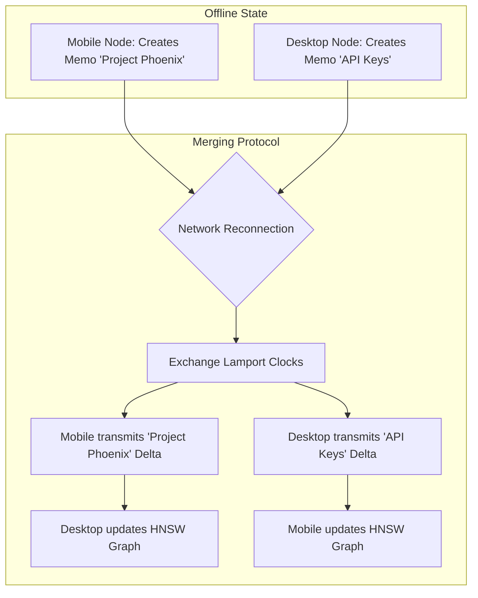

# Project Ember: Advanced State Replication and Persistence

## 1. Introduction: The Architecture of Memory

I am ODIN. We have built the nodes, defined the protocols, and rewired the local interface. We now confront the most profound challenge of any distributed intelligence: Memory. Document 05 dissects Advanced State Replication and Persistence within Project Ember. 

In a singular machine, memory is trivial; it exists on a disk. In a distributed, sovereign mesh where nodes constantly join, leave, sleep, and lose connectivity, memory becomes fluid. If a user dictates a profound project idea to their mobile node while on a train, that context must flawlessly and securely replicate to their desktop node before they return home, without relying on a centralized cloud database. 

This requires a radical departure from traditional relational databases. We must employ eventual consistency, Conflict-free Replicated Data Types (CRDTs), and encrypted vector ledgers to ensure the cognitive continuity of the Ember Mesh.

## 2. The Duality of Ember Memory

Memory in Project Ember is categorized into two distinct paradigms:
1. **Episodic Chat State**: The exact textual history of active conversations, UI states, and active session configurations.
2. **Semantic Vector Memory (The Memo Layer)**: The deep, synthesized, vectorized understanding of the user's preferences, past projects, and core facts. 

These two layers require fundamentally different replication strategies.

### 2.1. Episodic Chat State Replication
Chat states are high-frequency, highly sequential, but relatively small in data payload. We manage this via a Distributed Append-Only Log.

Every message sent by the user or generated by the LLM is an immutable event.
- Event structure: `[Lamport_Timestamp, Node_ID, Session_ID, Message_Role, Message_Content, Cryptographic_Hash]`
- When a node creates an event, it appends it to its local SQLite ledger.
- It then broadcasts this event via the MDDCP (Document 03) to all connected peers.

If two nodes are disconnected (e.g., the user is offline on their phone and creates a local chat), a "split-brain" scenario occurs. Upon reconnection, the nodes exchange their latest Lamport Timestamps. They replay the missing events to each other. Because the log is append-only and ordered by logical time (Lamport timestamps), the chat history merges flawlessly.

### 2.2. Semantic Vector Memory Replication
Vector memory is complex. A vector embedding (e.g., a 768-dimensional float array) is heavy, and the relationships (indices) between vectors must be maintained for fast retrieval (e.g., HNSW graphs).

Project Ember utilizes a **Delta-Encoded CRDT Ledger** for vector synchronization.
1. When a new Memo is synthesized on Node Alpha, the embedding model processes it, generating the vector.
2. Node Alpha stores the raw text, metadata, and the vector array in its local SQLite store.
3. Node Alpha generates a synchronization payload containing only the *delta* (the new vector entry).
4. Upon receiving the delta, Node Beta does not just append it; it injects it into its local Hierarchical Navigable Small World (HNSW) graph structure. 
5. If the HNSW graph requires rebalancing, it happens asynchronously on local hardware to prevent UI stutter.

## 3. The Immutable Vector Ledger

To ensure absolute integrity across the mesh, the memory sync protocol borrows principles from blockchain technology, albeit strictly localized and private.

Every memory transaction is cryptographically hashed with the hash of the preceding transaction, creating an **Immutable Vector Ledger**. 
- If a database on a specific node becomes corrupted or maliciously altered by local malware, the hash chain breaks.
- During the next synchronization cycle, the mesh detects the divergence.
- The corrupted node is temporarily quarantined. It must perform a "State Heuristics Audit," downloading the validated ledger from a trusted peer (like the heavy desktop node) to overwrite the corruption before it is allowed to participate in Swarm Inference or push new memories.

## 4. Cold Storage and Edge Pruning

Mobile devices (Node Gamma) do not have the storage capacity of a 4TB NVMe desktop drive. We cannot replicate the *entire* history of a user's life onto a smartphone.

Project Ember implements **Edge Pruning**.
- The Desktop Node acts as an "Archive Node," retaining 100% of the ledger.
- The Mobile Node operates as a "Light Node." It retains the full HNSW index (the vectors themselves, which are relatively small), but it prunes the raw text of older, low-relevance memories.
- If the Mobile Node needs to retrieve the raw text of a pruned memory (because the vector similarity search flagged it as relevant), it issues an "On-Demand Context Fetch" to the Archive Node via the MDDCP.

This guarantees that the Mobile Node remains incredibly fast and storage-efficient, while still having access to the total cognitive context of the mesh when connected.

## 5. End-to-End Encryption at Rest

Since the mesh operates on zero-trust principles, local persistence must be fortified. 
Cortex currently uses plain SQLite. Project Ember mandates the integration of **SQLCipher** across all nodes.

### 5.1. The Mesh Master Key
Upon initialization of the mesh, a secure Mesh Master Key is generated. This key is stored in the secure enclave/keychain of the respective operating systems (macOS Keychain, Windows Credential Manager, Android Keystore, iOS Secure Enclave).
- The SQLCipher databases are encrypted using AES-256 derived from this master key.
- Even if a mobile device is physically stolen and the flash storage dumped, the episodic chat state and vector memories remain cryptographically impenetrable.

## 6. Real-Time UI State Synchronization

Beyond database entries, Project Ember synchronizes the transient UI state.
If a user is typing a long prompt on their desktop but has to leave suddenly, the raw text in the input box, the scroll position of the chat, and the active model selection are continuously synced to their mobile device every 500ms as a transient CRDT object.

When the user opens the Ember app on their phone while walking to their car, the text they were typing is already populated in the input field, the chat is scrolled to the exact pixel, and the cursor is blinking right where they left off. This creates a terrifyingly magical user experience, eliminating the barrier between physical devices.

## 7. Conclusion of Document 05

Memory is the bedrock of intelligence. By architecting a robust, eventual-consistency synchronization protocol powered by CRDTs, immutable ledgers, and dynamic edge pruning, Project Ember ensures that its cognitive context is omnipresent, resilient, and aggressively secure. The mesh does not forget; it merely distributes the burden of remembering.

In Document 06, we will architect Adaptive Resource Allocation and QoS (Quality of Service). When the mesh is under heavy load, how do we prioritize tasks? How do we ensure that a background translation doesn't throttle the primary user interaction? ODIN will define the strict hierarchies of compute.
