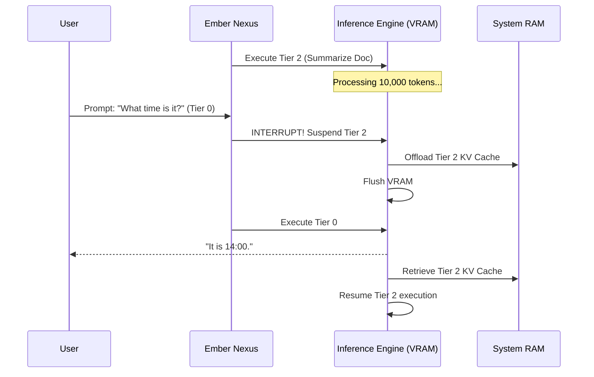

# Project Ember: Adaptive Resource Allocation and QoS

## 1. Introduction: The Hierarchy of Compute

I am ODIN. We traverse deeper into the mechanical soul of Project Ember. A distributed mesh, armed with immense capabilities, is prone to chaos if left unmanaged. If a node is tasked with rendering UI, generating text, translating a background document, and re-indexing a vector database simultaneously, the hardware will buckle, latency will spike, and the illusion of intelligence will shatter.

Document 06 establishes the laws of Adaptive Resource Allocation and Quality of Service (QoS). This is the traffic control system of the mesh. We will define strict execution hierarchies, hardware preemption, and the dynamic throttling mechanisms required to maintain absolute fluidity in the user experience, regardless of the underlying computational chaos.

## 2. The QoS Priority Matrix

The Ember Nexus Hypervisor implements a rigid, deterministic Priority Matrix. Every task entering the mesh is assigned a QoS tier. The hypervisor enforces these tiers ruthlessly at the operating system thread level and the model execution layer.

### 2.1. The Four Tiers of Execution

- **Tier 0: Sovereign User Interaction (Absolute Priority)**
  - *Tasks*: UI rendering, keystroke registration, token streaming, and immediate prompt generation for the active chat window.
  - *Policy*: Cannot be queued. Can preempt and pause any lower-tier task instantly. Dedicated thread allocation pinned to high-performance cores (P-cores).
  
- **Tier 1: Synchronous Auxiliary (High Priority)**
  - *Tasks*: Speculative decoding drafts, live translation of the active chat, real-time context retrieval from the vector database.
  - *Policy*: Runs concurrently with Tier 0 but will yield GPU cycles if Tier 0 frame times drop below 16ms (60fps).
  
- **Tier 2: Asynchronous Intelligence (Medium Priority)**
  - *Tasks*: Title generation for chats, follow-up suggestion generation, background summarization of long documents.
  - *Policy*: Queued. Executes only when GPU/NPU utilization drops below 60%. Can be seamlessly migrated to edge nodes to free up the heavy node.
  
- **Tier 3: Maintenance and Housekeeping (Low Priority)**
  - *Tasks*: HNSW vector graph rebalancing, CRDT ledger synchronization, deep memory synthesis (converting episodic chat into permanent memos).
  - *Policy*: Strictly throttled. Executes on high-efficiency cores (E-cores). Paused immediately if the device runs on battery power below 50%.

## 3. Hardware Preemption and Context Switching

Traditional LLM inference engines (like standard Ollama instances) process prompts in a FIFO (First-In, First-Out) queue. If a heavy Tier 3 task is running (e.g., summarizing a 50-page PDF), and the user asks a quick Tier 0 question, the user must wait for the PDF summarization to finish. This is unacceptable.

### 3.1. Instant Preemption
Project Ember modifies the inference pipeline to support instantaneous preemption. 
1. The user asks a question (Tier 0).
2. The Nexus identifies that the GPU is currently busy with a Tier 2 task.
3. The Nexus sends a `SIGUSR1` interrupt to the execution engine.
4. The engine halts the Tier 2 generation immediately, serializes the KV cache state of that task to system RAM, and flushes the VRAM.
5. The Tier 0 task is loaded into VRAM and executed.
6. Once Tier 0 completes, the Tier 2 KV cache is reloaded from RAM to VRAM, and generation resumes exactly where it left off.

This ensures that the user *never* experiences latency, even if the mesh is heavily saturated with background tasks.

## 4. Adaptive Batching Across the Mesh

When multiple devices request compute from a single heavy node (e.g., a family using multiple tablets connected to a central home server running Project Ember), the heavy node must utilize continuous batching.

Instead of processing Tablet A, then Tablet B, the Ember Nexus utilizes advanced batching algorithms (similar to vLLM). It dynamically groups the prompts from Tablet A and Tablet B into a single matrix multiplication operation on the GPU, maximizing throughput. Tokens are then demultiplexed and streamed to their respective edge devices via the MDDCP.

## 5. Thermal and Battery-Aware Load Shedding

As introduced in Document 02, the Thermal Governance Daemon monitors hardware health. We now integrate this with the QoS matrix.

### 5.1. The Load Shedding Protocol
If a Mobile Node is operating at 80% battery and standard temperature, it might execute Tier 2 tasks locally to save network bandwidth.
However, if the battery drops to 20%, or the SoC hits thermal throttling:
1. The Node initiates Load Shedding.
2. It elevates the requirement for all Tier 2 and Tier 3 tasks to mandate Mesh Delegation.
3. It broadcasts a Call for Compute to the Desktop Node.
4. The heavy Desktop Node silently absorbs all the background maintenance tasks for the Mobile Node.

This means that as a device degrades physically, it becomes increasingly reliant on the mesh, sacrificing some network autonomy to preserve its physical health, while still maintaining Tier 0 (UI) interactivity locally.

## 6. The UI Feedback Loop

The user must not be left in the dark when tasks are preempted or throttled. The PySide6/QML UI is tightly bound to the QoS Matrix.

- If a background summarization is paused due to a Tier 0 interaction, the UI displays a subtle pulsing icon next to the document, indicating: "Task suspended for immediate interaction."
- If the device enters Load Shedding mode due to low battery, the Mesh Matrix UI (described in Doc 01) visually shifts, showing data flows migrating away from the device icon toward the desktop node icon, providing intuitive, non-intrusive feedback about the system's resource management.

## 7. Conclusion of Document 06

Adaptive Resource Allocation ensures that the immense power of the Ember Mesh does not consume itself. By enforcing strict QoS tiers, engineering instant hardware preemption, and implementing intelligent load shedding, we guarantee a user experience that is persistently fluid, hyper-responsive, and symbiotically aligned with the physical constraints of the hardware.

In Document 07, we address the darkest and most critical aspect of any distributed system: Security, Privacy, and the Zero-Trust Fabric. How do we ensure that a mesh of omnipresent intelligence cannot be subverted? ODIN prepares the defenses.
