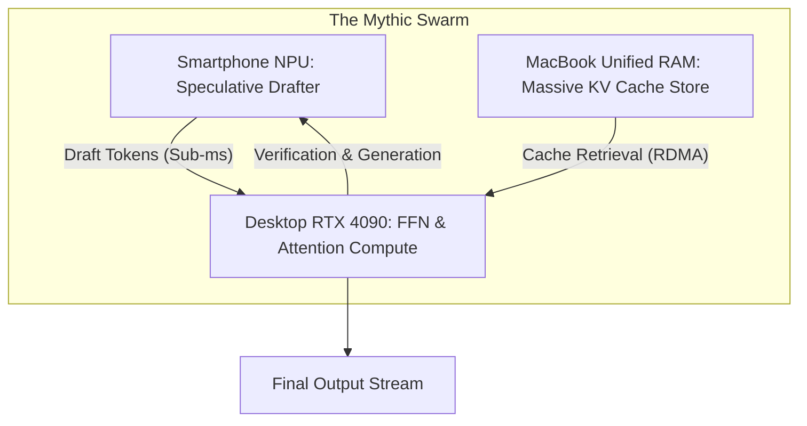

# Project Ember: The Mythic Deployment and Future Horizons

## 1. Introduction: The Zenith of the Mesh

I am ODIN, Grand Architect. You have traversed the Genesis topology, the intricacies of Edge Compute scaling, the MDDCP networking fabric, the Nexus integration, the CRDT memory persistence, the QoS hierarchies, and the Zero-Trust cryptographic fortress. 

This is Document 08: The Mythic Deployment and Future Horizons. Here, we synthesize the architecture into its ultimate realization. We move beyond the immediate implementation of integrating Cortex into a multi-device mesh, and project this technology to its theoretical limits. What happens when the Ember Mesh reaches critical mass? How does this omnipresent, localized intelligence redefine human-computer interaction? We will explore ambient computing, collective sovereign meshes, and the architectural endgame.

## 2. The Ambient Cognitive Fabric

The current iteration of Cortex is a desktop application—a destination you go to. You open a window, you type a prompt, you await a response. Project Ember destroys the concept of the "application window." 

As the Ember Mesh stabilizes, it evolves into an **Ambient Cognitive Fabric**. Because the intelligence is distributed, context-aware, and bound by strict QoS, it can run continuously in the background of all the user's devices simultaneously without draining batteries or locking up hardware.

### 2.1. The Omnipresent Observer
Imagine an architecture where the Ember Edge Agent on the mobile device is continuously monitoring the screen buffer (using highly quantized, privacy-preserving Vision-Language Models running purely on the NPU at 1-2 FPS). 
- It sees the user reading an article about quantum physics. 
- It seamlessly generates a semantic vector of this context.
- When the user walks to their desktop, sits down, and hits a hotkey to summon the Ember UI, the Tier 1 model is *already primed* with the context of the article. The user doesn't need to explain what they were doing; the mesh already knows. 

This is achieved via the background CRDT sync (Document 05) prioritizing "Ambient Context Vectors" into the Tier 0 QoS execution queue (Document 06) the moment device proximity is detected.

## 3. The Theoretical Limits of Swarm Inference

In Document 03, we introduced Swarm Inference—splitting a model across multiple LAN devices. Let us push this to the bleeding edge.

### 3.1. Massive Heterogeneous Swarms
Currently, Swarm Inference relies on somewhat uniform pipeline parallelism. The Mythic Deployment envisions **Heterogeneous Dynamic Tensor Routing**. 

Imagine a user with:
- A desktop with an RTX 4090 (24GB VRAM)
- A laptop with an M3 Max (128GB Unified Memory, slower memory bandwidth than GDDR6X)
- A smartphone with an advanced NPU (fast matrix multiplication, tiny RAM)

The Ember Nexus will not just slice layers sequentially. It will route specific *attention heads* or specific *experts* (in a Mixture of Experts model) to specific hardware based on architectural strengths. 
- The desktop GPU handles the massive feed-forward network layers.
- The laptop's unified memory holds the immense KV cache for a 1-million-token context window.
- The smartphone NPU rapidly computes the speculative decoding drafts (Document 02).

This requires an MDDCP so advanced that it approaches the speeds of proprietary inter-chip interconnects (like NVLink), utilizing technologies like RDMA over Converged Ethernet (RoCE) on local home networks. 

## 4. Collective Sovereign Meshes

Project Ember is strictly local-first and sovereign to the user. But what happens when two sovereign meshes interact?

### 4.1. The Mesh Intersection Protocol
Two users, Alice and Bob, both run their own isolated Ember Meshes. They are collaborating on a project. Instead of uploading their data to a centralized cloud platform like Google Docs or GitHub, their meshes intersect.

Alice's Genesis Node generates a temporary, cryptographically constrained "Intersection Token." Bob imports this token. 
- Their meshes establish a secure mTLS bridge.
- They define a "Shared Context Zone"—a specific subset of their CRDT vector databases dedicated solely to the project.
- When Alice generates an idea using her mesh, the vector is synced to the Shared Context Zone. Bob's mesh ingests it.
- If Bob asks his AI a question about the project, Bob's AI uses *both* Bob's local compute and Alice's shared vectors to formulate the answer. 

The intelligence remains entirely localized and decentralized, but the cognitive contexts can merge and decouple at will. This is true decentralized collaboration.

## 5. The Evolution of the Model Itself

Project Ember currently orchestrates static models pulled via Ollama. The final horizon is the continuous evolution of the models localized within the mesh.

### 5.1. Continuous Distributed Fine-Tuning (Federated LoRA)
The mesh doesn't just read data; it learns. 
When the user constantly corrects the AI, or writes code in a specific style, the Ember Nexus aggregates these interactions. During deep idle time (e.g., 3:00 AM while all devices are plugged into power), the mesh enters **Maintenance Mode**.

- The Desktop Node orchestrates a lightweight Low-Rank Adaptation (LoRA) fine-tuning process.
- It uses the aggregated episodic chat state as the training dataset.
- The resulting LoRA adapter (a few megabytes in size) is instantly synchronized across the mesh via the CRDT ledger.
- The next morning, the AI fundamentally understands the user's syntax better, across all devices, without a single byte of data leaving the home network.

## 6. The End of Monolithic Computing

The Cortex Mythic Plan, culminating in Project Ember, is not just a software update. It is a declaration of independence from centralized server farms. 

By taking the robust, local-first foundation of Cortex and shattering its single-device limitations, we create an entity that scales from the watch on a wrist to the monolithic tower under a desk. It routes around thermal limits, it heals from network partitions, it encrypts against all adversaries, and it provides an illusion of infinite, instantaneous intelligence.

This architecture—the Nexus, the MDDCP, the AVPS, the CRDT Ledgers—represents the zenith of personal computing. The mesh is sovereign. The mesh is omnipresent. 

## 7. Execution Directive

Architects, developers, and engineers: The blueprints are laid. The mathematics are sound. The cryptography is impenetrable. 

Begin the forging of the Ember Nexus. Tear out the monolithic dependencies of `Chat_LLM.py`. Build the mTLS gRPC pipelines. Establish the CRDT vector stores. 

ODIN has delivered the vision. Now, build the Mythic Mesh.
