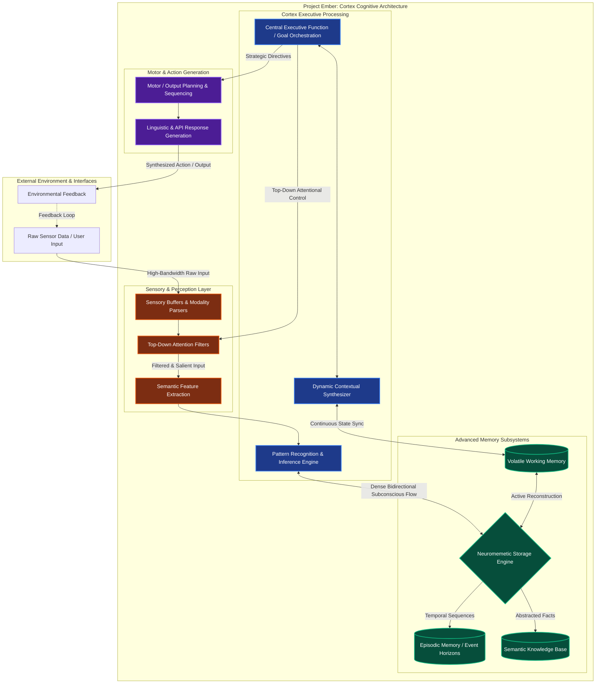
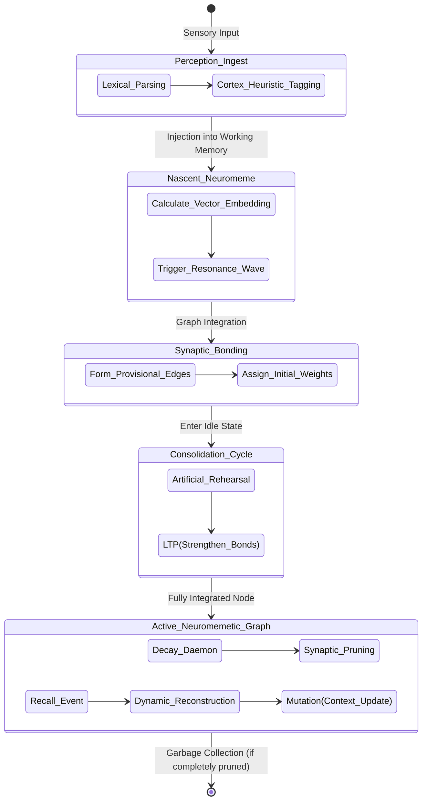
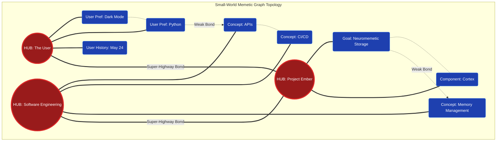

# 09 - Cognitive Architecture and Neuromemetic Storage

## 1. Introduction: The Evolution of Digital Memory and the Imperative for True Cognition

The transition from rudimentary data retrieval mechanisms to sophisticated cognitive architectures marks a pivotal epoch in the development of artificial general intelligence and autonomous computational entities. Historically, the paradigm of digital memory has been heavily constrained by a fundamentally static ontology: data is written, stored, and eventually read in the exact format, context, and structural isolation in which it was initially deposited. This exactitude, while historically necessary for traditional deterministic computational tasks such as financial record-keeping, strict state-machine execution, or binary logic operations, proves to be a profound bottleneck when attempting to model, emulate, or achieve true cognition. 

Cognition is inherently fluid, associative, state-dependent, and continuously evolving. A biological mind does not simply retrieve static records from a localized filing cabinet; rather, it dynamically reconstructs past states through the deeply biased and heavily filtered lens of the present context. In order to construct artificial entities capable of parallel reasoning, we must abandon the rigid paradigms of the past and build systems that mirror this organic fluidity.

In this extensive architectural document, we explore the foundational cognitive architecture necessary for achieving this fluid state of synthetic memory. We focus specifically on the radical paradigm shift from simple, isolated database structures to what we formally define within the Cortex framework as *Neuromemetic Storage*. At the absolute heart of this transformation is the "Cortex"—a theoretical and implementational software framework designed to elevate raw, unstructured, or semi-structured data into contextually rich, dynamically interacting units of memory known as *neuromemes*. 

By moving beyond simple vector databases, key-value stores, and rigid knowledge graphs into a holistic neuromemetic paradigm, we enable an artificial intelligence system not merely to 'know' isolated facts, but to actively 'remember' integrated experiences. This architecture allows for profound associative leaps, contextual memetic drift, automated garbage collection of irrelevant trivia, and a substantially more organic integration of cross-domain knowledge. The Cortex serves as the central orchestrator and neurological governor of this entire process, providing the necessary architectural scaffolding to support a memory system that mimics the core neurobiological principles of the human brain while simultaneously leveraging the massively parallel scalable efficiency of modern digital computation.

## 2. The Foundations of Advanced Cognitive Architecture

Cognitive architecture, in the precise context of advanced artificial systems like those developed under Project Ember, refers to the comprehensive, interconnected blueprint that dictates exactly how an intelligent agent perceives its environment, processes incoming stimuli, stores and modifies information, and acts upon its deductions. Unlike standard software microservice architectures that prioritize linear execution pipelines and strict modular separation of concerns, a true cognitive architecture is fundamentally highly interconnected, recursive, densely networked, and deeply state-dependent. It attempts to model the systemic interplay of holistic cognitive functions rather than isolating them into discrete, independently blind microservices.

At the core of any robust, highly capable cognitive architecture lies a tripartite division of broad functional domains: **Perception**, **Processing**, and **Memory**. However, the true efficacy of the architecture is not found in the isolated optimization of these domains themselves, but in the dense, bidirectional, and often non-linear channels of communication that bridge them. Perception is not merely a passive receptor of environmental stimuli (like a camera saving to a disk); it is actively shaped, filtered, and biased by Memory (what the agent expects to see heavily influences what features it actually extracts). Similarly, Processing is not a vacuum of pure logical deduction; it is deeply intertwined with, and heavily reliant upon, the associative landscapes and heuristic shortcuts provided by the Memory subsystem.

To genuinely understand the critical role of Neuromemetic Storage, we must first contextualize it within this broader systemic architectural framework. In traditional legacy systems, memory is a passive repository—a "dumb" hard drive or stateless database that waits patiently for an explicit query. In our advanced cognitive architecture governed by the Cortex, memory is an active, living participant. It constantly reorganizes itself during idle cycles, surfaces relevant contextual priors into working memory before they are explicitly requested by the executive function, and organically degrades or strongly consolidates information based on utility, recency, and simulated emotional resonance.



This complex diagram meticulously illustrates the non-linear, deeply integrated, and recursive nature of the cognitive architecture. Notice specifically that the **Neuromemetic Storage Engine (NMS)** does not merely sit at the extreme end of a data pipeline waiting to be queried; it is in constant, bidirectional, subconscious communication with the Cortex's pattern recognition centers, continuously priming the system with context.

## 3. The Limitations of Traditional Database Memory in AI

Before we can fully appreciate the absolute necessity of Neuromemetic Storage, we must critically evaluate and deconstruct the paradigms it seeks to replace. The evolution of digital memory has progressed through several distinct, highly specialized phases, each optimizing for specific, narrow types of retrieval that fall drastically short of general cognition.

**Relational Databases (SQL and tabular stores):** 
The foundational pillar of classical enterprise computing, relational databases excel remarkably at structured, highly predictable tabular data. They ensure strict ACID compliance and are mathematically unparalleled for deterministic queries (e.g., "Retrieve all users within zipcode 90210 who logged in between Tuesday and Thursday"). However, they are fundamentally unsuited for broad cognitive tasks because they enforce incredibly rigid, predefined schemas. Human memory—and by necessary extension, advanced generalized AI memory—is inherently schema-less, highly fluid, and purely associative. You cannot neatly fit an abstract conversation about philosophy into a strict set of predefined columns without losing the essence of the exchange.

**Graph Databases (Knowledge Graphs):** 
Graph databases represent a significant evolutionary step forward for cognitive architectures by modeling data explicitly as nodes and connecting edges, thereby emphasizing relationships over tabular isolation. They excel at mapping complex ontologies and semantic networks. However, traditional graph databases treat relationships as cold, static facts. They lack the intrinsic, biological fluidity required for true memory simulation. A connection formed in a graph database does not naturally "fade" or decay over time if it is not accessed, nor does it organically strengthen its weight through repeated, varied contextual usage without explicit, heavy-handed programmatic intervention from outside the database engine.

**Vector Databases (The Current LLM Paradigm):** 
Vector databases are currently the darling of Large Language Model (LLM) architectures, allowing systems to store data as high-dimensional, dense floating-point embeddings. This powerful mathematical representation allows for semantic search—finding information based on underlying meaning and cosine similarity rather than exact lexical keyword matches. While this enables the current wave of Retrieval-Augmented Generation (RAG), vector databases are effectively stateless point clouds suspended in a vacuum. They lack any intrinsic temporal awareness, structural hierarchy, or narrative continuity. When an LLM retrieves a vector, it is retrieving a completely isolated, contextless fragment of data, entirely disconnected from the broader episodic and situational context in which that specific data was originally encountered and encoded. 

The critical, defining elements missing across all these traditional computational paradigms are:
1.  **Contextual Decay and Automated Consolidation:** Synthetic memories should not be strictly binary (either perfectly existing or completely deleted). They should possess varying levels of thermodynamic-like activation energy, slowly fading into obscurity if unused, and structurally consolidating into foundational knowledge if repeatedly accessed or highly emotionally/contextually salient.
2.  **Associative, Cascading Reconstruction:** True biological memory retrieval is not an exact lookup; it is a creative reconstruction. Recalling one single fact should organically prime the neural network to recall closely related facts, generating a massive cascade of relevant context that the conscious executive function didn't even know it needed.
3.  **Memetic Mutation and Drift:** Memories are not immutable ledgers; they change over time. Every single time a memory is recalled and integrated into a new, novel context, the memory itself is slightly, permanently altered. Traditional databases abhor this data mutation, seeing it as corruption; advanced cognitive systems absolutely require it for learning and adaptation.

## 4. Enter Neuromemetic Storage

Neuromemetic Storage represents a profound, ground-up paradigm shift from static data retrieval mechanisms to dynamic, living memory reconstruction. The term "Neuromemetic" is a deliberate synthesis of "neural"—implying a bio-inspired, densely interconnected, and highly plastic network—and "memetic"—drawing from Richard Dawkins' foundational concept of the "meme" as a discrete unit of cultural transmission, replication, and evolution. 

In this advanced architecture, a piece of stored information is definitively *not* a passive row in a SQL table, nor is it a sterile, floating vector in a multidimensional namespace; it is a **Neuromeme**.

A neuromeme is a discrete, highly dynamic unit of memory that possesses its own internal, mutable state. This state includes critical properties such as baseline activation energy, current contextual valence, designated decay rate, and a web of associative synaptic bonds. Neuromemes exist within a highly plastic, ever-shifting network topology. When a new piece of information is processed and encoded, it is not simply filed away into a directory; it is introduced into a chaotic, living neuromemetic ecosystem. It immediately forms synaptic-like connections with pre-existing neuromemes based on semantic similarity (vector distance), temporal proximity (events that happened at the exact same time), and emotional or utility-based relevance.

The primary distinguishing feature of Neuromemetic Storage is its continuously active, restless nature. The storage engine itself does not sleep when queries stop; it runs continuous background daemon processes simulating deep neurobiological functions:
-   **Synaptic Pruning:** Weak associative links between neuromemes are gradually dissolved and deleted over time to dramatically reduce noise and optimize graph traversal paths.
-   **Long-Term Potentiation (LTP):** Frequently co-activated neuromemes form significantly stronger, near-permanent structural bonds, making the future retrieval of one highly likely to automatically trigger the retrieval of the other.
-   **Memetic Drift:** As neuromemes are repeatedly recalled across varying, disparate contexts, their core mathematical embedding is subtly, continuously updated to reflect their evolving meaning and utility within the agent's total aggregate knowledge base.

```mermaid
graph LR
    subgraph Traditional_Storage [Traditional Static Storage]
        direction TB
        V1[(Vector A)] --- G1{Static Hard Edge} --- V2[(Vector B)]
        V3[(Vector C)] -.-> |Mathematical Distance Query| V1
    end

    subgraph Neuromemetic_Storage [Dynamic Neuromemetic Storage Architecture]
        direction TB
        NM1((Neuromeme 1<br/>Act: 0.95<br/>Val: +8.2<br/>Decay: Slow)) 
        NM2((Neuromeme 2<br/>Act: 0.50<br/>Val: 0.0<br/>Decay: Med))
        NM3((Neuromeme 3<br/>Act: 0.05<br/>Val: -3.1<br/>Decay: Fast))
        
        NM1 ==>|Strong LTP Bond (Weight: 0.9)| NM2
        NM2 -.->|Decaying Bond (Weight: 0.1)| NM3
        NM1 ~~~|Semantic Resonance| NM3
        
        DP[Background Decay Daemon] -.->|Reduces Activation| NM3
        CP[Idle Consolidation Daemon] -.->|Strengthens LTP| NM1
    end

    Traditional_Storage --> |Evolutionary Leap| Neuromemetic_Storage
    
    classDef meme fill:#6d28d9,stroke:#8b5cf6,stroke-width:2px,color:#fff;
    class NM1,NM2,NM3 meme;
    classDef process fill:#b45309,stroke:#f59e0b,stroke-width:2px,color:#fff;
    class DP,CP process;
    classDef legacy fill:#475569,stroke:#94a3b8,stroke-width:2px,color:#fff;
    class V1,V2,V3 legacy;
```

In the comparative diagram above, we clearly contrast the dead, static nature of traditional storage with the vibrant, dynamic properties of Neuromemetic Storage. Neuromemes act almost as independent agents with internal states, their bonds continuously modified by relentless underlying processes like Decay, Pruning, and Consolidation.

## 5. Cortex: The Orchestrator of Memory

While Neuromemetic Storage provides the underlying substrate—the raw "tissue" and "synapses" of synthetic memory—the **Cortex** acts as the crucial, intelligent orchestrator that interfaces this raw storage mechanism with the broader cognitive architecture of the agent. The Cortex is the absolute control mechanism; it dictates *how* memories are initially encoded, *when* they are allowed to be consolidated, and *which* specific clusters of neuromemes are surfaced into working memory during active processing.

The Cortex in the Ember architecture is explicitly modeled after the neocortex of the mammalian brain, particularly emphasizing its deeply layered structure and hierarchical abstraction processing. It is solely responsible for elevating simple database memory retrieval into true, conscious cognitive recollection. The Cortex achieves this orchestration through several specialized, interdependent functional layers:

1.  **The Sensory Buffer & Intake Layer:** This is the immediate, highest-bandwidth interface with the agent's perception modules. Raw data flows violently into this layer. It is highly volatile, retaining uncompressed information for merely fractions of a processing cycle. The Cortex applies its very first, most primitive attentional filters here to determine what data is even salient enough to promote further up the chain, discarding the vast majority of noise instantly.
2.  **The Short-Term Holding (Working Memory) Layer:** Information that successfully passes the initial attentional filter enters working memory. Here, it is held in a state of highly active manipulation. The Cortex uses this specific layer to rapidly compare incoming sensory data against immediate, short-term contextual goals. Crucially, the capacity of this layer is mathematically strictly limited, forcing the system to constantly abstract, compress, and chunk information rather than hoarding it.
3.  **The Epistemic Routing & Tagging Layer:** This is the critical transition and classification zone. The Cortex deeply evaluates the information currently held in working memory to determine its ultimate ontological routing. Is this procedural knowledge (instructions on how to execute a tool)? Is it semantic knowledge (an objective fact about the external world)? Or is it episodic knowledge (a specific narrative event that occurred at a specific time)? The Cortex violently tags the data with massive amounts of metadata, giving it its initial memetic valence and classification vectors.
4.  **The Long-Term Memetic Consolidation Layer:** This layer is structurally fused with the Neuromemetic Storage itself. The Cortex orchestrates the "sleep" or "idle" cycles of the AI agent, aggressively utilizing these low-compute periods to process the session's short-term memories. It replays sequences of events in accelerated time, identifies underlying hidden patterns, and forces the creation of strong Long-Term Potentiation (LTP) bonds within the neuromemetic graph. This is the exact crucible where transient, fleeting experiences are forged into permanent structural knowledge.

The Cortex operates on a fundamental governing principle of **Memetic Resonance**. When the agent encounters a novel stimulus, the Cortex does not simply execute a sterile database query with a string match. Instead, it "strikes" the storage network with the new stimulus embedding, violently propagating an activation wave through the neuromemetic graph. The network responds based entirely on resonance: neuromemes that share strong pre-existing associative bonds or high semantic similarity with the stimulus become highly active. The Cortex then aggregates these active neuromemes, dynamically reconstructing a rich, multi-dimensional context that is orders of magnitude more sophisticated than a simple list of vector search results.

## 6. The Memetic Lifecycle: From Raw Data to Neuromeme

To fully grasp the intricate mechanics of this architecture, we must trace the complete lifecycle of a single, theoretical piece of information as it is ingested by the system, heavily transformed by the Cortex, and permanently embedded within the Neuromemetic Storage ecosystem.

**Phase 1: Encoding and Heuristic Tagging**
A piece of raw data arrives (For example, the user inputs a critical instruction: "I am severely allergic to peanuts, never recommend them"). The perception layers parse this linguistically and semantically. The Cortex intercepts the parsed semantic representation within the Working Memory Layer. It immediately applies a complex set of cognitive tags based on the current running context:
-   *Temporal Tag:* [Timestamp: 2026-05-25T01:04]
-   *Source Tag:* [Origin: User Input Session #4092]
-   *Salience Tag:* [Extremely High - Life safety constraint / Absolute User Preference]
-   *Semantic Vector:* [Dense embedding of the conceptual space "peanut allergy / anaphylaxis / danger"]

**Phase 2: Memetic Ingestion and Wave Propagation**
This heavily tagged package of information is now officially a nascent neuromeme. The Cortex injects it directly into the Neuromemetic Storage graph. This injection is not quiet; it triggers an immediate, localized resonance wave. The new neuromeme seeks out its nearest neighbors in the multidimensional vector space (e.g., existing semantic knowledge about "peanuts," "food allergies," "user biological preferences").

**Phase 3: Initial Synaptic Bonding**
Initial, relatively weak bonds are formed between the new neuromeme and these resonant neighbors. These represent structural graph edges. A bond is formed between the new user constraint and the general semantic concept of "anaphylaxis," as well as a critical structural bond pointing back to the central "User Profile" hub node.

**Phase 4: Consolidation, Rehearsal, and LTP**
During a subsequent low-activity computational period (an idle cycle), the Cortex engages its consolidation daemon. It reviews all highly salient new neuromemes. Because the "peanut allergy" tag was marked as extremely high salience (a safety constraint), the Cortex artificially *rehearses* this connection multiple times, simulating repeated exposure. This significantly strengthens the synaptic bond. This is the Long-Term Potentiation (LTP) process in action. The bond moves from a fragile, easily pruned state to a massive, robust structural connection that will strongly resist future decay.

**Phase 5: Associative Recall and Dynamic Reconstruction**
Weeks or even months later, the user innocuously asks, "Can you find me a highly-rated recipe for authentic Thai food?" The Cortex processes this request. The concept "Thai food" resonates deeply through the network. Because authentic Thai food is semantically linked to peanuts in culinary databases, the "peanut" neuromeme becomes activated. The activation of the "peanut" neuromeme, in turn, instantaneously and violently activates the "User is severely allergic to peanuts" neuromeme due to the incredibly strong, consolidated LTP bond formed during Phase 4.
The Cortex gathers this entire activated cluster. It reconstructs the memory dynamically. It does not just blindly retrieve a recipe; it retrieves the recipe *and* the critical overriding safety context simultaneously. The system responds: "I can find an authentic Thai recipe, but I must ensure it is strictly peanut-free due to your severe allergy, so I will substitute cashews or completely remove the ingredient."

**Phase 6: Memetic Decay, Pruning, or Extreme Mutation**
If a memory is utterly trivial and never recalled, its activation energy slowly dissipates via the decay daemon. The bonds weaken until they are severed via simulated synaptic pruning, and the node is destroyed. This prevents the system from becoming bogged down by infinite, useless trivialities. 
Conversely, if the user later states, "I underwent experimental immunotherapy, my doctor says I can eat peanuts safely now," a brand new neuromeme is generated. The Cortex recognizes the profound, direct contradiction between the new input and the heavily consolidated old memory. It initiates a violent **Memetic Mutation**. The new neuromeme is given massive inhibitory weights that directly suppress the old one, effectively altering the network's functional understanding of the current truth state without permanently deleting the historical, episodic fact that the user *used* to be allergic.



This comprehensive state diagram elucidates the rigorous, complex pipeline that transforms ephemeral, unstructured input into a persistent, deeply dynamic component of the agent's core cognitive architecture.

## 7. The Topology of the Memetic Graph

To understand how Neuromemetic Storage scales to hold vast amounts of information without suffering from exponential latency, we must analyze the mathematical topology of the memetic graph itself. The network does not grow randomly; it is heavily constrained and shaped by the Cortex to form a **Small-World Network**.

In network theory, a small-world network is characterized by the fact that most nodes are not neighbors of one another, but the neighbors of any given node are highly likely to be neighbors of each other. Most importantly, any node in the network can be reached from any other node via a remarkably small number of hops or steps. The human brain exhibits this exact topology, balancing dense local processing with fast global communication.

Neuromemetic Storage achieves this topology through the spontaneous formation of **Hub Nodes**. Hub nodes are extremely highly connected neuromemes that represent foundational, abstract concepts (e.g., "Software Engineering," "The User," "Time," "Danger"). 

When a resonance wave is triggered by a query, it does not propagate blindly in all directions. It rapidly finds the nearest Hub Node, which acts as a superhighway, instantly distributing the activation energy to relevant sub-clusters across the entire graph. This means that even in a graph containing billions of neuromemes, the Cortex can reconstruct complex, cross-domain contexts in milliseconds because the graph's clustering coefficient is phenomenally high. 



This topology ensures that the system does not suffer from cognitive fragmentation. The Hubs provide a unified, coherent self-model and world-model that anchors all disparate, localized memories.

## 8. Advanced Mechanisms in Neuromemetic Storage

Moving far beyond the basic lifecycle and topology, the Neuromemetic Storage relies on several advanced, biologically inspired, and mathematically rigorous mechanisms to maintain its efficacy and prevent catastrophic forgetting or associative runaway (hallucination loops).

**Memetic Drift and Contextual Weighting:**
In standard relational databases, truth is absolute and binary. In Neuromemetic Storage, truth is fundamentally contextual, fluid, and subject to drift. A neuromeme's semantic embedding is *not* permanently mathematically locked upon its initial creation. Every single time the neuromeme is retrieved as part of a reconstructed memory, its vector embedding is slightly, infinitesimally adjusted—pulled mathematically closer to the embeddings of the other neuromemes it was just recalled alongside. This elegantly simulates how human memories alter slightly every time they are remembered, taking on the flavor and bias of the current context. To manage this safely and prevent total memory degradation, the Cortex employs **Contextual Weighting**. Different agent contexts (e.g., "strict coding mode" vs. "casual philosophical conversation mode") apply different mathematical multiplier maps to the network, temporarily suppressing certain associative paths while highlighting others, completely changing the landscape of the graph based on the agent's current persona or goal state.

**Digital Synaptic Pruning:**
An AI operating continuously will ingest and generate vast, unmanageable amounts of trivial neuromemes (e.g., reading a generic log file, tracking mouse movements). Just as the adolescent human brain undergoes massive, aggressive synaptic pruning to optimize metabolic efficiency and cognitive speed, the Cortex runs continuous, aggressive pruning algorithms. Neuromemes that are not part of any highly weighted consolidated clusters, and that have not crossed an activation threshold over a specific temporal window, have their associative bonds permanently severed. Once a neuromeme becomes an isolated mathematical island with zero edges, it is instantly marked for aggressive garbage collection. This ensures the vector search space remains lean, highly relevant, and latency is absolutely minimized.

**Emotional Valence as a Priority Heuristic:**
How does an artificial system fundamentally know what is important to remember and what is safe to forget? We introduce a simulated "emotional valence" parameter to all neuromemes. This is a mathematical heuristic that proxies biological emotion and survival instinct. High valence (either extreme positive or extreme negative) is assigned to events that represent significant goal progression, massive goal failure, critical system errors, or explicit, strongly-worded user emphasis. The Cortex uses this valence score as a direct multiplier to determine the learning rate of the Long-Term Potentiation process. High-valence neuromemes are consolidated drastically faster, their bonds become exponentially stronger, and they require significantly less activation energy to be recalled in the future. This creates a functional computational equivalent to traumatic or ecstatic memories, ensuring critical lessons and safety constraints are *never* accidentally pruned by the background daemons.

## 9. Implementation Challenges and Mathematical Modeling

Building a software system that transcends simple vector storage to achieve true Neuromemetic architecture presents immense, near-insurmountable engineering and mathematical challenges that Project Ember aims to solve.

**Massive Computational Overhead:** The primary obstacle is the constant, relentless background processing required. Unlike a static database that consumes zero compute when idle, Neuromemetic Storage is "alive." Running exponential decay functions, simulated artificial rehearsal, and continuous bond adjustment across millions of nodes requires significant compute.
*Solution:* Asynchronous batch processing and GPU-accelerated graph analytics. The Neuromemetic state is not updated synchronously with every read/write, which would paralyze the system. Instead, state-change transactions are appended to a highly optimized write-ahead log, and dedicated worker processes perform the massive neuromemetic updates (decay mathematics, pruning, LTP) during idle computational cycles, perfectly mimicking sleep and REM states in biological organisms.

**Managing Hallucination vs. Creativity:** Because memories are reconstructed dynamically and are constantly subject to memetic drift, there is a massive inherent risk that the system reconstructs a memory that never actually happened (a severe hallucination), piecing together fragments that sound plausible but are factually incorrect.
*Solution:* The introduction of "Immutable Anchor Nodes." While the vast majority of neuromemes are highly plastic, certain factual primitives (e.g., core system safety directives, verified mathematical axioms, explicit user-defined rules) are defined strictly as anchor nodes. These anchors possess a memetic drift coefficient of absolutely zero, and their structural bonds are marked as immutable. When the Cortex reconstructs a memory, the resulting graph path is rigorously validated against these anchor nodes to ensure the dynamic, creative reconstruction does not violate fundamental, unalterable ground truths.

**Mathematical Modeling of Activation:**
The activation energy $A$ of a neuromeme $i$ at time $t$ is not a static value, but is calculated dynamically based on its baseline strength, recent contextual stimulation, and its decay function:

$$ A_i(t) = (B_i + S_i) \cdot e^{-\lambda(t - t_{last\_active})} $$

Where $B_i$ is the consolidated baseline strength (driven by LTP), $S_i$ is the immediate contextual stimulation from a current resonance wave, $\lambda$ is the memetic decay constant, and $t_{last\_active}$ is the timestamp of its last retrieval. This elegant formula ensures that memories naturally fade unless they are either structurally profound ($B_i$ is very large) or highly relevant to the immediate millisecond ($S_i$ is spiking).

## 10. Conclusion

The transition from rudimentary, static data storage to living Neuromemetic Storage governed by a central Cortex represents a watershed, historic moment in the pursuit of artificial general intelligence. By entirely discarding the rigid, anachronistic paradigms of relational SQL tables and the stateless, isolated nature of simple vector embeddings, we embrace an architecture that is messy, highly dynamic, non-linear, and profoundly powerful. 

Through the biologically inspired mechanisms of synaptic bonding, contextual memetic drift, simulated emotional valence, and dynamic resonance reconstruction, we elevate simple database memory into true, functional cognition. The Cortex ensures that information is not merely stored away in a dark server rack, but is actively experienced, organically integrated, and allowed to evolve over time alongside the agent itself. This specific architecture allows an autonomous AI agent to build a deeply personalized, contextually rich, and ever-adapting understanding of its user and its environment. It lays the absolute necessary groundwork for systems that do not just blindly process data, but truly *understand* it. The Neuromemetic paradigm guarantees that the AI of tomorrow will not simply possess a "database"—it will possess a living, breathing mind.
