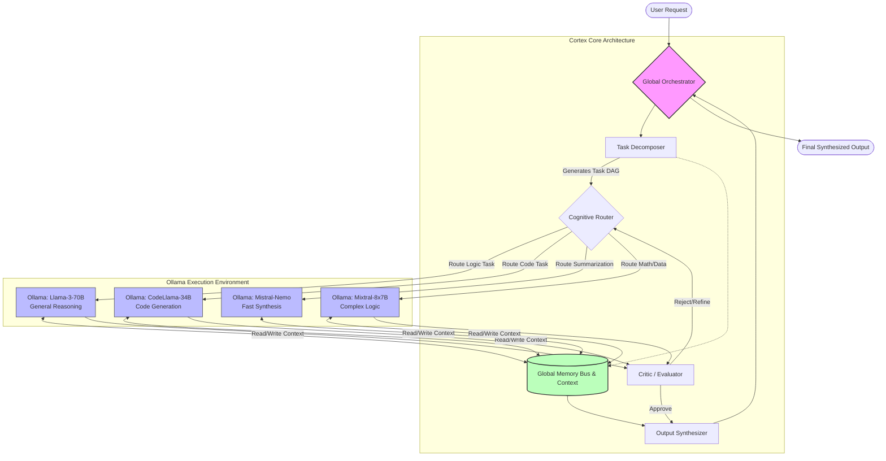
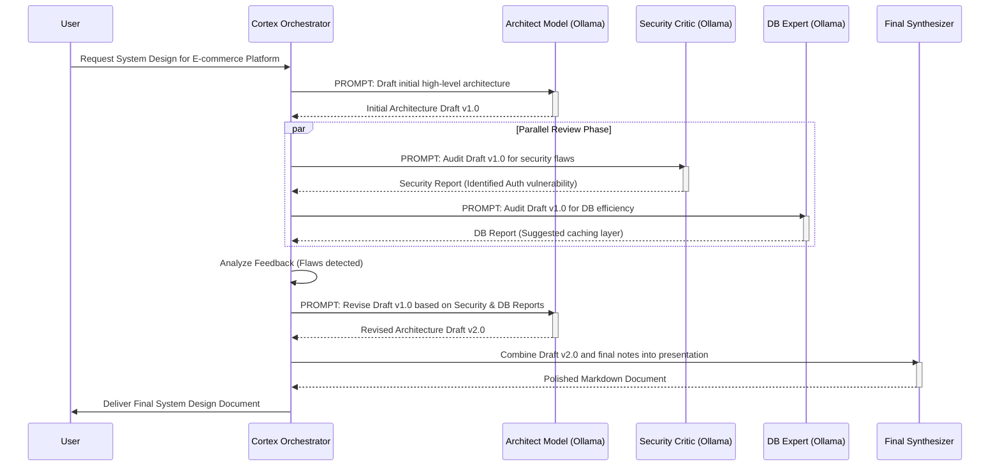
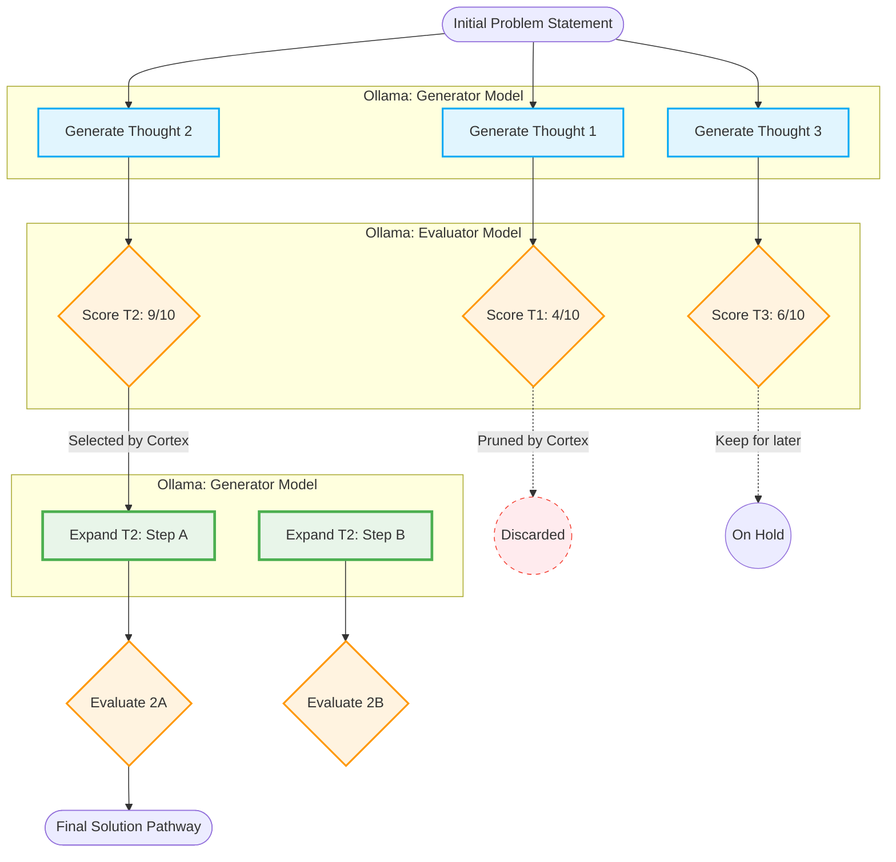

# Advanced Reasoning and Orchestration Dynamics: Elevating Ollama via Cortex

## 1. Introduction to Advanced Reasoning and Orchestration Dynamics

The landscape of artificial intelligence is undergoing a profound metamorphosis, shifting from monolithic, centralized models accessed via remote APIs to decentralized, localized, and highly orchestrated cognitive engines. At the forefront of this revolution is the integration of local execution environments, epitomized by Ollama, with advanced orchestration frameworks like Cortex. This document delves deeply into the intricacies of "Advanced Reasoning and Orchestration Dynamics," exploring how the fusion of Ollama's localized execution capabilities with Cortex's mythic-tier orchestration elevates standard large language models (LLMs) into sophisticated, multi-agent reasoning engines capable of unparalleled cognitive feats.

Historically, the interaction paradigm with LLMs has been largely transactional and linear: a user provides a prompt, and the model generates a response based on its pre-trained weights and the immediate context provided. While this single-prompt, single-model approach has yielded impressive results, it inherently bottlenecks the potential of AI. It restricts the system's ability to engage in extended, iterative reasoning, self-correction, and the dynamic allocation of cognitive resources. Advanced reasoning requires more than just a large parameter count; it necessitates a dynamic, stateful, and highly orchestrated environment where multiple models, tools, and memory systems interact in a continuous symphony of cognitive processing.

Enter Cortex. Cortex is designed not merely as a wrapper or a simple routing layer, but as a comprehensive cognitive architecture that treats individual LLM instances as modular, interchangeable cognitive units. By leveraging Ollama as the foundational substrate for model execution, Cortex can dynamically instantiate, query, and terminate specialized models on the fly. This architecture allows for the implementation of complex reasoning topologies—such as Chain of Thought (CoT), Tree of Thoughts (ToT), and Graph of Thoughts (GoT)—in a localized, secure, and highly efficient manner. The true power of this system lies in its orchestration dynamics: the intelligent routing of tasks, the synthesis of fragmented context, the management of persistent memory, and the orchestration of multi-agent collaboration and debate. This document will systematically dissect these components, providing a blueprint for building a next-generation reasoning engine.

The necessity for such a system becomes apparent when tackling tasks that exceed the "zero-shot" capabilities of even the most advanced frontier models. Complex software engineering, intricate legal analysis, or multi-step mathematical theorem proving cannot be solved reliably in a single pass. These domains require planning, execution, verification, and revision. Cortex effectively externalizes these cognitive steps into a rigid, orchestrated pipeline, forcing the underlying LLMs to operate within a structured, methodical framework rather than relying on intuitive, next-token prediction leaps. By doing so, Cortex systematically reduces hallucinations, improves logical coherence, and dramatically expands the ceiling of what local AI can achieve.

## 2. The Core Philosophy: Ollama Orchestration as a Cognitive Engine

To understand the advanced reasoning capabilities of the Cortex framework, one must first examine the foundational role of Ollama. Ollama has democratized local AI execution by providing a streamlined, highly optimized environment for running large language models on consumer-grade hardware. Its ability to handle model quantization (e.g., GGUF format) allows models with billions of parameters to run efficiently on standard GPUs and even CPUs. However, Ollama, in its native form, is primarily an execution engine; it is the "muscle" of the operation. Cortex provides the "nervous system" and the "prefrontal cortex."

The core philosophy of integrating Cortex with Ollama is based on the concept of **Cognitive Modularity and Dynamic Instantiation**. In a traditional setup, a single, highly capable model is tasked with everything: creative writing, logical deduction, code generation, and factual retrieval. This is cognitively inefficient. Just as the human brain has specialized regions for different tasks, an advanced AI system should route tasks to specialized models. Cortex utilizes Ollama to achieve this via "hot-swapping" and parallel execution. 

For instance, when a complex prompt is received, Cortex's primary orchestrator node analyzes the request. If the request involves writing a Python script to analyze financial data, Cortex does not simply send the entire prompt to a general-purpose model. Instead, it decomposes the task. It might spin up a small, highly quantized model (e.g., Llama 3 8B) via Ollama to act as a task planner. The planner breaks the task into logical steps. Then, Cortex routes the coding specific steps to a model specialized in programming (e.g., CodeLlama or DeepSeek Coder). Simultaneously, it might route the financial analysis logic to a model fine-tuned on financial reasoning. 

This dynamic orchestration turns Ollama from a simple command-line tool into a fluid, multi-dimensional cognitive engine. The advantages are multifold:
1.  **Efficiency**: Smaller, specialized models run faster and consume fewer resources than massive, generalized models. By routing tasks appropriately, Cortex optimizes the overall latency and compute footprint.
2.  **Accuracy**: Specialized models exhibit higher accuracy in their respective domains. A coding model will write better code; a mathematical model will solve equations more reliably.
3.  **Resilience**: If one model hallucinates or fails to produce a valid output, the orchestrator can detect this (using a separate "critic" model) and re-route the task or prompt a different model to attempt the solution.
4.  **Privacy and Security**: By running the entire orchestration layer and all models locally via Ollama, Cortex ensures that sensitive data never leaves the host machine, making it ideal for enterprise and mythic-tier proprietary applications.

This philosophy extends beyond just picking the right model. It involves dynamically tuning the parameters for each call. Cortex might instruct Ollama to use a high temperature (e.g., 0.8) for the initial brainstorming phase of a Tree of Thoughts execution, encouraging divergent thinking. Later, when a critical logical deduction is required, Cortex will invoke Ollama with a temperature of 0.0, demanding deterministic, highly focused output. This fine-grained control over the cognitive parameters of the execution engine is what transforms Ollama into a true reasoning platform.

## 3. Architectural Paradigms of Cortex

The Cortex architecture is designed to manage the immense complexity of orchestrating multiple Ollama instances while maintaining coherent state and context. The architecture is built upon several core components: The Global Orchestrator, the Task Decomposer, the Cognitive Router, the Memory Bus, and the Synthesizer. These components work in concert to ensure that the cognitive load is distributed effectively and that the final output is logically sound.

*   **The Global Orchestrator**: The central nervous system of Cortex. It receives the initial input from the user, manages the overall lifecycle of the reasoning process, and delivers the final output. It is responsible for maintaining the overarching goal and ensuring that all sub-tasks align with the user's intent. It monitors system health, manages timeouts, and handles catastrophic failures in the reasoning pipeline.
*   **The Task Decomposer**: When a complex query arrives, the Decomposer breaks it down into a Directed Acyclic Graph (DAG) of sub-tasks. It identifies dependencies (e.g., Task B cannot start until Task A provides its output) and execution paradigms (sequential vs. parallel). This is crucial for optimizing the throughput of the local Ollama instance.
*   **The Cognitive Router**: This component acts as the dispatcher. For each node in the task DAG, the Router determines the optimal Ollama model to execute it. It considers the task's domain (code, text, logic), required context size, and available system resources (e.g., VRAM availability). If VRAM is constrained, the Cognitive Router might opt for a smaller, highly quantized model or sequence the tasks differently to avoid memory swapping.
*   **The Memory Bus**: A centralized state management system that holds the conversational context, retrieved documents (via RAG), and intermediate outputs from various models. It ensures that any instantiated model has access to the precise context it needs without being overwhelmed by irrelevant data.
*   **The Synthesizer**: Once the various sub-tasks are completed by different models, the Synthesizer weaves the disparate outputs into a cohesive, logically sound, and stylistically consistent final response. It is the final quality assurance gate before the output is returned to the user.

Below is a Mermaid diagram illustrating the high-level architecture and data flow within the Cortex orchestration engine.

This architecture allows Cortex to abstract away the complexity of model management from the end-user. The user simply provides a prompt, and the Cortex engine handles the complex choreography of spinning up Ollama models, passing context, evaluating outputs, and synthesizing the final result.

## 4. Dynamic Model Routing and Multi-Agent Collaboration

One of the most critical aspects of Advanced Reasoning in Cortex is **Dynamic Model Routing**. In a static application, a hardcoded model is called for every request. In Cortex, routing is a highly dynamic process, often involving an initial "lightweight" model to classify and route the request to the appropriate "heavyweight" models. The routing logic takes into account not only the semantic domain of the prompt but also the current state of the local hardware, prioritizing models that are already loaded into memory if they are suitable for the task.

This dynamic routing is essential for creating multi-agent collaboration scenarios. Imagine a scenario where a user asks for a comprehensive software architecture design for a distributed microservices platform. The task requires structural planning, security analysis, performance optimization, and database schema design. Cortex orchestrates this by creating a virtual "panel of experts," each powered by a specific Ollama instance or specialized prompt template.

1.  **The Architect (Model A)**: A model specializing in high-level system design drafts the initial architecture. It outlines the microservices, their communication protocols, and the primary data stores.
2.  **The Security Auditor (Model B)**: A model fine-tuned on cybersecurity analyzes the Architect's draft, pointing out potential vulnerabilities, such as lack of encryption at rest, susceptible API endpoints, or inadequate IAM roles.
3.  **The Database Administrator (Model C)**: A model specializing in data structures reviews the data flow and suggests optimized schemas, indexing strategies, and caching layers (e.g., Redis) to reduce latency.
4.  **The Moderator (Model D)**: The orchestrator synthesizes the feedback. If the Security Auditor finds a critical flaw that breaks the Architect's initial design, the Moderator routes the issue back to the Architect for a revision, including the explicit constraints generated by the Auditor.

This iterative, adversarial, and collaborative process mimics human expert panels and results in outputs that are significantly more robust, nuanced, and accurate than what any single model could produce in a single pass. It leverages the concept of **LLM Debate**, where models are explicitly prompted to find flaws in each other's reasoning.

Below is a Mermaid diagram illustrating a Multi-Agent Collaboration workflow orchestrated by Cortex.

This sequence diagram clearly demonstrates the power of orchestration. The User experiences a single interaction, but behind the scenes, Cortex has coordinated multiple specialized local models to critique, refine, and perfect the output before it is ever presented.

## 5. Synthesizing Complex Contexts: Memory and State Management

Advanced reasoning is fundamentally constrained by the context window of the underlying models. Even with the advent of long-context models (e.g., 128k or 1M tokens), shoving massive amounts of information into a single prompt often degrades the model's ability to focus on specific details—a phenomenon known as the "lost in the middle" problem. Furthermore, in a multi-agent setup, sending the entire conversational history to every sub-agent is wildly inefficient and wastes precious computational cycles. Cortex addresses this through sophisticated Memory and State Management, ensuring that Ollama models receive highly concentrated, relevant context.

Cortex implements a multi-tiered memory system:
1.  **Short-Term Working Memory (The Context Buffer)**: This is the immediate context passed to an Ollama model during a specific task execution. Cortex aggressively prunes and compresses this buffer. Instead of passing the entire chat history, Cortex might use a small, fast model to summarize the history into a dense "state of the world" paragraph before passing it to the reasoning model.
2.  **Episodic Memory (Vector Store)**: Past interactions, generated code snippets, and intermediate reasoning steps are embedded and stored in a local vector database (e.g., ChromaDB or Qdrant). When a model needs historical context, Cortex performs a semantic search and injects only the top-K relevant chunks into the prompt.
3.  **Semantic / Graph Memory (Knowledge Graph)**: For mythic-tier reasoning, semantic relationships must be explicitly tracked. Cortex maintains a local knowledge graph of entities, concepts, and their relationships discussed during the session. This allows for abductive reasoning—connecting seemingly disparate pieces of information across long conversational gaps. For example, if a user mentioned a preference for PostgreSQL in session 1, and in session 10 asks for a database design, the Graph Memory ensures PostgreSQL is prioritized without needing to feed all 10 sessions into the context window.

The **Context Synthesizer** is the module responsible for assembling the prompt before it hits the Ollama API. It pulls from the Working Memory, retrieves relevant nodes from the Graph Memory, and queries the Vector Store. It then formats this data into a highly structured prompt (often using XML or JSON tags to clearly delineate system instructions, retrieved context, and the user query) maximizing the LLM's ability to parse and reason over the data.

Furthermore, Cortex manages **State Context** across asynchronous model calls. Because the Task Decomposer might launch three parallel Ollama instances, the Memory Bus must handle concurrent writes and state updates without race conditions, ensuring that the global state remains consistent as different sub-agents report their findings. This robust state management is the bedrock upon which multi-agent collaboration is built.

## 6. Reasoning Modules: Deductive, Inductive, and Abductive Pathways

The true hallmark of Cortex's advanced orchestration is its ability to implement complex cognitive frameworks programmatically. Standard LLMs operate primarily on next-token prediction, which can mimic reasoning but often falls short on complex, multi-step logic puzzles or deep architectural planning. Cortex forces the models into structured reasoning pathways, mitigating the inherent weaknesses of transformer architectures.

### The Tree of Thoughts (ToT) Implementation
Cortex orchestrates the Tree of Thoughts framework by using Ollama to generate multiple diverse candidate thoughts (branches), evaluate them, and then selectively expand the most promising ones. This transforms the linear Chain of Thought (CoT) process into a heuristic search process over a vast cognitive state space.

In a ToT scenario, Cortex tasks an Ollama model (Model A) to generate three different possible approaches to a problem. Then, Cortex tasks an evaluator model (Model B) to score each approach on a scale of 1-10 based on feasibility, logical soundness, and alignment with user constraints. The orchestrator then prunes the branches with low scores and instructs Model A to expand on the highest-scoring branch. This search algorithm (often implemented as Breadth-First Search or Depth-First Search within Cortex) dramatically increases the system's ability to solve complex, novel problems that require strategic lookahead and backtracking.

Below is a Mermaid diagram illustrating how Cortex orchestrates a Tree of Thoughts evaluation using Ollama.

### Graph of Thoughts (GoT) and Beyond
Taking ToT further, Cortex implements Graph of Thoughts (GoT). In GoT, thoughts are not just branching divergent paths; they can merge. If Model A comes up with a brilliant front-end architectural idea, and Model B comes up with a brilliant back-end database schema in a separate reasoning branch, Cortex's orchestration layer can explicitly instruct a third model to *merge* these two previously distinct thoughts into a unified full-stack architecture. This requires the orchestrator to track the provenance of every thought and intelligently prompt models to synthesize synergistic concepts.

By providing these structured cognitive pathways (deductive step-by-step logic, inductive pattern matching across the vector store, and abductive hypothesis generation via ToT/GoT), Cortex ensures that the underlying Ollama models are not just hallucinating plausible text, but are rigorously exploring an intellectual state space, verifying their own logic, and compounding their insights toward a mathematically rigorous conclusion.

## 7. Self-Correction and Metacognition

A critical differentiator between standard AI wrappers and an Advanced Reasoning Engine is **Metacognition**—the system's ability to "think about its own thinking." Cortex achieves this through explicit, automated self-correction loops orchestrated without any user intervention.

When a worker model produces an output, it is rarely presented directly to the user immediately. Instead, it enters an internal verification loop. Cortex will pass the output, along with the original constraints and prompt, to a specialized Critic Model (often a highly capable, instruction-tuned model running locally, or even the same model prompted with a different persona). The Critic Model's sole system prompt is to act as an adversarial evaluator: finding errors, logical fallacies, security vulnerabilities, or unfulfilled constraints in the input.

If the Critic Model flags an issue, Cortex extracts the specific critique and automatically generates a new prompt for the original worker model: *"Your previous output had the following error: [Critique extracted from Critic]. Please revise your output to explicitly correct this issue while maintaining all other constraints."* This loop continues until the Critic Model approves the output, or until a predefined maximum iteration limit (e.g., 3 loops) is reached to prevent infinite regressions.

This metacognitive loop drastically reduces hallucinations and logical errors. It allows the system to engage in "System 2" thinking (slow, deliberate, analytical, and self-aware) rather than relying solely on the "System 1" (fast, intuitive, predictive) nature of the base LLM. By externalizing the verification process into the orchestration layer, Cortex enforces a rigorous standard of quality that elevates the performance of even mid-sized local models (like an 8B or 14B parameter model) to compete favorably with massive, proprietary, cloud-based APIs.

## 8. Conclusion and Future Trajectories

The integration of Ollama's highly optimized local execution environment with the mythic-tier orchestration capabilities of Cortex represents a paradigm shift in artificial intelligence architecture. We are moving decisively away from monolithic, black-box interactions toward transparent, modular, and dynamically scalable cognitive architectures.

By treating individual LLMs as specialized, interchangeable modules within a larger cognitive framework, Cortex unlocks profound advanced reasoning capabilities. Features such as multi-agent debate, Tree of Thoughts execution, semantic graph memory synthesis, and iterative metacognitive self-correction are no longer theoretical concepts but practical tools implemented efficiently on local hardware. This architecture provides the ultimate balance of power: the reasoning density of frontier models combined with the security, privacy, and cost-efficiency of local execution.

The future trajectory of the Cortex framework involves even deeper integration with the underlying hardware, allowing for dynamic quantization adjustments based on real-time task complexity. Furthermore, the continuous evolution of cognitive routing algorithms will enable Cortex to predict the most efficient reasoning pathway before the first token is even generated. As open-weight models continue to proliferate and improve, the orchestration layer will increasingly become the primary differentiator in AI capabilities. Cortex, by mastering the advanced reasoning and orchestration dynamics detailed in this document, positions itself not merely as a tool or a framework, but as a foundational operating system for the next generation of autonomous, mythic-level machine intelligence.
