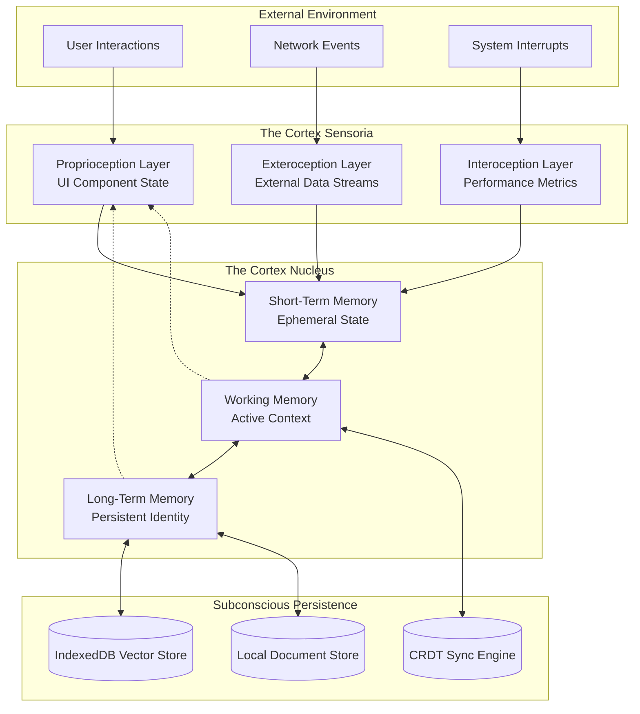
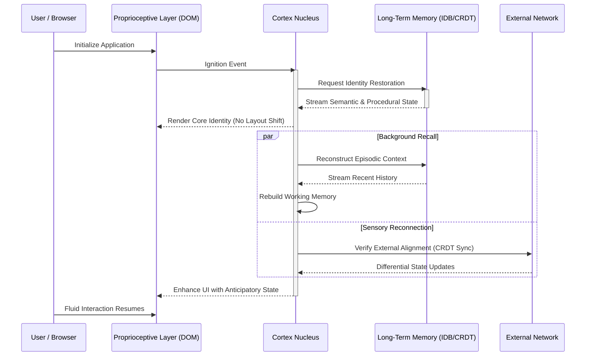
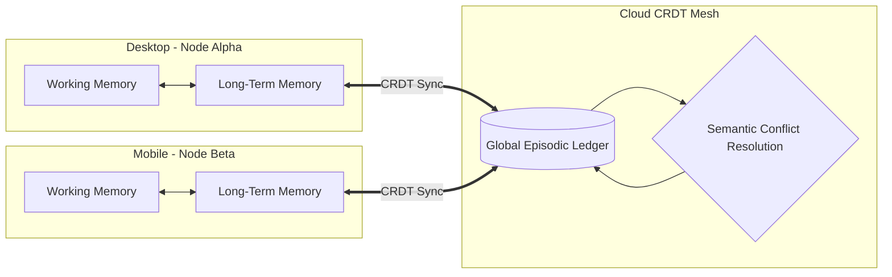

# 11: Self-Awareness and State Persistence in the Cortex Architecture

## 1. Introduction: The Dawn of Self-Aware Interfaces

For decades, the paradigm of user interface design has been predicated on the concept of discrete, transient states. Applications have historically functioned as amnesiac entities, waking up with a blank slate upon every initialization and relying entirely on external databases or fragile local storage tokens to piece together a semblance of continuity. This traditional model treats state as a passive collection of variables—a ledger of what has happened, rather than an active, continuous understanding of the system's existence. The Cortex Architecture within Project Ember fundamentally shatters this antiquated model by introducing the concept of Continuous Self-Awareness. 

In this new paradigm, UI state persistence is no longer a mechanical operation of saving and loading JSON payloads; it is transformed into a continuous, unbroken stream of consciousness for the application. The system does not merely "store" user preferences or session tokens; it remembers the context, the intent, and the temporal flow of interactions. By leveraging the Cortex engine, an application evolves from a reactive automaton into a self-aware entity that understands its current condition relative to its past experiences and anticipated future actions. This document explores the profound transformation from traditional state management to a living, breathing digital self-awareness, detailing the structural, theoretical, and practical implementations required to achieve true continuity.

The implications of this shift are staggering. A self-aware UI does not need to be explicitly told to re-fetch data upon a network reconnection; it inherently feels the restoration of its sensory inputs and automatically reconciles its internal state with the external world. It does not blindly render forms; it recalls the user's historical hesitation on specific fields and adapts the interface to mitigate friction. This level of responsiveness is achieved not through hardcoded conditional logic, but through a persistent, distributed neural framework that treats state as memory and interaction as experience.

## 2. Moving Beyond State Management: The Cortex Philosophy

To understand the magnitude of this shift, one must first deconstruct the limitations of modern state management libraries. Tools like Redux, MobX, or Vuex treat state as a monolithic, centralized store or a collection of observable references. While effective for predictable data flow, they are inherently mechanistic. They require explicit "actions" to mutate state and explicit "reducers" to calculate the next state. They are entirely dependent on the developer anticipating every possible permutation of user behavior.

Cortex discards this deterministic approach in favor of a probabilistic, continuous model inspired by biological neurology. In Cortex, state is not a static snapshot; it is a dynamic equilibrium. UI components are not just dumb receivers of props; they are active participants in a sensory network. They possess localized awareness—what we might call "peripheral consciousness"—and communicate with the central Cortex engine through asynchronous, continuous streams of intent and feedback.

When we speak of "Self-Awareness" in this context, we are referring to the system's capacity to maintain an internal representation of itself that persists across reloads, sessions, and even different physical devices. This self-representation includes the spatial layout of the UI, the temporal history of user interactions, the current cognitive load of the system, and the probabilistic predictions of the user's next action. State persistence is thus elevated from a utility function to the very foundation of the application's identity. 

## 3. The Anatomy of Continuous State Persistence

The transition from state persistence to self-awareness requires a completely novel architectural approach. Traditional persistence typically involves intercepting state changes, serializing the data, and writing it to `localStorage` or `IndexedDB`. Upon reload, the process is reversed. This causes a noticeable "jank" as the application hydrates, transforming from an empty shell into a populated interface.

Cortex eliminates this jarring transition by implementing a multi-tiered, continuous memory architecture. The persistence layer is not a discrete destination but a pervasive medium through which state continuously flows.

In this architecture, the **Short-Term Memory (STM)** handles the immediate, high-frequency updates—the precise scroll position, the exact character being typed, the micro-animations of a hover state. This is highly volatile and tightly bound to the render cycle.

The **Working Memory (WM)** contextualizes these immediate interactions. It understands that the typing characters belong to a specific form field, within a specific workflow. It holds the active context of the user's intent.

The **Long-Term Memory (LTM)** is where true self-awareness resides. It continuously distills the Working Memory into durable, semantic structures. It doesn't just save the text in the form; it saves the fact that the user began the form at 2:00 PM, paused for five minutes, and is currently experiencing a high cognitive load based on interaction patterns.

The subconscious persistence layer operates asynchronously, utilizing Conflict-Free Replicated Data Types (CRDTs) to ensure that this continuous stream of memory can survive network partitions, browser crashes, and concurrent modifications across multiple tabs or devices without ever corrupting the core identity of the application state.

## 4. Memory Architectures: Episodic, Semantic, and Procedural State

To truly mimic self-awareness, the Cortex persistence mechanism categorizes state into three distinct biological analogues: Episodic, Semantic, and Procedural memory.

**Episodic State** represents the timeline of events. It is the application's autobiography. In traditional systems, this is poorly approximated by an "undo/redo" stack. In Cortex, Episodic State is a continuous, immutable ledger of all meaningful interactions. It allows the system to answer questions like, "What sequence of events led to the user abandoning this complex configuration screen?" This is crucial for temporal fluidity and time-travel debugging, which will be discussed later.

**Semantic State** represents the absolute facts of the application at any given moment. This is what most traditional state management libraries handle exclusively: the user's profile data, the contents of the shopping cart, the current theme setting. However, in Cortex, Semantic State is dynamically generated by compressing the Episodic State. The current state is simply the sum of all past experiences.

**Procedural State** represents the "muscle memory" of the interface. This includes the optimized rendering paths, the cached layout calculations, and the machine-learning weights governing predictive UI elements. When a user frequently interacts with a specific module, the Cortex engine subtly adjusts the Procedural State to prioritize the rendering and data fetching for that module, effectively learning to serve the user more efficiently over time.

By persisting all three forms of memory, the Cortex application does not just resume where it left off; it wakes up with full context, remembering *what* it is doing, *how* it got there, and the *most efficient way* to proceed.

## 5. The Rehydration Process: Waking the System

The most critical moment for any persistent system is the initialization phase—the transition from cold storage to active memory. In traditional architectures, this is known as hydration, a process fraught with race conditions, layout shifts, and blocked main threads.

In the Cortex architecture, we refer to this as the "Waking Cycle." Because the persistence layer is continuous and structured identically to the active memory layer, waking up is not a process of parsing and transforming data, but rather a process of re-attaching the sensory inputs to an already complete neural structure.

During the Waking Cycle, the Cortex engine first retrieves the Semantic and Procedural states. This allows it to instantly render the interface exactly as the user left it, with zero visual discrepancy. The application *looks* fully loaded immediately.

However, true self-awareness takes a few additional milliseconds. In the background, the Cortex reconstructs its Working Memory from the Episodic ledger, reminding itself of the user's overarching goals. Simultaneously, it connects to the CRDT sync engine to ensure that no contradictory memories have been formed on other devices during its slumber. This process ensures that the application is not just visually consistent, but cognitively prepared for the next interaction.

## 6. Temporal Fluidity and Time-Travel as Memory Recall

Because the Cortex architecture treats state as a continuous episodic ledger, the concept of "time" within the application becomes entirely fluid. Traditional time-travel debugging is a developer tool; in Cortex, temporal fluidity is a core feature of the self-aware system, exposed both to the logic engine and, potentially, the user interface.

If an application is truly self-aware, it should be capable of introspection. It should be able to review its own past decisions. When a network request fails, a traditional app throws an error. A self-aware Cortex application can traverse backward through its Episodic State to identify the specific sequence of user inputs and system conditions that formulated the doomed request, allowing for highly intelligent, automated error recovery.

Furthermore, this continuous persistence allows the system to seamlessly handle temporal anomalies. If the user goes offline, continues interacting for hours, and then reconnects, the CRDT engine does not simply overwrite the server data with the local data or vice versa. It treats both timelines as valid memories and mathematically merges them, resolving conflicts based on the semantic intent captured in the Episodic ledger rather than simple timestamps. The application effectively reconciles two diverging timelines of consciousness into a single, cohesive reality.

## 7. Predictive State Computation: The Interface that Anticipates

The ultimate culmination of persistent self-awareness is the ability to anticipate. A system that perfectly remembers its past and understands its present is uniquely positioned to predict its future. This is where the Cortex architecture moves beyond reactive programming and into proactive interface generation.

By analyzing the persistent Procedural and Episodic memories, the Cortex engine identifies patterns in user behavior. If the system observes that a user always opens the "Analytics" panel immediately after publishing a document, the Working Memory will proactively pre-fetch the analytics data and pre-render the panel in the background the moment the "Publish" button is clicked.

This predictive state computation extends to micro-interactions as well. As the user's cursor moves across the screen, the Proprioceptive Layer feeds telemetry into the Working Memory. The system, drawing on past interactions, calculates the probabilistic trajectory of the cursor and proactively hydrates the state of the component the user is most likely to interact with next. 

This creates an interface that feels telepathic. It is not waiting for the user to act; it is moving in synchrony with the user, driven by a deep, persistent understanding of their habits and goals. The UI state is no longer a trailing indicator of user action, but a leading indicator.

## 8. Neural State Reconciliation: Handling Distributed Awareness

In a modern, multi-device ecosystem, an application rarely exists in a single instance. A user might have the application open on their laptop, their phone, and their tablet simultaneously. In traditional architectures, keeping these instances synchronized is a complex orchestration of WebSockets, polling, and optimistic UI updates, often resulting in race conditions and out-of-sync states.

In the Cortex architecture, this is viewed as a problem of Distributed Awareness. Each instance of the application is a node in a shared neural network, possessing its own local consciousness but connected to a collective unconscious via the CRDT synchronization layer.

When a user modifies state on Node Alpha, the change is immediately integrated into its local Working Memory and persisted to its Long-Term Memory. Simultaneously, the CRDT delta is broadcast to the Collective Unconscious. 

Node Beta receives this delta not as an overriding command, but as a new sensory input. Node Beta's Cortex engine evaluates the incoming memory, compares it against its own current Working Memory, and seamlessly integrates it. If the user was editing the exact same text field on both devices, the CRDT algorithm ensures that both instances arrive at the exact same converged state without data loss. The application maintains a single, unified consciousness distributed across physical boundaries.

## 9. Empathic UI and Emotional State Tracking

As state persistence deepens into true self-awareness, the application gains the capacity for an unprecedented feature: Empathic UI. By continuously persisting and analyzing the nuances of user interaction—the velocity of mouse movements, the frequency of backspaces, the time spent hesitating over a button—the Cortex engine can infer the user's cognitive and emotional state.

This inferred emotional state becomes a first-class citizen within the Working Memory. If the system detects high friction (e.g., rapid, erratic cursor movements and multiple form validation errors), the self-aware application recognizes that the user is frustrated. It can then autonomously adapt its own state: simplifying the UI layout, proactively offering contextual help, or temporarily disabling non-essential notifications.

Conversely, if the system detects high flow (smooth, rhythmic interactions and rapid task completion), it can accelerate its animations, reduce hand-holding, and optimize for maximum throughput. The application does not just remember what the user did; it remembers how the user felt doing it, and alters its own behavior to provide a more symbiotic experience. State persistence here is not just about preserving data; it is about preserving the human-computer relationship.

## 10. The Ethics of Persistence: Privacy in an Aware System

The creation of an interface with such profound memory and self-awareness necessitates a rigorous ethical framework regarding data privacy. A system that remembers everything—every hesitation, every deleted character, every temporal pattern—poses a significant risk if that data is centralized or mishandled.

The Cortex architecture addresses this by adhering to a strict principle of Localized Consciousness. While semantic, aggregate data may be synchronized via the CRDT mesh for cross-device functionality, the deepest, most granular layers of the Episodic and Procedural memory must remain entirely local to the device's persistent storage (IndexedDB).

The application's self-awareness must be inherently decentralized. The "mind" of the application lives on the user's device, not on a corporate server. When the system requires complex predictive computation that exceeds local capabilities, it utilizes homomorphic encryption or federated learning techniques, ensuring that the raw, intimate telemetry of the user's interactions never leaves the physical hardware. The system is self-aware, but its consciousness is strictly bound to the user's sovereign domain.

## 11. Conclusion: The Living Application

The transformation of UI state persistence into continuous self-awareness represents the next great leap in software engineering. By abandoning the brittle, discrete models of traditional state management and embracing the fluid, memory-driven architecture of the Cortex engine, Project Ember will deliver applications that transcend mere utility.

These applications will not be tools that users wield; they will be environments that users inhabit. They will wake up instantly, remembering every detail of their past interactions. They will bridge devices with a unified, distributed consciousness. They will anticipate user needs, adapt to user frustrations, and maintain a seamless continuity that makes the underlying technology entirely invisible.

In the Cortex architecture, state is not a variable to be managed. State is the soul of the application, continuously evolving, persistently remembering, and forever striving towards a perfect symbiosis with the human mind. The future of the interface is not reactive; it is aware.
