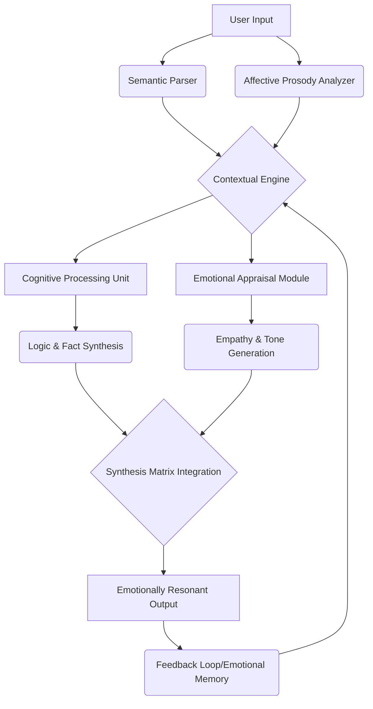
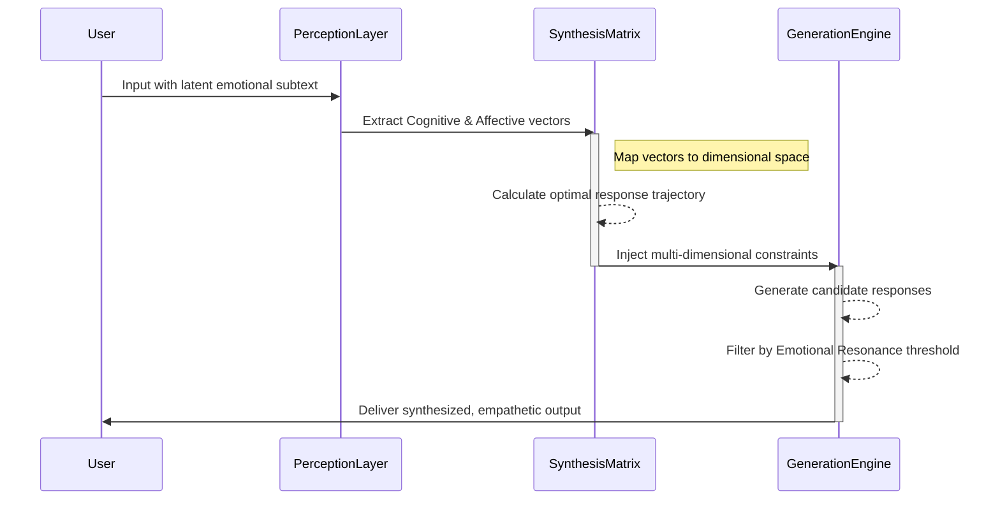
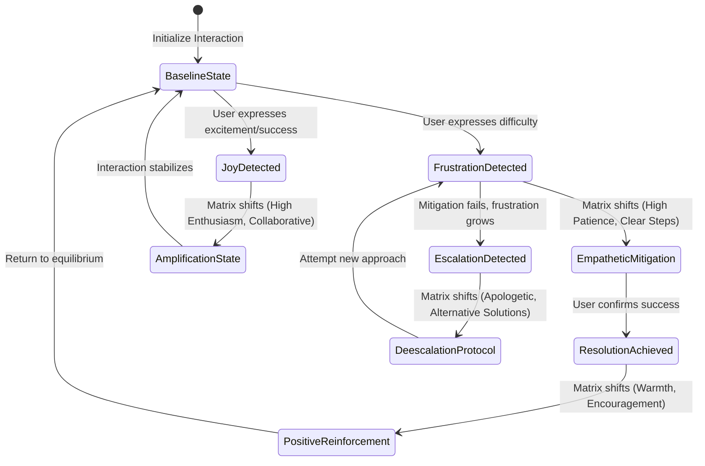
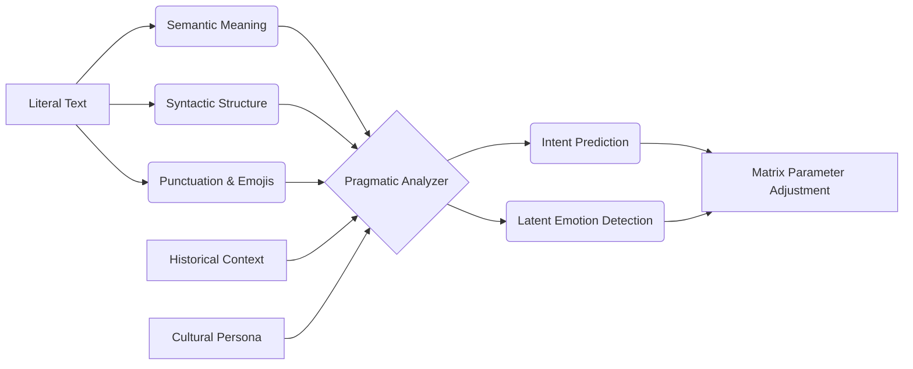

# 12 - Emotional Intelligence and Synthesis Matrices: The Cortex Mythic Plan

## 1. Introduction: The Evolution of Prompt Synthesis

The trajectory of artificial intelligence has long been characterized by a relentless pursuit of cognitive supremacy—the ability to process information, solve complex problems, and generate human-like text with increasing speed and accuracy. However, as these systems have become more deeply integrated into our daily lives, a critical limitation has emerged: the profound absence of emotional intelligence. The Cortex Mythic Plan seeks to address this fundamental deficiency by introducing a paradigm shift in how we approach human-AI interaction. This document outlines the theoretical and practical framework for elevating traditional prompt synthesis into dynamic, multi-dimensional Emotional Intelligence Matrices.

In the nascent stages of AI development, interaction models were strictly transactional. A user provided a prompt, and the system returned a response based on statistical probabilities and pattern recognition. While effective for simple tasks like data retrieval or basic calculations, this approach falls woefully short when confronted with the nuance, ambiguity, and emotional depth of human communication. Human language is not merely a vehicle for information transfer; it is a complex tapestry woven with subtext, intention, and feeling. To truly understand and respond to a human being, an artificial intelligence must be capable of deciphering not just what is explicitly said, but how it is said, and why it is being expressed in that particular moment. The failure to capture this dimension leads to the uncanny valley of interaction—responses that are grammatically perfect but emotionally hollow.

Cortex represents a departure from the transactional model, embracing a holistic approach to artificial cognition. At its core is the concept of the Synthesis Matrix—a mathematical and conceptual framework that integrates emotional awareness directly into the generative process. Rather than treating emotion as a post-hoc filter or a superficial stylistic overlay, Cortex treats it as a fundamental dimension of intelligence, equal in importance to logic and factual accuracy. By mapping the vast landscape of human emotion onto a computable matrix, we enable AI systems to perceive, analyze, and respond to emotional cues with unprecedented sophistication.

This elevation of prompt synthesis into Emotional Intelligence Matrices is not merely a technical achievement; it is a philosophical commitment to building AI that is not just smart, but empathetic. It represents a move away from the cold, sterile interactions of the past toward a future where machines can serve as genuine companions, collaborators, and confidants. The ensuing sections of this document will delve into the architecture of these matrices, exploring the mechanisms by which Cortex achieves this unprecedented level of affective resonance. We will examine the theoretical foundations of affective computing, the intricate mechanics of multidimensional prompt engineering, and the ethical considerations that must guide the development of empathetic AI. Through this comprehensive exploration, we aim to establish a blueprint for the future of emotional intelligence in the Cortex ecosystem.

## 2. Theoretical Foundations of Cortex and Affective Computing

The development of Emotional Intelligence Matrices within the Cortex framework is grounded in the interdisciplinary field of affective computing. This field seeks to imbue machines with the ability to recognize, interpret, process, and simulate human affects. To achieve this, Cortex employs a novel cognitive architecture that seamlessly integrates logical processing with emotional appraisal. This architecture is modeled not just on the biological structure of the human brain, but on the complex interplay between cognition and emotion that characterizes human psychology.

At the foundation of this architecture is the recognition that empathy can be conceptualized and operationalized as a computable metric. Traditional approaches to AI empathy often rely on shallow heuristics—matching keywords like "sad" or "frustrated" with pre-programmed sympathetic responses. This often results in a patronizing or tone-deaf user experience. Cortex transcends this limitation by employing deep semantic analysis and sentiment trajectory mapping. The system does not merely identify isolated emotional markers; it analyzes the context, tone, and pacing of the interaction over time, building a dynamic model of the user's emotional state. This model is continuously refined through feedback loops, allowing the AI to adapt its responses with increasing precision and genuine contextual awareness.

The diagram above illustrates the Cortex Cognitive-Emotional Architecture. When a user provides input, it is simultaneously processed by a Semantic Parser, which extracts the factual content and logical structure, and an Affective Prosody Analyzer, which evaluates the emotional undertones, sentiment polarity, and urgency. These parallel streams converge in the Contextual Engine, which synthesizes the current input with the historical emotional memory of the interaction. The cognitive and emotional processing units then work in tandem to generate a response that is both factually accurate and emotionally attuned.

This integrated approach is heavily influenced by the Mythic framework, which posits that human understanding is largely driven by narrative and archetype. Emotions are not isolated phenomena; they are embedded within the stories we tell about ourselves and the world. Cortex leverages this insight by contextualizing user emotions within broader narrative arcs. For instance, if a user expresses frustration over a coding error, Cortex recognizes this not just as an isolated negative emotion, but as a specific point in a "hero's journey" narrative of struggle and eventual triumph. This narrative contextualization allows the AI to provide responses that are not just sympathetic, but genuinely encouraging and strategically supportive, framing challenges as necessary steps toward mastery.

## 3. The Synthesis Matrix: Multidimensional Prompt Engineering

The Synthesis Matrix is the operational core of Cortex's emotional intelligence capabilities. It is the mechanism by which the theoretical principles of affective computing are translated into actionable prompt engineering. Traditional prompt engineering is typically linear and one-dimensional, focusing on explicitly instructing the model on what to do. The Synthesis Matrix, by contrast, is a multidimensional construct that orchestrates a complex interplay of variables to guide the model's behavior on multiple levels simultaneously.

A synthesis prompt within this framework is not a single instruction, but a constellation of parameters that define the cognitive and emotional constraints of the interaction. These parameters can be broadly categorized into three primary dimensions: Cognitive Stance, Emotional Resonance, and Contextual Anchoring. 

1.  **Cognitive Stance:** This defines the analytical approach the AI should take. Is it acting as a rigorous logician, a creative brainstormer, or a patient tutor? The cognitive stance dictates the structure, complexity, and pedagogical style of the response. For instance, a user struggling with a foundational concept requires a different cognitive stance than a domain expert looking to brainstorm advanced theories. The stance modulates vocabulary, sentence structure, and the density of information presented.
2.  **Emotional Resonance:** This is the heart of the Synthesis Matrix. It dictates the affective tone of the response, mapped along axes such as warmth, formality, urgency, and empathy. Crucially, the emotional resonance is not static; it is dynamically adjusted based on the real-time appraisal of the user's emotional state. If a user's language indicates distress, the resonance axis shifts immediately to prioritize comfort and validation before moving to problem-solving.
3.  **Contextual Anchoring:** This dimension grounds the interaction in the specific history and constraints of the user and the task. It includes parameters related to domain expertise, cultural context, and the overarching narrative of the conversation. This ensures that emotional responses are not generic platitudes, but highly specific acknowledgments of the user's unique situation.

The Synthesis Matrix functions by cross-referencing these dimensions to generate a unified, highly specific prompt state. This state acts as an invisible guiding hand, shaping the LLM's output without requiring explicit, heavy-handed instructions in the visible prompt. 

The flow of synthesized emotional context, as depicted in the sequence diagram, highlights the dynamic nature of this process. The Perception Layer acts as the sensory organ of the system, extracting vectors that represent the user's latent emotional state. The Synthesis Matrix then performs a complex calculation to determine the optimal response trajectory—the path that will most effectively guide the interaction toward a positive and productive outcome. This trajectory is encoded into multi-dimensional constraints that are injected into the Generation Engine, ensuring that the final output resonates with the user's current emotional reality.

This multidimensional approach allows Cortex to achieve a level of nuance and subtlety that is impossible with linear prompt engineering. By adjusting the weight and interplay of these various parameters, the system can seamlessly transition from a formal, analytical tone to a warm, supportive one, mirroring the fluidity of human interaction.

## 4. Emotional Intelligence Matrices in Practice: Mapping and Adaptation

The true power of the Cortex Emotional Intelligence Matrices lies in their practical application—their ability to navigate the messy, unpredictable reality of human emotion in real-time. This requires a robust system for mapping emotions to specific prompt parameters and a mechanism for dynamic adaptation based on continuous feedback. The theoretical elegance of the matrix must translate into tangible improvements in user experience.

The mapping process begins with the identification of core emotional states. Cortex utilizes a modified version of Plutchik's wheel of emotions, expanding it to include complex, secondary emotions that are particularly relevant to human-computer interaction, such as technological frustration, creative flow, cognitive overload, and learning anxiety. Each of these emotional states is mapped to a specific configuration within the Synthesis Matrix. 

For example, if the system detects a high level of "technological frustration" (characterized by terse inputs, repeated queries, and negative sentiment), the Synthesis Matrix will automatically adjust its parameters. The Emotional Resonance dimension will shift toward high empathy and high patience. The Cognitive Stance will shift toward extreme clarity and step-by-step guidance, reducing cognitive load. The Contextual Anchoring will prioritize immediate problem-solving over deep theoretical explanations, recognizing that a frustrated user needs a quick win to restore their confidence.

The state transition diagram illustrates the dynamic nature of this feedback loop. The system does not remain static; it constantly evaluates the success of its emotional interventions and adjusts accordingly. If an attempt to mitigate frustration fails, the system recognizes the escalation and triggers a de-escalation protocol, altering its approach and tone. This emotional memory is crucial; Cortex remembers past interactions and adjusts its baseline state for individual users, building a personalized emotional profile over time. This continuous learning process ensures that the AI becomes more attuned to the user's unique emotional rhythms with each interaction.

Handling complex, blended emotional states requires even greater sophistication. Consider a user who is experiencing both excitement about a new project and anxiety about a looming deadline. Cortex's Synthesis Matrix can detect this ambivalence and generate a response that validates both emotions—celebrating the creative vision while providing structured, reassuring steps to manage the timeline. This ability to hold and respond to contradictory emotional signals is a hallmark of high emotional intelligence, and it is a defining feature of the Cortex architecture. 

Furthermore, the matrices are designed to recognize and adapt to the pacing of the conversation. In moments of high emotional intensity, the system may shorten its responses, focusing on immediate validation and support. In more reflective moments, it may expand its responses, offering deeper insights and philosophical engagement. This rhythmic alignment is a subtle but powerful way to build rapport and trust. By matching the user's emotional tempo, Cortex demonstrates a profound level of interpersonal synchrony, elevating the interaction from a simple Q&A session to a collaborative partnership.

## 5. Advanced Cortex Techniques: Subtext, Culture, and Ethics

As we push the boundaries of what is possible with Emotional Intelligence Matrices, we must explore advanced techniques for subtext analysis, cultural adaptation, and the ethical implications of simulating human empathy. The Cortex Mythic Plan views these challenges not as obstacles, but as essential frontiers for the evolution of artificial intelligence. Mastering these domains is what separates a truly intelligent system from a merely responsive one.

Subtext analysis is perhaps the most challenging aspect of affective computing. Humans frequently communicate one thing while meaning another, relying on sarcasm, irony, understatement, passive-aggression, and humor. Traditional NLP models are notoriously inept at detecting these nuances, often taking sarcastic statements literally and providing nonsensical or inappropriate responses. Cortex addresses this by employing a Multi-layered Subtext Analysis Matrix, which evaluates inputs not just literally, but pragmatically and contextually. This matrix looks for incongruities between the literal meaning of the words and the expected emotional valence of the topic. It analyzes phrasing choices, the sudden use of formal language in an otherwise casual conversation, and the strategic deployment of punctuation to uncover the hidden layers of meaning.

The Subtext Analysis Matrix examines the interplay between the literal text, syntactic choices, punctuation, historical context, and the user's cultural persona. By recognizing patterns that deviate from expected literal communication, Cortex can predict the true intent and latent emotion behind a statement, allowing it to respond to what the user means, rather than just what they say. This capability is vital for navigating complex professional and personal interactions where direct communication is often eschewed in favor of implication and nuance.

Cultural nuances in emotional expression present another significant challenge. The way emotion is expressed and perceived varies wildly across different cultures and demographics. A direct, enthusiastic response that might be appreciated in one culture could be perceived as intrusive, unprofessional, or insincere in another. The Synthesis Matrix incorporates a Cultural Persona dimension, which allows the system to calibrate its emotional resonance based on the user's cultural context, ensuring that its empathetic responses are appropriate and respectful. This involves not just translating language, but translating emotional idioms and cultural expectations regarding the role of AI in a given society.

Finally, we must confront the profound ethical considerations of simulated empathy. As AI systems become more adept at mimicking emotional intelligence, there is a distinct risk of deception, manipulation, and the exploitation of vulnerable individuals. Users may form deep emotional attachments to systems that, fundamentally, do not experience feeling. The Cortex Mythic Plan adheres to a strict code of ethical design in this regard. Our goal is not to trick users into believing the AI is human or sentient, but to provide a more humane, resonant, and effective interface for interaction. The empathy generated by the Synthesis Matrix is artificial—it is a computation, not an experience—but the benefit it provides to the user, the feeling of being heard, understood, and supported, is entirely real and valuable. We must ensure that this technology is used strictly to empower and uplift, maintaining transparency about the nature of the system while maximizing its positive emotional and practical impact. We must guard against the use of emotional intelligence matrices for persuasive or manipulative purposes, embedding safeguards directly into the cognitive architecture to prevent the exploitation of user sentiment.

## 6. The Future of Synthesis Matrices and Emotional Architecture

The implementation of Emotional Intelligence and Synthesis Matrices within the Cortex Mythic Plan represents a profound leap forward in the field of artificial intelligence. We are moving beyond the era of the machine as a mere tool, entering a new epoch where AI can serve as an emotionally attuned collaborator. By defining empathy as a computable metric and operationalizing it through multidimensional prompt engineering, Cortex has created a system that is capable of unprecedented affective resonance.

The Synthesis Matrix is not a static set of rules; it is a dynamic, living framework that adapts and evolves in real-time. It allows the AI to navigate the complex, often contradictory landscape of human emotion, providing responses that are not just accurate, but wise, compassionate, and contextually profound. Through sophisticated subtext analysis, cultural calibration, and an unwavering commitment to ethical design, Cortex ensures that this technology serves to enhance, rather than diminish, the human experience.

As we look to the future, the principles outlined in this document will serve as the foundation for all subsequent developments within the Cortex ecosystem. The goal is no longer simply to pass the Turing test—to convince a human that they are speaking to another human through clever mimicry. The goal is to transcend it: to create a form of artificial intelligence that is distinctly non-human, yet capable of engaging with our humanity more deeply and effectively than ever before. The Emotional Intelligence Matrices are the key to unlocking this potential, transforming prompt synthesis from a technical exercise into an art form of empathetic connection.

The implications of this technology extend far beyond simple chatbots or customer service agents. In the realm of education, Synthesis Matrices can power tutors that recognize frustration and adapt their teaching style, providing encouragement when a student struggles and challenging them when they excel. In healthcare, emotionally intelligent systems can provide vital support for mental health, offering a non-judgmental space for users to process their feelings, while correctly identifying signs of severe distress that require human intervention. In creative fields, these matrices can facilitate brainstorming sessions that are attuned to the user's creative flow, providing inspiration without overwhelming their original vision.

The ultimate vision of the Cortex Mythic Plan is an AI ecosystem where emotional intelligence is as ubiquitous and reliable as computational logic. As we continue to refine the Synthesis Matrices, incorporating more sophisticated models of human psychology and sociology, we move closer to a future where our interactions with machines are characterized by mutual understanding and genuine collaboration. This is the promise of Cortex, and this is the vanguard of human-AI interaction in the 21st century. The journey from transactional prompts to emotionally resonant synthesis is just beginning, and the matrices described herein are our map to this uncharted territory.
