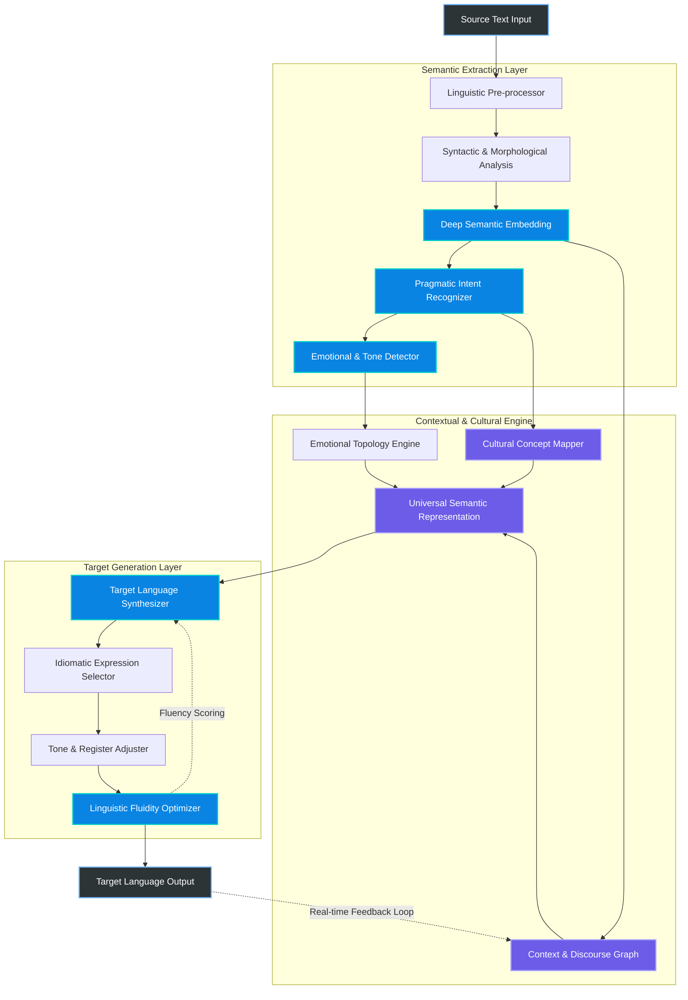
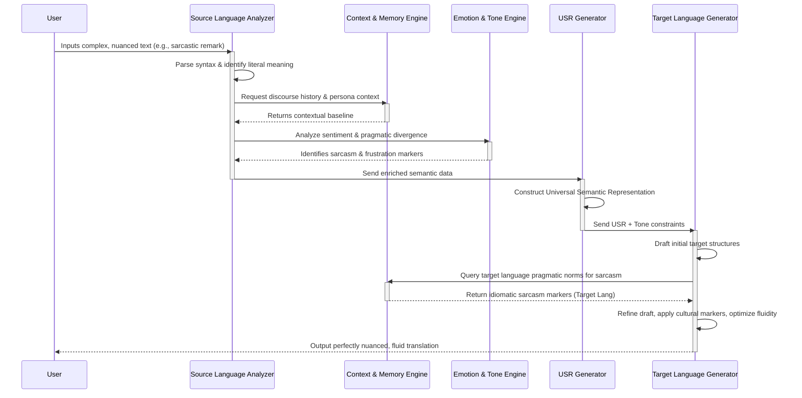
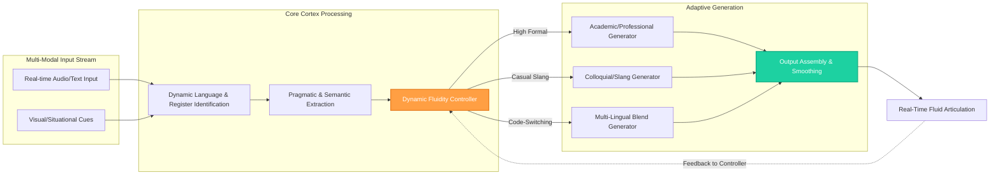

# Chapter 13: Semantic Translation and Linguistic Fluidity in Cortex

## 1. Introduction: The Vision of Linguistic Fluidity in Cortex
The quest for true multilingual AI has often stumbled at the hurdle of literal translation. Traditional translation pipelines operate by mapping tokens or syntactic structures from a source language to a target language, often losing the essence, the cultural nuance, and the subtext encoded within the original phrasing. In the development of the Cortex architecture, our ambition stretches far beyond these conventional methodologies. We aim to achieve what we term "Linguistic Fluidity"—a state where the AI system does not merely translate, but genuinely comprehends the semantic core of an utterance and fluidly re-articulates it in any target language as if it were a native speaker deeply embedded in that language's cultural context.

Linguistic fluidity in Cortex represents a paradigm shift from syntactic mapping to semantic regeneration. It is the ability to decouple the fundamental meaning, intent, and emotional resonance of a message from its original linguistic vehicle. Once this decoupling is achieved, the Cortex engine synthesizes a new linguistic vehicle in the target language that carries the exact same semantic weight. This process requires an intricate understanding of not just grammar and vocabulary, but of human psychology, cultural idioms, historical context, and the delicate subtleties of tone and register.

Imagine a pipeline that can take a highly colloquial, culturally laden joke in Japanese and articulate a perfectly equivalent joke in English—not by translating the words, but by identifying the humorous intent, the cultural references, and the comedic timing, and then finding or constructing a parallel structure in English that elicits the exact same response from an English-speaking audience. This is the essence of Semantic Translation. It is not about finding the right words; it is about finding the right meaning.

In this document, we explore the theoretical foundations and the architectural implementation of Semantic Translation and Linguistic Fluidity within the Cortex Mythic Plan. We will dissect the mechanisms by which Cortex achieves this unprecedented level of linguistic mastery, examining the interplay between its deep semantic models, its cultural context engines, and its dynamic generation pipelines. The goal is to outline a system that transcends the barriers of language, fostering true, unmediated understanding across the globe.

## 2. Core Principles of Semantic Translation
To elevate translation to the level of linguistic fluidity, Cortex operates on a set of core principles that differentiate it from legacy machine translation models. These principles form the philosophical and technical bedrock of our approach.

### 2.1 The Principle of Semantic Decoupling
The fundamental flaw of traditional translation is the tight coupling between the source text and the generated output. Cortex enforces a strict decoupling phase. Before any generation occurs, the source text is broken down into a language-agnostic representation—a multi-dimensional semantic topology. This topology encodes the literal meaning, the emotional tone, the pragmatic intent (e.g., persuasion, informativeness, sarcasm), and the cultural references. By stripping away the source language's syntax and vocabulary, Cortex isolates the pure "thought" behind the utterance. This abstract representation serves as the absolute source of truth for the subsequent generation phase, ensuring that the target language output is bound to the meaning, not the original words.

### 2.2 The Principle of Contextual Primacy
In Cortex, meaning is never static; it is entirely dependent on context. A single word or phrase can have wildly different interpretations depending on the surrounding text, the relationship between the speakers, the broader societal context, and even the current historical moment. The Semantic Translation pipeline features a dedicated Contextual Awareness Engine that continuously updates its understanding of the surrounding environment. This engine analyzes the discourse history, the persona of the user, and the specific domain of the conversation. When translating, Cortex does not look at sentences in isolation; it evaluates them as integral nodes within a larger contextual web. This ensures that the translation maintains the coherent thread of the conversation and respects the established tone and register.

### 2.3 The Principle of Idiomatic Equivalence over Literal Accuracy
Often, the most accurate translation is the least literal one. Idioms, proverbs, and culturally specific metaphors resist direct translation. Cortex prioritizes idiomatic equivalence. When encountering a culturally bound expression, the system queries its Cultural Concept Graph to understand the underlying function of the idiom. It then searches the target language's conceptual space for an expression that serves the same function, even if the imagery is entirely different. If the French say "quand les poules auront des dents" (when chickens have teeth), Cortex knows not to mention poultry or dentistry in English, but rather to use "when pigs fly," perfectly preserving the meaning of impossibility.

### 2.4 The Principle of Dynamic Fluidity
Language is a living, breathing entity, constantly evolving and adapting. Cortex's linguistic models are not static snapshots of a language; they are dynamic systems that adapt to new slang, emerging terminology, and shifting cultural norms in real-time. Dynamic Fluidity ensures that the AI can seamlessly transition between formal academic prose, casual conversational banter, and technical jargon within the same interaction. The translation pipeline dynamically adjusts its generation parameters based on the detected register of the source text, ensuring that the output feels natural, appropriate, and perfectly attuned to the conversational dynamic.

## 3. The Cortex Architecture for Semantic Translation
The architecture supporting Semantic Translation in Cortex is a multi-layered, highly concurrent system designed to process complex linguistic phenomena in real-time. It moves away from the simple encoder-decoder models of the past, introducing specialized modules for semantic extraction, cultural mapping, and fluid generation.

### 3.1 The Semantic Extraction Layer
The process begins in the Semantic Extraction Layer. When a source text is ingested, it first passes through a sophisticated linguistic pre-processor that handles tokenization, morphological analysis, and syntactic parsing. However, this is merely the groundwork. The true magic happens in the Deep Semantic Embedder, which maps the text into a high-dimensional, language-agnostic latent space. Simultaneously, the Pragmatic Intent Recognizer analyzes the utterance to determine what the speaker is actually trying to achieve (e.g., requesting information, expressing frustration, making a joke). The Emotional and Tone Detector evaluates the sentiment, identifying nuances like sarcasm, urgency, or empathy.

### 3.2 The Contextual and Cultural Engine
The outputs of the extraction layer feed into the heart of the system: the Contextual and Cultural Engine. Here, the raw semantic data is contextualized. The Context and Discourse Graph evaluates the utterance against the history of the conversation, resolving anaphora, understanding implicit references, and maintaining thematic coherence. Crucially, the Cultural Concept Mapper identifies culturally bound terms, idioms, and references, linking them to universal concepts in the Cortex ontology. The Emotional Topology Engine ensures that the exact emotional weight is captured. All these streams converge to form the Universal Semantic Representation (USR)—a pure, abstract encoding of the meaning, entirely divorced from the source language.

### 3.3 The Target Generation Layer
With the USR established, the system transitions to the Target Generation Layer. The Target Language Synthesizer takes the USR and begins drafting potential structures in the target language. The Idiomatic Expression Selector queries the target language's cultural database to find the most natural, native-sounding equivalents for the concepts encoded in the USR. The Tone and Register Adjuster refines the vocabulary and syntax to match the identified pragmatics and emotion—ensuring that a formal request remains formal, and a casual joke remains casual. Finally, the Linguistic Fluidity Optimizer evaluates multiple candidate translations, scoring them for rhythm, flow, and naturalness, before producing the final, seamlessly translated output.

## 4. Nuance, Tone, and Contextual Awareness
Achieving linguistic fluidity requires an obsessive focus on nuance and tone. A translation can be semantically accurate but entirely inappropriate if it fails to capture the subtle undertones of the original message. In Cortex, Contextual Awareness is not an afterthought; it is a primary driver of the generation process.

The system utilizes a multi-tiered approach to contextual analysis. It maintains a short-term memory of the immediate discourse, allowing it to track the flow of topics and resolve references fluidly. It also utilizes a long-term memory system that stores information about the user's preferences, relationship with the AI, and past interactions. This historical context allows Cortex to adapt its tone over time, developing a personalized communicative style.

Furthermore, Cortex employs sophisticated models for detecting and replicating pragmatic phenomena such as irony, sarcasm, and passive-aggressiveness. These are notoriously difficult for traditional translation systems, as they rely heavily on the divergence between literal meaning and intended meaning. By analyzing the USR and the Contextual Graph, Cortex can identify when a statement is ironic. When generating the translation, it actively seeks out the linguistic markers of irony in the target language—whether that involves specific phrasing, exaggeration, or subtle syntactic shifts—to ensure the irony translates perfectly.

This sequence diagram illustrates the intricate dance between literal analysis, contextual memory, and emotional detection. The Target Language Generator does not simply translate the words; it actively queries the Context Engine to understand *how* sarcasm is expressed in the target language culture, ensuring that the final output resonates with native authenticity.

## 5. Handling Idiomatic Expressions and Cultural Equivalencies
One of the most profound challenges in Semantic Translation is the handling of idiomatic expressions. Idioms are the fingerprints of a culture, deeply intertwined with historical events, local flora and fauna, and societal norms. A literal translation of an idiom is often nonsensical and instantly shatters the illusion of linguistic fluidity.

Cortex addresses this challenge through its massive Cultural Concept Graph (CCG). The CCG is a continuously expanding knowledge base that maps idioms, proverbs, and culturally specific references to their underlying, universal meanings. When the Semantic Extraction Layer encounters a phrase like "bite the bullet," it doesn't process "biting" and "bullets." Instead, the CCG identifies it as a unified concept: "to endure a painful or otherwise unpleasant situation that is seen as unavoidable."

During the generation phase, the Idiom Selector accesses the CCG from the perspective of the target language. It searches for expressions that map to the same universal concept. If translating into French, it might select "faire contre mauvaise fortune bon cœur" (to make a good heart against bad fortune) or simply a strong, non-idiomatic verb that carries the necessary weight. The selection process is guided by the established tone and register. In a formal setting, Cortex might opt for a standard, non-idiomatic phrasing to maintain professionalism. In a casual conversation, it will actively seek out the most natural, colorful equivalent to maintain the lively dynamic of the source text.

Furthermore, the CCG handles cultural references that don't have direct equivalents. If a user makes a joke about a specific, local television commercial, Cortex recognizes that a direct translation will fall flat. Depending on the settings and the context, the system may either provide a subtle, inline explanation of the cultural reference, or, in more creative modes, attempt to substitute it with a roughly equivalent cultural touchstone in the target language. This level of cultural mapping is what truly separates semantic translation from mere word-substitution.

## 6. Dynamic Fluidity: Real-Time Cross-Lingual Adaptation
Linguistic Fluidity is not merely about producing a good translation of a single sentence; it is about maintaining a natural, effortless flow over the course of a long, complex interaction. Humans rarely speak in perfectly structured, grammatical sentences. We use filler words, we self-correct, we change topics abruptly, and we code-switch between languages and registers. Cortex is designed to handle this dynamic reality.

Dynamic Fluidity refers to the system's ability to adapt its generation strategies in real-time. If the user begins speaking in a highly formal, academic tone, Cortex matches that tone. If the user suddenly shifts to casual slang, Cortex detects this shift through its Contextual Graph and instantly adjusts its output register. This requires a highly responsive architecture where the parameters governing the Target Synthesizer are continuously updated based on incoming data.

Moreover, Dynamic Fluidity encompasses the seamless handling of mixed-language inputs. In many global contexts, users seamlessly blend two or more languages in a single sentence (e.g., Spanglish, Hinglish). Cortex's Semantic Extraction Layer is language-agnostic at its core. It can process a sentence that begins in English, switches to Spanish, and ends with a French idiom, extracting the unified semantic intent without missing a beat. The Target Generation Layer can then output the response in a single, chosen target language, or, if appropriate for the persona, respond with its own fluid mix of languages, mirroring the user's communicative style.

This diagram highlights the role of the Dynamic Fluidity Controller. This central node continuously evaluates the incoming stream, identifying shifts in language, register, and tone. It acts as a conductor, routing the Universal Semantic Representation to the appropriate generation pipelines (Formal, Casual, or Mixed) and dynamically blending their outputs in the Output Buffer to ensure a smooth, natural transition. This ensures that the AI never sounds robotic or jarring, even when navigating complex, multi-lingual conversational landscapes.

## 7. Evaluating Linguistic Fluidity
Measuring the success of a semantic translation system requires metrics that go far beyond standard algorithms like BLEU or ROUGE, which primarily measure syntactic overlap. In Cortex, we employ a sophisticated suite of evaluation metrics designed to assess true linguistic fluidity.

These metrics include:
*   **Semantic Preservation Score (SPS):** This measures how accurately the core intent, facts, and logic of the source text are represented in the Universal Semantic Representation and the final output. It is evaluated using deep neural models trained on semantic textual similarity.
*   **Idiomatic Naturalness Index (INI):** Evaluates whether the generated text uses appropriate idioms and cultural references for the target language. This is often assessed via human-in-the-loop evaluation and specialized models trained on native speaker corpora.
*   **Register Consistency Metric (RCM):** Measures how well the translation maintains the appropriate level of formality, emotion, and tone throughout a conversation. A sudden, jarring shift from formal to casual language without conversational justification results in a lower score.
*   **Fluidity and Flow Assessment (FFA):** Evaluates the rhythm, prosody, and structural naturalness of the generated text. It ensures that the output does not read like a translation, but rather like an original composition by a native speaker.

By continuously optimizing against these holistic metrics, Cortex ensures that its translation capabilities remain at the absolute cutting edge of artificial intelligence, providing users with an experience that is virtually indistinguishable from interacting with a perfectly bilingual human expert.

## 8. Conclusion
Semantic Translation and Linguistic Fluidity represent the culmination of years of research into natural language understanding within the Cortex Mythic Plan. By dismantling the traditional barriers of syntactic mapping and embracing a philosophy of semantic decoupling and cultural mapping, Cortex achieves a level of translation that is profoundly human. It does not just swap words; it understands intent, respects cultural nuance, and dynamically adapts to the ever-changing flow of human conversation.

This capability is not merely a technical achievement; it is a foundational pillar for the future of global communication. With Cortex, language is no longer a barrier to understanding. Instead, it becomes a transparent medium through which ideas, emotions, and culture can flow freely and accurately across the world, fostering deeper connections and a more unified global intelligence. The era of broken translations and lost nuances is ending; the era of true Linguistic Fluidity has begun.
