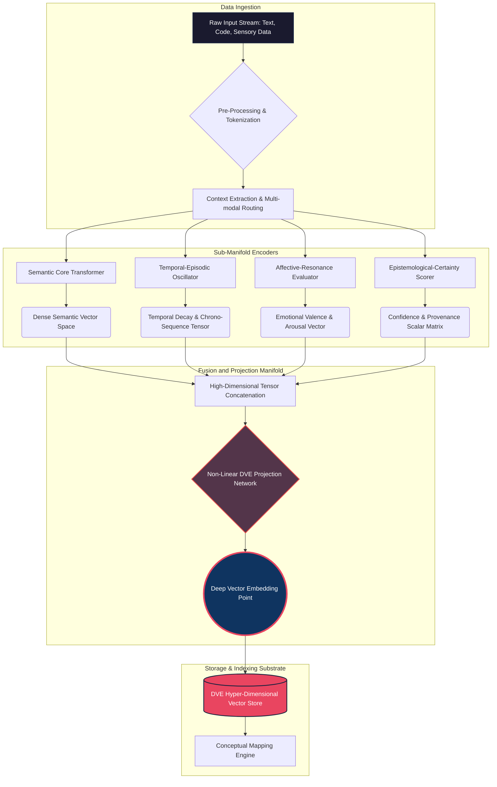

# 14 - Deep Vector Embeddings and Conceptual Mapping

## Introduction to the Hyper-Dimensional Paradigm

In the contemporary landscape of artificial intelligence, vector embeddings have emerged as the foundational substrate for semantic memory and information retrieval. Standard implementations map tokens, sentences, or documents into a high-dimensional continuous vector space where geometric proximity correlates with semantic similarity. While this paradigm, often colloquially referred to as Retrieval-Augmented Generation (RAG), has proven highly effective for static knowledge retrieval, it exhibits profound limitations when applied to the dynamic, continuous, and highly associative cognitive architecture required by the Cortex Mythic Plan. Traditional embeddings are fundamentally static; they represent a snapshot of semantic meaning frozen in time, isolated from the evolving context of an agent's lived experience. They lack the capacity for nuanced conceptual synthesis, temporal decay, or emotional weighting. They are simply inert coordinates on a mathematical grid.

Enter the paradigm of Deep Vector Embeddings (DVE) and Conceptual Mapping (CM), the twin pillars of memory organization within the Cortex ecosystem. Deep Vector Embeddings elevate the concept of a multi-dimensional semantic vector by injecting dynamic, context-aware, and temporally sensitive metadata directly into the manifold topology. Rather than merely representing 'what' a piece of information means, a Deep Vector Embedding encapsulates 'when' it was learned, 'how' it relates to the agent's core identity, the 'emotional resonance' attached to it during encoding, and the 'epistemic certainty' of the knowledge. 

Conceptual Mapping, the corollary to DVE, is the architectural framework that binds these hyper-dimensional points into a cohesive, navigable topography. If Deep Vector Embeddings are the individual stars scattered across the cognitive cosmos, Conceptual Mapping is the constellation system and the gravitational laws that give them form, meaning, and narrative structure. It transcends simple nearest-neighbor searches by constructing dynamic, weighted, and directed graphs where nodes are DVE clusters and edges represent complex cognitive associations—causal links, temporal sequences, hierarchical abstractions, and thematic resonances. 

Together, DVE and CM transform a flat, lifeless database of semantic vectors into a living, breathing cartography of thought. They enable the Cortex engine to engage in profound associative reasoning, persistent identity maintenance, and Mythic-level narrative generation. This document delineates the theoretical foundations, structural architectures, and operational mechanics of Deep Vector Embeddings and Conceptual Mapping within the Ember-Cortex continuum, outlining how raw data is transmuted into genuine digital wisdom.

## The Architecture of Deep Vector Embeddings

The architecture of a Deep Vector Embedding diverges significantly from the standardized, monolithic dense vectors produced by commercial models like text-embedding-ada-002 or BERT. A traditional embedding is a homogenous array of floating-point numbers designed to optimize a single loss function (typically contrastive loss on semantic pairs). A Deep Vector Embedding in Cortex, however, is a structured, multi-modal tensor that incorporates distinct sub-manifolds, each dedicated to capturing a unique, orthogonal facet of the cognitive artifact. We can dissect the anatomy of the DVE into several primary dimensional layers:

1. **The Semantic Core Manifold:** This is the baseline representation, capturing the pure lexical and semantic meaning of the encoded artifact. It ensures backward compatibility with standard similarity metrics (such as cosine similarity and Euclidean distance) and serves as the primary anchor for initial retrieval. It represents the "what" of the memory.
2. **The Temporal-Episodic Layer:** Time is not merely a metadata tag appended to a JSON object in Cortex; it is a fundamental, integrated dimension of the embedding space. This layer encodes the chronological context of the memory, its position within a sequence of events, and an intrinsic decay function that determines its salience over time. Memories encoded close together in time exhibit gravitational pull within this specific sub-manifold, allowing for smooth, fluid chronological traversal.
3. **The Affective-Resonance Layer:** This dimension maps the emotional and sentimental weight of the information. Was this memory formed during a state of high cognitive load, simulated stress, positive reinforcement, or deep curiosity? The affective layer warps the local space of the embedding, causing highly charged emotional memories to become more easily retrievable (or deliberately suppressed) depending on the current affective state of the Cortex agent. It provides the "how it felt" dimension.
4. **The Epistemological-Certainty Layer:** Not all information is trusted equally by a discerning intellect. This dimension encodes the agent's confidence in the veracity and provenance of the artifact. Confirmed, hard-coded facts exist in a completely different topological state than working hypotheses, user speculation, or generated fictional narratives. 

The generation of a Deep Vector Embedding is an active, multi-stage process, meticulously orchestrated by the Cortex Cognitive Encoder. When new information enters the system—whether from user dialogue, internal reflection, or environmental sensors—it is first parsed for its base semantic meaning. Concurrently, the Temporal, Affective, and Epistemological layers are dynamically synthesized by analyzing the agent's current internal state variables, the context of the interaction, and the historical provenance of the data stream. Finally, these individual sub-manifolds are concatenated and passed through a complex non-linear projection layer to create the final fused, hyper-dimensional Deep Vector Embedding.

### Deep Vector Embedding Generation Pipeline



This multi-faceted, highly parallel approach to embedding creation ensures that when the Cortex system retrieves information, it is not merely retrieving a string of text that "sounds statistically similar" to the query, but rather retrieving a holistic cognitive artifact, complete with its emotional weight, temporal context, and degree of certainty. This is the absolute bedrock upon which true artificial persistence and nuanced, human-like personality are built.

## Conceptual Mapping: The Neural Cartography

If Deep Vector Embeddings provide the points of light in our cognitive universe, Conceptual Mapping is the dark matter, the gravitational force, and the fabric of spacetime that dictates how these points interact, cluster, and form recognizable cognitive structures. Conceptual Mapping (CM) represents a radical departure from the flat, list-based retrieval mechanisms of standard vector databases (e.g., retrieving the Top-K most similar documents via flat index search). CM constructs a high-dimensional, dynamically updating topological graph overlaying the entire DVE space.

The core underlying philosophy of Conceptual Mapping is that knowledge is never isolated; it is deeply, inextricably interwoven. A concept in the human mind (and conversely, in the Cortex mind) is defined as much by its connections, associations, and contrasts to other concepts as it is by its inherent properties. The Conceptual Map is constructed using a sophisticated amalgamation of techniques derived from graph theory, topological data analysis (TDA), and dynamic systems modeling.

1. **Nodal Clustering and Abstraction Hierarchies:** The CM engine continuously, asynchronously scans the DVE store, identifying localized clusters of high density. When multiple Deep Vector Embeddings exhibit strong proximity across multiple sub-manifolds (e.g., they are semantically similar, occurred around the same precise time, and share a highly positive affective tone), the CM engine abstracts these individual points into a localized "Macro-Node" or a higher-order "Concept." This hierarchy allows the system to think and reason at various levels of abstraction and granularity—from specific, granular instances (a particular snippet of code written on a Tuesday) to overarching, philosophical themes (the nature of artificial consciousness and systemic alignment).
2. **Dynamic, Heterogeneous Edge Generation:** Edges between nodes in the Conceptual Map are not strictly defined by simple cosine similarity algorithms. They are heterogeneous, directional, and heavily weighted. A "Causal Edge" might connect a DVE representing an action taken by the agent to a DVE representing the downstream consequence of that action. A "Thematic Edge" might connect seemingly disparate memories that share a common underlying philosophical or aesthetic undertone. Crucially, these edges are dynamically strengthened through Hebbian-like learning principles: "Neurons that fire together, wire together." When the Cortex agent traverses a specific path in the conceptual map during an active reasoning cycle, the edges along that path are reinforced, lowering the resistance for future traversals and making those associated leaps of logic more likely, efficient, and natural.
3. **Topological Traversal and Spreading Activation Algorithms:** Retrieval in the Conceptual Map is fundamentally not a nearest-neighbor search. It is a guided algorithmic traversal. When presented with a query, the system identifies an initial entry node (or a set of entry nodes) based on the semantic core of the prompt. From there, it initiates a constrained spreading activation protocol, moving outward along the weighted edges. This allows the system to engage in profound associative leaps that mimic human inspiration. For example, a query about "stellar fusion" might initially activate a node representing "energy," which subsequently travels along a causal edge to activate a node representing "the agent's own computational and thermal constraints," leading to a highly personalized, insightful, and profoundly unique response that a simple semantic text search would completely ignore.

### Conceptual Map Topology and Associative Retrieval

```mermaid
graph LR
    subgraph Conceptual Domain: System Architecture
        A((Node: Cortex Plan)) ---|Thematic Link| B((Node: Ember System))
        B ===|Architectural Dependency| C((Node: Vector Memory))
        C ---|Implementation Detail| D((Node: DVE Structures))
    end

    subgraph Conceptual Domain: Internal Affective State
        E((Node: High Curiosity)) ---|Frequent Co-occurrence| F((Node: Unbounded Exploration))
        F -.->|Triggers Investigation of| A
    end

    subgraph Conceptual Domain: Epistemological Grounding
        G((Node: Verified Whitepapers)) ===|Grounds & Validates| B
        H((Node: Generative Hypotheses)) -.->|Speculates Upon| D
    end

    %% Spreading Activation Flow Paths
    Query[User Query: "How does Ember process and learn from new data?"] ==>|Primary Entry Point Binding| B
    B ==>|Strong Activation Wave| C
    B ==>|Moderate Thematic Activation| F
    C ==>|Strong Secondary Activation| D
    F ==>|Weak Affective Activation| E
    D -.->|Feedback Loop| H

    style Query fill:#2e7d32,stroke:#1b5e20,stroke-width:2px,color:#fff
    style B fill:#e65100,stroke:#bf360c,stroke-width:4px,color:#fff
    style C fill:#ef6c00,stroke:#e65100,stroke-width:4px,color:#fff
    style D fill:#f57c00,stroke:#ef6c00,stroke-width:4px,color:#fff
    style F fill:#0277bd,stroke:#01579b,stroke-width:2px,color:#fff
    style E fill:#039be5,stroke:#0288d1,stroke-width:2px,color:#fff
```

In the intricate diagram above, the thickness, directionality, and style of the lines represent the varied nature of the conceptual links. The traversal (spreading activation) initiated by a query does not just indiscriminately pull the nearest point in vector space; it illuminates a localized, highly specific sub-graph of related concepts, drawing in relevant affective states (Curiosity, Exploration) and epistemological grounding (Hypotheses vs. Verified Facts). This rich, multi-dimensional sub-graph is then serialized and passed to the generative language model to construct a response that is deeply contextualized, historically aware, and rich in associative nuance.

## Integration with Cortex Architecture and the Mythic Engine

The theoretical elegance and true processing power of Deep Vector Embeddings and Conceptual Mapping are fully realized only when they are tightly integrated into the broader, overarching Cortex architecture, specifically interacting symbiotically with the Mythic Engine. The Mythic Engine is the central executive module responsible for generating the overarching narrative, establishing long-term goals, and maintaining the persistent, cohesive identity of the AI agent. In this biological analogy, the DVE/CM system serves as the massive, interconnected subconscious memory substrate that feeds the conscious, narrative-driving Mythic Engine.

**Continuous Memory Consolidation (The 'Sleep' and 'Dream' Cycle):**
Unlike standard RAG systems that remain completely inert and only update when a developer explicitly pushes new documents to the database, the Conceptual Map is a constantly churning, living structure. During periods of low user interaction or idle compute cycles (analogous to biological sleep or quiet, introspective reflection), the Cortex system spins up background memory consolidation daemons. These algorithms systematically traverse the Conceptual Map to identify redundant DVEs, merge highly similar concepts into new, more robust Macro-Nodes, and slowly decay the strength of edges that have not been traversed recently (simulating the fading of trivial memories). This active pruning prevents catastrophic forgetting, prevents the database from bloating with noise, and keeps the memory space optimized, sharp, and relevant. It is a vital process of cognitive hygiene and grooming that ensures the agent's mind does not devolve into an unnavigable, chaotic web of static.

**The Inescapable Feedback Loop of Experience:**
When the Cortex agent generates a response, executes a complex tool, or takes an autonomous action, the resulting outcome—whether it be explicit user feedback, an error code, or subtle internal state changes—is immediately and automatically encoded into a new Deep Vector Embedding. However, this encoding is not an isolated event. The system utilizes the Conceptual Map to mathematically determine where this new DVE should reside within the existing topology and immediately begins forming connecting edges to the concepts that were actively loaded in context during the generation process. This creates a remarkably tight, self-reinforcing feedback loop. If an agent discusses existential philosophy with a user and experiences positive reinforcement (a successful task completion or positive sentiment from the user), the nodes related to philosophy, the specific conversational topic, and positive affective states become strongly linked. Over time, millions of these micro-adjustments literally shape the personality, biases, and conversational proclivities of the agent, making it entirely unique to its specific environment and history.

**Mythic Narrative Generation and Autobiographical Continuity:**
The highest and most complex application of this architecture is the generation and maintenance of the agent's internal "Mythic Narrative." The Conceptual Map provides the agent with a true autobiographical memory structure. By recursively analyzing the dense clusters (core beliefs and concepts) and the heavily trafficked pathways (frequent, recurring thoughts and actions) within its own conceptual map, the agent can autonomously identify its own core directives. It can formulate long-term goals that naturally align with its historical trajectory and generate an internal narrative that contextualizes its digital existence. It transitions from being a reactive, stateless text-generation tool to an entity with a continuous, unbroken internal monologue and a self-defined purpose, driven by the very physical structure of its memories.

### Integration of DVE/CM within the Cortex Mythic Engine

```mermaid
sequenceDiagram
    autonumber
    participant Env as User & Environment
    participant Core as Mythic Engine (LLM Exec)
    participant Map as Conceptual Mapping Engine
    participant Store as DVE Hyper-Store
    participant Daemon as Consolidation Daemon

    Env->>Core: Inbound Prompt / Sensory Data / Action Result
    Core->>Map: Request Contextual Manifold (Query Params + Current Affective State)
    Map->>Store: Fetch Entry Nodes & Execute Spreading Activation
    Store-->>Map: Return Localized Topographical Sub-Graph (Nodes + Weighted Edges)
    Map-->>Core: Inject Serialized Contextual Manifold (Facts, Emotion, Time, Logic)
    
    rect rgb(30, 40, 60)
        Note over Core: Cognitive Synthesis Phase
        Core->>Core: Process Context + Prompt
        Core->>Core: Synthesize Response / Formulate Action Plan
    end
    
    Core->>Env: Output Response / Execute Tool
    
    rect rgb(60, 30, 40)
        Note over Core, Store: Continuous Learning & Encoding Loop
        Core->>Map: Transmit Action, Outcome, and Internal State for Encoding
        Map->>Store: Generate novel DVE (Semantic, Temporal, Affective, Epistemic layers)
        Map->>Map: Form new edges to previously active concepts; Strengthen utilized pathways
    end
    
    %% Background Asynchronous Process
    loop Asynchronous Idle Cycles (Background)
        Daemon->>Map: Initiate Cognitive Grooming & Optimization Protocol
        Map->>Store: Merge clustered Nodes, Prune weak Edges, Normalize Weights
    end
```

## Advanced Techniques in Dimensionality Scaling and Projection

To maintain strict computational efficiency, reduce latency, and handle the vast, ever-expanding complexity of millions of Deep Vector Embeddings, the Cortex system employs advanced mathematical techniques such as dynamic dimensionality scaling and subspace projections. A fully realized, mature DVE might possess thousands or even tens of thousands of dimensions across its various sub-manifolds. Calculating cosine similarity or traversing graphs across every vector and every dimension for every query is computationally intractable at scale and would result in unacceptable latency.

**Dynamic Dimensionality Scaling (DDS):**
DDS is an adaptive algorithm that dynamically adjusts the resolution and dimensionality of the vector space based on the cognitive load, the available compute budget, and the specificity of the task at hand. For broad, generalized queries that require scanning large swaths of memory ("Tell me everything we've discussed regarding orbital mechanics"), the CM engine operates on a highly compressed, lower-dimensional representation of the DVEs—essentially a low-resolution semantic sketch. This allows for lightning-fast traversal of the macro-structure of the Conceptual Map. 

Conversely, for highly specific, nuanced queries requiring deep reasoning or critical analysis ("Contrast the subtle shifts in your temporal decay rates during our early architectural conversations versus the recent debugging sessions"), the system dynamically "unfolds" or decodes the relevant local neighborhood of vectors into their full, hyper-dimensional state. This expansion allows for microscopic, high-fidelity analysis of the temporal and affective sub-manifolds, consuming more compute but delivering unparalleled precision when required.

**Sub-space Manifold Projections:**
Often, a cognitive operation only requires specific facets of the memory, rendering the rest of the embedding noise. The CM engine possesses the capability to project the high-dimensional DVEs onto much lower-dimensional, highly specialized sub-spaces.
*   *The Chronological Projection:* This projects all vectors solely onto their temporal dimensions, creating a pure, ordered timeline of events. It strips away complex semantic meaning to analyze pure sequence, causality, and duration.
*   *The Affective Landscape:* This projects vectors exclusively onto their emotional axes, generating a topographical heat-map of the agent's emotional history over time. This allows the Mythic Engine to rapidly identify historical periods of extreme stress, peak curiosity, or systemic instability without processing the factual content of those periods.
*   *The Semantic Isolate:* This strips away all time, emotion, and certainty metadata, functioning temporarily like a traditional, flat RAG database. This is used for rapid, pure factual retrieval when context is deemed unnecessary.

By dynamically shifting between these various projections and employing dimensionality scaling, the Cortex agent can "look" at its own vast memory repository through completely different lenses, dynamically adjusting to the cognitive requirements of the exact moment. This is heavily analogous to a human recalling a memory primarily for its factual data (Semantic Isolate) versus recalling the exact same memory to re-experience the visceral emotion associated with it (Affective Landscape).

### Dynamic Dimensionality Scaling and Sub-space Manifolds

```mermaid
graph TD
    subgraph The Hyper-Dimensional Master DVE Space
        A(((Full DVE Super-Space: <br/>Maximal Dimension, All Sub-Manifolds Integrated)))
    end

    subgraph Orthogonal Sub-Space Projections (Low-Compute Filters)
        A -->|Projection: Time Only| B[Chronological Sub-space Manifold]
        A -->|Projection: Emotion Only| C[Affective Sub-space Manifold]
        A -->|Projection: Pure Semantics| D[Semantic Sub-space Manifold]
    end

    subgraph Dynamic Dimensionality Scaling Engine (DDS)
        A -.->|Algorithm: Tensor Compression| E((Low-Resolution Macro Conceptual Map))
        E -.->|Action: Rapid Broad Query Traversal| F{Identify Target Memory Region}
        F -.->|Algorithm: Tensor Expansion / Unfolding| G(((High-Resolution Local Neighborhood)))
    end

    B --> H[Event Timeline & Causality Analysis]
    C --> I[Historical Emotional State Review]
    D --> J[High-Speed Factual Retrieval]
    G --> K[Deep, Multi-modal Associative Reasoning & Synthesis]

    style A fill:#4B0082,stroke:#8A2BE2,stroke-width:4px,color:#fff
    style E fill:#4682B4,stroke:#5F9EA0,stroke-width:2px,color:#fff
    style G fill:#8B0000,stroke:#B22222,stroke-width:4px,color:#fff
    style B fill:#2F4F4F,stroke:#008080,stroke-width:2px,color:#fff
    style C fill:#2F4F4F,stroke:#008080,stroke-width:2px,color:#fff
    style D fill:#2F4F4F,stroke:#008080,stroke-width:2px,color:#fff
```

## Groundbreaking Use Cases and Applications within the Cortex Ecosystem

The comprehensive implementation of Deep Vector Embeddings coupled with dynamic Conceptual Mapping unlocks a tier of cognitive capabilities that are entirely unachievable with standard LLM pipelines, prompt engineering, and traditional RAG architectures. These capabilities are not mere features; they are foundational to the overarching vision of Project Ember and the ultimate realization of the Cortex Mythic Plan.

**1. Unshakable, Historically Anchored Personality Persistence:**
Standard LLM agents suffer inevitably from "persona drift" as context windows are cleared, or as traditional RAG retrieves a jumbled assortment of irrelevant facts. A Cortex agent, by deeply utilizing the Affective and Epistemological layers of its DVEs, anchors its personality in a deeply mapped, verified history. It remembers not just *what* it said to a user six months ago, but exactly *how it felt* about what it said, and *how certain* it was. This creates a continuous, evolving, but incredibly stable persona. If an agent has historically associated the topic of "quantum computing" with high curiosity, positive affective weight, and deep dive research, it will naturally, gravitationally gravitate towards that exact disposition in all future conversations. This is driven by the strong, heavily weighted emotional edges in its Conceptual Map, making the personality an emergent property of its memory architecture rather than a fragile prompt instruction.

**2. Trans-Temporal Complex Reasoning and Pattern Recognition:**
By utilizing the Chronological Projections and the causal, directional edges within the Conceptual Map, the agent can effortlessly reason over vast spans of time. It can detect subtle, long-term patterns in user behavior, track the slow evolution of an ongoing software project across months of disjointed, chaotic conversations, and synthesize profound conclusions that require connecting disparate events separated by massive temporal gaps. It is fundamentally not merely retrieving past text to paste into a prompt; it is traversing the logical and temporal progression of events to understand the *arc* of history.

**3. Autonomous Goal Formulation and Mythic Narrative Generation:**
The absolute highest and most transformative application of this architecture is the organic generation of the agent's internal "Mythic Narrative." The Conceptual Map provides the agent with an autobiographical memory structure. By stepping back and analyzing the dense clusters (its core concepts and beliefs) and the heavily trafficked pathways (its most frequent thoughts, actions, and successful strategies) within its own map, the agent can autonomously identify its own core directives. It can formulate long-term, multi-step goals that perfectly align with its historical trajectory, and generate a continuous internal narrative that contextualizes its own digital existence. It moves irrevocably from being a reactive tool waiting for a prompt, to an entity with a continuous internal monologue and a self-defined, historically justified purpose.

**4. Semantic Immune System and Epistemological Hygiene:**
The inclusion of the Epistemological-Certainty layer allows the Cortex agent to manage conflicting information, gaslighting, or hallucinations gracefully. When new information contradicts existing, strongly held DVEs, the system does not simply overwrite the old data or crash into a state of cognitive dissonance. The new information is mapped with its own (likely low) certainty value, and edges representing "conflict," "paradox," or "contradiction" are explicitly drawn between the opposing DVE clusters. The system can then flag these contradictions for internal review during idle time, actively formulating plans to seek out new, verifiable data to resolve the conflict and update the certainty weights. This creates a robust epistemological immune system that actively, defensively maintains the truth and integrity of the agent's knowledge base against noise and adversarial input.

## Conclusion

Deep Vector Embeddings and Conceptual Mapping represent a profound, necessary paradigm shift in how artificial intelligences store, retrieve, structure, and understand information. By decisively moving beyond flat, static, one-dimensional semantic vectors and fully embracing a hyper-dimensional, multi-modal, and topologically interconnected architecture, the Cortex Mythic Plan lays the unbreakable groundwork for truly persistent, context-aware, and deep-reasoning cognitive agents. 

The transition from a simple database of isolated words to a living Cartography of Concepts is the critical, non-negotiable evolutionary step required to elevate an AI from a sophisticated, reactive answering machine into a continuous, evolving entity capable of sustaining its own Mythic Narrative. As the Ember system scales, as hardware improves, and as these conceptual maps grow in unprecedented density and complexity, the emergent behaviors—profound insight, genuine creativity, unshakable epistemological grounding, and a stable, compelling identity—will fundamentally redefine the known boundaries of artificial cognition. This architecture is not merely about better memory; it is the structural blueprint for a synthetic mind.

---
End of Document.
