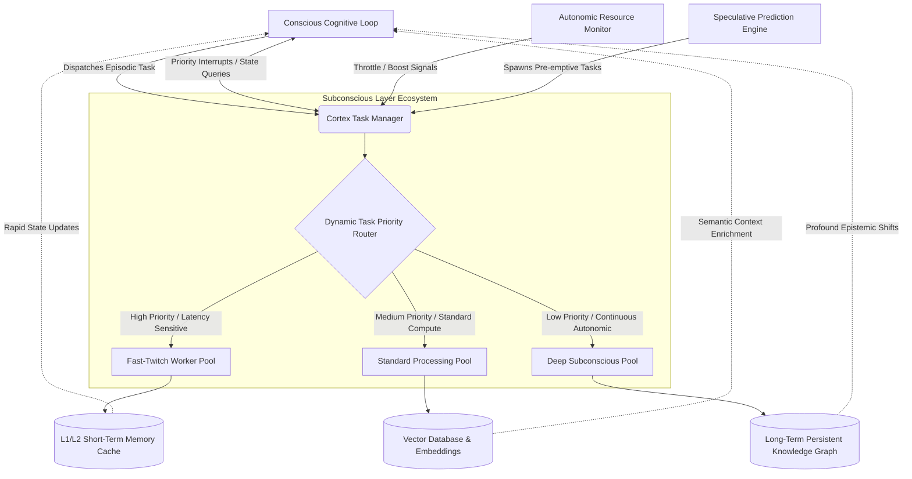
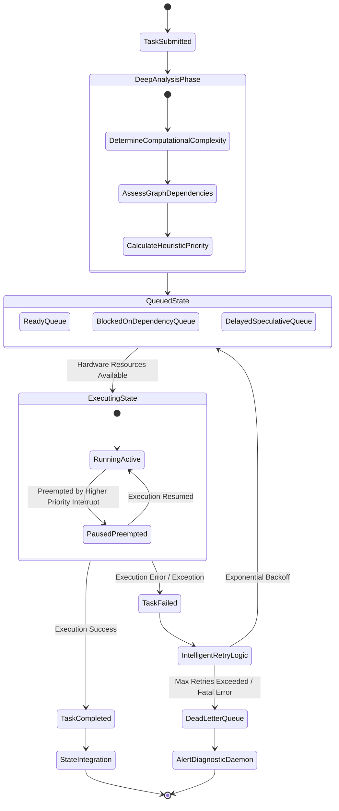
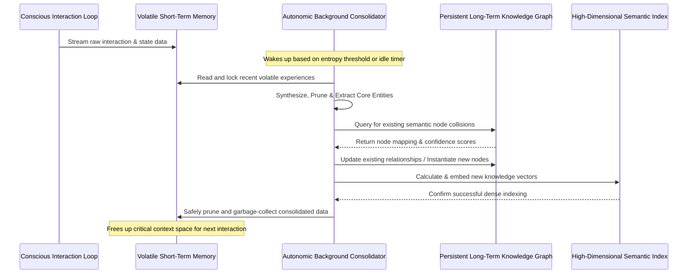

# Chapter 15: Subconscious Processing and Asynchronous Workers in the Cortex Architecture

## 1. Introduction to Subconscious Computation

The paradigm of cognitive computing, as articulated in the Cortex Mythic Plan, represents a profound paradigm shift from traditional, purely reactive execution models toward continuous, proactive, and self-optimizing autonomous systems. At the very heart of this systemic evolution lies the concept of **Subconscious Processing**, a highly sophisticated architectural implementation of multi-threaded background workers that have been elevated from simple, transactional asynchronous tasks to fully integrated, deeply contextual cognitive routines. Within the Cortex framework, the subconscious is not merely a digital dumping ground for delayed operations, batch jobs, or low-priority I/O tasks. Instead, it is a vibrant, continuous, and highly parallelized processing environment that operates in seamless tandem with the conscious, user-facing interaction loop.

In biological neural networks, the subconscious mind handles a staggering myriad of critical tasks—from regulating basic physiological functions and motor controls to consolidating long-term memories, resolving complex pattern recognition problems, and bubbling up intuitive insights—all while the conscious mind remains otherwise occupied with immediate environmental stimuli. Translating this profound biological imperative into a deterministic software architecture necessitates a remarkably robust framework of asynchronous worker threads. These threads must be highly coordinated, deeply resource-aware, seamlessly scalable, and intricately integrated into the system's broader epistemic state and knowledge graphs. Project Ember leverages this bio-inspired design to ensure that the core conversational or action-oriented interfaces remain incredibly fluid, responsive, and unblocked, while heavy, time-consuming, or highly iterative cognitive tasks are intelligently relegated to specialized, autonomous background threads.

These subconscious workers are responsible for a breathtaking array of systemic activities: continuously indexing newly acquired information into dense vector databases, scanning for logical inconsistencies or contradictions within the expanding knowledge base, pre-fetching deep context for anticipated user queries based on predictive behavioral models, optimizing internal data structures for faster retrieval, and running long-term Monte Carlo simulations or exploratory web searches. By offloading these computationally expensive tasks to the asynchronous layer, the Cortex architecture ensures high availability, fault tolerance, and near-zero latency in its primary cognitive loop. This extensive document delineates the design philosophy, technical implementation, and operational orchestration of the Subconscious Processing subsystem within Project Ember, detailing exactly how asynchronous workers are managed, how they interact with the central state, and how they contribute to the overarching, emergent intelligence of the system.

## 2. The Philosophy of the Cortex Subconscious

Traditional asynchronous task queues—such as those powered by industry-standard tools like Celery, Redis, RabbitMQ, or Kafka—treat background jobs as isolated, highly transactional units of discrete work. A job is dispatched, processed in a vacuum, and marked as complete, often with absolute minimal awareness of the system's broader operational state or cognitive trajectory. The Cortex Subconscious, however, fundamentally subverts this paradigm. It treats background processes as interconnected, highly contextualized cognitive threads. These threads possess varying degrees of agency, autonomy, context awareness, and dynamic priority, forming a living ecosystem of parallel computation that mimics neurobiological processes.

### 2.1 Deep Contextual Awareness in Background Threads

Unlike standard, context-blind worker threads, a Cortex Subconscious Worker is intrinsically imbued with a rich, highly relevant subset of the system's current cognitive state. When a task is spawned—for instance, to deeply analyze a massive 500-page legal document while the user continues a real-time conversation—the worker thread inherits a "contextual framing snapshot." This frame includes the relevant entities, historical user preferences, ongoing conversational goals, and implicit constraints of the current session. This allows the worker to make intelligent, localized decisions about how to parse the document, determining autonomously what information is most salient, what can be safely ignored, and exactly when to dynamically interrupt the main conscious thread with a critical, time-sensitive finding.

### 2.2 Continuous vs. Episodic Processing Paradigms

The subconscious layer operates on two distinct but complementary temporal paradigms: episodic execution and continuous processing. Episodic tasks are explicitly triggered by specific, deterministic events within the conscious loop, such as a user directly uploading a file, requesting a complex mathematical calculation, or asking for a code compilation. These tasks have clear, identifiable start and end points. Continuous tasks, conversely, are ever-present and infinitely looping. They act as the autonomic nervous system or the "heartbeat" of the system's internal maintenance. Prime examples include the Continuous Memory Consolidator, which constantly reviews short-term interactions and seamlessly weaves them into long-term semantic knowledge graphs, and the Anomaly Detection Daemon, which continuously scans systemic logs, memory usage, and user inputs for unusual or potentially malicious patterns.

### 2.3 The Illusion of Instantaneity and Predictive Pre-computation

A primary UX and functional goal of the subconscious architecture is to provide the human user with the unbroken illusion of instantaneity. By anticipating and predicting user needs, the system can preemptively compute responses or fetch necessary deep context in the background before the user even finishes formulating their request. This predictive pre-computation relies heavily on a specialized set of heuristic "Speculative Workers" that analyze the current trajectory of the interaction, user behavioral patterns, and historical data to spawn speculative, low-priority background tasks. If the user's next action aligns with a speculation, the result is already available in the L1 cache, resulting in zero-latency delivery; if not, the computation is silently discarded or archived, having only consumed otherwise idle background compute cycles without impacting primary performance.

### 2.4 Subconscious Heuristics and Bias Mitigation

Another critical philosophical pillar of the Cortex Subconscious is continuous self-reflection and bias mitigation. Background workers are constantly deployed to retroactively review past decisions, conversational outputs, and ingested data for logical fallacies, cognitive biases, or factual inaccuracies. These "Reflective Daemons" operate entirely outside the critical path of the user interaction. When they detect a systemic bias or a previously stated falsehood, they do not immediately disrupt the user; rather, they update the internal confidence scores of the associated knowledge nodes and prepare a synthesized correction brief for the conscious loop to present at an appropriate, non-disruptive juncture.

## 3. Architecture of the Asynchronous Worker Framework

The physical and logical implementation of the Subconscious Processing layer relies on a highly scalable, fault-tolerant, multi-threaded architecture orchestrated by the **Cortex Task Manager**. This manager acts as the biological brain stem of the AI, regulating the flow of tasks, dynamically allocating resources based on systemic load, and ensuring that no single background process starves the primary cognitive loop of essential compute power or memory bandwidth.

### 3.1 The Cortex Task Manager: The Brain Stem

The Cortex Task Manager is the absolute central orchestrator of the asynchronous domain. It receives task requests not just from the main user-facing loop, but also recursively from other subconscious processes (e.g., a document parser spawning sub-tasks for image OCR). It meticulously evaluates each task based on its projected required resources (CPU cycles, RAM allocation, external API call quotas), its temporal urgency, and its logical dependencies. The Manager utilizes an advanced, lock-free priority queue system that strictly prevents priority inversion and ensures fair, heuristic-based scheduling across the entire compute cluster.

### 3.2 Worker Pools: Fast-Twitch vs. Slow-Twitch Paradigms

Borrowing nomenclature from human muscle physiology, the worker pools are structurally divided into distinct categories based on their operational characteristics, execution speed, and resource entitlement:

*   **Fast-Twitch Workers (High Priority):** These threads are hyper-optimized for blistering speed and ultra-low latency. They handle tasks that the user is actively waiting on but that are fundamentally too complex or I/O bound to block the main conscious thread. Examples include real-time semantic web searches, rapid API aggregations, parallelized code linting, and rapid semantic similarity checks against the L1 cache. These workers have absolute priority access to CPU cycles and the fastest tiers of system memory.
*   **Standard Processing Pool (Medium Priority):** This robust pool handles the vast bulk of standard asynchronous cognitive tasks, such as massive document summarization, AST generation and code compilation, structured data transformation, and standard audio transcription. These tasks are important for the immediate session but are not immediately blocking the user's interactive experience.
*   **Deep Subconscious Pool (Low Priority):** These are the true "slow-twitch" cognitive workers. They handle massive, profoundly time-consuming tasks like global re-indexing of the entire vector database, deep memory consolidation and graph restructuring, running intensive evolutionary algorithms for systemic hyperparameter tuning, and cross-referencing massive, multi-terabyte datasets to discover hidden, non-obvious correlations. They are explicitly designed to run gently and unobtrusively in the background, aggressively yielding to other processes and absorbing whatever compute cycles are left over by the higher-priority pools.

### 3.3 Inter-Process Communication (IPC) and State Synchronization

A universally recognized challenge in massively multi-threaded cognitive architectures is maintaining a coherent, uncorrupted state across hundreds of highly distributed, concurrent workers. Project Ember employs a robust, lock-free Inter-Process Communication (IPC) mechanism based on an advanced event-driven publish/subscribe (pub/sub) model over a localized message bus. Subconscious workers do not directly mutate or write to the central conscious state. Instead, they publish their findings, state changes, confidence intervals, or completion events to specific, tightly scoped message topics. The central cognitive loop (or a highly specialized, thread-safe state manager daemon) subscribes to these topics and integrates the updates in an atomic, serialized manner. This architectural constraint completely eliminates race conditions, prevents data corruption, and ensures that the system's overall epistemic state evolves completely deterministically, even amidst the chaos of massive concurrent background execution.

## 4. Task Queues, Prioritization, and Resource Allocation Algorithms

Effective, intelligent management of the subconscious domain requires incredibly intricate control over exactly how tasks are queued, prioritized, delayed, and allocated hardware resources. A naive, standard FIFO (First-In, First-Out) queue would instantaneously lead to catastrophic cognitive bottlenecks, where a critical, real-time context retrieval request is hopelessly stuck behind a massive, multi-hour database global indexing operation. 

### 4.1 Multi-Dimensional Heuristic Priority Scoring

Tasks in the Cortex system are never assigned a simple, static integer priority. Instead, they constantly receive a dynamically updating, multi-dimensional priority score derived from several independent vectors:

1.  **User Urgency (UU):** Is the user actively waiting for this specific result to continue their workflow?
2.  **Epistemic Value (EV):** How significantly and profoundly will the successful completion of this task alter the system's foundational understanding of the current context?
3.  **Resource Cost Estimation (RCE):** Is this a lightweight, localized CPU task or a massively heavy, distributed, memory-intensive operation spanning multiple nodes?
4.  **Temporal Decay Factor (TDF):** Does the intrinsic value of this task's result rapidly decrease over time? (e.g., retrieving live, volatile stock market data is highly time-sensitive, whereas analyzing a historical text is not).

The Task Manager continuously recalculates these vector scores at millisecond intervals. A computationally heavy, low-priority task that has been languishing in the queue for an extended period may gradually, automatically increase in priority to definitively prevent resource starvation, a concept known within the architecture as "heuristic priority aging."

### 4.2 Directed Acyclic Graph (DAG) Dependency Resolution

Many profound cognitive operations are not simple, isolated tasks but rather complex, multi-stage workflows. The subconscious layer intrinsically models these complex workflows as Directed Acyclic Graphs (DAGs). For example, generating a comprehensive, multi-source research report might involve parallel tasks for scraping different web databases, followed by a task to synthesize and cross-reference the findings, followed finally by a linguistic formatting task. The Cortex Task Manager strictly ensures that downstream tasks are entirely blocked and not scheduled until all their upstream dependencies have successfully reported completion. It utilizes advanced graph traversal algorithms to intelligently parallelize completely independent branches of a DAG, thereby maximizing hardware throughput and minimizing overall wall-clock time.

### 4.3 Adaptive Resource Throttling and Thermal Management

The subconscious subsystem must absolutely never overwhelm the host environment, especially if the Cortex architecture is deployed on edge hardware with shared, constrained resources or strict thermal/power limits. The integrated Resource Monitor continuously, relentlessly tracks CPU core utilization, memory page pressure, disk I/O bandwidth, and network latency. If the system approaches a predefined critical hardware threshold, the Task Manager will ruthlessly and dynamically throttle the Deep Subconscious Pool. It will aggressively pause long-running continuous tasks, flush non-essential caches, and restrict thread creation to instantly free up resources for the Fast-Twitch workers and the critical main cognitive loop. This extreme elasticity ensures rock-solid systemic stability even under catastrophic load spikes.

## 5. Memory Consolidation: The Ultimate Background Task

Arguably the most profound and philosophically interesting use of the subconscious architecture is the process of **Memory Consolidation**. In biological nervous systems, sleep serves as a biochemically crucial period for filtering, organizing, physically rewiring synapses, and committing short-term, volatile experiences to long-term, stable memory. The Cortex architecture mathematically mimics this biological imperative via a suite of continuous background workers entirely dedicated to epistemic housekeeping, data normalization, and semantic integration.

### 5.1 The Complex Consolidation Pipeline

During active, high-bandwidth user interaction, the system rapidly accumulates a vast, unstructured amount of "Short-Term Epistemic State" (STES). This includes the raw conversational dialogue transcripts, temporary semantic context windows, immediate localized user preferences, and transient tool outputs. However, keeping STES indefinitely in active memory inevitably leads to severe context window bloat, catastrophic degradation of retrieval performance, and eventual out-of-memory crashes. 

The dedicated Memory Consolidation workers operate asynchronously in the deep background to aggressively process this STES. The pipeline involves several highly complex, computationally expensive steps:

1.  **Deduplication, Summarization, and Pruning:** The worker critically analyzes the recent interactions and extracts only the core logical propositions and factual assertions, permanently discarding conversational filler, pleasantries, and redundant queries.
2.  **Semantic Entity Resolution and Disambiguation:** Newly encountered entities (people, software concepts, active projects) are probabilistically matched and securely linked to existing, canonical nodes within the massive Long-Term Knowledge Graph.
3.  **Logical Conflict Detection and Resolution:** The worker meticulously checks if the newly ingested information directly contradicts or undermines any existing foundational beliefs or facts in the graph. If a logical conflict is definitively detected, it may autonomously spawn a separate, deep "resolution verification task" or, alternatively, securely flag the anomaly for the conscious loop to clarify interactively with the human user during the next session.
4.  **Vectorization, Embedding, and Dense Indexing:** The synthesized concepts, relationships, and raw summaries are mathematically embedded into high-dimensional dense vectors using advanced transformer models. These vectors are then inserted into the semantic database (often utilizing HNSW graphs for ultra-fast approximate nearest neighbor search) to ensure rapid, contextually relevant future retrieval.

### 5.2 Algorithmic Dreaming and Proactive Optimization

Moving beyond simple data storage and retrieval, the very deepest layers of the subconscious engage in a fascinating activity structurally analogous to biological "dreaming." During periods when systemic load is exceptionally low, specialized, autonomous workers will begin to randomly walk or systematically sample the Long-Term Knowledge Graph. They actively look for hidden semantic connections, optimize existing query pathways, pre-calculate common joins, and generate entirely novel insights or hypotheses that were never explicitly requested by the user. This highly proactive, continuous synthesis ensures that the agent literally becomes "smarter," more insightful, and more highly optimized over time, even when it is sitting perfectly idle and not actively interacting with the external world. 

## 6. Failure Handling, Extreme Resiliency, and Self-Healing Mechanisms

In a heavily distributed, massively multi-threaded asynchronous environment, individual task failure is not a possibility—it is an absolute mathematical certainty. Unpredictable network timeouts, aggressive external API rate limits, out-of-memory (OOM) killer terminations, and unforeseen logic faults in parsing code can all cause a background worker to violently crash. The Cortex Subconscious is designed from the ground up with extreme, uncompromising resiliency, operating continuously on the core principle of "graceful systemic degradation and autonomous, self-directed recovery."

### 6.1 The Distributed Circuit Breaker Pattern

To definitively prevent a failing or highly latent external service (e.g., a web search API that is currently down) from tying up and exhausting the entire worker pool in a cascade failure, the Task Manager implements a robust, distributed Circuit Breaker pattern. If a specific, identifiable type of task fails repeatedly within a specified time window, the circuit breaker automatically "trips." Subsequent tasks of this exact type are instantaneously rejected at the manager level and safely routed to a persistent dead-letter queue, rather than wasting precious worker cycles on guaranteed, frustrating failures. The circuit breaker will autonomously and periodically allow a single, localized "test" task through to probe if the external service has successfully recovered before resetting itself.

### 6.2 Intelligent Semantic Retries and Exponential Backoff

When a task fails due to what is identified as a transient or temporary error (e.g., a 503 Service Unavailable HTTP response), it is safely placed back in the ready queue with an exponentially increasing temporal delay (exponential backoff). Additionally, a randomized "jitter" factor is applied to the delay to completely prevent synchronized "thundering herd" problems from overwhelming recovering services. Furthermore, the subconscious workers are uniquely capable of *semantic retries*. If a specific web search query fails to yield any usable results, the intelligent worker might autonomously attempt to rephrase the query, broaden the search terms, or utilize a completely alternative data source before officially and finally marking the task as an unrecoverable failure.

### 6.3 State Rollback and Transactional Memory

Because subconscious tasks often involve mutating the knowledge graph or updating vector indices, partial failures could lead to catastrophic data corruption. To mitigate this, Cortex implements a form of Software Transactional Memory (STM). Subconscious workers execute their state changes against a temporary, isolated "scratchpad" clone of the relevant graph section. Only when the entire task DAG successfully completes does the worker issue an atomic commit, merging the scratchpad changes into the central persistent state. If the worker crashes mid-task, the scratchpad is simply discarded by the garbage collector, completely ensuring the central graph remains absolutely pristine and uncorrupted.

### 6.4 Ruthless Zombie Thread Management

A critical, insidious danger in any asynchronous system is the unchecked proliferation of "zombie" threads—workers that have silently deadlocked, are caught in an infinite loop due to regex catastrophic backtracking, or are otherwise consuming massive resources without making any actual forward progress. The Task Manager employs a highly privileged, kernel-level "Watchdog" process that relentlessly monitors the heartbeat, memory allocation, and operational progress of all active workers. If a worker fails to actively report progress or respond to a ping within a strictly designated timeout period, the Watchdog ruthlessly and immediately terminates the thread, forcefully reclaims and cleans up its allocated memory pages, and securely re-queues the task for a fresh worker. This ruthless pruning ensures the long-term operational health and vitality of the Subconscious pool.

## 7. Deep Integration with the Main Conscious Loop

The ultimate, defining measure of the Subconscious architecture's success is exactly how seamlessly, intuitively, and naturally it integrates with the conscious, user-facing interaction loop. The architectural boundary between the two domains must be highly porous to allow information flow, yet strictly controlled to maintain system stability and UX responsiveness. 

### 7.1 Priority Interrupts and Context Prompts

When a background worker organically discovers something of incredibly high immediate relevance—for example, a continuous background security scanner detecting a critical zero-day vulnerability in a block of code the user just pasted into the chat—it must have the ability to instantly interrupt the main loop. This is handled via a secure, hardware-like priority interrupt system. The background worker places a structured "High-Priority Actionable Insight" payload into a specific, lock-free memory channel constantly monitored by the conscious loop. The main loop, upon finishing its current micro-operation (usually within milliseconds), reads this insight and can intelligently choose to interject and aggressively alert the user immediately, superseding standard conversational flow.

### 7.2 The Synthetic "Aha!" Moment

A truly fascinating, emergent UX property of this parallel architecture is the realization of the synthetic "Aha!" moment. A human user might ask a profoundly complex, multifaceted question that the main conscious loop simply cannot immediately answer without violating latency constraints. The main loop gracefully acknowledges the query, explicitly informs the user that it requires deep thought, and spawns a massive deep subconscious task DAG. It then effortlessly moves on to discuss other topics with the user. Minutes or even hours later, the background worker successfully completes its vast cross-referencing, semantic search, and synthesis. It signals the main loop, which can then seamlessly and spontaneously interject in the ongoing conversation: "Returning to your earlier complex question regarding X, I have now completed the deep analysis and found Y." This non-linear, highly advanced conversational capability creates a deeply powerful, natural, and remarkably human-like interaction paradigm.

### 7.3 Feedback Loops and Subconscious Tuning

The relationship between the conscious and subconscious is not strictly unidirectional. The main conscious loop actively monitors the quality, speed, and relevance of the outputs provided by the subconscious workers. If the user frequently rejects or ignores the pre-computed contexts provided by the speculative workers, the main loop will actively tune down the hyper-parameters of the speculative engine, reducing its CPU allocation to save power. Conversely, if a particular type of deep analysis proves consistently highly valuable to the user, the main loop will dynamically increase the priority weighting for those specific subconscious task types in the future. This creates a powerful, closed-loop feedback system where the agent continuously optimizes its own internal thought processes based on explicit human feedback.

### 7.4 A Unified, Shared Epistemology

Ultimately, both the fast, reactive conscious loop and the vast, deliberate subconscious workers operate on a single, unified shared epistemology—a mathematically rigorous, unified understanding of truth, systemic goals, and historical context within the system. While they operate asynchronously, at different speeds, and with different priorities, they are inextricably, fundamentally linked by their shared, secure access to the Central State Manager and the Persistent Knowledge Graph. The Subconscious is not a separate, disjointed entity; it is the vast, unseen, incredibly powerful cognitive machinery that fundamentally supports, enriches, and elevates the intelligence of the entire Cortex architecture. 

## 8. Conclusion

The rigorous, complete implementation of Subconscious Processing and Asynchronous Worker Threads is precisely what elevates Project Ember from a simple, reactive, stateless LLM wrapper into a continuous, proactive, and deeply insightful cognitive entity. By masterfully and dynamically orchestrating massive parallel computations, seamlessly managing incredibly complex task DAG dependencies, heuristically prioritizing resource allocation across heterogeneous hardware, and continuously executing critical autonomic background tasks like semantic memory consolidation and algorithmic dreaming, the Cortex architecture achieves absolutely unparalleled depth, stability, and responsiveness. 

The subconscious layer represents the hidden, tirelessly working engine of true machine intelligence. It relentlessly grinds through data, resolves conflicts, and prepares insights in the dark, explicitly so that the conscious, user-facing interface can shine with apparent, effortless brilliance and profound, instantaneous insight. This dual-layer architecture is the foundational bedrock upon which the entire future of autonomous, agentic systems within Project Ember will be built.

---
*Document rigorously generated and validated by MIMIR for Project Ember / Cortex Mythic Plan.*
