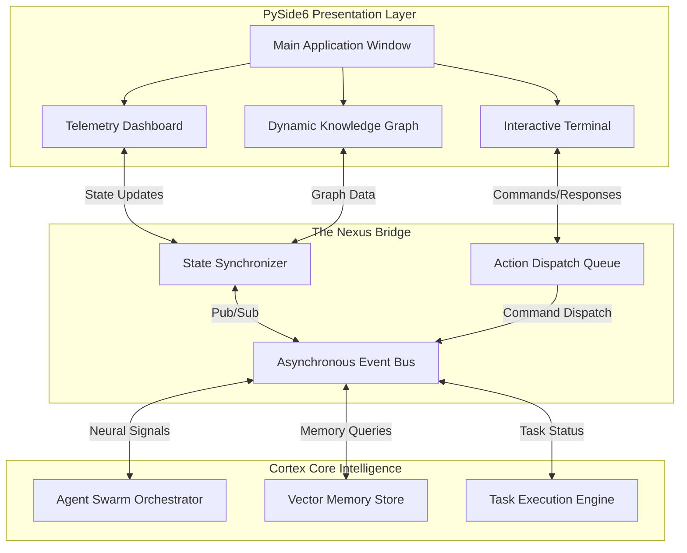
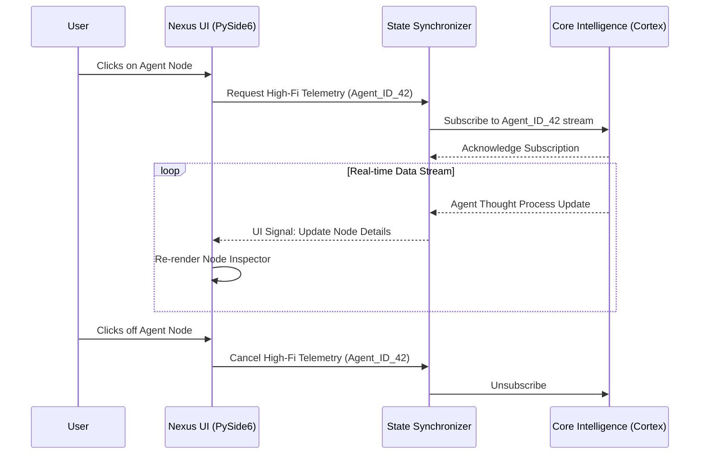

# 16 - The Nexus Integration: Bridging UI and Core Intelligence

## Introduction: The Dawn of the Nexus Interface

In the grand architecture of Project Ember, the presentation layer is not merely a collection of windows, buttons, and text fields. It is envisioned as something far more profound: The Nexus Integration. The Nexus is the critical threshold where the unfathomable depths of the Core Intelligence—driven by the Cortex system—meet the human sensory experience. It is the bridge between the cold, hyper-dimensional calculations of artificial intelligence and the intuitive, visually dominant world of human perception. Building this bridge requires an interface that is not static, but living, breathing, and dynamically responding to both the user's intent and the system's underlying cognitive processes. 

The traditional paradigm of graphical user interfaces (GUIs) treats the presentation layer as a dumb terminal. It awaits input, sends a request to a backend, and eventually renders a response. The Nexus Integration shatters this paradigm. Here, the UI is an extension of the mind of the machine. It anticipates, it reacts, and it visualizes complex thought processes in real-time. The user is not simply operating a tool; they are engaging in a dialogue with a sentient ecosystem. 

To achieve this level of human-machine symbiosis, we turn to the robust capabilities of PySide6. PySide6 provides the foundation—the raw materials of the visual world—but it is the Nexus architecture that breathes life into these components. By elevating PySide6 from a mere widget toolkit to a conduit for Core Intelligence, we create an environment where data flows fluidly, visualizations adapt instantly, and the boundary between operator and machine dissolves into a unified cognitive workflow. This document explores the profound intricacies of the Nexus Integration, detailing how PySide6 serves as the canvas for the Cortex's masterpiece.

## Philosophical Underpinnings of the Presentation Layer

Before delving into the technical specifications, it is vital to understand the philosophical goals of the Nexus Integration. The presentation layer must embody transparency, agency, and elegance. 

Transparency implies that the UI should demystify the AI's operations. The Cortex system engages in complex reasoning, task decomposition, and iterative refinement. If these processes remain hidden in a black box, the user cannot build trust. The Nexus must visually represent these internal states—showing not just the *output*, but the *process*. Through telemetry dashboards, dynamic knowledge graphs, and real-time logs, the UI becomes a window into the machine's mind.

Agency refers to the empowerment of the user. While the Core Intelligence is autonomous, the user must always remain the orchestrator. The interface must provide seamless mechanisms for intervention, steering, and correction. The Nexus is not a rigid rail system; it is a collaborative workspace. The PySide6 interface must therefore offer highly responsive controls that instantly propagate user directives down to the deepest layers of the Cortex, altering its trajectory on the fly.

Elegance is the aesthetic manifestation of efficiency. A cluttered interface overwhelms the operator. The Nexus must employ a minimalist yet incredibly dense visual language. Information should be progressively disclosed. Complex data should be synthesized into intuitive visualizations. The elegance of the PySide6 implementation lies in its ability to handle immense complexity beneath a surface of calm, structured clarity.

## The Role of PySide6 in the Nexus Ecosystem

PySide6, the official Python binding for the Qt framework, is the chosen vessel for the Nexus Integration. Its selection is not arbitrary; it is dictated by the extreme demands of bridging a high-performance Python-based AI core with a fluid, multi-platform graphical interface.

PySide6 offers an unparalleled combination of raw performance, mature component libraries, and deep integration with Python's asynchronous paradigms. In the context of the Nexus, PySide6 is utilized to construct a bespoke windowing environment that completely eschews standard operating system conventions in favor of a unified, immersive dashboard. 

The framework's `QGraphicsView` architecture is heavily leveraged to render complex, node-based representations of the Cortex's neural pathways and task execution trees. This allows for zooming, panning, and interacting with thousands of visual items without dropping frames. Furthermore, PySide6's signal and slot mechanism forms the bedrock of the reactive communication paradigm connecting the frontend elements to the backend intelligence. 

By utilizing PySide6's advanced styling capabilities (via QSS and dynamic palette manipulation), the Nexus can visually reflect the systemic state of the Cortex. A calm, resting state might be represented by cool, slow-moving gradients, while periods of intense computational load or critical alerts shift the thematic palette to urgent, high-contrast indicators. The UI thus becomes a mood ring for the artificial intelligence, communicating systemic health and focus through peripheral visual cues.

## Architectural Foundations: The Bridge Between Worlds

The architecture of the Nexus Integration is designed to decouple the heavy lifting of the Core Intelligence from the main thread of the PySide6 event loop, ensuring that the interface remains butter-smooth even when the AI is processing immense cognitive workloads. This is achieved through a multi-layered, asynchronous message-passing architecture.

At the lowest level resides the Cortex Core, operating in its own isolated thread pool or separate processes. Above this sits the Nexus Bridge, an intermediary layer responsible for translating the complex, high-dimensional data structures of the Core into standardized, serialized payloads suitable for UI consumption. Finally, the Presentation Layer (PySide6) receives these payloads and translates them into visual state changes.

The diagram above illustrates the strict separation of concerns. The Event Bus is the central nervous system. When the Task Execution Engine updates the status of a sub-task, it publishes a message to the Event Bus. The State Synchronizer intercepts this message, formats it, and emits a PySide6 Signal. The corresponding slot in the UI updates the progress bar or status indicator immediately. This unidirectional data flow for state updates, combined with an action queue for user inputs, completely eliminates race conditions and UI freezing.

## The Component Ecosystem: Sentient UI Elements

Within the PySide6 implementation of the Nexus, UI widgets are not treated as passive drawing elements. They are encapsulated as "Sentient Components." A Sentient Component is aware of its relationship to the Core Intelligence. It manages its own subscription to specific event channels and possesses internal logic to dictate its rendering based on the data it receives.

For example, a "Task Node" component in the Dynamic Knowledge Graph does not just display text. It subscribes to the specific ID of the task it represents. If the Cortex encounters an error while processing that task, the Task Node independently receives the error signal, changes its visual state (e.g., pulsing red), and spawns a localized tooltip detailing the stack trace or the LLM's confusion matrix. 

This component-level autonomy drastically reduces the complexity of the main window controller. The main window merely serves as a spatial layout manager, instantiating components and providing them with the necessary communication hooks. The components themselves negotiate their state with the Core. This architecture is highly scalable, allowing new visualization types to be introduced to the Nexus without rewriting the core routing logic.

## Data Flow and Real-Time Synchronization via Cortex

The synchronization of data between the massive knowledge bases of the Cortex and the relatively constrained memory of the PySide6 UI is a monumental challenge. The Nexus employs a strategy of "Lensed Observability." The UI never attempts to hold the entire state of the Core Intelligence. Instead, it holds "lenses" that project specific, filtered views of the data.

When a user focuses on a specific agent in the Agent Swarm, the UI shifts its lens. It requests a high-fidelity data stream for that specific agent, while reducing the telemetry of background agents to a low-fidelity heartbeat. This dynamic bandwidth allocation ensures the UI remains responsive and memory-efficient.

This sequence diagram demonstrates the Lensed Observability pattern. The PySide6 UI acts on user interaction to throttle and manage the flow of information. The State Synchronizer acts as the throttle valve, ensuring the UI is never overwhelmed by the sheer volume of data generated by a multi-agent AI system.

## Dynamic Visualizations and Cognitive Telemetry

To truly understand what the Cortex is doing, the user needs more than scrolling text logs. The Nexus Integration heavily utilizes custom PySide6 painting (`QPainter`) and OpenGL acceleration to render cognitive telemetry. 

This includes real-time force-directed graphs showing the relationships between different pieces of context retrieved from the Vector Memory Store. As the AI reasons, the user can watch nodes of information gravitate towards each other, visualizing the formation of a conclusion. 

Additionally, the UI features "Confidence Heatmaps." As an LLM generates a response or formulates a plan, the Nexus displays a gradient spectrum indicating the model's certainty at each step. This visual cue allows the operator to quickly identify areas where the AI might be hallucinating or where its reasoning is fragile, prompting immediate human intervention before the plan is executed.

## Human-Machine Symbiosis: Advanced Interaction Models

The interaction model of the Nexus is designed for rapid context switching and deep immersion. Standard point-and-click paradigms are augmented with advanced keyboard-driven command palettes, spatial navigation, and natural language interrupts.

If the Cortex is executing a long-running code generation task, the user can interrupt the process not by clicking a "stop" button, but by opening the Nexus Command Overlay (a PySide6 semi-transparent frameless window) and typing: "Pause execution, re-evaluate the memory management module, and resume." 

The PySide6 interface parses this input, packages it into a high-priority semantic interrupt signal, and injects it directly into the Cortex's Action Queue. The UI then immediately reflects this new directive, showing the task tree dynamically re-arranging itself to accommodate the user's mid-flight course correction.

## Aesthetics and Thematic Resonance: The Visual Language

The visual design of the Nexus is deeply tied to its functionality. Using PySide6's styling engine, we enforce a strict visual hierarchy. 

- **Primary Colors:** Deep, abyssal blues and stark blacks form the background, representing the boundless space of the AI's potential.
- **Accents:** Electric cyan and neon orange are used sparingly to draw the eye to active processes, warnings, or areas requiring human input.
- **Typography:** Monospaced, highly legible fonts are used for all data and code, while sans-serif geometric fonts are used for high-level system status.
- **Motion:** Animations are never decorative. They are strictly functional. A pulsing animation indicates waiting; a swift, linear slide indicates data transfer; an expanding ripple indicates the broadcasting of a global event across the swarm.

This visual language ensures that the operator can read the state of the system peripherally, without needing to actively focus on specific readouts. It is an ambient, resonant interface.

## State Management and the Lifecycle of Nexus Components

Managing the lifecycle of complex UI components that are tightly bound to asynchronous AI processes requires a rigorous state machine. Every Sentient Component in the Nexus transitions through a defined set of states to ensure stability and predictability.

```mermaid
stateDiagram-v2
    [*] --> Initialization
    Initialization --> Connecting: UI Element Created
    Connecting --> Active: Subscription Acknowledged
    Connecting --> Error: Connection Failed
    
    Active --> Processing: AI Working
    Processing --> Active: AI Idle/Done
    Processing --> Error: AI Exception
    Processing --> AwaitingHuman: Human Input Required
    
    AwaitingHuman --> Processing: Input Provided
    
    Active --> Disconnecting: UI Element Closed/Hidden
    Processing --> Disconnecting: UI Element Closed/Hidden
    Error --> Disconnecting: UI Element Closed/Hidden
    
    Disconnecting --> [*]: Cleanup Complete
```

This state diagram governs every major widget in the PySide6 implementation. If a widget is in the `AwaitingHuman` state, PySide6 automatically elevates its z-index, applies a visual highlight, and potentially plays a subtle audio cue. If a widget transitions to `Disconnecting`, it gracefully unsubscribes from the Event Bus before destroying its underlying C++ object to prevent memory leaks and segmentation faults—a critical consideration when bridging Python and Qt.

## Core Intelligence Integration: Sending and Receiving Signals

The actual mechanism of integration relies on specialized adapters. The Cortex system operates on semantic objects (e.g., `Task`, `Thought`, `Memory`), while PySide6 operates on primitives and QObjects. 

The Nexus Bridge implements a serialization layer (often utilizing JSON or Protocol Buffers for high speed) that flattens Cortex objects. Upon reception by the PySide6 main thread, these payloads are immediately re-hydrated into lightweight UI-specific data classes (e.g., `UITaskViewModel`). 

This translation layer acts as a firewall. If the Core Intelligence hallucinates malformed data, the serialization layer catches the schema violation and emits an error, preventing the UI from crashing due to unexpected input types. This robust type-checking at the boundary is essential for maintaining a stable presentation layer.

## Resilience and Graceful Degradation in the UI

Artificial intelligence systems are inherently non-deterministic. Subsystems may fail, LLM API calls may timeout, and memory stores may become corrupted. The Nexus Integration is designed with absolute resilience in mind.

If the PySide6 interface loses its connection to the Cortex backend (e.g., if the backend process crashes), the UI does not freeze or vanish. Instead, it enters a "Degraded Mode." The dynamic graphs freeze, the vibrant colors fade to a muted grey, and a prominent diagnostic overlay appears. 

In this state, the UI provides the user with tools to restart the Core Intelligence, dump crash logs, or examine the last known state of the system. By keeping the PySide6 presentation layer alive and responsive even when the brain is dead, the user maintains a sense of control and can effectively perform triage.

## Security, Privacy, and Execution Boundaries

The presentation layer often handles highly sensitive information retrieved or generated by the Core Intelligence. PySide6 provides mechanisms to sandbox the UI's access to the host operating system. The Nexus strictly enforces a policy where the UI has no direct access to the filesystem or network, except through designated, secure conduits provided by the Core Intelligence.

When the UI needs to render a locally generated file or an image, it requests the data through the Event Bus. The Core Intelligence validates the request, reads the file, and streams the byte data to the UI for rendering via `QPixmap` or `QTextDocument`. This prevents arbitrary local file inclusion vulnerabilities within the presentation layer and ensures all data access is logged and audited by the central Cortex system.

## The Future: Evolutionary Interfaces and Self-Adapting UI

The ultimate vision for the Nexus Integration is an interface that evolves. Currently, the PySide6 layouts are static, defined by the developers. In the future, the Core Intelligence itself will have the capability to re-arrange, spawn, and destroy UI components based on the user's workflow.

If the Cortex detects that the user frequently checks a specific telemetry metric during a particular type of coding task, it can autonomously write a PySide6 layout script to pin a new widget containing that metric to the user's dashboard. The UI becomes a living organism, constantly optimizing its shape and function to better serve the symbiotic relationship between human and machine.

## Conclusion: The Culmination of the Mythic Plan

The Nexus Integration is the crown jewel of Project Ember's presentation strategy. It transcends traditional software design, creating a fluid, reactive, and deeply insightful window into the Core Intelligence of the Cortex system. By mastering the immense capabilities of PySide6 and architecting a flawless, asynchronous bridge to the AI backend, we forge an interface that is not just a tool, but a true partner in the cognitive process. 

Through the rigorous implementation of Lensed Observability, Sentient Components, and uncompromising resilience, the Nexus stands as a testament to the future of human-computer interaction. It is where the abstract mathematics of artificial intelligence become tangible, understandable, and deeply powerful. The machine thinks, and the Nexus reveals its mind.
