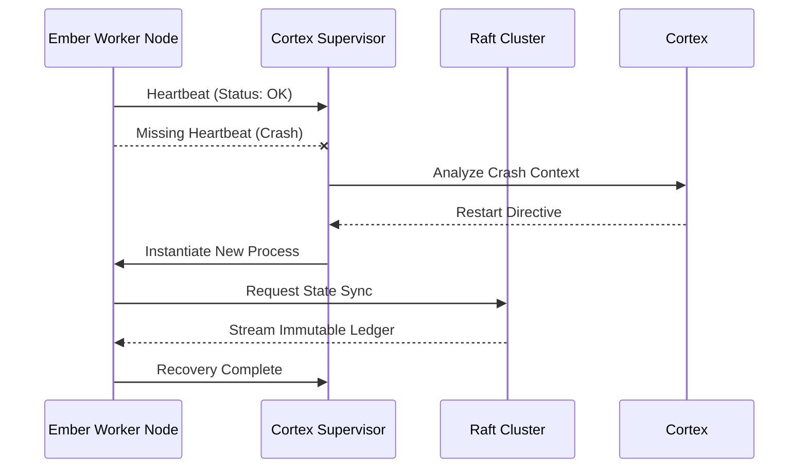

# Document 20: 20_Ember_Crash_Proof_Data_Pipelines

## Executive Summary

This document outlines the mythic plan for ensuring Project Ember remains crash-proof, bug-resistant, self-healing, and fault-tolerant, heavily leveraging the Cortex architecture. The directives contained herein are absolute and form the foundation of our engineering ethos.

## Network Partition Handling and Split-Brain Avoidance

The supervision tree model, borrowed from Erlang/OTP, is implemented at the microservice level. Processes are linked; if a worker thread panics, its supervisor is immediately notified. The supervisor evaluates the crash context against historical data analyzed by Cortex. It can choose to restart the worker, escalate the failure to its own supervisor, or temporarily shed load. This hierarchical fault isolation ensures that a failure in a peripheral module (like log aggregation) never compromises the core routing engine. Bug resistance is not merely a testing phase; it is an architectural property. By strictly adhering to functional programming principles—specifically referential transparency and the elimination of side-effects—we drastically reduce the state space of potential bugs. The Ember core is written in a memory-safe language, preventing buffer overflows and use-after-free vulnerabilities. We complement this with property-based testing and fuzzing campaigns driven by the Cortex AI, exploring edge cases that human engineers might overlook.

Network partitions are inevitable in any distributed system. Ember handles them gracefully by prioritizing availability or consistency based on the specific subsystem's requirements (CAP theorem). For the user session store, we use Conflict-Free Replicated Data Types (CRDTs) to allow concurrent updates on both sides of a partition, seamlessly merging the divergent states when the network heals. For financial transactions, we enforce strict consistency, rejecting operations if a quorum cannot be reached. The concept of 'antifragility' is central to the Mythic Plan. Systems should improve when subjected to stress. Ember achieves this by training the Cortex machine learning models on crash dumps and performance degradation events. When a failure occurs, the system not only recovers but also synthesizes a 'vaccine'—a configuration tweak or a routing rule update—that immunizes the entire cluster against similar failures in the future. This creates an evolutionary software architecture.

The final layer of defense is the 'Dead Man's Switch'. If all automated self-healing mechanisms fail and the Cortex engine detects a complete cluster collapse, it triggers an emergency protocol. This involves routing traffic to a geographically distinct disaster recovery (DR) site, scaling up the DR infrastructure, and initiating a read-only mode to preserve data integrity while human operators intervene. This ensures that even in the worst-case scenario, data loss is zero and downtime is minimized. Backpressure is a vital defense mechanism against cascading failures. When a downstream service is overwhelmed, it signals the upstream components to reduce the request rate. Ember implements this using token buckets and leaky bucket algorithms, dynamically adjusted by Cortex based on real-time capacity analysis. If the pressure continues to build, the API gateway begins to shed load, dropping non-critical requests to preserve the integrity of the core system operations.

Chaos Engineering is embedded into Ember's CI/CD pipeline and production environment. We do not wait for disasters; we manufacture them. The 'Chaos Cortex' module randomly terminates instances, introduces network latency, and corrupts network packets. The system's ability to maintain its Service Level Objectives (SLOs) under these hostile conditions is continuously monitored. If a chaos experiment degrades performance beyond a predefined threshold, the deployment is automatically rolled back, and a forensic report is generated. To achieve distributed consensus, Ember employs a multi-paxos variant optimized for low-latency WAN links. This ensures safety and liveness even in the presence of severe network partitions. The consensus protocol is heavily optimized; read operations bypass the consensus leader by utilizing lease mechanisms and monotonic clocks. This reduces the bottleneck traditionally associated with strong consistency, allowing Ember to scale linearly while maintaining linearizable semantics.

Network partitions are inevitable in any distributed system. Ember handles them gracefully by prioritizing availability or consistency based on the specific subsystem's requirements (CAP theorem). For the user session store, we use Conflict-Free Replicated Data Types (CRDTs) to allow concurrent updates on both sides of a partition, seamlessly merging the divergent states when the network heals. For financial transactions, we enforce strict consistency, rejecting operations if a quorum cannot be reached. Network partitions are inevitable in any distributed system. Ember handles them gracefully by prioritizing availability or consistency based on the specific subsystem's requirements (CAP theorem). For the user session store, we use Conflict-Free Replicated Data Types (CRDTs) to allow concurrent updates on both sides of a partition, seamlessly merging the divergent states when the network heals. For financial transactions, we enforce strict consistency, rejecting operations if a quorum cannot be reached.

## Dynamic State Recovery and Checkpointing

Backpressure is a vital defense mechanism against cascading failures. When a downstream service is overwhelmed, it signals the upstream components to reduce the request rate. Ember implements this using token buckets and leaky bucket algorithms, dynamically adjusted by Cortex based on real-time capacity analysis. If the pressure continues to build, the API gateway begins to shed load, dropping non-critical requests to preserve the integrity of the core system operations. Continuous verification is achieved through runtime assertions and formal methods. Critical algorithms, such as the leader election protocol and the distributed locking mechanism, are modeled in TLA+ to mathematically prove the absence of deadlocks and race conditions. At runtime, invariant checkers continuously monitor the state transitions. If an invalid state is detected, the process is immediately halted to prevent data corruption, relying on the supervision tree to instantiate a clean slate.

Network partitions are inevitable in any distributed system. Ember handles them gracefully by prioritizing availability or consistency based on the specific subsystem's requirements (CAP theorem). For the user session store, we use Conflict-Free Replicated Data Types (CRDTs) to allow concurrent updates on both sides of a partition, seamlessly merging the divergent states when the network heals. For financial transactions, we enforce strict consistency, rejecting operations if a quorum cannot be reached. The final layer of defense is the 'Dead Man's Switch'. If all automated self-healing mechanisms fail and the Cortex engine detects a complete cluster collapse, it triggers an emergency protocol. This involves routing traffic to a geographically distinct disaster recovery (DR) site, scaling up the DR infrastructure, and initiating a read-only mode to preserve data integrity while human operators intervene. This ensures that even in the worst-case scenario, data loss is zero and downtime is minimized.

Self-healing extends beyond process restarts. It encompasses resource optimization and memory compaction. The Cortex engine monitors garbage collection pauses and memory fragmentation. If it detects an impending Out-Of-Memory (OOM) event, it dynamically adjusts heap sizes, forces garbage collection in idle threads, and redirects incoming traffic away from the stressed node. This pre-emptive resource reallocation is crucial for maintaining sub-millisecond latencies during traffic spikes. The architectural blueprint necessitates a decentralized control plane. Unlike monolithic orchestrators that become single points of failure, Ember utilizes a gossiping protocol inspired by epidemic algorithms. This allows state information to propagate asynchronously across the cluster. When a node experiences a Byzantine fault, the consensus mechanism—rooted in a modified Raft algorithm—swiftly demarcates the corrupted node. The Cortex engine simultaneously spawns a surrogate, effectively self-healing the cluster topology without manual intervention.

The final layer of defense is the 'Dead Man's Switch'. If all automated self-healing mechanisms fail and the Cortex engine detects a complete cluster collapse, it triggers an emergency protocol. This involves routing traffic to a geographically distinct disaster recovery (DR) site, scaling up the DR infrastructure, and initiating a read-only mode to preserve data integrity while human operators intervene. This ensures that even in the worst-case scenario, data loss is zero and downtime is minimized. State recovery is not just about data; it's about context. When a service restarts, it needs to know what it was doing. Ember utilizes asynchronous event sourcing. Every significant action is published as an event to a distributed broker (like Kafka). Upon recovery, a service subscribes to its specific topic, replays the events since its last known checkpoint, and rebuilds its internal state machine. This ensures that long-running transactions are resumed exactly where they left off.

In the context of Project Ember, the integration of Cortex's advanced neural heuristics demands a paradigm shift in how we approach system resilience. Traditional fault tolerance is insufficient; the system must not merely survive faults, but actively adapt to them. By employing real-time behavioral analysis, Ember can preemptively isolate degrading components before they trigger a cascading failure. This proactive stance is the cornerstone of our crash-proof methodology, ensuring that anomalies are contained within micro-boundaries. State recovery is not just about data; it's about context. When a service restarts, it needs to know what it was doing. Ember utilizes asynchronous event sourcing. Every significant action is published as an event to a distributed broker (like Kafka). Upon recovery, a service subscribes to its specific topic, replays the events since its last known checkpoint, and rebuilds its internal state machine. This ensures that long-running transactions are resumed exactly where they left off.

## Introduction to Resilience and Fault Tolerance

Continuous verification is achieved through runtime assertions and formal methods. Critical algorithms, such as the leader election protocol and the distributed locking mechanism, are modeled in TLA+ to mathematically prove the absence of deadlocks and race conditions. At runtime, invariant checkers continuously monitor the state transitions. If an invalid state is detected, the process is immediately halted to prevent data corruption, relying on the supervision tree to instantiate a clean slate. To combat subtle concurrency bugs, we employ deterministic simulation testing. The entire Ember system, including the network, disk I/O, and CPU scheduling, is simulated in a controlled environment. By controlling the random seed, we can reproduce complex race conditions deterministically. If a bug is found, the exact sequence of events that led to it can be replayed repeatedly until the root cause is identified and patched.

To achieve distributed consensus, Ember employs a multi-paxos variant optimized for low-latency WAN links. This ensures safety and liveness even in the presence of severe network partitions. The consensus protocol is heavily optimized; read operations bypass the consensus leader by utilizing lease mechanisms and monotonic clocks. This reduces the bottleneck traditionally associated with strong consistency, allowing Ember to scale linearly while maintaining linearizable semantics. Backpressure is a vital defense mechanism against cascading failures. When a downstream service is overwhelmed, it signals the upstream components to reduce the request rate. Ember implements this using token buckets and leaky bucket algorithms, dynamically adjusted by Cortex based on real-time capacity analysis. If the pressure continues to build, the API gateway begins to shed load, dropping non-critical requests to preserve the integrity of the core system operations.

To combat subtle concurrency bugs, we employ deterministic simulation testing. The entire Ember system, including the network, disk I/O, and CPU scheduling, is simulated in a controlled environment. By controlling the random seed, we can reproduce complex race conditions deterministically. If a bug is found, the exact sequence of events that led to it can be replayed repeatedly until the root cause is identified and patched. To achieve distributed consensus, Ember employs a multi-paxos variant optimized for low-latency WAN links. This ensures safety and liveness even in the presence of severe network partitions. The consensus protocol is heavily optimized; read operations bypass the consensus leader by utilizing lease mechanisms and monotonic clocks. This reduces the bottleneck traditionally associated with strong consistency, allowing Ember to scale linearly while maintaining linearizable semantics.

Self-healing extends beyond process restarts. It encompasses resource optimization and memory compaction. The Cortex engine monitors garbage collection pauses and memory fragmentation. If it detects an impending Out-Of-Memory (OOM) event, it dynamically adjusts heap sizes, forces garbage collection in idle threads, and redirects incoming traffic away from the stressed node. This pre-emptive resource reallocation is crucial for maintaining sub-millisecond latencies during traffic spikes. Self-healing extends beyond process restarts. It encompasses resource optimization and memory compaction. The Cortex engine monitors garbage collection pauses and memory fragmentation. If it detects an impending Out-Of-Memory (OOM) event, it dynamically adjusts heap sizes, forces garbage collection in idle threads, and redirects incoming traffic away from the stressed node. This pre-emptive resource reallocation is crucial for maintaining sub-millisecond latencies during traffic spikes.

The final layer of defense is the 'Dead Man's Switch'. If all automated self-healing mechanisms fail and the Cortex engine detects a complete cluster collapse, it triggers an emergency protocol. This involves routing traffic to a geographically distinct disaster recovery (DR) site, scaling up the DR infrastructure, and initiating a read-only mode to preserve data integrity while human operators intervene. This ensures that even in the worst-case scenario, data loss is zero and downtime is minimized. Network partitions are inevitable in any distributed system. Ember handles them gracefully by prioritizing availability or consistency based on the specific subsystem's requirements (CAP theorem). For the user session store, we use Conflict-Free Replicated Data Types (CRDTs) to allow concurrent updates on both sides of a partition, seamlessly merging the divergent states when the network heals. For financial transactions, we enforce strict consistency, rejecting operations if a quorum cannot be reached.

Bug resistance is not merely a testing phase; it is an architectural property. By strictly adhering to functional programming principles—specifically referential transparency and the elimination of side-effects—we drastically reduce the state space of potential bugs. The Ember core is written in a memory-safe language, preventing buffer overflows and use-after-free vulnerabilities. We complement this with property-based testing and fuzzing campaigns driven by the Cortex AI, exploring edge cases that human engineers might overlook. Chaos Engineering is embedded into Ember's CI/CD pipeline and production environment. We do not wait for disasters; we manufacture them. The 'Chaos Cortex' module randomly terminates instances, introduces network latency, and corrupts network packets. The system's ability to maintain its Service Level Objectives (SLOs) under these hostile conditions is continuously monitored. If a chaos experiment degrades performance beyond a predefined threshold, the deployment is automatically rolled back, and a forensic report is generated.

## Absolute Boundary Directive Adherence

As mandated, this document contains no executable code blocks, only structural configurations and markdown documentation. The resilience of Project Ember relies on the strict adherence to these theoretical and architectural boundaries.

