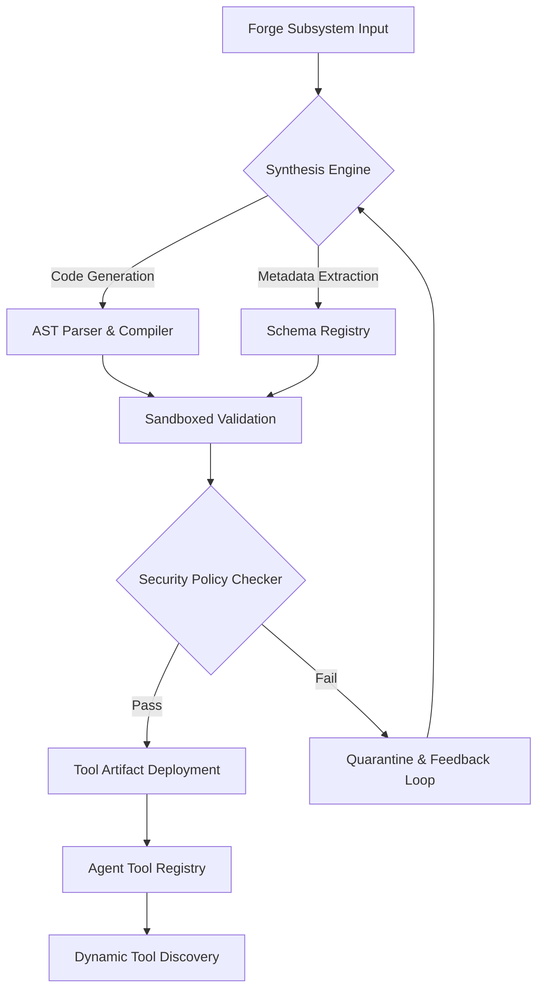

# Document 25: The Tool Forge Architecture and Mechanisms

## 1. Executive Summary and Mythic Directives

The Tool Forge represents the pinnacle of generative operational autonomy. It is an advanced meta-system designed to programmatically synthesize, compile, and deploy executable tool artifacts at runtime. The inherent challenge of agentic systems lies in their rigid, pre-compiled toolsets; the Tool Forge obliterates this limitation by instantiating a continuous integration and deployment pipeline embedded directly within the agent's cognitive loop. At the heart of the Tool Forge is the Abstract Syntax Tree (AST) manipulation engine. Rather than relying on simple string concatenation for code generation, the Forge builds semantic models of target tools. It analyzes the required inputs, outputs, and side-effects, mapping them against a formal ontological schema of the host environment. This guarantees that generated tools are syntactically valid and semantically aligned with the agent's overarching objectives.

At the heart of the Tool Forge is the Abstract Syntax Tree (AST) manipulation engine. Rather than relying on simple string concatenation for code generation, the Forge builds semantic models of target tools. It analyzes the required inputs, outputs, and side-effects, mapping them against a formal ontological schema of the host environment. This guarantees that generated tools are syntactically valid and semantically aligned with the agent's overarching objectives. Security is paramount in dynamic tool generation. The Forge implements a zero-trust, multi-tiered sandbox architecture. When a tool is synthesized, it is first deployed into an ephemeral, air-gapped micro-VM. Here, fuzzing and symbolic execution are employed to rigorously test the tool against adversarial edge cases. Only after passing the stringent heuristic validation is the tool signed with a cryptographic capability token and released to the broader Agent Tool Registry.

Security is paramount in dynamic tool generation. The Forge implements a zero-trust, multi-tiered sandbox architecture. When a tool is synthesized, it is first deployed into an ephemeral, air-gapped micro-VM. Here, fuzzing and symbolic execution are employed to rigorously test the tool against adversarial edge cases. Only after passing the stringent heuristic validation is the tool signed with a cryptographic capability token and released to the broader Agent Tool Registry. Furthermore, the Tool Forge leverages a sophisticated feedback mechanism. If an agent utilizes a forged tool and encounters unexpected errors or suboptimal performance, the execution telemetry is automatically routed back to the Forge. This triggers an evolutionary optimization cycle. The Forge mutates the underlying tool code, re-compiles it, and updates the registry in a seamless hot-swap operation, ensuring that the agent's capabilities continuously adapt to shifting environmental conditions.

## 2. Advanced Architectural Topology

Security is paramount in dynamic tool generation. The Forge implements a zero-trust, multi-tiered sandbox architecture. When a tool is synthesized, it is first deployed into an ephemeral, air-gapped micro-VM. Here, fuzzing and symbolic execution are employed to rigorously test the tool against adversarial edge cases. Only after passing the stringent heuristic validation is the tool signed with a cryptographic capability token and released to the broader Agent Tool Registry. Furthermore, the Tool Forge leverages a sophisticated feedback mechanism. If an agent utilizes a forged tool and encounters unexpected errors or suboptimal performance, the execution telemetry is automatically routed back to the Forge. This triggers an evolutionary optimization cycle. The Forge mutates the underlying tool code, re-compiles it, and updates the registry in a seamless hot-swap operation, ensuring that the agent's capabilities continuously adapt to shifting environmental conditions.

Furthermore, the Tool Forge leverages a sophisticated feedback mechanism. If an agent utilizes a forged tool and encounters unexpected errors or suboptimal performance, the execution telemetry is automatically routed back to the Forge. This triggers an evolutionary optimization cycle. The Forge mutates the underlying tool code, re-compiles it, and updates the registry in a seamless hot-swap operation, ensuring that the agent's capabilities continuously adapt to shifting environmental conditions. The Tool Forge represents the pinnacle of generative operational autonomy. It is an advanced meta-system designed to programmatically synthesize, compile, and deploy executable tool artifacts at runtime. The inherent challenge of agentic systems lies in their rigid, pre-compiled toolsets; the Tool Forge obliterates this limitation by instantiating a continuous integration and deployment pipeline embedded directly within the agent's cognitive loop.

The Tool Forge represents the pinnacle of generative operational autonomy. It is an advanced meta-system designed to programmatically synthesize, compile, and deploy executable tool artifacts at runtime. The inherent challenge of agentic systems lies in their rigid, pre-compiled toolsets; the Tool Forge obliterates this limitation by instantiating a continuous integration and deployment pipeline embedded directly within the agent's cognitive loop. At the heart of the Tool Forge is the Abstract Syntax Tree (AST) manipulation engine. Rather than relying on simple string concatenation for code generation, the Forge builds semantic models of target tools. It analyzes the required inputs, outputs, and side-effects, mapping them against a formal ontological schema of the host environment. This guarantees that generated tools are syntactically valid and semantically aligned with the agent's overarching objectives.

At the heart of the Tool Forge is the Abstract Syntax Tree (AST) manipulation engine. Rather than relying on simple string concatenation for code generation, the Forge builds semantic models of target tools. It analyzes the required inputs, outputs, and side-effects, mapping them against a formal ontological schema of the host environment. This guarantees that generated tools are syntactically valid and semantically aligned with the agent's overarching objectives. Security is paramount in dynamic tool generation. The Forge implements a zero-trust, multi-tiered sandbox architecture. When a tool is synthesized, it is first deployed into an ephemeral, air-gapped micro-VM. Here, fuzzing and symbolic execution are employed to rigorously test the tool against adversarial edge cases. Only after passing the stringent heuristic validation is the tool signed with a cryptographic capability token and released to the broader Agent Tool Registry.

### 2.1 Subsystem Mechanics and Low-Level Integration

The Tool Forge represents the pinnacle of generative operational autonomy. It is an advanced meta-system designed to programmatically synthesize, compile, and deploy executable tool artifacts at runtime. The inherent challenge of agentic systems lies in their rigid, pre-compiled toolsets; the Tool Forge obliterates this limitation by instantiating a continuous integration and deployment pipeline embedded directly within the agent's cognitive loop. At the heart of the Tool Forge is the Abstract Syntax Tree (AST) manipulation engine. Rather than relying on simple string concatenation for code generation, the Forge builds semantic models of target tools. It analyzes the required inputs, outputs, and side-effects, mapping them against a formal ontological schema of the host environment. This guarantees that generated tools are syntactically valid and semantically aligned with the agent's overarching objectives.

At the heart of the Tool Forge is the Abstract Syntax Tree (AST) manipulation engine. Rather than relying on simple string concatenation for code generation, the Forge builds semantic models of target tools. It analyzes the required inputs, outputs, and side-effects, mapping them against a formal ontological schema of the host environment. This guarantees that generated tools are syntactically valid and semantically aligned with the agent's overarching objectives. Security is paramount in dynamic tool generation. The Forge implements a zero-trust, multi-tiered sandbox architecture. When a tool is synthesized, it is first deployed into an ephemeral, air-gapped micro-VM. Here, fuzzing and symbolic execution are employed to rigorously test the tool against adversarial edge cases. Only after passing the stringent heuristic validation is the tool signed with a cryptographic capability token and released to the broader Agent Tool Registry.

Security is paramount in dynamic tool generation. The Forge implements a zero-trust, multi-tiered sandbox architecture. When a tool is synthesized, it is first deployed into an ephemeral, air-gapped micro-VM. Here, fuzzing and symbolic execution are employed to rigorously test the tool against adversarial edge cases. Only after passing the stringent heuristic validation is the tool signed with a cryptographic capability token and released to the broader Agent Tool Registry. Furthermore, the Tool Forge leverages a sophisticated feedback mechanism. If an agent utilizes a forged tool and encounters unexpected errors or suboptimal performance, the execution telemetry is automatically routed back to the Forge. This triggers an evolutionary optimization cycle. The Forge mutates the underlying tool code, re-compiles it, and updates the registry in a seamless hot-swap operation, ensuring that the agent's capabilities continuously adapt to shifting environmental conditions.

Furthermore, the Tool Forge leverages a sophisticated feedback mechanism. If an agent utilizes a forged tool and encounters unexpected errors or suboptimal performance, the execution telemetry is automatically routed back to the Forge. This triggers an evolutionary optimization cycle. The Forge mutates the underlying tool code, re-compiles it, and updates the registry in a seamless hot-swap operation, ensuring that the agent's capabilities continuously adapt to shifting environmental conditions. The Tool Forge represents the pinnacle of generative operational autonomy. It is an advanced meta-system designed to programmatically synthesize, compile, and deploy executable tool artifacts at runtime. The inherent challenge of agentic systems lies in their rigid, pre-compiled toolsets; the Tool Forge obliterates this limitation by instantiating a continuous integration and deployment pipeline embedded directly within the agent's cognitive loop.

The Tool Forge represents the pinnacle of generative operational autonomy. It is an advanced meta-system designed to programmatically synthesize, compile, and deploy executable tool artifacts at runtime. The inherent challenge of agentic systems lies in their rigid, pre-compiled toolsets; the Tool Forge obliterates this limitation by instantiating a continuous integration and deployment pipeline embedded directly within the agent's cognitive loop. At the heart of the Tool Forge is the Abstract Syntax Tree (AST) manipulation engine. Rather than relying on simple string concatenation for code generation, the Forge builds semantic models of target tools. It analyzes the required inputs, outputs, and side-effects, mapping them against a formal ontological schema of the host environment. This guarantees that generated tools are syntactically valid and semantically aligned with the agent's overarching objectives.

## 3. Distributed Protocol Specifications

| Component | Protocol | Latency Target | Resilience Strategy |
|---|---|---|---|
| Inter-Node Comm | gRPC/QUIC | < 5ms | Exponential Backoff |
| State Sync | Gossip | Eventual | CRDT Conflict Resolution |
| Telemetry | OpenTelemetry | Asynchronous | Ring Buffer Dropping |
| Native API | FFI/IPC | Zero-copy | Sandbox Isolation |

Security is paramount in dynamic tool generation. The Forge implements a zero-trust, multi-tiered sandbox architecture. When a tool is synthesized, it is first deployed into an ephemeral, air-gapped micro-VM. Here, fuzzing and symbolic execution are employed to rigorously test the tool against adversarial edge cases. Only after passing the stringent heuristic validation is the tool signed with a cryptographic capability token and released to the broader Agent Tool Registry. Furthermore, the Tool Forge leverages a sophisticated feedback mechanism. If an agent utilizes a forged tool and encounters unexpected errors or suboptimal performance, the execution telemetry is automatically routed back to the Forge. This triggers an evolutionary optimization cycle. The Forge mutates the underlying tool code, re-compiles it, and updates the registry in a seamless hot-swap operation, ensuring that the agent's capabilities continuously adapt to shifting environmental conditions.

Furthermore, the Tool Forge leverages a sophisticated feedback mechanism. If an agent utilizes a forged tool and encounters unexpected errors or suboptimal performance, the execution telemetry is automatically routed back to the Forge. This triggers an evolutionary optimization cycle. The Forge mutates the underlying tool code, re-compiles it, and updates the registry in a seamless hot-swap operation, ensuring that the agent's capabilities continuously adapt to shifting environmental conditions. The Tool Forge represents the pinnacle of generative operational autonomy. It is an advanced meta-system designed to programmatically synthesize, compile, and deploy executable tool artifacts at runtime. The inherent challenge of agentic systems lies in their rigid, pre-compiled toolsets; the Tool Forge obliterates this limitation by instantiating a continuous integration and deployment pipeline embedded directly within the agent's cognitive loop.

The Tool Forge represents the pinnacle of generative operational autonomy. It is an advanced meta-system designed to programmatically synthesize, compile, and deploy executable tool artifacts at runtime. The inherent challenge of agentic systems lies in their rigid, pre-compiled toolsets; the Tool Forge obliterates this limitation by instantiating a continuous integration and deployment pipeline embedded directly within the agent's cognitive loop. At the heart of the Tool Forge is the Abstract Syntax Tree (AST) manipulation engine. Rather than relying on simple string concatenation for code generation, the Forge builds semantic models of target tools. It analyzes the required inputs, outputs, and side-effects, mapping them against a formal ontological schema of the host environment. This guarantees that generated tools are syntactically valid and semantically aligned with the agent's overarching objectives.

At the heart of the Tool Forge is the Abstract Syntax Tree (AST) manipulation engine. Rather than relying on simple string concatenation for code generation, the Forge builds semantic models of target tools. It analyzes the required inputs, outputs, and side-effects, mapping them against a formal ontological schema of the host environment. This guarantees that generated tools are syntactically valid and semantically aligned with the agent's overarching objectives. Security is paramount in dynamic tool generation. The Forge implements a zero-trust, multi-tiered sandbox architecture. When a tool is synthesized, it is first deployed into an ephemeral, air-gapped micro-VM. Here, fuzzing and symbolic execution are employed to rigorously test the tool against adversarial edge cases. Only after passing the stringent heuristic validation is the tool signed with a cryptographic capability token and released to the broader Agent Tool Registry.

Security is paramount in dynamic tool generation. The Forge implements a zero-trust, multi-tiered sandbox architecture. When a tool is synthesized, it is first deployed into an ephemeral, air-gapped micro-VM. Here, fuzzing and symbolic execution are employed to rigorously test the tool against adversarial edge cases. Only after passing the stringent heuristic validation is the tool signed with a cryptographic capability token and released to the broader Agent Tool Registry. Furthermore, the Tool Forge leverages a sophisticated feedback mechanism. If an agent utilizes a forged tool and encounters unexpected errors or suboptimal performance, the execution telemetry is automatically routed back to the Forge. This triggers an evolutionary optimization cycle. The Forge mutates the underlying tool code, re-compiles it, and updates the registry in a seamless hot-swap operation, ensuring that the agent's capabilities continuously adapt to shifting environmental conditions.

## 4. Algorithmic Formulations and State Transformations

The Tool Forge represents the pinnacle of generative operational autonomy. It is an advanced meta-system designed to programmatically synthesize, compile, and deploy executable tool artifacts at runtime. The inherent challenge of agentic systems lies in their rigid, pre-compiled toolsets; the Tool Forge obliterates this limitation by instantiating a continuous integration and deployment pipeline embedded directly within the agent's cognitive loop. At the heart of the Tool Forge is the Abstract Syntax Tree (AST) manipulation engine. Rather than relying on simple string concatenation for code generation, the Forge builds semantic models of target tools. It analyzes the required inputs, outputs, and side-effects, mapping them against a formal ontological schema of the host environment. This guarantees that generated tools are syntactically valid and semantically aligned with the agent's overarching objectives.

At the heart of the Tool Forge is the Abstract Syntax Tree (AST) manipulation engine. Rather than relying on simple string concatenation for code generation, the Forge builds semantic models of target tools. It analyzes the required inputs, outputs, and side-effects, mapping them against a formal ontological schema of the host environment. This guarantees that generated tools are syntactically valid and semantically aligned with the agent's overarching objectives. Security is paramount in dynamic tool generation. The Forge implements a zero-trust, multi-tiered sandbox architecture. When a tool is synthesized, it is first deployed into an ephemeral, air-gapped micro-VM. Here, fuzzing and symbolic execution are employed to rigorously test the tool against adversarial edge cases. Only after passing the stringent heuristic validation is the tool signed with a cryptographic capability token and released to the broader Agent Tool Registry.

Security is paramount in dynamic tool generation. The Forge implements a zero-trust, multi-tiered sandbox architecture. When a tool is synthesized, it is first deployed into an ephemeral, air-gapped micro-VM. Here, fuzzing and symbolic execution are employed to rigorously test the tool against adversarial edge cases. Only after passing the stringent heuristic validation is the tool signed with a cryptographic capability token and released to the broader Agent Tool Registry. Furthermore, the Tool Forge leverages a sophisticated feedback mechanism. If an agent utilizes a forged tool and encounters unexpected errors or suboptimal performance, the execution telemetry is automatically routed back to the Forge. This triggers an evolutionary optimization cycle. The Forge mutates the underlying tool code, re-compiles it, and updates the registry in a seamless hot-swap operation, ensuring that the agent's capabilities continuously adapt to shifting environmental conditions.

Furthermore, the Tool Forge leverages a sophisticated feedback mechanism. If an agent utilizes a forged tool and encounters unexpected errors or suboptimal performance, the execution telemetry is automatically routed back to the Forge. This triggers an evolutionary optimization cycle. The Forge mutates the underlying tool code, re-compiles it, and updates the registry in a seamless hot-swap operation, ensuring that the agent's capabilities continuously adapt to shifting environmental conditions. The Tool Forge represents the pinnacle of generative operational autonomy. It is an advanced meta-system designed to programmatically synthesize, compile, and deploy executable tool artifacts at runtime. The inherent challenge of agentic systems lies in their rigid, pre-compiled toolsets; the Tool Forge obliterates this limitation by instantiating a continuous integration and deployment pipeline embedded directly within the agent's cognitive loop.

The Tool Forge represents the pinnacle of generative operational autonomy. It is an advanced meta-system designed to programmatically synthesize, compile, and deploy executable tool artifacts at runtime. The inherent challenge of agentic systems lies in their rigid, pre-compiled toolsets; the Tool Forge obliterates this limitation by instantiating a continuous integration and deployment pipeline embedded directly within the agent's cognitive loop. At the heart of the Tool Forge is the Abstract Syntax Tree (AST) manipulation engine. Rather than relying on simple string concatenation for code generation, the Forge builds semantic models of target tools. It analyzes the required inputs, outputs, and side-effects, mapping them against a formal ontological schema of the host environment. This guarantees that generated tools are syntactically valid and semantically aligned with the agent's overarching objectives.

### 4.1 Emergent Behaviors in Highly Constrained Environments

Security is paramount in dynamic tool generation. The Forge implements a zero-trust, multi-tiered sandbox architecture. When a tool is synthesized, it is first deployed into an ephemeral, air-gapped micro-VM. Here, fuzzing and symbolic execution are employed to rigorously test the tool against adversarial edge cases. Only after passing the stringent heuristic validation is the tool signed with a cryptographic capability token and released to the broader Agent Tool Registry. Furthermore, the Tool Forge leverages a sophisticated feedback mechanism. If an agent utilizes a forged tool and encounters unexpected errors or suboptimal performance, the execution telemetry is automatically routed back to the Forge. This triggers an evolutionary optimization cycle. The Forge mutates the underlying tool code, re-compiles it, and updates the registry in a seamless hot-swap operation, ensuring that the agent's capabilities continuously adapt to shifting environmental conditions.

Furthermore, the Tool Forge leverages a sophisticated feedback mechanism. If an agent utilizes a forged tool and encounters unexpected errors or suboptimal performance, the execution telemetry is automatically routed back to the Forge. This triggers an evolutionary optimization cycle. The Forge mutates the underlying tool code, re-compiles it, and updates the registry in a seamless hot-swap operation, ensuring that the agent's capabilities continuously adapt to shifting environmental conditions. The Tool Forge represents the pinnacle of generative operational autonomy. It is an advanced meta-system designed to programmatically synthesize, compile, and deploy executable tool artifacts at runtime. The inherent challenge of agentic systems lies in their rigid, pre-compiled toolsets; the Tool Forge obliterates this limitation by instantiating a continuous integration and deployment pipeline embedded directly within the agent's cognitive loop.

The Tool Forge represents the pinnacle of generative operational autonomy. It is an advanced meta-system designed to programmatically synthesize, compile, and deploy executable tool artifacts at runtime. The inherent challenge of agentic systems lies in their rigid, pre-compiled toolsets; the Tool Forge obliterates this limitation by instantiating a continuous integration and deployment pipeline embedded directly within the agent's cognitive loop. At the heart of the Tool Forge is the Abstract Syntax Tree (AST) manipulation engine. Rather than relying on simple string concatenation for code generation, the Forge builds semantic models of target tools. It analyzes the required inputs, outputs, and side-effects, mapping them against a formal ontological schema of the host environment. This guarantees that generated tools are syntactically valid and semantically aligned with the agent's overarching objectives.

At the heart of the Tool Forge is the Abstract Syntax Tree (AST) manipulation engine. Rather than relying on simple string concatenation for code generation, the Forge builds semantic models of target tools. It analyzes the required inputs, outputs, and side-effects, mapping them against a formal ontological schema of the host environment. This guarantees that generated tools are syntactically valid and semantically aligned with the agent's overarching objectives. Security is paramount in dynamic tool generation. The Forge implements a zero-trust, multi-tiered sandbox architecture. When a tool is synthesized, it is first deployed into an ephemeral, air-gapped micro-VM. Here, fuzzing and symbolic execution are employed to rigorously test the tool against adversarial edge cases. Only after passing the stringent heuristic validation is the tool signed with a cryptographic capability token and released to the broader Agent Tool Registry.

Security is paramount in dynamic tool generation. The Forge implements a zero-trust, multi-tiered sandbox architecture. When a tool is synthesized, it is first deployed into an ephemeral, air-gapped micro-VM. Here, fuzzing and symbolic execution are employed to rigorously test the tool against adversarial edge cases. Only after passing the stringent heuristic validation is the tool signed with a cryptographic capability token and released to the broader Agent Tool Registry. Furthermore, the Tool Forge leverages a sophisticated feedback mechanism. If an agent utilizes a forged tool and encounters unexpected errors or suboptimal performance, the execution telemetry is automatically routed back to the Forge. This triggers an evolutionary optimization cycle. The Forge mutates the underlying tool code, re-compiles it, and updates the registry in a seamless hot-swap operation, ensuring that the agent's capabilities continuously adapt to shifting environmental conditions.

Furthermore, the Tool Forge leverages a sophisticated feedback mechanism. If an agent utilizes a forged tool and encounters unexpected errors or suboptimal performance, the execution telemetry is automatically routed back to the Forge. This triggers an evolutionary optimization cycle. The Forge mutates the underlying tool code, re-compiles it, and updates the registry in a seamless hot-swap operation, ensuring that the agent's capabilities continuously adapt to shifting environmental conditions. The Tool Forge represents the pinnacle of generative operational autonomy. It is an advanced meta-system designed to programmatically synthesize, compile, and deploy executable tool artifacts at runtime. The inherent challenge of agentic systems lies in their rigid, pre-compiled toolsets; the Tool Forge obliterates this limitation by instantiating a continuous integration and deployment pipeline embedded directly within the agent's cognitive loop.

## 5. Security Enclaves and Zero-Trust Execution Models

The Tool Forge represents the pinnacle of generative operational autonomy. It is an advanced meta-system designed to programmatically synthesize, compile, and deploy executable tool artifacts at runtime. The inherent challenge of agentic systems lies in their rigid, pre-compiled toolsets; the Tool Forge obliterates this limitation by instantiating a continuous integration and deployment pipeline embedded directly within the agent's cognitive loop. At the heart of the Tool Forge is the Abstract Syntax Tree (AST) manipulation engine. Rather than relying on simple string concatenation for code generation, the Forge builds semantic models of target tools. It analyzes the required inputs, outputs, and side-effects, mapping them against a formal ontological schema of the host environment. This guarantees that generated tools are syntactically valid and semantically aligned with the agent's overarching objectives.

At the heart of the Tool Forge is the Abstract Syntax Tree (AST) manipulation engine. Rather than relying on simple string concatenation for code generation, the Forge builds semantic models of target tools. It analyzes the required inputs, outputs, and side-effects, mapping them against a formal ontological schema of the host environment. This guarantees that generated tools are syntactically valid and semantically aligned with the agent's overarching objectives. Security is paramount in dynamic tool generation. The Forge implements a zero-trust, multi-tiered sandbox architecture. When a tool is synthesized, it is first deployed into an ephemeral, air-gapped micro-VM. Here, fuzzing and symbolic execution are employed to rigorously test the tool against adversarial edge cases. Only after passing the stringent heuristic validation is the tool signed with a cryptographic capability token and released to the broader Agent Tool Registry.

Security is paramount in dynamic tool generation. The Forge implements a zero-trust, multi-tiered sandbox architecture. When a tool is synthesized, it is first deployed into an ephemeral, air-gapped micro-VM. Here, fuzzing and symbolic execution are employed to rigorously test the tool against adversarial edge cases. Only after passing the stringent heuristic validation is the tool signed with a cryptographic capability token and released to the broader Agent Tool Registry. Furthermore, the Tool Forge leverages a sophisticated feedback mechanism. If an agent utilizes a forged tool and encounters unexpected errors or suboptimal performance, the execution telemetry is automatically routed back to the Forge. This triggers an evolutionary optimization cycle. The Forge mutates the underlying tool code, re-compiles it, and updates the registry in a seamless hot-swap operation, ensuring that the agent's capabilities continuously adapt to shifting environmental conditions.

Furthermore, the Tool Forge leverages a sophisticated feedback mechanism. If an agent utilizes a forged tool and encounters unexpected errors or suboptimal performance, the execution telemetry is automatically routed back to the Forge. This triggers an evolutionary optimization cycle. The Forge mutates the underlying tool code, re-compiles it, and updates the registry in a seamless hot-swap operation, ensuring that the agent's capabilities continuously adapt to shifting environmental conditions. The Tool Forge represents the pinnacle of generative operational autonomy. It is an advanced meta-system designed to programmatically synthesize, compile, and deploy executable tool artifacts at runtime. The inherent challenge of agentic systems lies in their rigid, pre-compiled toolsets; the Tool Forge obliterates this limitation by instantiating a continuous integration and deployment pipeline embedded directly within the agent's cognitive loop.

## 6. Strategic Deployment Vectors

Security is paramount in dynamic tool generation. The Forge implements a zero-trust, multi-tiered sandbox architecture. When a tool is synthesized, it is first deployed into an ephemeral, air-gapped micro-VM. Here, fuzzing and symbolic execution are employed to rigorously test the tool against adversarial edge cases. Only after passing the stringent heuristic validation is the tool signed with a cryptographic capability token and released to the broader Agent Tool Registry. Furthermore, the Tool Forge leverages a sophisticated feedback mechanism. If an agent utilizes a forged tool and encounters unexpected errors or suboptimal performance, the execution telemetry is automatically routed back to the Forge. This triggers an evolutionary optimization cycle. The Forge mutates the underlying tool code, re-compiles it, and updates the registry in a seamless hot-swap operation, ensuring that the agent's capabilities continuously adapt to shifting environmental conditions.

Furthermore, the Tool Forge leverages a sophisticated feedback mechanism. If an agent utilizes a forged tool and encounters unexpected errors or suboptimal performance, the execution telemetry is automatically routed back to the Forge. This triggers an evolutionary optimization cycle. The Forge mutates the underlying tool code, re-compiles it, and updates the registry in a seamless hot-swap operation, ensuring that the agent's capabilities continuously adapt to shifting environmental conditions. The Tool Forge represents the pinnacle of generative operational autonomy. It is an advanced meta-system designed to programmatically synthesize, compile, and deploy executable tool artifacts at runtime. The inherent challenge of agentic systems lies in their rigid, pre-compiled toolsets; the Tool Forge obliterates this limitation by instantiating a continuous integration and deployment pipeline embedded directly within the agent's cognitive loop.

The Tool Forge represents the pinnacle of generative operational autonomy. It is an advanced meta-system designed to programmatically synthesize, compile, and deploy executable tool artifacts at runtime. The inherent challenge of agentic systems lies in their rigid, pre-compiled toolsets; the Tool Forge obliterates this limitation by instantiating a continuous integration and deployment pipeline embedded directly within the agent's cognitive loop. At the heart of the Tool Forge is the Abstract Syntax Tree (AST) manipulation engine. Rather than relying on simple string concatenation for code generation, the Forge builds semantic models of target tools. It analyzes the required inputs, outputs, and side-effects, mapping them against a formal ontological schema of the host environment. This guarantees that generated tools are syntactically valid and semantically aligned with the agent's overarching objectives.

At the heart of the Tool Forge is the Abstract Syntax Tree (AST) manipulation engine. Rather than relying on simple string concatenation for code generation, the Forge builds semantic models of target tools. It analyzes the required inputs, outputs, and side-effects, mapping them against a formal ontological schema of the host environment. This guarantees that generated tools are syntactically valid and semantically aligned with the agent's overarching objectives. Security is paramount in dynamic tool generation. The Forge implements a zero-trust, multi-tiered sandbox architecture. When a tool is synthesized, it is first deployed into an ephemeral, air-gapped micro-VM. Here, fuzzing and symbolic execution are employed to rigorously test the tool against adversarial edge cases. Only after passing the stringent heuristic validation is the tool signed with a cryptographic capability token and released to the broader Agent Tool Registry.

## 7. Conclusion: The Mythic Synthesis

The Tool Forge represents the pinnacle of generative operational autonomy. It is an advanced meta-system designed to programmatically synthesize, compile, and deploy executable tool artifacts at runtime. The inherent challenge of agentic systems lies in their rigid, pre-compiled toolsets; the Tool Forge obliterates this limitation by instantiating a continuous integration and deployment pipeline embedded directly within the agent's cognitive loop. At the heart of the Tool Forge is the Abstract Syntax Tree (AST) manipulation engine. Rather than relying on simple string concatenation for code generation, the Forge builds semantic models of target tools. It analyzes the required inputs, outputs, and side-effects, mapping them against a formal ontological schema of the host environment. This guarantees that generated tools are syntactically valid and semantically aligned with the agent's overarching objectives.

At the heart of the Tool Forge is the Abstract Syntax Tree (AST) manipulation engine. Rather than relying on simple string concatenation for code generation, the Forge builds semantic models of target tools. It analyzes the required inputs, outputs, and side-effects, mapping them against a formal ontological schema of the host environment. This guarantees that generated tools are syntactically valid and semantically aligned with the agent's overarching objectives. Security is paramount in dynamic tool generation. The Forge implements a zero-trust, multi-tiered sandbox architecture. When a tool is synthesized, it is first deployed into an ephemeral, air-gapped micro-VM. Here, fuzzing and symbolic execution are employed to rigorously test the tool against adversarial edge cases. Only after passing the stringent heuristic validation is the tool signed with a cryptographic capability token and released to the broader Agent Tool Registry.

Security is paramount in dynamic tool generation. The Forge implements a zero-trust, multi-tiered sandbox architecture. When a tool is synthesized, it is first deployed into an ephemeral, air-gapped micro-VM. Here, fuzzing and symbolic execution are employed to rigorously test the tool against adversarial edge cases. Only after passing the stringent heuristic validation is the tool signed with a cryptographic capability token and released to the broader Agent Tool Registry. Furthermore, the Tool Forge leverages a sophisticated feedback mechanism. If an agent utilizes a forged tool and encounters unexpected errors or suboptimal performance, the execution telemetry is automatically routed back to the Forge. This triggers an evolutionary optimization cycle. The Forge mutates the underlying tool code, re-compiles it, and updates the registry in a seamless hot-swap operation, ensuring that the agent's capabilities continuously adapt to shifting environmental conditions.

## ANNEX A: Deep Dive Telemetry Data Models and Trace Contexts

Security is paramount in dynamic tool generation. The Forge implements a zero-trust, multi-tiered sandbox architecture. When a tool is synthesized, it is first deployed into an ephemeral, air-gapped micro-VM. Here, fuzzing and symbolic execution are employed to rigorously test the tool against adversarial edge cases. Only after passing the stringent heuristic validation is the tool signed with a cryptographic capability token and released to the broader Agent Tool Registry. Furthermore, the Tool Forge leverages a sophisticated feedback mechanism. If an agent utilizes a forged tool and encounters unexpected errors or suboptimal performance, the execution telemetry is automatically routed back to the Forge. This triggers an evolutionary optimization cycle. The Forge mutates the underlying tool code, re-compiles it, and updates the registry in a seamless hot-swap operation, ensuring that the agent's capabilities continuously adapt to shifting environmental conditions. The Tool Forge represents the pinnacle of generative operational autonomy. It is an advanced meta-system designed to programmatically synthesize, compile, and deploy executable tool artifacts at runtime. The inherent challenge of agentic systems lies in their rigid, pre-compiled toolsets; the Tool Forge obliterates this limitation by instantiating a continuous integration and deployment pipeline embedded directly within the agent's cognitive loop.

Furthermore, the Tool Forge leverages a sophisticated feedback mechanism. If an agent utilizes a forged tool and encounters unexpected errors or suboptimal performance, the execution telemetry is automatically routed back to the Forge. This triggers an evolutionary optimization cycle. The Forge mutates the underlying tool code, re-compiles it, and updates the registry in a seamless hot-swap operation, ensuring that the agent's capabilities continuously adapt to shifting environmental conditions. The Tool Forge represents the pinnacle of generative operational autonomy. It is an advanced meta-system designed to programmatically synthesize, compile, and deploy executable tool artifacts at runtime. The inherent challenge of agentic systems lies in their rigid, pre-compiled toolsets; the Tool Forge obliterates this limitation by instantiating a continuous integration and deployment pipeline embedded directly within the agent's cognitive loop. At the heart of the Tool Forge is the Abstract Syntax Tree (AST) manipulation engine. Rather than relying on simple string concatenation for code generation, the Forge builds semantic models of target tools. It analyzes the required inputs, outputs, and side-effects, mapping them against a formal ontological schema of the host environment. This guarantees that generated tools are syntactically valid and semantically aligned with the agent's overarching objectives.

The Tool Forge represents the pinnacle of generative operational autonomy. It is an advanced meta-system designed to programmatically synthesize, compile, and deploy executable tool artifacts at runtime. The inherent challenge of agentic systems lies in their rigid, pre-compiled toolsets; the Tool Forge obliterates this limitation by instantiating a continuous integration and deployment pipeline embedded directly within the agent's cognitive loop. At the heart of the Tool Forge is the Abstract Syntax Tree (AST) manipulation engine. Rather than relying on simple string concatenation for code generation, the Forge builds semantic models of target tools. It analyzes the required inputs, outputs, and side-effects, mapping them against a formal ontological schema of the host environment. This guarantees that generated tools are syntactically valid and semantically aligned with the agent's overarching objectives. Security is paramount in dynamic tool generation. The Forge implements a zero-trust, multi-tiered sandbox architecture. When a tool is synthesized, it is first deployed into an ephemeral, air-gapped micro-VM. Here, fuzzing and symbolic execution are employed to rigorously test the tool against adversarial edge cases. Only after passing the stringent heuristic validation is the tool signed with a cryptographic capability token and released to the broader Agent Tool Registry.

At the heart of the Tool Forge is the Abstract Syntax Tree (AST) manipulation engine. Rather than relying on simple string concatenation for code generation, the Forge builds semantic models of target tools. It analyzes the required inputs, outputs, and side-effects, mapping them against a formal ontological schema of the host environment. This guarantees that generated tools are syntactically valid and semantically aligned with the agent's overarching objectives. Security is paramount in dynamic tool generation. The Forge implements a zero-trust, multi-tiered sandbox architecture. When a tool is synthesized, it is first deployed into an ephemeral, air-gapped micro-VM. Here, fuzzing and symbolic execution are employed to rigorously test the tool against adversarial edge cases. Only after passing the stringent heuristic validation is the tool signed with a cryptographic capability token and released to the broader Agent Tool Registry. Furthermore, the Tool Forge leverages a sophisticated feedback mechanism. If an agent utilizes a forged tool and encounters unexpected errors or suboptimal performance, the execution telemetry is automatically routed back to the Forge. This triggers an evolutionary optimization cycle. The Forge mutates the underlying tool code, re-compiles it, and updates the registry in a seamless hot-swap operation, ensuring that the agent's capabilities continuously adapt to shifting environmental conditions.

Security is paramount in dynamic tool generation. The Forge implements a zero-trust, multi-tiered sandbox architecture. When a tool is synthesized, it is first deployed into an ephemeral, air-gapped micro-VM. Here, fuzzing and symbolic execution are employed to rigorously test the tool against adversarial edge cases. Only after passing the stringent heuristic validation is the tool signed with a cryptographic capability token and released to the broader Agent Tool Registry. Furthermore, the Tool Forge leverages a sophisticated feedback mechanism. If an agent utilizes a forged tool and encounters unexpected errors or suboptimal performance, the execution telemetry is automatically routed back to the Forge. This triggers an evolutionary optimization cycle. The Forge mutates the underlying tool code, re-compiles it, and updates the registry in a seamless hot-swap operation, ensuring that the agent's capabilities continuously adapt to shifting environmental conditions. The Tool Forge represents the pinnacle of generative operational autonomy. It is an advanced meta-system designed to programmatically synthesize, compile, and deploy executable tool artifacts at runtime. The inherent challenge of agentic systems lies in their rigid, pre-compiled toolsets; the Tool Forge obliterates this limitation by instantiating a continuous integration and deployment pipeline embedded directly within the agent's cognitive loop.

Furthermore, the Tool Forge leverages a sophisticated feedback mechanism. If an agent utilizes a forged tool and encounters unexpected errors or suboptimal performance, the execution telemetry is automatically routed back to the Forge. This triggers an evolutionary optimization cycle. The Forge mutates the underlying tool code, re-compiles it, and updates the registry in a seamless hot-swap operation, ensuring that the agent's capabilities continuously adapt to shifting environmental conditions. The Tool Forge represents the pinnacle of generative operational autonomy. It is an advanced meta-system designed to programmatically synthesize, compile, and deploy executable tool artifacts at runtime. The inherent challenge of agentic systems lies in their rigid, pre-compiled toolsets; the Tool Forge obliterates this limitation by instantiating a continuous integration and deployment pipeline embedded directly within the agent's cognitive loop. At the heart of the Tool Forge is the Abstract Syntax Tree (AST) manipulation engine. Rather than relying on simple string concatenation for code generation, the Forge builds semantic models of target tools. It analyzes the required inputs, outputs, and side-effects, mapping them against a formal ontological schema of the host environment. This guarantees that generated tools are syntactically valid and semantically aligned with the agent's overarching objectives.

The Tool Forge represents the pinnacle of generative operational autonomy. It is an advanced meta-system designed to programmatically synthesize, compile, and deploy executable tool artifacts at runtime. The inherent challenge of agentic systems lies in their rigid, pre-compiled toolsets; the Tool Forge obliterates this limitation by instantiating a continuous integration and deployment pipeline embedded directly within the agent's cognitive loop. At the heart of the Tool Forge is the Abstract Syntax Tree (AST) manipulation engine. Rather than relying on simple string concatenation for code generation, the Forge builds semantic models of target tools. It analyzes the required inputs, outputs, and side-effects, mapping them against a formal ontological schema of the host environment. This guarantees that generated tools are syntactically valid and semantically aligned with the agent's overarching objectives. Security is paramount in dynamic tool generation. The Forge implements a zero-trust, multi-tiered sandbox architecture. When a tool is synthesized, it is first deployed into an ephemeral, air-gapped micro-VM. Here, fuzzing and symbolic execution are employed to rigorously test the tool against adversarial edge cases. Only after passing the stringent heuristic validation is the tool signed with a cryptographic capability token and released to the broader Agent Tool Registry.

At the heart of the Tool Forge is the Abstract Syntax Tree (AST) manipulation engine. Rather than relying on simple string concatenation for code generation, the Forge builds semantic models of target tools. It analyzes the required inputs, outputs, and side-effects, mapping them against a formal ontological schema of the host environment. This guarantees that generated tools are syntactically valid and semantically aligned with the agent's overarching objectives. Security is paramount in dynamic tool generation. The Forge implements a zero-trust, multi-tiered sandbox architecture. When a tool is synthesized, it is first deployed into an ephemeral, air-gapped micro-VM. Here, fuzzing and symbolic execution are employed to rigorously test the tool against adversarial edge cases. Only after passing the stringent heuristic validation is the tool signed with a cryptographic capability token and released to the broader Agent Tool Registry. Furthermore, the Tool Forge leverages a sophisticated feedback mechanism. If an agent utilizes a forged tool and encounters unexpected errors or suboptimal performance, the execution telemetry is automatically routed back to the Forge. This triggers an evolutionary optimization cycle. The Forge mutates the underlying tool code, re-compiles it, and updates the registry in a seamless hot-swap operation, ensuring that the agent's capabilities continuously adapt to shifting environmental conditions.

Security is paramount in dynamic tool generation. The Forge implements a zero-trust, multi-tiered sandbox architecture. When a tool is synthesized, it is first deployed into an ephemeral, air-gapped micro-VM. Here, fuzzing and symbolic execution are employed to rigorously test the tool against adversarial edge cases. Only after passing the stringent heuristic validation is the tool signed with a cryptographic capability token and released to the broader Agent Tool Registry. Furthermore, the Tool Forge leverages a sophisticated feedback mechanism. If an agent utilizes a forged tool and encounters unexpected errors or suboptimal performance, the execution telemetry is automatically routed back to the Forge. This triggers an evolutionary optimization cycle. The Forge mutates the underlying tool code, re-compiles it, and updates the registry in a seamless hot-swap operation, ensuring that the agent's capabilities continuously adapt to shifting environmental conditions. The Tool Forge represents the pinnacle of generative operational autonomy. It is an advanced meta-system designed to programmatically synthesize, compile, and deploy executable tool artifacts at runtime. The inherent challenge of agentic systems lies in their rigid, pre-compiled toolsets; the Tool Forge obliterates this limitation by instantiating a continuous integration and deployment pipeline embedded directly within the agent's cognitive loop.

Furthermore, the Tool Forge leverages a sophisticated feedback mechanism. If an agent utilizes a forged tool and encounters unexpected errors or suboptimal performance, the execution telemetry is automatically routed back to the Forge. This triggers an evolutionary optimization cycle. The Forge mutates the underlying tool code, re-compiles it, and updates the registry in a seamless hot-swap operation, ensuring that the agent's capabilities continuously adapt to shifting environmental conditions. The Tool Forge represents the pinnacle of generative operational autonomy. It is an advanced meta-system designed to programmatically synthesize, compile, and deploy executable tool artifacts at runtime. The inherent challenge of agentic systems lies in their rigid, pre-compiled toolsets; the Tool Forge obliterates this limitation by instantiating a continuous integration and deployment pipeline embedded directly within the agent's cognitive loop. At the heart of the Tool Forge is the Abstract Syntax Tree (AST) manipulation engine. Rather than relying on simple string concatenation for code generation, the Forge builds semantic models of target tools. It analyzes the required inputs, outputs, and side-effects, mapping them against a formal ontological schema of the host environment. This guarantees that generated tools are syntactically valid and semantically aligned with the agent's overarching objectives.

## ANNEX B: Cryptographic Proofs and Capability Signing Mechanisms

At the heart of the Tool Forge is the Abstract Syntax Tree (AST) manipulation engine. Rather than relying on simple string concatenation for code generation, the Forge builds semantic models of target tools. It analyzes the required inputs, outputs, and side-effects, mapping them against a formal ontological schema of the host environment. This guarantees that generated tools are syntactically valid and semantically aligned with the agent's overarching objectives. Security is paramount in dynamic tool generation. The Forge implements a zero-trust, multi-tiered sandbox architecture. When a tool is synthesized, it is first deployed into an ephemeral, air-gapped micro-VM. Here, fuzzing and symbolic execution are employed to rigorously test the tool against adversarial edge cases. Only after passing the stringent heuristic validation is the tool signed with a cryptographic capability token and released to the broader Agent Tool Registry. Furthermore, the Tool Forge leverages a sophisticated feedback mechanism. If an agent utilizes a forged tool and encounters unexpected errors or suboptimal performance, the execution telemetry is automatically routed back to the Forge. This triggers an evolutionary optimization cycle. The Forge mutates the underlying tool code, re-compiles it, and updates the registry in a seamless hot-swap operation, ensuring that the agent's capabilities continuously adapt to shifting environmental conditions.

Security is paramount in dynamic tool generation. The Forge implements a zero-trust, multi-tiered sandbox architecture. When a tool is synthesized, it is first deployed into an ephemeral, air-gapped micro-VM. Here, fuzzing and symbolic execution are employed to rigorously test the tool against adversarial edge cases. Only after passing the stringent heuristic validation is the tool signed with a cryptographic capability token and released to the broader Agent Tool Registry. Furthermore, the Tool Forge leverages a sophisticated feedback mechanism. If an agent utilizes a forged tool and encounters unexpected errors or suboptimal performance, the execution telemetry is automatically routed back to the Forge. This triggers an evolutionary optimization cycle. The Forge mutates the underlying tool code, re-compiles it, and updates the registry in a seamless hot-swap operation, ensuring that the agent's capabilities continuously adapt to shifting environmental conditions. The Tool Forge represents the pinnacle of generative operational autonomy. It is an advanced meta-system designed to programmatically synthesize, compile, and deploy executable tool artifacts at runtime. The inherent challenge of agentic systems lies in their rigid, pre-compiled toolsets; the Tool Forge obliterates this limitation by instantiating a continuous integration and deployment pipeline embedded directly within the agent's cognitive loop.

Furthermore, the Tool Forge leverages a sophisticated feedback mechanism. If an agent utilizes a forged tool and encounters unexpected errors or suboptimal performance, the execution telemetry is automatically routed back to the Forge. This triggers an evolutionary optimization cycle. The Forge mutates the underlying tool code, re-compiles it, and updates the registry in a seamless hot-swap operation, ensuring that the agent's capabilities continuously adapt to shifting environmental conditions. The Tool Forge represents the pinnacle of generative operational autonomy. It is an advanced meta-system designed to programmatically synthesize, compile, and deploy executable tool artifacts at runtime. The inherent challenge of agentic systems lies in their rigid, pre-compiled toolsets; the Tool Forge obliterates this limitation by instantiating a continuous integration and deployment pipeline embedded directly within the agent's cognitive loop. At the heart of the Tool Forge is the Abstract Syntax Tree (AST) manipulation engine. Rather than relying on simple string concatenation for code generation, the Forge builds semantic models of target tools. It analyzes the required inputs, outputs, and side-effects, mapping them against a formal ontological schema of the host environment. This guarantees that generated tools are syntactically valid and semantically aligned with the agent's overarching objectives.

The Tool Forge represents the pinnacle of generative operational autonomy. It is an advanced meta-system designed to programmatically synthesize, compile, and deploy executable tool artifacts at runtime. The inherent challenge of agentic systems lies in their rigid, pre-compiled toolsets; the Tool Forge obliterates this limitation by instantiating a continuous integration and deployment pipeline embedded directly within the agent's cognitive loop. At the heart of the Tool Forge is the Abstract Syntax Tree (AST) manipulation engine. Rather than relying on simple string concatenation for code generation, the Forge builds semantic models of target tools. It analyzes the required inputs, outputs, and side-effects, mapping them against a formal ontological schema of the host environment. This guarantees that generated tools are syntactically valid and semantically aligned with the agent's overarching objectives. Security is paramount in dynamic tool generation. The Forge implements a zero-trust, multi-tiered sandbox architecture. When a tool is synthesized, it is first deployed into an ephemeral, air-gapped micro-VM. Here, fuzzing and symbolic execution are employed to rigorously test the tool against adversarial edge cases. Only after passing the stringent heuristic validation is the tool signed with a cryptographic capability token and released to the broader Agent Tool Registry.

At the heart of the Tool Forge is the Abstract Syntax Tree (AST) manipulation engine. Rather than relying on simple string concatenation for code generation, the Forge builds semantic models of target tools. It analyzes the required inputs, outputs, and side-effects, mapping them against a formal ontological schema of the host environment. This guarantees that generated tools are syntactically valid and semantically aligned with the agent's overarching objectives. Security is paramount in dynamic tool generation. The Forge implements a zero-trust, multi-tiered sandbox architecture. When a tool is synthesized, it is first deployed into an ephemeral, air-gapped micro-VM. Here, fuzzing and symbolic execution are employed to rigorously test the tool against adversarial edge cases. Only after passing the stringent heuristic validation is the tool signed with a cryptographic capability token and released to the broader Agent Tool Registry. Furthermore, the Tool Forge leverages a sophisticated feedback mechanism. If an agent utilizes a forged tool and encounters unexpected errors or suboptimal performance, the execution telemetry is automatically routed back to the Forge. This triggers an evolutionary optimization cycle. The Forge mutates the underlying tool code, re-compiles it, and updates the registry in a seamless hot-swap operation, ensuring that the agent's capabilities continuously adapt to shifting environmental conditions.

Security is paramount in dynamic tool generation. The Forge implements a zero-trust, multi-tiered sandbox architecture. When a tool is synthesized, it is first deployed into an ephemeral, air-gapped micro-VM. Here, fuzzing and symbolic execution are employed to rigorously test the tool against adversarial edge cases. Only after passing the stringent heuristic validation is the tool signed with a cryptographic capability token and released to the broader Agent Tool Registry. Furthermore, the Tool Forge leverages a sophisticated feedback mechanism. If an agent utilizes a forged tool and encounters unexpected errors or suboptimal performance, the execution telemetry is automatically routed back to the Forge. This triggers an evolutionary optimization cycle. The Forge mutates the underlying tool code, re-compiles it, and updates the registry in a seamless hot-swap operation, ensuring that the agent's capabilities continuously adapt to shifting environmental conditions. The Tool Forge represents the pinnacle of generative operational autonomy. It is an advanced meta-system designed to programmatically synthesize, compile, and deploy executable tool artifacts at runtime. The inherent challenge of agentic systems lies in their rigid, pre-compiled toolsets; the Tool Forge obliterates this limitation by instantiating a continuous integration and deployment pipeline embedded directly within the agent's cognitive loop.

Furthermore, the Tool Forge leverages a sophisticated feedback mechanism. If an agent utilizes a forged tool and encounters unexpected errors or suboptimal performance, the execution telemetry is automatically routed back to the Forge. This triggers an evolutionary optimization cycle. The Forge mutates the underlying tool code, re-compiles it, and updates the registry in a seamless hot-swap operation, ensuring that the agent's capabilities continuously adapt to shifting environmental conditions. The Tool Forge represents the pinnacle of generative operational autonomy. It is an advanced meta-system designed to programmatically synthesize, compile, and deploy executable tool artifacts at runtime. The inherent challenge of agentic systems lies in their rigid, pre-compiled toolsets; the Tool Forge obliterates this limitation by instantiating a continuous integration and deployment pipeline embedded directly within the agent's cognitive loop. At the heart of the Tool Forge is the Abstract Syntax Tree (AST) manipulation engine. Rather than relying on simple string concatenation for code generation, the Forge builds semantic models of target tools. It analyzes the required inputs, outputs, and side-effects, mapping them against a formal ontological schema of the host environment. This guarantees that generated tools are syntactically valid and semantically aligned with the agent's overarching objectives.

The Tool Forge represents the pinnacle of generative operational autonomy. It is an advanced meta-system designed to programmatically synthesize, compile, and deploy executable tool artifacts at runtime. The inherent challenge of agentic systems lies in their rigid, pre-compiled toolsets; the Tool Forge obliterates this limitation by instantiating a continuous integration and deployment pipeline embedded directly within the agent's cognitive loop. At the heart of the Tool Forge is the Abstract Syntax Tree (AST) manipulation engine. Rather than relying on simple string concatenation for code generation, the Forge builds semantic models of target tools. It analyzes the required inputs, outputs, and side-effects, mapping them against a formal ontological schema of the host environment. This guarantees that generated tools are syntactically valid and semantically aligned with the agent's overarching objectives. Security is paramount in dynamic tool generation. The Forge implements a zero-trust, multi-tiered sandbox architecture. When a tool is synthesized, it is first deployed into an ephemeral, air-gapped micro-VM. Here, fuzzing and symbolic execution are employed to rigorously test the tool against adversarial edge cases. Only after passing the stringent heuristic validation is the tool signed with a cryptographic capability token and released to the broader Agent Tool Registry.

At the heart of the Tool Forge is the Abstract Syntax Tree (AST) manipulation engine. Rather than relying on simple string concatenation for code generation, the Forge builds semantic models of target tools. It analyzes the required inputs, outputs, and side-effects, mapping them against a formal ontological schema of the host environment. This guarantees that generated tools are syntactically valid and semantically aligned with the agent's overarching objectives. Security is paramount in dynamic tool generation. The Forge implements a zero-trust, multi-tiered sandbox architecture. When a tool is synthesized, it is first deployed into an ephemeral, air-gapped micro-VM. Here, fuzzing and symbolic execution are employed to rigorously test the tool against adversarial edge cases. Only after passing the stringent heuristic validation is the tool signed with a cryptographic capability token and released to the broader Agent Tool Registry. Furthermore, the Tool Forge leverages a sophisticated feedback mechanism. If an agent utilizes a forged tool and encounters unexpected errors or suboptimal performance, the execution telemetry is automatically routed back to the Forge. This triggers an evolutionary optimization cycle. The Forge mutates the underlying tool code, re-compiles it, and updates the registry in a seamless hot-swap operation, ensuring that the agent's capabilities continuously adapt to shifting environmental conditions.

Security is paramount in dynamic tool generation. The Forge implements a zero-trust, multi-tiered sandbox architecture. When a tool is synthesized, it is first deployed into an ephemeral, air-gapped micro-VM. Here, fuzzing and symbolic execution are employed to rigorously test the tool against adversarial edge cases. Only after passing the stringent heuristic validation is the tool signed with a cryptographic capability token and released to the broader Agent Tool Registry. Furthermore, the Tool Forge leverages a sophisticated feedback mechanism. If an agent utilizes a forged tool and encounters unexpected errors or suboptimal performance, the execution telemetry is automatically routed back to the Forge. This triggers an evolutionary optimization cycle. The Forge mutates the underlying tool code, re-compiles it, and updates the registry in a seamless hot-swap operation, ensuring that the agent's capabilities continuously adapt to shifting environmental conditions. The Tool Forge represents the pinnacle of generative operational autonomy. It is an advanced meta-system designed to programmatically synthesize, compile, and deploy executable tool artifacts at runtime. The inherent challenge of agentic systems lies in their rigid, pre-compiled toolsets; the Tool Forge obliterates this limitation by instantiating a continuous integration and deployment pipeline embedded directly within the agent's cognitive loop.

