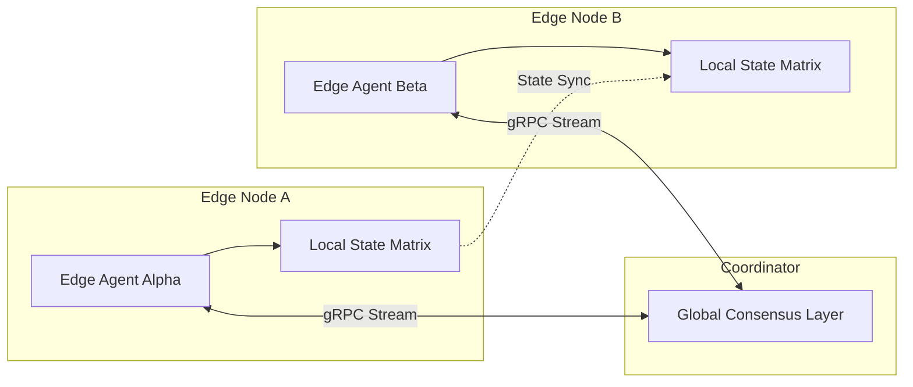

# Document 27: Multi Agent Edge Orchestration Framework

## 1. Executive Summary and Mythic Directives

Multi-Agent Edge Orchestration completely redefines distributed intelligence by decentralizing the cognitive load across heterogeneous compute nodes operating at the network periphery. Traditional centralized orchestration models suffer from unacceptable latency, single points of failure, and massive bandwidth bottlenecks. Our Edge Orchestration Framework solves this through a Byzantine fault-tolerant consensus mechanism tailored for high-churn edge environments. Each agent within the edge mesh operates autonomously, maintaining a localized State Matrix representing its immediate environment and operational goals. Communication between nodes is handled via ultra-low latency gRPC streams, multiplexed over secure QUIC connections. Instead of broadcasting all data, agents utilize gossip protocols to propagate critical state changes and gradient updates. This ensures that the collective intelligence of the swarm remains synchronized without overwhelming the network infrastructure.

Each agent within the edge mesh operates autonomously, maintaining a localized State Matrix representing its immediate environment and operational goals. Communication between nodes is handled via ultra-low latency gRPC streams, multiplexed over secure QUIC connections. Instead of broadcasting all data, agents utilize gossip protocols to propagate critical state changes and gradient updates. This ensures that the collective intelligence of the swarm remains synchronized without overwhelming the network infrastructure. Resource allocation in this multi-agent paradigm is governed by a distributed micro-economy. Agents bid for compute cycles, memory, and network bandwidth using cryptographically secured smart contracts. This market-based approach ensures optimal utilization of scarce edge resources. High-priority tasks automatically outbid lower-priority processes, leading to an emergent, highly efficient load-balancing system that requires zero centralized oversight.

Resource allocation in this multi-agent paradigm is governed by a distributed micro-economy. Agents bid for compute cycles, memory, and network bandwidth using cryptographically secured smart contracts. This market-based approach ensures optimal utilization of scarce edge resources. High-priority tasks automatically outbid lower-priority processes, leading to an emergent, highly efficient load-balancing system that requires zero centralized oversight. To handle the inevitable network partitions and node failures characteristic of edge computing, the framework employs dynamic leader election and state replication protocols. If a sub-mesh becomes isolated, it continues to operate independently, merging its divergent state with the global consensus layer once connectivity is restored. This partition tolerance is achieved through Operational Transformation and Conflict-free Replicated Data Types (CRDTs), guaranteeing eventual consistency across the entire multi-agent swarm.

## 2. Advanced Architectural Topology

Resource allocation in this multi-agent paradigm is governed by a distributed micro-economy. Agents bid for compute cycles, memory, and network bandwidth using cryptographically secured smart contracts. This market-based approach ensures optimal utilization of scarce edge resources. High-priority tasks automatically outbid lower-priority processes, leading to an emergent, highly efficient load-balancing system that requires zero centralized oversight. To handle the inevitable network partitions and node failures characteristic of edge computing, the framework employs dynamic leader election and state replication protocols. If a sub-mesh becomes isolated, it continues to operate independently, merging its divergent state with the global consensus layer once connectivity is restored. This partition tolerance is achieved through Operational Transformation and Conflict-free Replicated Data Types (CRDTs), guaranteeing eventual consistency across the entire multi-agent swarm.

To handle the inevitable network partitions and node failures characteristic of edge computing, the framework employs dynamic leader election and state replication protocols. If a sub-mesh becomes isolated, it continues to operate independently, merging its divergent state with the global consensus layer once connectivity is restored. This partition tolerance is achieved through Operational Transformation and Conflict-free Replicated Data Types (CRDTs), guaranteeing eventual consistency across the entire multi-agent swarm. Multi-Agent Edge Orchestration completely redefines distributed intelligence by decentralizing the cognitive load across heterogeneous compute nodes operating at the network periphery. Traditional centralized orchestration models suffer from unacceptable latency, single points of failure, and massive bandwidth bottlenecks. Our Edge Orchestration Framework solves this through a Byzantine fault-tolerant consensus mechanism tailored for high-churn edge environments.

Multi-Agent Edge Orchestration completely redefines distributed intelligence by decentralizing the cognitive load across heterogeneous compute nodes operating at the network periphery. Traditional centralized orchestration models suffer from unacceptable latency, single points of failure, and massive bandwidth bottlenecks. Our Edge Orchestration Framework solves this through a Byzantine fault-tolerant consensus mechanism tailored for high-churn edge environments. Each agent within the edge mesh operates autonomously, maintaining a localized State Matrix representing its immediate environment and operational goals. Communication between nodes is handled via ultra-low latency gRPC streams, multiplexed over secure QUIC connections. Instead of broadcasting all data, agents utilize gossip protocols to propagate critical state changes and gradient updates. This ensures that the collective intelligence of the swarm remains synchronized without overwhelming the network infrastructure.

Each agent within the edge mesh operates autonomously, maintaining a localized State Matrix representing its immediate environment and operational goals. Communication between nodes is handled via ultra-low latency gRPC streams, multiplexed over secure QUIC connections. Instead of broadcasting all data, agents utilize gossip protocols to propagate critical state changes and gradient updates. This ensures that the collective intelligence of the swarm remains synchronized without overwhelming the network infrastructure. Resource allocation in this multi-agent paradigm is governed by a distributed micro-economy. Agents bid for compute cycles, memory, and network bandwidth using cryptographically secured smart contracts. This market-based approach ensures optimal utilization of scarce edge resources. High-priority tasks automatically outbid lower-priority processes, leading to an emergent, highly efficient load-balancing system that requires zero centralized oversight.

### 2.1 Subsystem Mechanics and Low-Level Integration

Multi-Agent Edge Orchestration completely redefines distributed intelligence by decentralizing the cognitive load across heterogeneous compute nodes operating at the network periphery. Traditional centralized orchestration models suffer from unacceptable latency, single points of failure, and massive bandwidth bottlenecks. Our Edge Orchestration Framework solves this through a Byzantine fault-tolerant consensus mechanism tailored for high-churn edge environments. Each agent within the edge mesh operates autonomously, maintaining a localized State Matrix representing its immediate environment and operational goals. Communication between nodes is handled via ultra-low latency gRPC streams, multiplexed over secure QUIC connections. Instead of broadcasting all data, agents utilize gossip protocols to propagate critical state changes and gradient updates. This ensures that the collective intelligence of the swarm remains synchronized without overwhelming the network infrastructure.

Each agent within the edge mesh operates autonomously, maintaining a localized State Matrix representing its immediate environment and operational goals. Communication between nodes is handled via ultra-low latency gRPC streams, multiplexed over secure QUIC connections. Instead of broadcasting all data, agents utilize gossip protocols to propagate critical state changes and gradient updates. This ensures that the collective intelligence of the swarm remains synchronized without overwhelming the network infrastructure. Resource allocation in this multi-agent paradigm is governed by a distributed micro-economy. Agents bid for compute cycles, memory, and network bandwidth using cryptographically secured smart contracts. This market-based approach ensures optimal utilization of scarce edge resources. High-priority tasks automatically outbid lower-priority processes, leading to an emergent, highly efficient load-balancing system that requires zero centralized oversight.

Resource allocation in this multi-agent paradigm is governed by a distributed micro-economy. Agents bid for compute cycles, memory, and network bandwidth using cryptographically secured smart contracts. This market-based approach ensures optimal utilization of scarce edge resources. High-priority tasks automatically outbid lower-priority processes, leading to an emergent, highly efficient load-balancing system that requires zero centralized oversight. To handle the inevitable network partitions and node failures characteristic of edge computing, the framework employs dynamic leader election and state replication protocols. If a sub-mesh becomes isolated, it continues to operate independently, merging its divergent state with the global consensus layer once connectivity is restored. This partition tolerance is achieved through Operational Transformation and Conflict-free Replicated Data Types (CRDTs), guaranteeing eventual consistency across the entire multi-agent swarm.

To handle the inevitable network partitions and node failures characteristic of edge computing, the framework employs dynamic leader election and state replication protocols. If a sub-mesh becomes isolated, it continues to operate independently, merging its divergent state with the global consensus layer once connectivity is restored. This partition tolerance is achieved through Operational Transformation and Conflict-free Replicated Data Types (CRDTs), guaranteeing eventual consistency across the entire multi-agent swarm. Multi-Agent Edge Orchestration completely redefines distributed intelligence by decentralizing the cognitive load across heterogeneous compute nodes operating at the network periphery. Traditional centralized orchestration models suffer from unacceptable latency, single points of failure, and massive bandwidth bottlenecks. Our Edge Orchestration Framework solves this through a Byzantine fault-tolerant consensus mechanism tailored for high-churn edge environments.

Multi-Agent Edge Orchestration completely redefines distributed intelligence by decentralizing the cognitive load across heterogeneous compute nodes operating at the network periphery. Traditional centralized orchestration models suffer from unacceptable latency, single points of failure, and massive bandwidth bottlenecks. Our Edge Orchestration Framework solves this through a Byzantine fault-tolerant consensus mechanism tailored for high-churn edge environments. Each agent within the edge mesh operates autonomously, maintaining a localized State Matrix representing its immediate environment and operational goals. Communication between nodes is handled via ultra-low latency gRPC streams, multiplexed over secure QUIC connections. Instead of broadcasting all data, agents utilize gossip protocols to propagate critical state changes and gradient updates. This ensures that the collective intelligence of the swarm remains synchronized without overwhelming the network infrastructure.

## 3. Distributed Protocol Specifications

| Component | Protocol | Latency Target | Resilience Strategy |
|---|---|---|---|
| Inter-Node Comm | gRPC/QUIC | < 5ms | Exponential Backoff |
| State Sync | Gossip | Eventual | CRDT Conflict Resolution |
| Telemetry | OpenTelemetry | Asynchronous | Ring Buffer Dropping |
| Native API | FFI/IPC | Zero-copy | Sandbox Isolation |

Resource allocation in this multi-agent paradigm is governed by a distributed micro-economy. Agents bid for compute cycles, memory, and network bandwidth using cryptographically secured smart contracts. This market-based approach ensures optimal utilization of scarce edge resources. High-priority tasks automatically outbid lower-priority processes, leading to an emergent, highly efficient load-balancing system that requires zero centralized oversight. To handle the inevitable network partitions and node failures characteristic of edge computing, the framework employs dynamic leader election and state replication protocols. If a sub-mesh becomes isolated, it continues to operate independently, merging its divergent state with the global consensus layer once connectivity is restored. This partition tolerance is achieved through Operational Transformation and Conflict-free Replicated Data Types (CRDTs), guaranteeing eventual consistency across the entire multi-agent swarm.

To handle the inevitable network partitions and node failures characteristic of edge computing, the framework employs dynamic leader election and state replication protocols. If a sub-mesh becomes isolated, it continues to operate independently, merging its divergent state with the global consensus layer once connectivity is restored. This partition tolerance is achieved through Operational Transformation and Conflict-free Replicated Data Types (CRDTs), guaranteeing eventual consistency across the entire multi-agent swarm. Multi-Agent Edge Orchestration completely redefines distributed intelligence by decentralizing the cognitive load across heterogeneous compute nodes operating at the network periphery. Traditional centralized orchestration models suffer from unacceptable latency, single points of failure, and massive bandwidth bottlenecks. Our Edge Orchestration Framework solves this through a Byzantine fault-tolerant consensus mechanism tailored for high-churn edge environments.

Multi-Agent Edge Orchestration completely redefines distributed intelligence by decentralizing the cognitive load across heterogeneous compute nodes operating at the network periphery. Traditional centralized orchestration models suffer from unacceptable latency, single points of failure, and massive bandwidth bottlenecks. Our Edge Orchestration Framework solves this through a Byzantine fault-tolerant consensus mechanism tailored for high-churn edge environments. Each agent within the edge mesh operates autonomously, maintaining a localized State Matrix representing its immediate environment and operational goals. Communication between nodes is handled via ultra-low latency gRPC streams, multiplexed over secure QUIC connections. Instead of broadcasting all data, agents utilize gossip protocols to propagate critical state changes and gradient updates. This ensures that the collective intelligence of the swarm remains synchronized without overwhelming the network infrastructure.

Each agent within the edge mesh operates autonomously, maintaining a localized State Matrix representing its immediate environment and operational goals. Communication between nodes is handled via ultra-low latency gRPC streams, multiplexed over secure QUIC connections. Instead of broadcasting all data, agents utilize gossip protocols to propagate critical state changes and gradient updates. This ensures that the collective intelligence of the swarm remains synchronized without overwhelming the network infrastructure. Resource allocation in this multi-agent paradigm is governed by a distributed micro-economy. Agents bid for compute cycles, memory, and network bandwidth using cryptographically secured smart contracts. This market-based approach ensures optimal utilization of scarce edge resources. High-priority tasks automatically outbid lower-priority processes, leading to an emergent, highly efficient load-balancing system that requires zero centralized oversight.

Resource allocation in this multi-agent paradigm is governed by a distributed micro-economy. Agents bid for compute cycles, memory, and network bandwidth using cryptographically secured smart contracts. This market-based approach ensures optimal utilization of scarce edge resources. High-priority tasks automatically outbid lower-priority processes, leading to an emergent, highly efficient load-balancing system that requires zero centralized oversight. To handle the inevitable network partitions and node failures characteristic of edge computing, the framework employs dynamic leader election and state replication protocols. If a sub-mesh becomes isolated, it continues to operate independently, merging its divergent state with the global consensus layer once connectivity is restored. This partition tolerance is achieved through Operational Transformation and Conflict-free Replicated Data Types (CRDTs), guaranteeing eventual consistency across the entire multi-agent swarm.

## 4. Algorithmic Formulations and State Transformations

Multi-Agent Edge Orchestration completely redefines distributed intelligence by decentralizing the cognitive load across heterogeneous compute nodes operating at the network periphery. Traditional centralized orchestration models suffer from unacceptable latency, single points of failure, and massive bandwidth bottlenecks. Our Edge Orchestration Framework solves this through a Byzantine fault-tolerant consensus mechanism tailored for high-churn edge environments. Each agent within the edge mesh operates autonomously, maintaining a localized State Matrix representing its immediate environment and operational goals. Communication between nodes is handled via ultra-low latency gRPC streams, multiplexed over secure QUIC connections. Instead of broadcasting all data, agents utilize gossip protocols to propagate critical state changes and gradient updates. This ensures that the collective intelligence of the swarm remains synchronized without overwhelming the network infrastructure.

Each agent within the edge mesh operates autonomously, maintaining a localized State Matrix representing its immediate environment and operational goals. Communication between nodes is handled via ultra-low latency gRPC streams, multiplexed over secure QUIC connections. Instead of broadcasting all data, agents utilize gossip protocols to propagate critical state changes and gradient updates. This ensures that the collective intelligence of the swarm remains synchronized without overwhelming the network infrastructure. Resource allocation in this multi-agent paradigm is governed by a distributed micro-economy. Agents bid for compute cycles, memory, and network bandwidth using cryptographically secured smart contracts. This market-based approach ensures optimal utilization of scarce edge resources. High-priority tasks automatically outbid lower-priority processes, leading to an emergent, highly efficient load-balancing system that requires zero centralized oversight.

Resource allocation in this multi-agent paradigm is governed by a distributed micro-economy. Agents bid for compute cycles, memory, and network bandwidth using cryptographically secured smart contracts. This market-based approach ensures optimal utilization of scarce edge resources. High-priority tasks automatically outbid lower-priority processes, leading to an emergent, highly efficient load-balancing system that requires zero centralized oversight. To handle the inevitable network partitions and node failures characteristic of edge computing, the framework employs dynamic leader election and state replication protocols. If a sub-mesh becomes isolated, it continues to operate independently, merging its divergent state with the global consensus layer once connectivity is restored. This partition tolerance is achieved through Operational Transformation and Conflict-free Replicated Data Types (CRDTs), guaranteeing eventual consistency across the entire multi-agent swarm.

To handle the inevitable network partitions and node failures characteristic of edge computing, the framework employs dynamic leader election and state replication protocols. If a sub-mesh becomes isolated, it continues to operate independently, merging its divergent state with the global consensus layer once connectivity is restored. This partition tolerance is achieved through Operational Transformation and Conflict-free Replicated Data Types (CRDTs), guaranteeing eventual consistency across the entire multi-agent swarm. Multi-Agent Edge Orchestration completely redefines distributed intelligence by decentralizing the cognitive load across heterogeneous compute nodes operating at the network periphery. Traditional centralized orchestration models suffer from unacceptable latency, single points of failure, and massive bandwidth bottlenecks. Our Edge Orchestration Framework solves this through a Byzantine fault-tolerant consensus mechanism tailored for high-churn edge environments.

Multi-Agent Edge Orchestration completely redefines distributed intelligence by decentralizing the cognitive load across heterogeneous compute nodes operating at the network periphery. Traditional centralized orchestration models suffer from unacceptable latency, single points of failure, and massive bandwidth bottlenecks. Our Edge Orchestration Framework solves this through a Byzantine fault-tolerant consensus mechanism tailored for high-churn edge environments. Each agent within the edge mesh operates autonomously, maintaining a localized State Matrix representing its immediate environment and operational goals. Communication between nodes is handled via ultra-low latency gRPC streams, multiplexed over secure QUIC connections. Instead of broadcasting all data, agents utilize gossip protocols to propagate critical state changes and gradient updates. This ensures that the collective intelligence of the swarm remains synchronized without overwhelming the network infrastructure.

### 4.1 Emergent Behaviors in Highly Constrained Environments

Resource allocation in this multi-agent paradigm is governed by a distributed micro-economy. Agents bid for compute cycles, memory, and network bandwidth using cryptographically secured smart contracts. This market-based approach ensures optimal utilization of scarce edge resources. High-priority tasks automatically outbid lower-priority processes, leading to an emergent, highly efficient load-balancing system that requires zero centralized oversight. To handle the inevitable network partitions and node failures characteristic of edge computing, the framework employs dynamic leader election and state replication protocols. If a sub-mesh becomes isolated, it continues to operate independently, merging its divergent state with the global consensus layer once connectivity is restored. This partition tolerance is achieved through Operational Transformation and Conflict-free Replicated Data Types (CRDTs), guaranteeing eventual consistency across the entire multi-agent swarm.

To handle the inevitable network partitions and node failures characteristic of edge computing, the framework employs dynamic leader election and state replication protocols. If a sub-mesh becomes isolated, it continues to operate independently, merging its divergent state with the global consensus layer once connectivity is restored. This partition tolerance is achieved through Operational Transformation and Conflict-free Replicated Data Types (CRDTs), guaranteeing eventual consistency across the entire multi-agent swarm. Multi-Agent Edge Orchestration completely redefines distributed intelligence by decentralizing the cognitive load across heterogeneous compute nodes operating at the network periphery. Traditional centralized orchestration models suffer from unacceptable latency, single points of failure, and massive bandwidth bottlenecks. Our Edge Orchestration Framework solves this through a Byzantine fault-tolerant consensus mechanism tailored for high-churn edge environments.

Multi-Agent Edge Orchestration completely redefines distributed intelligence by decentralizing the cognitive load across heterogeneous compute nodes operating at the network periphery. Traditional centralized orchestration models suffer from unacceptable latency, single points of failure, and massive bandwidth bottlenecks. Our Edge Orchestration Framework solves this through a Byzantine fault-tolerant consensus mechanism tailored for high-churn edge environments. Each agent within the edge mesh operates autonomously, maintaining a localized State Matrix representing its immediate environment and operational goals. Communication between nodes is handled via ultra-low latency gRPC streams, multiplexed over secure QUIC connections. Instead of broadcasting all data, agents utilize gossip protocols to propagate critical state changes and gradient updates. This ensures that the collective intelligence of the swarm remains synchronized without overwhelming the network infrastructure.

Each agent within the edge mesh operates autonomously, maintaining a localized State Matrix representing its immediate environment and operational goals. Communication between nodes is handled via ultra-low latency gRPC streams, multiplexed over secure QUIC connections. Instead of broadcasting all data, agents utilize gossip protocols to propagate critical state changes and gradient updates. This ensures that the collective intelligence of the swarm remains synchronized without overwhelming the network infrastructure. Resource allocation in this multi-agent paradigm is governed by a distributed micro-economy. Agents bid for compute cycles, memory, and network bandwidth using cryptographically secured smart contracts. This market-based approach ensures optimal utilization of scarce edge resources. High-priority tasks automatically outbid lower-priority processes, leading to an emergent, highly efficient load-balancing system that requires zero centralized oversight.

Resource allocation in this multi-agent paradigm is governed by a distributed micro-economy. Agents bid for compute cycles, memory, and network bandwidth using cryptographically secured smart contracts. This market-based approach ensures optimal utilization of scarce edge resources. High-priority tasks automatically outbid lower-priority processes, leading to an emergent, highly efficient load-balancing system that requires zero centralized oversight. To handle the inevitable network partitions and node failures characteristic of edge computing, the framework employs dynamic leader election and state replication protocols. If a sub-mesh becomes isolated, it continues to operate independently, merging its divergent state with the global consensus layer once connectivity is restored. This partition tolerance is achieved through Operational Transformation and Conflict-free Replicated Data Types (CRDTs), guaranteeing eventual consistency across the entire multi-agent swarm.

To handle the inevitable network partitions and node failures characteristic of edge computing, the framework employs dynamic leader election and state replication protocols. If a sub-mesh becomes isolated, it continues to operate independently, merging its divergent state with the global consensus layer once connectivity is restored. This partition tolerance is achieved through Operational Transformation and Conflict-free Replicated Data Types (CRDTs), guaranteeing eventual consistency across the entire multi-agent swarm. Multi-Agent Edge Orchestration completely redefines distributed intelligence by decentralizing the cognitive load across heterogeneous compute nodes operating at the network periphery. Traditional centralized orchestration models suffer from unacceptable latency, single points of failure, and massive bandwidth bottlenecks. Our Edge Orchestration Framework solves this through a Byzantine fault-tolerant consensus mechanism tailored for high-churn edge environments.

## 5. Security Enclaves and Zero-Trust Execution Models

Multi-Agent Edge Orchestration completely redefines distributed intelligence by decentralizing the cognitive load across heterogeneous compute nodes operating at the network periphery. Traditional centralized orchestration models suffer from unacceptable latency, single points of failure, and massive bandwidth bottlenecks. Our Edge Orchestration Framework solves this through a Byzantine fault-tolerant consensus mechanism tailored for high-churn edge environments. Each agent within the edge mesh operates autonomously, maintaining a localized State Matrix representing its immediate environment and operational goals. Communication between nodes is handled via ultra-low latency gRPC streams, multiplexed over secure QUIC connections. Instead of broadcasting all data, agents utilize gossip protocols to propagate critical state changes and gradient updates. This ensures that the collective intelligence of the swarm remains synchronized without overwhelming the network infrastructure.

Each agent within the edge mesh operates autonomously, maintaining a localized State Matrix representing its immediate environment and operational goals. Communication between nodes is handled via ultra-low latency gRPC streams, multiplexed over secure QUIC connections. Instead of broadcasting all data, agents utilize gossip protocols to propagate critical state changes and gradient updates. This ensures that the collective intelligence of the swarm remains synchronized without overwhelming the network infrastructure. Resource allocation in this multi-agent paradigm is governed by a distributed micro-economy. Agents bid for compute cycles, memory, and network bandwidth using cryptographically secured smart contracts. This market-based approach ensures optimal utilization of scarce edge resources. High-priority tasks automatically outbid lower-priority processes, leading to an emergent, highly efficient load-balancing system that requires zero centralized oversight.

Resource allocation in this multi-agent paradigm is governed by a distributed micro-economy. Agents bid for compute cycles, memory, and network bandwidth using cryptographically secured smart contracts. This market-based approach ensures optimal utilization of scarce edge resources. High-priority tasks automatically outbid lower-priority processes, leading to an emergent, highly efficient load-balancing system that requires zero centralized oversight. To handle the inevitable network partitions and node failures characteristic of edge computing, the framework employs dynamic leader election and state replication protocols. If a sub-mesh becomes isolated, it continues to operate independently, merging its divergent state with the global consensus layer once connectivity is restored. This partition tolerance is achieved through Operational Transformation and Conflict-free Replicated Data Types (CRDTs), guaranteeing eventual consistency across the entire multi-agent swarm.

To handle the inevitable network partitions and node failures characteristic of edge computing, the framework employs dynamic leader election and state replication protocols. If a sub-mesh becomes isolated, it continues to operate independently, merging its divergent state with the global consensus layer once connectivity is restored. This partition tolerance is achieved through Operational Transformation and Conflict-free Replicated Data Types (CRDTs), guaranteeing eventual consistency across the entire multi-agent swarm. Multi-Agent Edge Orchestration completely redefines distributed intelligence by decentralizing the cognitive load across heterogeneous compute nodes operating at the network periphery. Traditional centralized orchestration models suffer from unacceptable latency, single points of failure, and massive bandwidth bottlenecks. Our Edge Orchestration Framework solves this through a Byzantine fault-tolerant consensus mechanism tailored for high-churn edge environments.

## 6. Strategic Deployment Vectors

Resource allocation in this multi-agent paradigm is governed by a distributed micro-economy. Agents bid for compute cycles, memory, and network bandwidth using cryptographically secured smart contracts. This market-based approach ensures optimal utilization of scarce edge resources. High-priority tasks automatically outbid lower-priority processes, leading to an emergent, highly efficient load-balancing system that requires zero centralized oversight. To handle the inevitable network partitions and node failures characteristic of edge computing, the framework employs dynamic leader election and state replication protocols. If a sub-mesh becomes isolated, it continues to operate independently, merging its divergent state with the global consensus layer once connectivity is restored. This partition tolerance is achieved through Operational Transformation and Conflict-free Replicated Data Types (CRDTs), guaranteeing eventual consistency across the entire multi-agent swarm.

To handle the inevitable network partitions and node failures characteristic of edge computing, the framework employs dynamic leader election and state replication protocols. If a sub-mesh becomes isolated, it continues to operate independently, merging its divergent state with the global consensus layer once connectivity is restored. This partition tolerance is achieved through Operational Transformation and Conflict-free Replicated Data Types (CRDTs), guaranteeing eventual consistency across the entire multi-agent swarm. Multi-Agent Edge Orchestration completely redefines distributed intelligence by decentralizing the cognitive load across heterogeneous compute nodes operating at the network periphery. Traditional centralized orchestration models suffer from unacceptable latency, single points of failure, and massive bandwidth bottlenecks. Our Edge Orchestration Framework solves this through a Byzantine fault-tolerant consensus mechanism tailored for high-churn edge environments.

Multi-Agent Edge Orchestration completely redefines distributed intelligence by decentralizing the cognitive load across heterogeneous compute nodes operating at the network periphery. Traditional centralized orchestration models suffer from unacceptable latency, single points of failure, and massive bandwidth bottlenecks. Our Edge Orchestration Framework solves this through a Byzantine fault-tolerant consensus mechanism tailored for high-churn edge environments. Each agent within the edge mesh operates autonomously, maintaining a localized State Matrix representing its immediate environment and operational goals. Communication between nodes is handled via ultra-low latency gRPC streams, multiplexed over secure QUIC connections. Instead of broadcasting all data, agents utilize gossip protocols to propagate critical state changes and gradient updates. This ensures that the collective intelligence of the swarm remains synchronized without overwhelming the network infrastructure.

Each agent within the edge mesh operates autonomously, maintaining a localized State Matrix representing its immediate environment and operational goals. Communication between nodes is handled via ultra-low latency gRPC streams, multiplexed over secure QUIC connections. Instead of broadcasting all data, agents utilize gossip protocols to propagate critical state changes and gradient updates. This ensures that the collective intelligence of the swarm remains synchronized without overwhelming the network infrastructure. Resource allocation in this multi-agent paradigm is governed by a distributed micro-economy. Agents bid for compute cycles, memory, and network bandwidth using cryptographically secured smart contracts. This market-based approach ensures optimal utilization of scarce edge resources. High-priority tasks automatically outbid lower-priority processes, leading to an emergent, highly efficient load-balancing system that requires zero centralized oversight.

## 7. Conclusion: The Mythic Synthesis

Multi-Agent Edge Orchestration completely redefines distributed intelligence by decentralizing the cognitive load across heterogeneous compute nodes operating at the network periphery. Traditional centralized orchestration models suffer from unacceptable latency, single points of failure, and massive bandwidth bottlenecks. Our Edge Orchestration Framework solves this through a Byzantine fault-tolerant consensus mechanism tailored for high-churn edge environments. Each agent within the edge mesh operates autonomously, maintaining a localized State Matrix representing its immediate environment and operational goals. Communication between nodes is handled via ultra-low latency gRPC streams, multiplexed over secure QUIC connections. Instead of broadcasting all data, agents utilize gossip protocols to propagate critical state changes and gradient updates. This ensures that the collective intelligence of the swarm remains synchronized without overwhelming the network infrastructure.

Each agent within the edge mesh operates autonomously, maintaining a localized State Matrix representing its immediate environment and operational goals. Communication between nodes is handled via ultra-low latency gRPC streams, multiplexed over secure QUIC connections. Instead of broadcasting all data, agents utilize gossip protocols to propagate critical state changes and gradient updates. This ensures that the collective intelligence of the swarm remains synchronized without overwhelming the network infrastructure. Resource allocation in this multi-agent paradigm is governed by a distributed micro-economy. Agents bid for compute cycles, memory, and network bandwidth using cryptographically secured smart contracts. This market-based approach ensures optimal utilization of scarce edge resources. High-priority tasks automatically outbid lower-priority processes, leading to an emergent, highly efficient load-balancing system that requires zero centralized oversight.

Resource allocation in this multi-agent paradigm is governed by a distributed micro-economy. Agents bid for compute cycles, memory, and network bandwidth using cryptographically secured smart contracts. This market-based approach ensures optimal utilization of scarce edge resources. High-priority tasks automatically outbid lower-priority processes, leading to an emergent, highly efficient load-balancing system that requires zero centralized oversight. To handle the inevitable network partitions and node failures characteristic of edge computing, the framework employs dynamic leader election and state replication protocols. If a sub-mesh becomes isolated, it continues to operate independently, merging its divergent state with the global consensus layer once connectivity is restored. This partition tolerance is achieved through Operational Transformation and Conflict-free Replicated Data Types (CRDTs), guaranteeing eventual consistency across the entire multi-agent swarm.

## ANNEX A: Deep Dive Telemetry Data Models and Trace Contexts

Resource allocation in this multi-agent paradigm is governed by a distributed micro-economy. Agents bid for compute cycles, memory, and network bandwidth using cryptographically secured smart contracts. This market-based approach ensures optimal utilization of scarce edge resources. High-priority tasks automatically outbid lower-priority processes, leading to an emergent, highly efficient load-balancing system that requires zero centralized oversight. To handle the inevitable network partitions and node failures characteristic of edge computing, the framework employs dynamic leader election and state replication protocols. If a sub-mesh becomes isolated, it continues to operate independently, merging its divergent state with the global consensus layer once connectivity is restored. This partition tolerance is achieved through Operational Transformation and Conflict-free Replicated Data Types (CRDTs), guaranteeing eventual consistency across the entire multi-agent swarm. Multi-Agent Edge Orchestration completely redefines distributed intelligence by decentralizing the cognitive load across heterogeneous compute nodes operating at the network periphery. Traditional centralized orchestration models suffer from unacceptable latency, single points of failure, and massive bandwidth bottlenecks. Our Edge Orchestration Framework solves this through a Byzantine fault-tolerant consensus mechanism tailored for high-churn edge environments.

To handle the inevitable network partitions and node failures characteristic of edge computing, the framework employs dynamic leader election and state replication protocols. If a sub-mesh becomes isolated, it continues to operate independently, merging its divergent state with the global consensus layer once connectivity is restored. This partition tolerance is achieved through Operational Transformation and Conflict-free Replicated Data Types (CRDTs), guaranteeing eventual consistency across the entire multi-agent swarm. Multi-Agent Edge Orchestration completely redefines distributed intelligence by decentralizing the cognitive load across heterogeneous compute nodes operating at the network periphery. Traditional centralized orchestration models suffer from unacceptable latency, single points of failure, and massive bandwidth bottlenecks. Our Edge Orchestration Framework solves this through a Byzantine fault-tolerant consensus mechanism tailored for high-churn edge environments. Each agent within the edge mesh operates autonomously, maintaining a localized State Matrix representing its immediate environment and operational goals. Communication between nodes is handled via ultra-low latency gRPC streams, multiplexed over secure QUIC connections. Instead of broadcasting all data, agents utilize gossip protocols to propagate critical state changes and gradient updates. This ensures that the collective intelligence of the swarm remains synchronized without overwhelming the network infrastructure.

Multi-Agent Edge Orchestration completely redefines distributed intelligence by decentralizing the cognitive load across heterogeneous compute nodes operating at the network periphery. Traditional centralized orchestration models suffer from unacceptable latency, single points of failure, and massive bandwidth bottlenecks. Our Edge Orchestration Framework solves this through a Byzantine fault-tolerant consensus mechanism tailored for high-churn edge environments. Each agent within the edge mesh operates autonomously, maintaining a localized State Matrix representing its immediate environment and operational goals. Communication between nodes is handled via ultra-low latency gRPC streams, multiplexed over secure QUIC connections. Instead of broadcasting all data, agents utilize gossip protocols to propagate critical state changes and gradient updates. This ensures that the collective intelligence of the swarm remains synchronized without overwhelming the network infrastructure. Resource allocation in this multi-agent paradigm is governed by a distributed micro-economy. Agents bid for compute cycles, memory, and network bandwidth using cryptographically secured smart contracts. This market-based approach ensures optimal utilization of scarce edge resources. High-priority tasks automatically outbid lower-priority processes, leading to an emergent, highly efficient load-balancing system that requires zero centralized oversight.

Each agent within the edge mesh operates autonomously, maintaining a localized State Matrix representing its immediate environment and operational goals. Communication between nodes is handled via ultra-low latency gRPC streams, multiplexed over secure QUIC connections. Instead of broadcasting all data, agents utilize gossip protocols to propagate critical state changes and gradient updates. This ensures that the collective intelligence of the swarm remains synchronized without overwhelming the network infrastructure. Resource allocation in this multi-agent paradigm is governed by a distributed micro-economy. Agents bid for compute cycles, memory, and network bandwidth using cryptographically secured smart contracts. This market-based approach ensures optimal utilization of scarce edge resources. High-priority tasks automatically outbid lower-priority processes, leading to an emergent, highly efficient load-balancing system that requires zero centralized oversight. To handle the inevitable network partitions and node failures characteristic of edge computing, the framework employs dynamic leader election and state replication protocols. If a sub-mesh becomes isolated, it continues to operate independently, merging its divergent state with the global consensus layer once connectivity is restored. This partition tolerance is achieved through Operational Transformation and Conflict-free Replicated Data Types (CRDTs), guaranteeing eventual consistency across the entire multi-agent swarm.

Resource allocation in this multi-agent paradigm is governed by a distributed micro-economy. Agents bid for compute cycles, memory, and network bandwidth using cryptographically secured smart contracts. This market-based approach ensures optimal utilization of scarce edge resources. High-priority tasks automatically outbid lower-priority processes, leading to an emergent, highly efficient load-balancing system that requires zero centralized oversight. To handle the inevitable network partitions and node failures characteristic of edge computing, the framework employs dynamic leader election and state replication protocols. If a sub-mesh becomes isolated, it continues to operate independently, merging its divergent state with the global consensus layer once connectivity is restored. This partition tolerance is achieved through Operational Transformation and Conflict-free Replicated Data Types (CRDTs), guaranteeing eventual consistency across the entire multi-agent swarm. Multi-Agent Edge Orchestration completely redefines distributed intelligence by decentralizing the cognitive load across heterogeneous compute nodes operating at the network periphery. Traditional centralized orchestration models suffer from unacceptable latency, single points of failure, and massive bandwidth bottlenecks. Our Edge Orchestration Framework solves this through a Byzantine fault-tolerant consensus mechanism tailored for high-churn edge environments.

To handle the inevitable network partitions and node failures characteristic of edge computing, the framework employs dynamic leader election and state replication protocols. If a sub-mesh becomes isolated, it continues to operate independently, merging its divergent state with the global consensus layer once connectivity is restored. This partition tolerance is achieved through Operational Transformation and Conflict-free Replicated Data Types (CRDTs), guaranteeing eventual consistency across the entire multi-agent swarm. Multi-Agent Edge Orchestration completely redefines distributed intelligence by decentralizing the cognitive load across heterogeneous compute nodes operating at the network periphery. Traditional centralized orchestration models suffer from unacceptable latency, single points of failure, and massive bandwidth bottlenecks. Our Edge Orchestration Framework solves this through a Byzantine fault-tolerant consensus mechanism tailored for high-churn edge environments. Each agent within the edge mesh operates autonomously, maintaining a localized State Matrix representing its immediate environment and operational goals. Communication between nodes is handled via ultra-low latency gRPC streams, multiplexed over secure QUIC connections. Instead of broadcasting all data, agents utilize gossip protocols to propagate critical state changes and gradient updates. This ensures that the collective intelligence of the swarm remains synchronized without overwhelming the network infrastructure.

Multi-Agent Edge Orchestration completely redefines distributed intelligence by decentralizing the cognitive load across heterogeneous compute nodes operating at the network periphery. Traditional centralized orchestration models suffer from unacceptable latency, single points of failure, and massive bandwidth bottlenecks. Our Edge Orchestration Framework solves this through a Byzantine fault-tolerant consensus mechanism tailored for high-churn edge environments. Each agent within the edge mesh operates autonomously, maintaining a localized State Matrix representing its immediate environment and operational goals. Communication between nodes is handled via ultra-low latency gRPC streams, multiplexed over secure QUIC connections. Instead of broadcasting all data, agents utilize gossip protocols to propagate critical state changes and gradient updates. This ensures that the collective intelligence of the swarm remains synchronized without overwhelming the network infrastructure. Resource allocation in this multi-agent paradigm is governed by a distributed micro-economy. Agents bid for compute cycles, memory, and network bandwidth using cryptographically secured smart contracts. This market-based approach ensures optimal utilization of scarce edge resources. High-priority tasks automatically outbid lower-priority processes, leading to an emergent, highly efficient load-balancing system that requires zero centralized oversight.

Each agent within the edge mesh operates autonomously, maintaining a localized State Matrix representing its immediate environment and operational goals. Communication between nodes is handled via ultra-low latency gRPC streams, multiplexed over secure QUIC connections. Instead of broadcasting all data, agents utilize gossip protocols to propagate critical state changes and gradient updates. This ensures that the collective intelligence of the swarm remains synchronized without overwhelming the network infrastructure. Resource allocation in this multi-agent paradigm is governed by a distributed micro-economy. Agents bid for compute cycles, memory, and network bandwidth using cryptographically secured smart contracts. This market-based approach ensures optimal utilization of scarce edge resources. High-priority tasks automatically outbid lower-priority processes, leading to an emergent, highly efficient load-balancing system that requires zero centralized oversight. To handle the inevitable network partitions and node failures characteristic of edge computing, the framework employs dynamic leader election and state replication protocols. If a sub-mesh becomes isolated, it continues to operate independently, merging its divergent state with the global consensus layer once connectivity is restored. This partition tolerance is achieved through Operational Transformation and Conflict-free Replicated Data Types (CRDTs), guaranteeing eventual consistency across the entire multi-agent swarm.

Resource allocation in this multi-agent paradigm is governed by a distributed micro-economy. Agents bid for compute cycles, memory, and network bandwidth using cryptographically secured smart contracts. This market-based approach ensures optimal utilization of scarce edge resources. High-priority tasks automatically outbid lower-priority processes, leading to an emergent, highly efficient load-balancing system that requires zero centralized oversight. To handle the inevitable network partitions and node failures characteristic of edge computing, the framework employs dynamic leader election and state replication protocols. If a sub-mesh becomes isolated, it continues to operate independently, merging its divergent state with the global consensus layer once connectivity is restored. This partition tolerance is achieved through Operational Transformation and Conflict-free Replicated Data Types (CRDTs), guaranteeing eventual consistency across the entire multi-agent swarm. Multi-Agent Edge Orchestration completely redefines distributed intelligence by decentralizing the cognitive load across heterogeneous compute nodes operating at the network periphery. Traditional centralized orchestration models suffer from unacceptable latency, single points of failure, and massive bandwidth bottlenecks. Our Edge Orchestration Framework solves this through a Byzantine fault-tolerant consensus mechanism tailored for high-churn edge environments.

To handle the inevitable network partitions and node failures characteristic of edge computing, the framework employs dynamic leader election and state replication protocols. If a sub-mesh becomes isolated, it continues to operate independently, merging its divergent state with the global consensus layer once connectivity is restored. This partition tolerance is achieved through Operational Transformation and Conflict-free Replicated Data Types (CRDTs), guaranteeing eventual consistency across the entire multi-agent swarm. Multi-Agent Edge Orchestration completely redefines distributed intelligence by decentralizing the cognitive load across heterogeneous compute nodes operating at the network periphery. Traditional centralized orchestration models suffer from unacceptable latency, single points of failure, and massive bandwidth bottlenecks. Our Edge Orchestration Framework solves this through a Byzantine fault-tolerant consensus mechanism tailored for high-churn edge environments. Each agent within the edge mesh operates autonomously, maintaining a localized State Matrix representing its immediate environment and operational goals. Communication between nodes is handled via ultra-low latency gRPC streams, multiplexed over secure QUIC connections. Instead of broadcasting all data, agents utilize gossip protocols to propagate critical state changes and gradient updates. This ensures that the collective intelligence of the swarm remains synchronized without overwhelming the network infrastructure.

## ANNEX B: Cryptographic Proofs and Capability Signing Mechanisms

Each agent within the edge mesh operates autonomously, maintaining a localized State Matrix representing its immediate environment and operational goals. Communication between nodes is handled via ultra-low latency gRPC streams, multiplexed over secure QUIC connections. Instead of broadcasting all data, agents utilize gossip protocols to propagate critical state changes and gradient updates. This ensures that the collective intelligence of the swarm remains synchronized without overwhelming the network infrastructure. Resource allocation in this multi-agent paradigm is governed by a distributed micro-economy. Agents bid for compute cycles, memory, and network bandwidth using cryptographically secured smart contracts. This market-based approach ensures optimal utilization of scarce edge resources. High-priority tasks automatically outbid lower-priority processes, leading to an emergent, highly efficient load-balancing system that requires zero centralized oversight. To handle the inevitable network partitions and node failures characteristic of edge computing, the framework employs dynamic leader election and state replication protocols. If a sub-mesh becomes isolated, it continues to operate independently, merging its divergent state with the global consensus layer once connectivity is restored. This partition tolerance is achieved through Operational Transformation and Conflict-free Replicated Data Types (CRDTs), guaranteeing eventual consistency across the entire multi-agent swarm.

Resource allocation in this multi-agent paradigm is governed by a distributed micro-economy. Agents bid for compute cycles, memory, and network bandwidth using cryptographically secured smart contracts. This market-based approach ensures optimal utilization of scarce edge resources. High-priority tasks automatically outbid lower-priority processes, leading to an emergent, highly efficient load-balancing system that requires zero centralized oversight. To handle the inevitable network partitions and node failures characteristic of edge computing, the framework employs dynamic leader election and state replication protocols. If a sub-mesh becomes isolated, it continues to operate independently, merging its divergent state with the global consensus layer once connectivity is restored. This partition tolerance is achieved through Operational Transformation and Conflict-free Replicated Data Types (CRDTs), guaranteeing eventual consistency across the entire multi-agent swarm. Multi-Agent Edge Orchestration completely redefines distributed intelligence by decentralizing the cognitive load across heterogeneous compute nodes operating at the network periphery. Traditional centralized orchestration models suffer from unacceptable latency, single points of failure, and massive bandwidth bottlenecks. Our Edge Orchestration Framework solves this through a Byzantine fault-tolerant consensus mechanism tailored for high-churn edge environments.

To handle the inevitable network partitions and node failures characteristic of edge computing, the framework employs dynamic leader election and state replication protocols. If a sub-mesh becomes isolated, it continues to operate independently, merging its divergent state with the global consensus layer once connectivity is restored. This partition tolerance is achieved through Operational Transformation and Conflict-free Replicated Data Types (CRDTs), guaranteeing eventual consistency across the entire multi-agent swarm. Multi-Agent Edge Orchestration completely redefines distributed intelligence by decentralizing the cognitive load across heterogeneous compute nodes operating at the network periphery. Traditional centralized orchestration models suffer from unacceptable latency, single points of failure, and massive bandwidth bottlenecks. Our Edge Orchestration Framework solves this through a Byzantine fault-tolerant consensus mechanism tailored for high-churn edge environments. Each agent within the edge mesh operates autonomously, maintaining a localized State Matrix representing its immediate environment and operational goals. Communication between nodes is handled via ultra-low latency gRPC streams, multiplexed over secure QUIC connections. Instead of broadcasting all data, agents utilize gossip protocols to propagate critical state changes and gradient updates. This ensures that the collective intelligence of the swarm remains synchronized without overwhelming the network infrastructure.

Multi-Agent Edge Orchestration completely redefines distributed intelligence by decentralizing the cognitive load across heterogeneous compute nodes operating at the network periphery. Traditional centralized orchestration models suffer from unacceptable latency, single points of failure, and massive bandwidth bottlenecks. Our Edge Orchestration Framework solves this through a Byzantine fault-tolerant consensus mechanism tailored for high-churn edge environments. Each agent within the edge mesh operates autonomously, maintaining a localized State Matrix representing its immediate environment and operational goals. Communication between nodes is handled via ultra-low latency gRPC streams, multiplexed over secure QUIC connections. Instead of broadcasting all data, agents utilize gossip protocols to propagate critical state changes and gradient updates. This ensures that the collective intelligence of the swarm remains synchronized without overwhelming the network infrastructure. Resource allocation in this multi-agent paradigm is governed by a distributed micro-economy. Agents bid for compute cycles, memory, and network bandwidth using cryptographically secured smart contracts. This market-based approach ensures optimal utilization of scarce edge resources. High-priority tasks automatically outbid lower-priority processes, leading to an emergent, highly efficient load-balancing system that requires zero centralized oversight.

Each agent within the edge mesh operates autonomously, maintaining a localized State Matrix representing its immediate environment and operational goals. Communication between nodes is handled via ultra-low latency gRPC streams, multiplexed over secure QUIC connections. Instead of broadcasting all data, agents utilize gossip protocols to propagate critical state changes and gradient updates. This ensures that the collective intelligence of the swarm remains synchronized without overwhelming the network infrastructure. Resource allocation in this multi-agent paradigm is governed by a distributed micro-economy. Agents bid for compute cycles, memory, and network bandwidth using cryptographically secured smart contracts. This market-based approach ensures optimal utilization of scarce edge resources. High-priority tasks automatically outbid lower-priority processes, leading to an emergent, highly efficient load-balancing system that requires zero centralized oversight. To handle the inevitable network partitions and node failures characteristic of edge computing, the framework employs dynamic leader election and state replication protocols. If a sub-mesh becomes isolated, it continues to operate independently, merging its divergent state with the global consensus layer once connectivity is restored. This partition tolerance is achieved through Operational Transformation and Conflict-free Replicated Data Types (CRDTs), guaranteeing eventual consistency across the entire multi-agent swarm.

Resource allocation in this multi-agent paradigm is governed by a distributed micro-economy. Agents bid for compute cycles, memory, and network bandwidth using cryptographically secured smart contracts. This market-based approach ensures optimal utilization of scarce edge resources. High-priority tasks automatically outbid lower-priority processes, leading to an emergent, highly efficient load-balancing system that requires zero centralized oversight. To handle the inevitable network partitions and node failures characteristic of edge computing, the framework employs dynamic leader election and state replication protocols. If a sub-mesh becomes isolated, it continues to operate independently, merging its divergent state with the global consensus layer once connectivity is restored. This partition tolerance is achieved through Operational Transformation and Conflict-free Replicated Data Types (CRDTs), guaranteeing eventual consistency across the entire multi-agent swarm. Multi-Agent Edge Orchestration completely redefines distributed intelligence by decentralizing the cognitive load across heterogeneous compute nodes operating at the network periphery. Traditional centralized orchestration models suffer from unacceptable latency, single points of failure, and massive bandwidth bottlenecks. Our Edge Orchestration Framework solves this through a Byzantine fault-tolerant consensus mechanism tailored for high-churn edge environments.

To handle the inevitable network partitions and node failures characteristic of edge computing, the framework employs dynamic leader election and state replication protocols. If a sub-mesh becomes isolated, it continues to operate independently, merging its divergent state with the global consensus layer once connectivity is restored. This partition tolerance is achieved through Operational Transformation and Conflict-free Replicated Data Types (CRDTs), guaranteeing eventual consistency across the entire multi-agent swarm. Multi-Agent Edge Orchestration completely redefines distributed intelligence by decentralizing the cognitive load across heterogeneous compute nodes operating at the network periphery. Traditional centralized orchestration models suffer from unacceptable latency, single points of failure, and massive bandwidth bottlenecks. Our Edge Orchestration Framework solves this through a Byzantine fault-tolerant consensus mechanism tailored for high-churn edge environments. Each agent within the edge mesh operates autonomously, maintaining a localized State Matrix representing its immediate environment and operational goals. Communication between nodes is handled via ultra-low latency gRPC streams, multiplexed over secure QUIC connections. Instead of broadcasting all data, agents utilize gossip protocols to propagate critical state changes and gradient updates. This ensures that the collective intelligence of the swarm remains synchronized without overwhelming the network infrastructure.

Multi-Agent Edge Orchestration completely redefines distributed intelligence by decentralizing the cognitive load across heterogeneous compute nodes operating at the network periphery. Traditional centralized orchestration models suffer from unacceptable latency, single points of failure, and massive bandwidth bottlenecks. Our Edge Orchestration Framework solves this through a Byzantine fault-tolerant consensus mechanism tailored for high-churn edge environments. Each agent within the edge mesh operates autonomously, maintaining a localized State Matrix representing its immediate environment and operational goals. Communication between nodes is handled via ultra-low latency gRPC streams, multiplexed over secure QUIC connections. Instead of broadcasting all data, agents utilize gossip protocols to propagate critical state changes and gradient updates. This ensures that the collective intelligence of the swarm remains synchronized without overwhelming the network infrastructure. Resource allocation in this multi-agent paradigm is governed by a distributed micro-economy. Agents bid for compute cycles, memory, and network bandwidth using cryptographically secured smart contracts. This market-based approach ensures optimal utilization of scarce edge resources. High-priority tasks automatically outbid lower-priority processes, leading to an emergent, highly efficient load-balancing system that requires zero centralized oversight.

Each agent within the edge mesh operates autonomously, maintaining a localized State Matrix representing its immediate environment and operational goals. Communication between nodes is handled via ultra-low latency gRPC streams, multiplexed over secure QUIC connections. Instead of broadcasting all data, agents utilize gossip protocols to propagate critical state changes and gradient updates. This ensures that the collective intelligence of the swarm remains synchronized without overwhelming the network infrastructure. Resource allocation in this multi-agent paradigm is governed by a distributed micro-economy. Agents bid for compute cycles, memory, and network bandwidth using cryptographically secured smart contracts. This market-based approach ensures optimal utilization of scarce edge resources. High-priority tasks automatically outbid lower-priority processes, leading to an emergent, highly efficient load-balancing system that requires zero centralized oversight. To handle the inevitable network partitions and node failures characteristic of edge computing, the framework employs dynamic leader election and state replication protocols. If a sub-mesh becomes isolated, it continues to operate independently, merging its divergent state with the global consensus layer once connectivity is restored. This partition tolerance is achieved through Operational Transformation and Conflict-free Replicated Data Types (CRDTs), guaranteeing eventual consistency across the entire multi-agent swarm.

Resource allocation in this multi-agent paradigm is governed by a distributed micro-economy. Agents bid for compute cycles, memory, and network bandwidth using cryptographically secured smart contracts. This market-based approach ensures optimal utilization of scarce edge resources. High-priority tasks automatically outbid lower-priority processes, leading to an emergent, highly efficient load-balancing system that requires zero centralized oversight. To handle the inevitable network partitions and node failures characteristic of edge computing, the framework employs dynamic leader election and state replication protocols. If a sub-mesh becomes isolated, it continues to operate independently, merging its divergent state with the global consensus layer once connectivity is restored. This partition tolerance is achieved through Operational Transformation and Conflict-free Replicated Data Types (CRDTs), guaranteeing eventual consistency across the entire multi-agent swarm. Multi-Agent Edge Orchestration completely redefines distributed intelligence by decentralizing the cognitive load across heterogeneous compute nodes operating at the network periphery. Traditional centralized orchestration models suffer from unacceptable latency, single points of failure, and massive bandwidth bottlenecks. Our Edge Orchestration Framework solves this through a Byzantine fault-tolerant consensus mechanism tailored for high-churn edge environments.

