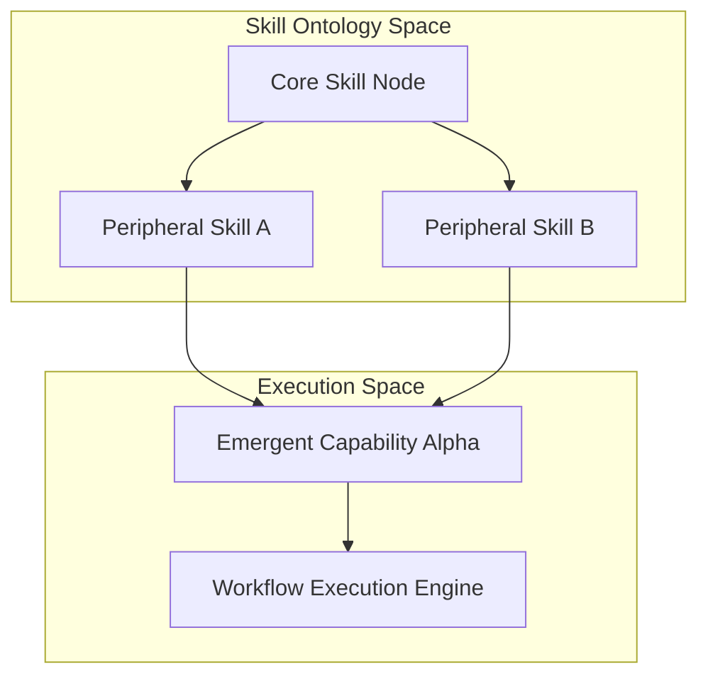

# Document 30: Skill Constellations Dynamic Evolution and Execution

## 1. Executive Summary and Mythic Directives

Skill Constellations provide a revolutionary ontological framework for structuring and executing complex agentic behaviors. Moving beyond linear, rigid state machines, a Skill Constellation is a high-dimensional, directed acyclic graph where nodes represent atomic capabilities and edges represent semantic dependencies and data flow constraints. This non-linear topology enables agents to dynamically construct highly adaptive, ad-hoc workflows to solve unprecedented challenges. The formation of a Skill Constellation begins with the core Semantic Matching Engine. When presented with a complex objective, the engine traverses the agent's skill repository, utilizing advanced vector embeddings to identify atomic skills that semantically align with the required sub-tasks. These skills are then bound together, establishing peripheral connections based on compatible input/output schemas. The result is an emergent, transient macro-skill specifically tailored to the immediate context.

The formation of a Skill Constellation begins with the core Semantic Matching Engine. When presented with a complex objective, the engine traverses the agent's skill repository, utilizing advanced vector embeddings to identify atomic skills that semantically align with the required sub-tasks. These skills are then bound together, establishing peripheral connections based on compatible input/output schemas. The result is an emergent, transient macro-skill specifically tailored to the immediate context. Execution within a Skill Constellation is highly parallelized and intrinsically asynchronous. The Workflow Execution Engine evaluates the topological ordering of the constellation. Independent sub-graphs are dispatched to separate thread pools or even distributed across peer agents via the Edge Orchestration layer. As intermediate results are produced, they propagate through the graph, triggering subsequent skill nodes in a cascade of distributed computation.

Execution within a Skill Constellation is highly parallelized and intrinsically asynchronous. The Workflow Execution Engine evaluates the topological ordering of the constellation. Independent sub-graphs are dispatched to separate thread pools or even distributed across peer agents via the Edge Orchestration layer. As intermediate results are produced, they propagate through the graph, triggering subsequent skill nodes in a cascade of distributed computation. A critical aspect of Skill Constellations is their capacity for unsupervised learning and structural optimization. As constellations are repeatedly deployed, the system monitors execution latency, success rates, and resource consumption. The relationships between skill nodes are dynamically weighted; highly successful pathways are reinforced, while inefficient or error-prone connections are pruned. This mechanism allows the agent's repertoire to organically evolve, developing highly specialized constellations for recurring problem domains.

## 2. Advanced Architectural Topology

Execution within a Skill Constellation is highly parallelized and intrinsically asynchronous. The Workflow Execution Engine evaluates the topological ordering of the constellation. Independent sub-graphs are dispatched to separate thread pools or even distributed across peer agents via the Edge Orchestration layer. As intermediate results are produced, they propagate through the graph, triggering subsequent skill nodes in a cascade of distributed computation. A critical aspect of Skill Constellations is their capacity for unsupervised learning and structural optimization. As constellations are repeatedly deployed, the system monitors execution latency, success rates, and resource consumption. The relationships between skill nodes are dynamically weighted; highly successful pathways are reinforced, while inefficient or error-prone connections are pruned. This mechanism allows the agent's repertoire to organically evolve, developing highly specialized constellations for recurring problem domains.

A critical aspect of Skill Constellations is their capacity for unsupervised learning and structural optimization. As constellations are repeatedly deployed, the system monitors execution latency, success rates, and resource consumption. The relationships between skill nodes are dynamically weighted; highly successful pathways are reinforced, while inefficient or error-prone connections are pruned. This mechanism allows the agent's repertoire to organically evolve, developing highly specialized constellations for recurring problem domains. Skill Constellations provide a revolutionary ontological framework for structuring and executing complex agentic behaviors. Moving beyond linear, rigid state machines, a Skill Constellation is a high-dimensional, directed acyclic graph where nodes represent atomic capabilities and edges represent semantic dependencies and data flow constraints. This non-linear topology enables agents to dynamically construct highly adaptive, ad-hoc workflows to solve unprecedented challenges.

Skill Constellations provide a revolutionary ontological framework for structuring and executing complex agentic behaviors. Moving beyond linear, rigid state machines, a Skill Constellation is a high-dimensional, directed acyclic graph where nodes represent atomic capabilities and edges represent semantic dependencies and data flow constraints. This non-linear topology enables agents to dynamically construct highly adaptive, ad-hoc workflows to solve unprecedented challenges. The formation of a Skill Constellation begins with the core Semantic Matching Engine. When presented with a complex objective, the engine traverses the agent's skill repository, utilizing advanced vector embeddings to identify atomic skills that semantically align with the required sub-tasks. These skills are then bound together, establishing peripheral connections based on compatible input/output schemas. The result is an emergent, transient macro-skill specifically tailored to the immediate context.

The formation of a Skill Constellation begins with the core Semantic Matching Engine. When presented with a complex objective, the engine traverses the agent's skill repository, utilizing advanced vector embeddings to identify atomic skills that semantically align with the required sub-tasks. These skills are then bound together, establishing peripheral connections based on compatible input/output schemas. The result is an emergent, transient macro-skill specifically tailored to the immediate context. Execution within a Skill Constellation is highly parallelized and intrinsically asynchronous. The Workflow Execution Engine evaluates the topological ordering of the constellation. Independent sub-graphs are dispatched to separate thread pools or even distributed across peer agents via the Edge Orchestration layer. As intermediate results are produced, they propagate through the graph, triggering subsequent skill nodes in a cascade of distributed computation.

### 2.1 Subsystem Mechanics and Low-Level Integration

Skill Constellations provide a revolutionary ontological framework for structuring and executing complex agentic behaviors. Moving beyond linear, rigid state machines, a Skill Constellation is a high-dimensional, directed acyclic graph where nodes represent atomic capabilities and edges represent semantic dependencies and data flow constraints. This non-linear topology enables agents to dynamically construct highly adaptive, ad-hoc workflows to solve unprecedented challenges. The formation of a Skill Constellation begins with the core Semantic Matching Engine. When presented with a complex objective, the engine traverses the agent's skill repository, utilizing advanced vector embeddings to identify atomic skills that semantically align with the required sub-tasks. These skills are then bound together, establishing peripheral connections based on compatible input/output schemas. The result is an emergent, transient macro-skill specifically tailored to the immediate context.

The formation of a Skill Constellation begins with the core Semantic Matching Engine. When presented with a complex objective, the engine traverses the agent's skill repository, utilizing advanced vector embeddings to identify atomic skills that semantically align with the required sub-tasks. These skills are then bound together, establishing peripheral connections based on compatible input/output schemas. The result is an emergent, transient macro-skill specifically tailored to the immediate context. Execution within a Skill Constellation is highly parallelized and intrinsically asynchronous. The Workflow Execution Engine evaluates the topological ordering of the constellation. Independent sub-graphs are dispatched to separate thread pools or even distributed across peer agents via the Edge Orchestration layer. As intermediate results are produced, they propagate through the graph, triggering subsequent skill nodes in a cascade of distributed computation.

Execution within a Skill Constellation is highly parallelized and intrinsically asynchronous. The Workflow Execution Engine evaluates the topological ordering of the constellation. Independent sub-graphs are dispatched to separate thread pools or even distributed across peer agents via the Edge Orchestration layer. As intermediate results are produced, they propagate through the graph, triggering subsequent skill nodes in a cascade of distributed computation. A critical aspect of Skill Constellations is their capacity for unsupervised learning and structural optimization. As constellations are repeatedly deployed, the system monitors execution latency, success rates, and resource consumption. The relationships between skill nodes are dynamically weighted; highly successful pathways are reinforced, while inefficient or error-prone connections are pruned. This mechanism allows the agent's repertoire to organically evolve, developing highly specialized constellations for recurring problem domains.

A critical aspect of Skill Constellations is their capacity for unsupervised learning and structural optimization. As constellations are repeatedly deployed, the system monitors execution latency, success rates, and resource consumption. The relationships between skill nodes are dynamically weighted; highly successful pathways are reinforced, while inefficient or error-prone connections are pruned. This mechanism allows the agent's repertoire to organically evolve, developing highly specialized constellations for recurring problem domains. Skill Constellations provide a revolutionary ontological framework for structuring and executing complex agentic behaviors. Moving beyond linear, rigid state machines, a Skill Constellation is a high-dimensional, directed acyclic graph where nodes represent atomic capabilities and edges represent semantic dependencies and data flow constraints. This non-linear topology enables agents to dynamically construct highly adaptive, ad-hoc workflows to solve unprecedented challenges.

Skill Constellations provide a revolutionary ontological framework for structuring and executing complex agentic behaviors. Moving beyond linear, rigid state machines, a Skill Constellation is a high-dimensional, directed acyclic graph where nodes represent atomic capabilities and edges represent semantic dependencies and data flow constraints. This non-linear topology enables agents to dynamically construct highly adaptive, ad-hoc workflows to solve unprecedented challenges. The formation of a Skill Constellation begins with the core Semantic Matching Engine. When presented with a complex objective, the engine traverses the agent's skill repository, utilizing advanced vector embeddings to identify atomic skills that semantically align with the required sub-tasks. These skills are then bound together, establishing peripheral connections based on compatible input/output schemas. The result is an emergent, transient macro-skill specifically tailored to the immediate context.

## 3. Distributed Protocol Specifications

| Component | Protocol | Latency Target | Resilience Strategy |
|---|---|---|---|
| Inter-Node Comm | gRPC/QUIC | < 5ms | Exponential Backoff |
| State Sync | Gossip | Eventual | CRDT Conflict Resolution |
| Telemetry | OpenTelemetry | Asynchronous | Ring Buffer Dropping |
| Native API | FFI/IPC | Zero-copy | Sandbox Isolation |

Execution within a Skill Constellation is highly parallelized and intrinsically asynchronous. The Workflow Execution Engine evaluates the topological ordering of the constellation. Independent sub-graphs are dispatched to separate thread pools or even distributed across peer agents via the Edge Orchestration layer. As intermediate results are produced, they propagate through the graph, triggering subsequent skill nodes in a cascade of distributed computation. A critical aspect of Skill Constellations is their capacity for unsupervised learning and structural optimization. As constellations are repeatedly deployed, the system monitors execution latency, success rates, and resource consumption. The relationships between skill nodes are dynamically weighted; highly successful pathways are reinforced, while inefficient or error-prone connections are pruned. This mechanism allows the agent's repertoire to organically evolve, developing highly specialized constellations for recurring problem domains.

A critical aspect of Skill Constellations is their capacity for unsupervised learning and structural optimization. As constellations are repeatedly deployed, the system monitors execution latency, success rates, and resource consumption. The relationships between skill nodes are dynamically weighted; highly successful pathways are reinforced, while inefficient or error-prone connections are pruned. This mechanism allows the agent's repertoire to organically evolve, developing highly specialized constellations for recurring problem domains. Skill Constellations provide a revolutionary ontological framework for structuring and executing complex agentic behaviors. Moving beyond linear, rigid state machines, a Skill Constellation is a high-dimensional, directed acyclic graph where nodes represent atomic capabilities and edges represent semantic dependencies and data flow constraints. This non-linear topology enables agents to dynamically construct highly adaptive, ad-hoc workflows to solve unprecedented challenges.

Skill Constellations provide a revolutionary ontological framework for structuring and executing complex agentic behaviors. Moving beyond linear, rigid state machines, a Skill Constellation is a high-dimensional, directed acyclic graph where nodes represent atomic capabilities and edges represent semantic dependencies and data flow constraints. This non-linear topology enables agents to dynamically construct highly adaptive, ad-hoc workflows to solve unprecedented challenges. The formation of a Skill Constellation begins with the core Semantic Matching Engine. When presented with a complex objective, the engine traverses the agent's skill repository, utilizing advanced vector embeddings to identify atomic skills that semantically align with the required sub-tasks. These skills are then bound together, establishing peripheral connections based on compatible input/output schemas. The result is an emergent, transient macro-skill specifically tailored to the immediate context.

The formation of a Skill Constellation begins with the core Semantic Matching Engine. When presented with a complex objective, the engine traverses the agent's skill repository, utilizing advanced vector embeddings to identify atomic skills that semantically align with the required sub-tasks. These skills are then bound together, establishing peripheral connections based on compatible input/output schemas. The result is an emergent, transient macro-skill specifically tailored to the immediate context. Execution within a Skill Constellation is highly parallelized and intrinsically asynchronous. The Workflow Execution Engine evaluates the topological ordering of the constellation. Independent sub-graphs are dispatched to separate thread pools or even distributed across peer agents via the Edge Orchestration layer. As intermediate results are produced, they propagate through the graph, triggering subsequent skill nodes in a cascade of distributed computation.

Execution within a Skill Constellation is highly parallelized and intrinsically asynchronous. The Workflow Execution Engine evaluates the topological ordering of the constellation. Independent sub-graphs are dispatched to separate thread pools or even distributed across peer agents via the Edge Orchestration layer. As intermediate results are produced, they propagate through the graph, triggering subsequent skill nodes in a cascade of distributed computation. A critical aspect of Skill Constellations is their capacity for unsupervised learning and structural optimization. As constellations are repeatedly deployed, the system monitors execution latency, success rates, and resource consumption. The relationships between skill nodes are dynamically weighted; highly successful pathways are reinforced, while inefficient or error-prone connections are pruned. This mechanism allows the agent's repertoire to organically evolve, developing highly specialized constellations for recurring problem domains.

## 4. Algorithmic Formulations and State Transformations

Skill Constellations provide a revolutionary ontological framework for structuring and executing complex agentic behaviors. Moving beyond linear, rigid state machines, a Skill Constellation is a high-dimensional, directed acyclic graph where nodes represent atomic capabilities and edges represent semantic dependencies and data flow constraints. This non-linear topology enables agents to dynamically construct highly adaptive, ad-hoc workflows to solve unprecedented challenges. The formation of a Skill Constellation begins with the core Semantic Matching Engine. When presented with a complex objective, the engine traverses the agent's skill repository, utilizing advanced vector embeddings to identify atomic skills that semantically align with the required sub-tasks. These skills are then bound together, establishing peripheral connections based on compatible input/output schemas. The result is an emergent, transient macro-skill specifically tailored to the immediate context.

The formation of a Skill Constellation begins with the core Semantic Matching Engine. When presented with a complex objective, the engine traverses the agent's skill repository, utilizing advanced vector embeddings to identify atomic skills that semantically align with the required sub-tasks. These skills are then bound together, establishing peripheral connections based on compatible input/output schemas. The result is an emergent, transient macro-skill specifically tailored to the immediate context. Execution within a Skill Constellation is highly parallelized and intrinsically asynchronous. The Workflow Execution Engine evaluates the topological ordering of the constellation. Independent sub-graphs are dispatched to separate thread pools or even distributed across peer agents via the Edge Orchestration layer. As intermediate results are produced, they propagate through the graph, triggering subsequent skill nodes in a cascade of distributed computation.

Execution within a Skill Constellation is highly parallelized and intrinsically asynchronous. The Workflow Execution Engine evaluates the topological ordering of the constellation. Independent sub-graphs are dispatched to separate thread pools or even distributed across peer agents via the Edge Orchestration layer. As intermediate results are produced, they propagate through the graph, triggering subsequent skill nodes in a cascade of distributed computation. A critical aspect of Skill Constellations is their capacity for unsupervised learning and structural optimization. As constellations are repeatedly deployed, the system monitors execution latency, success rates, and resource consumption. The relationships between skill nodes are dynamically weighted; highly successful pathways are reinforced, while inefficient or error-prone connections are pruned. This mechanism allows the agent's repertoire to organically evolve, developing highly specialized constellations for recurring problem domains.

A critical aspect of Skill Constellations is their capacity for unsupervised learning and structural optimization. As constellations are repeatedly deployed, the system monitors execution latency, success rates, and resource consumption. The relationships between skill nodes are dynamically weighted; highly successful pathways are reinforced, while inefficient or error-prone connections are pruned. This mechanism allows the agent's repertoire to organically evolve, developing highly specialized constellations for recurring problem domains. Skill Constellations provide a revolutionary ontological framework for structuring and executing complex agentic behaviors. Moving beyond linear, rigid state machines, a Skill Constellation is a high-dimensional, directed acyclic graph where nodes represent atomic capabilities and edges represent semantic dependencies and data flow constraints. This non-linear topology enables agents to dynamically construct highly adaptive, ad-hoc workflows to solve unprecedented challenges.

Skill Constellations provide a revolutionary ontological framework for structuring and executing complex agentic behaviors. Moving beyond linear, rigid state machines, a Skill Constellation is a high-dimensional, directed acyclic graph where nodes represent atomic capabilities and edges represent semantic dependencies and data flow constraints. This non-linear topology enables agents to dynamically construct highly adaptive, ad-hoc workflows to solve unprecedented challenges. The formation of a Skill Constellation begins with the core Semantic Matching Engine. When presented with a complex objective, the engine traverses the agent's skill repository, utilizing advanced vector embeddings to identify atomic skills that semantically align with the required sub-tasks. These skills are then bound together, establishing peripheral connections based on compatible input/output schemas. The result is an emergent, transient macro-skill specifically tailored to the immediate context.

### 4.1 Emergent Behaviors in Highly Constrained Environments

Execution within a Skill Constellation is highly parallelized and intrinsically asynchronous. The Workflow Execution Engine evaluates the topological ordering of the constellation. Independent sub-graphs are dispatched to separate thread pools or even distributed across peer agents via the Edge Orchestration layer. As intermediate results are produced, they propagate through the graph, triggering subsequent skill nodes in a cascade of distributed computation. A critical aspect of Skill Constellations is their capacity for unsupervised learning and structural optimization. As constellations are repeatedly deployed, the system monitors execution latency, success rates, and resource consumption. The relationships between skill nodes are dynamically weighted; highly successful pathways are reinforced, while inefficient or error-prone connections are pruned. This mechanism allows the agent's repertoire to organically evolve, developing highly specialized constellations for recurring problem domains.

A critical aspect of Skill Constellations is their capacity for unsupervised learning and structural optimization. As constellations are repeatedly deployed, the system monitors execution latency, success rates, and resource consumption. The relationships between skill nodes are dynamically weighted; highly successful pathways are reinforced, while inefficient or error-prone connections are pruned. This mechanism allows the agent's repertoire to organically evolve, developing highly specialized constellations for recurring problem domains. Skill Constellations provide a revolutionary ontological framework for structuring and executing complex agentic behaviors. Moving beyond linear, rigid state machines, a Skill Constellation is a high-dimensional, directed acyclic graph where nodes represent atomic capabilities and edges represent semantic dependencies and data flow constraints. This non-linear topology enables agents to dynamically construct highly adaptive, ad-hoc workflows to solve unprecedented challenges.

Skill Constellations provide a revolutionary ontological framework for structuring and executing complex agentic behaviors. Moving beyond linear, rigid state machines, a Skill Constellation is a high-dimensional, directed acyclic graph where nodes represent atomic capabilities and edges represent semantic dependencies and data flow constraints. This non-linear topology enables agents to dynamically construct highly adaptive, ad-hoc workflows to solve unprecedented challenges. The formation of a Skill Constellation begins with the core Semantic Matching Engine. When presented with a complex objective, the engine traverses the agent's skill repository, utilizing advanced vector embeddings to identify atomic skills that semantically align with the required sub-tasks. These skills are then bound together, establishing peripheral connections based on compatible input/output schemas. The result is an emergent, transient macro-skill specifically tailored to the immediate context.

The formation of a Skill Constellation begins with the core Semantic Matching Engine. When presented with a complex objective, the engine traverses the agent's skill repository, utilizing advanced vector embeddings to identify atomic skills that semantically align with the required sub-tasks. These skills are then bound together, establishing peripheral connections based on compatible input/output schemas. The result is an emergent, transient macro-skill specifically tailored to the immediate context. Execution within a Skill Constellation is highly parallelized and intrinsically asynchronous. The Workflow Execution Engine evaluates the topological ordering of the constellation. Independent sub-graphs are dispatched to separate thread pools or even distributed across peer agents via the Edge Orchestration layer. As intermediate results are produced, they propagate through the graph, triggering subsequent skill nodes in a cascade of distributed computation.

Execution within a Skill Constellation is highly parallelized and intrinsically asynchronous. The Workflow Execution Engine evaluates the topological ordering of the constellation. Independent sub-graphs are dispatched to separate thread pools or even distributed across peer agents via the Edge Orchestration layer. As intermediate results are produced, they propagate through the graph, triggering subsequent skill nodes in a cascade of distributed computation. A critical aspect of Skill Constellations is their capacity for unsupervised learning and structural optimization. As constellations are repeatedly deployed, the system monitors execution latency, success rates, and resource consumption. The relationships between skill nodes are dynamically weighted; highly successful pathways are reinforced, while inefficient or error-prone connections are pruned. This mechanism allows the agent's repertoire to organically evolve, developing highly specialized constellations for recurring problem domains.

A critical aspect of Skill Constellations is their capacity for unsupervised learning and structural optimization. As constellations are repeatedly deployed, the system monitors execution latency, success rates, and resource consumption. The relationships between skill nodes are dynamically weighted; highly successful pathways are reinforced, while inefficient or error-prone connections are pruned. This mechanism allows the agent's repertoire to organically evolve, developing highly specialized constellations for recurring problem domains. Skill Constellations provide a revolutionary ontological framework for structuring and executing complex agentic behaviors. Moving beyond linear, rigid state machines, a Skill Constellation is a high-dimensional, directed acyclic graph where nodes represent atomic capabilities and edges represent semantic dependencies and data flow constraints. This non-linear topology enables agents to dynamically construct highly adaptive, ad-hoc workflows to solve unprecedented challenges.

## 5. Security Enclaves and Zero-Trust Execution Models

Skill Constellations provide a revolutionary ontological framework for structuring and executing complex agentic behaviors. Moving beyond linear, rigid state machines, a Skill Constellation is a high-dimensional, directed acyclic graph where nodes represent atomic capabilities and edges represent semantic dependencies and data flow constraints. This non-linear topology enables agents to dynamically construct highly adaptive, ad-hoc workflows to solve unprecedented challenges. The formation of a Skill Constellation begins with the core Semantic Matching Engine. When presented with a complex objective, the engine traverses the agent's skill repository, utilizing advanced vector embeddings to identify atomic skills that semantically align with the required sub-tasks. These skills are then bound together, establishing peripheral connections based on compatible input/output schemas. The result is an emergent, transient macro-skill specifically tailored to the immediate context.

The formation of a Skill Constellation begins with the core Semantic Matching Engine. When presented with a complex objective, the engine traverses the agent's skill repository, utilizing advanced vector embeddings to identify atomic skills that semantically align with the required sub-tasks. These skills are then bound together, establishing peripheral connections based on compatible input/output schemas. The result is an emergent, transient macro-skill specifically tailored to the immediate context. Execution within a Skill Constellation is highly parallelized and intrinsically asynchronous. The Workflow Execution Engine evaluates the topological ordering of the constellation. Independent sub-graphs are dispatched to separate thread pools or even distributed across peer agents via the Edge Orchestration layer. As intermediate results are produced, they propagate through the graph, triggering subsequent skill nodes in a cascade of distributed computation.

Execution within a Skill Constellation is highly parallelized and intrinsically asynchronous. The Workflow Execution Engine evaluates the topological ordering of the constellation. Independent sub-graphs are dispatched to separate thread pools or even distributed across peer agents via the Edge Orchestration layer. As intermediate results are produced, they propagate through the graph, triggering subsequent skill nodes in a cascade of distributed computation. A critical aspect of Skill Constellations is their capacity for unsupervised learning and structural optimization. As constellations are repeatedly deployed, the system monitors execution latency, success rates, and resource consumption. The relationships between skill nodes are dynamically weighted; highly successful pathways are reinforced, while inefficient or error-prone connections are pruned. This mechanism allows the agent's repertoire to organically evolve, developing highly specialized constellations for recurring problem domains.

A critical aspect of Skill Constellations is their capacity for unsupervised learning and structural optimization. As constellations are repeatedly deployed, the system monitors execution latency, success rates, and resource consumption. The relationships between skill nodes are dynamically weighted; highly successful pathways are reinforced, while inefficient or error-prone connections are pruned. This mechanism allows the agent's repertoire to organically evolve, developing highly specialized constellations for recurring problem domains. Skill Constellations provide a revolutionary ontological framework for structuring and executing complex agentic behaviors. Moving beyond linear, rigid state machines, a Skill Constellation is a high-dimensional, directed acyclic graph where nodes represent atomic capabilities and edges represent semantic dependencies and data flow constraints. This non-linear topology enables agents to dynamically construct highly adaptive, ad-hoc workflows to solve unprecedented challenges.

## 6. Strategic Deployment Vectors

Execution within a Skill Constellation is highly parallelized and intrinsically asynchronous. The Workflow Execution Engine evaluates the topological ordering of the constellation. Independent sub-graphs are dispatched to separate thread pools or even distributed across peer agents via the Edge Orchestration layer. As intermediate results are produced, they propagate through the graph, triggering subsequent skill nodes in a cascade of distributed computation. A critical aspect of Skill Constellations is their capacity for unsupervised learning and structural optimization. As constellations are repeatedly deployed, the system monitors execution latency, success rates, and resource consumption. The relationships between skill nodes are dynamically weighted; highly successful pathways are reinforced, while inefficient or error-prone connections are pruned. This mechanism allows the agent's repertoire to organically evolve, developing highly specialized constellations for recurring problem domains.

A critical aspect of Skill Constellations is their capacity for unsupervised learning and structural optimization. As constellations are repeatedly deployed, the system monitors execution latency, success rates, and resource consumption. The relationships between skill nodes are dynamically weighted; highly successful pathways are reinforced, while inefficient or error-prone connections are pruned. This mechanism allows the agent's repertoire to organically evolve, developing highly specialized constellations for recurring problem domains. Skill Constellations provide a revolutionary ontological framework for structuring and executing complex agentic behaviors. Moving beyond linear, rigid state machines, a Skill Constellation is a high-dimensional, directed acyclic graph where nodes represent atomic capabilities and edges represent semantic dependencies and data flow constraints. This non-linear topology enables agents to dynamically construct highly adaptive, ad-hoc workflows to solve unprecedented challenges.

Skill Constellations provide a revolutionary ontological framework for structuring and executing complex agentic behaviors. Moving beyond linear, rigid state machines, a Skill Constellation is a high-dimensional, directed acyclic graph where nodes represent atomic capabilities and edges represent semantic dependencies and data flow constraints. This non-linear topology enables agents to dynamically construct highly adaptive, ad-hoc workflows to solve unprecedented challenges. The formation of a Skill Constellation begins with the core Semantic Matching Engine. When presented with a complex objective, the engine traverses the agent's skill repository, utilizing advanced vector embeddings to identify atomic skills that semantically align with the required sub-tasks. These skills are then bound together, establishing peripheral connections based on compatible input/output schemas. The result is an emergent, transient macro-skill specifically tailored to the immediate context.

The formation of a Skill Constellation begins with the core Semantic Matching Engine. When presented with a complex objective, the engine traverses the agent's skill repository, utilizing advanced vector embeddings to identify atomic skills that semantically align with the required sub-tasks. These skills are then bound together, establishing peripheral connections based on compatible input/output schemas. The result is an emergent, transient macro-skill specifically tailored to the immediate context. Execution within a Skill Constellation is highly parallelized and intrinsically asynchronous. The Workflow Execution Engine evaluates the topological ordering of the constellation. Independent sub-graphs are dispatched to separate thread pools or even distributed across peer agents via the Edge Orchestration layer. As intermediate results are produced, they propagate through the graph, triggering subsequent skill nodes in a cascade of distributed computation.

## 7. Conclusion: The Mythic Synthesis

Skill Constellations provide a revolutionary ontological framework for structuring and executing complex agentic behaviors. Moving beyond linear, rigid state machines, a Skill Constellation is a high-dimensional, directed acyclic graph where nodes represent atomic capabilities and edges represent semantic dependencies and data flow constraints. This non-linear topology enables agents to dynamically construct highly adaptive, ad-hoc workflows to solve unprecedented challenges. The formation of a Skill Constellation begins with the core Semantic Matching Engine. When presented with a complex objective, the engine traverses the agent's skill repository, utilizing advanced vector embeddings to identify atomic skills that semantically align with the required sub-tasks. These skills are then bound together, establishing peripheral connections based on compatible input/output schemas. The result is an emergent, transient macro-skill specifically tailored to the immediate context.

The formation of a Skill Constellation begins with the core Semantic Matching Engine. When presented with a complex objective, the engine traverses the agent's skill repository, utilizing advanced vector embeddings to identify atomic skills that semantically align with the required sub-tasks. These skills are then bound together, establishing peripheral connections based on compatible input/output schemas. The result is an emergent, transient macro-skill specifically tailored to the immediate context. Execution within a Skill Constellation is highly parallelized and intrinsically asynchronous. The Workflow Execution Engine evaluates the topological ordering of the constellation. Independent sub-graphs are dispatched to separate thread pools or even distributed across peer agents via the Edge Orchestration layer. As intermediate results are produced, they propagate through the graph, triggering subsequent skill nodes in a cascade of distributed computation.

Execution within a Skill Constellation is highly parallelized and intrinsically asynchronous. The Workflow Execution Engine evaluates the topological ordering of the constellation. Independent sub-graphs are dispatched to separate thread pools or even distributed across peer agents via the Edge Orchestration layer. As intermediate results are produced, they propagate through the graph, triggering subsequent skill nodes in a cascade of distributed computation. A critical aspect of Skill Constellations is their capacity for unsupervised learning and structural optimization. As constellations are repeatedly deployed, the system monitors execution latency, success rates, and resource consumption. The relationships between skill nodes are dynamically weighted; highly successful pathways are reinforced, while inefficient or error-prone connections are pruned. This mechanism allows the agent's repertoire to organically evolve, developing highly specialized constellations for recurring problem domains.

## ANNEX A: Deep Dive Telemetry Data Models and Trace Contexts

Execution within a Skill Constellation is highly parallelized and intrinsically asynchronous. The Workflow Execution Engine evaluates the topological ordering of the constellation. Independent sub-graphs are dispatched to separate thread pools or even distributed across peer agents via the Edge Orchestration layer. As intermediate results are produced, they propagate through the graph, triggering subsequent skill nodes in a cascade of distributed computation. A critical aspect of Skill Constellations is their capacity for unsupervised learning and structural optimization. As constellations are repeatedly deployed, the system monitors execution latency, success rates, and resource consumption. The relationships between skill nodes are dynamically weighted; highly successful pathways are reinforced, while inefficient or error-prone connections are pruned. This mechanism allows the agent's repertoire to organically evolve, developing highly specialized constellations for recurring problem domains. Skill Constellations provide a revolutionary ontological framework for structuring and executing complex agentic behaviors. Moving beyond linear, rigid state machines, a Skill Constellation is a high-dimensional, directed acyclic graph where nodes represent atomic capabilities and edges represent semantic dependencies and data flow constraints. This non-linear topology enables agents to dynamically construct highly adaptive, ad-hoc workflows to solve unprecedented challenges.

A critical aspect of Skill Constellations is their capacity for unsupervised learning and structural optimization. As constellations are repeatedly deployed, the system monitors execution latency, success rates, and resource consumption. The relationships between skill nodes are dynamically weighted; highly successful pathways are reinforced, while inefficient or error-prone connections are pruned. This mechanism allows the agent's repertoire to organically evolve, developing highly specialized constellations for recurring problem domains. Skill Constellations provide a revolutionary ontological framework for structuring and executing complex agentic behaviors. Moving beyond linear, rigid state machines, a Skill Constellation is a high-dimensional, directed acyclic graph where nodes represent atomic capabilities and edges represent semantic dependencies and data flow constraints. This non-linear topology enables agents to dynamically construct highly adaptive, ad-hoc workflows to solve unprecedented challenges. The formation of a Skill Constellation begins with the core Semantic Matching Engine. When presented with a complex objective, the engine traverses the agent's skill repository, utilizing advanced vector embeddings to identify atomic skills that semantically align with the required sub-tasks. These skills are then bound together, establishing peripheral connections based on compatible input/output schemas. The result is an emergent, transient macro-skill specifically tailored to the immediate context.

Skill Constellations provide a revolutionary ontological framework for structuring and executing complex agentic behaviors. Moving beyond linear, rigid state machines, a Skill Constellation is a high-dimensional, directed acyclic graph where nodes represent atomic capabilities and edges represent semantic dependencies and data flow constraints. This non-linear topology enables agents to dynamically construct highly adaptive, ad-hoc workflows to solve unprecedented challenges. The formation of a Skill Constellation begins with the core Semantic Matching Engine. When presented with a complex objective, the engine traverses the agent's skill repository, utilizing advanced vector embeddings to identify atomic skills that semantically align with the required sub-tasks. These skills are then bound together, establishing peripheral connections based on compatible input/output schemas. The result is an emergent, transient macro-skill specifically tailored to the immediate context. Execution within a Skill Constellation is highly parallelized and intrinsically asynchronous. The Workflow Execution Engine evaluates the topological ordering of the constellation. Independent sub-graphs are dispatched to separate thread pools or even distributed across peer agents via the Edge Orchestration layer. As intermediate results are produced, they propagate through the graph, triggering subsequent skill nodes in a cascade of distributed computation.

The formation of a Skill Constellation begins with the core Semantic Matching Engine. When presented with a complex objective, the engine traverses the agent's skill repository, utilizing advanced vector embeddings to identify atomic skills that semantically align with the required sub-tasks. These skills are then bound together, establishing peripheral connections based on compatible input/output schemas. The result is an emergent, transient macro-skill specifically tailored to the immediate context. Execution within a Skill Constellation is highly parallelized and intrinsically asynchronous. The Workflow Execution Engine evaluates the topological ordering of the constellation. Independent sub-graphs are dispatched to separate thread pools or even distributed across peer agents via the Edge Orchestration layer. As intermediate results are produced, they propagate through the graph, triggering subsequent skill nodes in a cascade of distributed computation. A critical aspect of Skill Constellations is their capacity for unsupervised learning and structural optimization. As constellations are repeatedly deployed, the system monitors execution latency, success rates, and resource consumption. The relationships between skill nodes are dynamically weighted; highly successful pathways are reinforced, while inefficient or error-prone connections are pruned. This mechanism allows the agent's repertoire to organically evolve, developing highly specialized constellations for recurring problem domains.

Execution within a Skill Constellation is highly parallelized and intrinsically asynchronous. The Workflow Execution Engine evaluates the topological ordering of the constellation. Independent sub-graphs are dispatched to separate thread pools or even distributed across peer agents via the Edge Orchestration layer. As intermediate results are produced, they propagate through the graph, triggering subsequent skill nodes in a cascade of distributed computation. A critical aspect of Skill Constellations is their capacity for unsupervised learning and structural optimization. As constellations are repeatedly deployed, the system monitors execution latency, success rates, and resource consumption. The relationships between skill nodes are dynamically weighted; highly successful pathways are reinforced, while inefficient or error-prone connections are pruned. This mechanism allows the agent's repertoire to organically evolve, developing highly specialized constellations for recurring problem domains. Skill Constellations provide a revolutionary ontological framework for structuring and executing complex agentic behaviors. Moving beyond linear, rigid state machines, a Skill Constellation is a high-dimensional, directed acyclic graph where nodes represent atomic capabilities and edges represent semantic dependencies and data flow constraints. This non-linear topology enables agents to dynamically construct highly adaptive, ad-hoc workflows to solve unprecedented challenges.

A critical aspect of Skill Constellations is their capacity for unsupervised learning and structural optimization. As constellations are repeatedly deployed, the system monitors execution latency, success rates, and resource consumption. The relationships between skill nodes are dynamically weighted; highly successful pathways are reinforced, while inefficient or error-prone connections are pruned. This mechanism allows the agent's repertoire to organically evolve, developing highly specialized constellations for recurring problem domains. Skill Constellations provide a revolutionary ontological framework for structuring and executing complex agentic behaviors. Moving beyond linear, rigid state machines, a Skill Constellation is a high-dimensional, directed acyclic graph where nodes represent atomic capabilities and edges represent semantic dependencies and data flow constraints. This non-linear topology enables agents to dynamically construct highly adaptive, ad-hoc workflows to solve unprecedented challenges. The formation of a Skill Constellation begins with the core Semantic Matching Engine. When presented with a complex objective, the engine traverses the agent's skill repository, utilizing advanced vector embeddings to identify atomic skills that semantically align with the required sub-tasks. These skills are then bound together, establishing peripheral connections based on compatible input/output schemas. The result is an emergent, transient macro-skill specifically tailored to the immediate context.

Skill Constellations provide a revolutionary ontological framework for structuring and executing complex agentic behaviors. Moving beyond linear, rigid state machines, a Skill Constellation is a high-dimensional, directed acyclic graph where nodes represent atomic capabilities and edges represent semantic dependencies and data flow constraints. This non-linear topology enables agents to dynamically construct highly adaptive, ad-hoc workflows to solve unprecedented challenges. The formation of a Skill Constellation begins with the core Semantic Matching Engine. When presented with a complex objective, the engine traverses the agent's skill repository, utilizing advanced vector embeddings to identify atomic skills that semantically align with the required sub-tasks. These skills are then bound together, establishing peripheral connections based on compatible input/output schemas. The result is an emergent, transient macro-skill specifically tailored to the immediate context. Execution within a Skill Constellation is highly parallelized and intrinsically asynchronous. The Workflow Execution Engine evaluates the topological ordering of the constellation. Independent sub-graphs are dispatched to separate thread pools or even distributed across peer agents via the Edge Orchestration layer. As intermediate results are produced, they propagate through the graph, triggering subsequent skill nodes in a cascade of distributed computation.

The formation of a Skill Constellation begins with the core Semantic Matching Engine. When presented with a complex objective, the engine traverses the agent's skill repository, utilizing advanced vector embeddings to identify atomic skills that semantically align with the required sub-tasks. These skills are then bound together, establishing peripheral connections based on compatible input/output schemas. The result is an emergent, transient macro-skill specifically tailored to the immediate context. Execution within a Skill Constellation is highly parallelized and intrinsically asynchronous. The Workflow Execution Engine evaluates the topological ordering of the constellation. Independent sub-graphs are dispatched to separate thread pools or even distributed across peer agents via the Edge Orchestration layer. As intermediate results are produced, they propagate through the graph, triggering subsequent skill nodes in a cascade of distributed computation. A critical aspect of Skill Constellations is their capacity for unsupervised learning and structural optimization. As constellations are repeatedly deployed, the system monitors execution latency, success rates, and resource consumption. The relationships between skill nodes are dynamically weighted; highly successful pathways are reinforced, while inefficient or error-prone connections are pruned. This mechanism allows the agent's repertoire to organically evolve, developing highly specialized constellations for recurring problem domains.

Execution within a Skill Constellation is highly parallelized and intrinsically asynchronous. The Workflow Execution Engine evaluates the topological ordering of the constellation. Independent sub-graphs are dispatched to separate thread pools or even distributed across peer agents via the Edge Orchestration layer. As intermediate results are produced, they propagate through the graph, triggering subsequent skill nodes in a cascade of distributed computation. A critical aspect of Skill Constellations is their capacity for unsupervised learning and structural optimization. As constellations are repeatedly deployed, the system monitors execution latency, success rates, and resource consumption. The relationships between skill nodes are dynamically weighted; highly successful pathways are reinforced, while inefficient or error-prone connections are pruned. This mechanism allows the agent's repertoire to organically evolve, developing highly specialized constellations for recurring problem domains. Skill Constellations provide a revolutionary ontological framework for structuring and executing complex agentic behaviors. Moving beyond linear, rigid state machines, a Skill Constellation is a high-dimensional, directed acyclic graph where nodes represent atomic capabilities and edges represent semantic dependencies and data flow constraints. This non-linear topology enables agents to dynamically construct highly adaptive, ad-hoc workflows to solve unprecedented challenges.

A critical aspect of Skill Constellations is their capacity for unsupervised learning and structural optimization. As constellations are repeatedly deployed, the system monitors execution latency, success rates, and resource consumption. The relationships between skill nodes are dynamically weighted; highly successful pathways are reinforced, while inefficient or error-prone connections are pruned. This mechanism allows the agent's repertoire to organically evolve, developing highly specialized constellations for recurring problem domains. Skill Constellations provide a revolutionary ontological framework for structuring and executing complex agentic behaviors. Moving beyond linear, rigid state machines, a Skill Constellation is a high-dimensional, directed acyclic graph where nodes represent atomic capabilities and edges represent semantic dependencies and data flow constraints. This non-linear topology enables agents to dynamically construct highly adaptive, ad-hoc workflows to solve unprecedented challenges. The formation of a Skill Constellation begins with the core Semantic Matching Engine. When presented with a complex objective, the engine traverses the agent's skill repository, utilizing advanced vector embeddings to identify atomic skills that semantically align with the required sub-tasks. These skills are then bound together, establishing peripheral connections based on compatible input/output schemas. The result is an emergent, transient macro-skill specifically tailored to the immediate context.

## ANNEX B: Cryptographic Proofs and Capability Signing Mechanisms

The formation of a Skill Constellation begins with the core Semantic Matching Engine. When presented with a complex objective, the engine traverses the agent's skill repository, utilizing advanced vector embeddings to identify atomic skills that semantically align with the required sub-tasks. These skills are then bound together, establishing peripheral connections based on compatible input/output schemas. The result is an emergent, transient macro-skill specifically tailored to the immediate context. Execution within a Skill Constellation is highly parallelized and intrinsically asynchronous. The Workflow Execution Engine evaluates the topological ordering of the constellation. Independent sub-graphs are dispatched to separate thread pools or even distributed across peer agents via the Edge Orchestration layer. As intermediate results are produced, they propagate through the graph, triggering subsequent skill nodes in a cascade of distributed computation. A critical aspect of Skill Constellations is their capacity for unsupervised learning and structural optimization. As constellations are repeatedly deployed, the system monitors execution latency, success rates, and resource consumption. The relationships between skill nodes are dynamically weighted; highly successful pathways are reinforced, while inefficient or error-prone connections are pruned. This mechanism allows the agent's repertoire to organically evolve, developing highly specialized constellations for recurring problem domains.

Execution within a Skill Constellation is highly parallelized and intrinsically asynchronous. The Workflow Execution Engine evaluates the topological ordering of the constellation. Independent sub-graphs are dispatched to separate thread pools or even distributed across peer agents via the Edge Orchestration layer. As intermediate results are produced, they propagate through the graph, triggering subsequent skill nodes in a cascade of distributed computation. A critical aspect of Skill Constellations is their capacity for unsupervised learning and structural optimization. As constellations are repeatedly deployed, the system monitors execution latency, success rates, and resource consumption. The relationships between skill nodes are dynamically weighted; highly successful pathways are reinforced, while inefficient or error-prone connections are pruned. This mechanism allows the agent's repertoire to organically evolve, developing highly specialized constellations for recurring problem domains. Skill Constellations provide a revolutionary ontological framework for structuring and executing complex agentic behaviors. Moving beyond linear, rigid state machines, a Skill Constellation is a high-dimensional, directed acyclic graph where nodes represent atomic capabilities and edges represent semantic dependencies and data flow constraints. This non-linear topology enables agents to dynamically construct highly adaptive, ad-hoc workflows to solve unprecedented challenges.

A critical aspect of Skill Constellations is their capacity for unsupervised learning and structural optimization. As constellations are repeatedly deployed, the system monitors execution latency, success rates, and resource consumption. The relationships between skill nodes are dynamically weighted; highly successful pathways are reinforced, while inefficient or error-prone connections are pruned. This mechanism allows the agent's repertoire to organically evolve, developing highly specialized constellations for recurring problem domains. Skill Constellations provide a revolutionary ontological framework for structuring and executing complex agentic behaviors. Moving beyond linear, rigid state machines, a Skill Constellation is a high-dimensional, directed acyclic graph where nodes represent atomic capabilities and edges represent semantic dependencies and data flow constraints. This non-linear topology enables agents to dynamically construct highly adaptive, ad-hoc workflows to solve unprecedented challenges. The formation of a Skill Constellation begins with the core Semantic Matching Engine. When presented with a complex objective, the engine traverses the agent's skill repository, utilizing advanced vector embeddings to identify atomic skills that semantically align with the required sub-tasks. These skills are then bound together, establishing peripheral connections based on compatible input/output schemas. The result is an emergent, transient macro-skill specifically tailored to the immediate context.

Skill Constellations provide a revolutionary ontological framework for structuring and executing complex agentic behaviors. Moving beyond linear, rigid state machines, a Skill Constellation is a high-dimensional, directed acyclic graph where nodes represent atomic capabilities and edges represent semantic dependencies and data flow constraints. This non-linear topology enables agents to dynamically construct highly adaptive, ad-hoc workflows to solve unprecedented challenges. The formation of a Skill Constellation begins with the core Semantic Matching Engine. When presented with a complex objective, the engine traverses the agent's skill repository, utilizing advanced vector embeddings to identify atomic skills that semantically align with the required sub-tasks. These skills are then bound together, establishing peripheral connections based on compatible input/output schemas. The result is an emergent, transient macro-skill specifically tailored to the immediate context. Execution within a Skill Constellation is highly parallelized and intrinsically asynchronous. The Workflow Execution Engine evaluates the topological ordering of the constellation. Independent sub-graphs are dispatched to separate thread pools or even distributed across peer agents via the Edge Orchestration layer. As intermediate results are produced, they propagate through the graph, triggering subsequent skill nodes in a cascade of distributed computation.

The formation of a Skill Constellation begins with the core Semantic Matching Engine. When presented with a complex objective, the engine traverses the agent's skill repository, utilizing advanced vector embeddings to identify atomic skills that semantically align with the required sub-tasks. These skills are then bound together, establishing peripheral connections based on compatible input/output schemas. The result is an emergent, transient macro-skill specifically tailored to the immediate context. Execution within a Skill Constellation is highly parallelized and intrinsically asynchronous. The Workflow Execution Engine evaluates the topological ordering of the constellation. Independent sub-graphs are dispatched to separate thread pools or even distributed across peer agents via the Edge Orchestration layer. As intermediate results are produced, they propagate through the graph, triggering subsequent skill nodes in a cascade of distributed computation. A critical aspect of Skill Constellations is their capacity for unsupervised learning and structural optimization. As constellations are repeatedly deployed, the system monitors execution latency, success rates, and resource consumption. The relationships between skill nodes are dynamically weighted; highly successful pathways are reinforced, while inefficient or error-prone connections are pruned. This mechanism allows the agent's repertoire to organically evolve, developing highly specialized constellations for recurring problem domains.

Execution within a Skill Constellation is highly parallelized and intrinsically asynchronous. The Workflow Execution Engine evaluates the topological ordering of the constellation. Independent sub-graphs are dispatched to separate thread pools or even distributed across peer agents via the Edge Orchestration layer. As intermediate results are produced, they propagate through the graph, triggering subsequent skill nodes in a cascade of distributed computation. A critical aspect of Skill Constellations is their capacity for unsupervised learning and structural optimization. As constellations are repeatedly deployed, the system monitors execution latency, success rates, and resource consumption. The relationships between skill nodes are dynamically weighted; highly successful pathways are reinforced, while inefficient or error-prone connections are pruned. This mechanism allows the agent's repertoire to organically evolve, developing highly specialized constellations for recurring problem domains. Skill Constellations provide a revolutionary ontological framework for structuring and executing complex agentic behaviors. Moving beyond linear, rigid state machines, a Skill Constellation is a high-dimensional, directed acyclic graph where nodes represent atomic capabilities and edges represent semantic dependencies and data flow constraints. This non-linear topology enables agents to dynamically construct highly adaptive, ad-hoc workflows to solve unprecedented challenges.

A critical aspect of Skill Constellations is their capacity for unsupervised learning and structural optimization. As constellations are repeatedly deployed, the system monitors execution latency, success rates, and resource consumption. The relationships between skill nodes are dynamically weighted; highly successful pathways are reinforced, while inefficient or error-prone connections are pruned. This mechanism allows the agent's repertoire to organically evolve, developing highly specialized constellations for recurring problem domains. Skill Constellations provide a revolutionary ontological framework for structuring and executing complex agentic behaviors. Moving beyond linear, rigid state machines, a Skill Constellation is a high-dimensional, directed acyclic graph where nodes represent atomic capabilities and edges represent semantic dependencies and data flow constraints. This non-linear topology enables agents to dynamically construct highly adaptive, ad-hoc workflows to solve unprecedented challenges. The formation of a Skill Constellation begins with the core Semantic Matching Engine. When presented with a complex objective, the engine traverses the agent's skill repository, utilizing advanced vector embeddings to identify atomic skills that semantically align with the required sub-tasks. These skills are then bound together, establishing peripheral connections based on compatible input/output schemas. The result is an emergent, transient macro-skill specifically tailored to the immediate context.

Skill Constellations provide a revolutionary ontological framework for structuring and executing complex agentic behaviors. Moving beyond linear, rigid state machines, a Skill Constellation is a high-dimensional, directed acyclic graph where nodes represent atomic capabilities and edges represent semantic dependencies and data flow constraints. This non-linear topology enables agents to dynamically construct highly adaptive, ad-hoc workflows to solve unprecedented challenges. The formation of a Skill Constellation begins with the core Semantic Matching Engine. When presented with a complex objective, the engine traverses the agent's skill repository, utilizing advanced vector embeddings to identify atomic skills that semantically align with the required sub-tasks. These skills are then bound together, establishing peripheral connections based on compatible input/output schemas. The result is an emergent, transient macro-skill specifically tailored to the immediate context. Execution within a Skill Constellation is highly parallelized and intrinsically asynchronous. The Workflow Execution Engine evaluates the topological ordering of the constellation. Independent sub-graphs are dispatched to separate thread pools or even distributed across peer agents via the Edge Orchestration layer. As intermediate results are produced, they propagate through the graph, triggering subsequent skill nodes in a cascade of distributed computation.

The formation of a Skill Constellation begins with the core Semantic Matching Engine. When presented with a complex objective, the engine traverses the agent's skill repository, utilizing advanced vector embeddings to identify atomic skills that semantically align with the required sub-tasks. These skills are then bound together, establishing peripheral connections based on compatible input/output schemas. The result is an emergent, transient macro-skill specifically tailored to the immediate context. Execution within a Skill Constellation is highly parallelized and intrinsically asynchronous. The Workflow Execution Engine evaluates the topological ordering of the constellation. Independent sub-graphs are dispatched to separate thread pools or even distributed across peer agents via the Edge Orchestration layer. As intermediate results are produced, they propagate through the graph, triggering subsequent skill nodes in a cascade of distributed computation. A critical aspect of Skill Constellations is their capacity for unsupervised learning and structural optimization. As constellations are repeatedly deployed, the system monitors execution latency, success rates, and resource consumption. The relationships between skill nodes are dynamically weighted; highly successful pathways are reinforced, while inefficient or error-prone connections are pruned. This mechanism allows the agent's repertoire to organically evolve, developing highly specialized constellations for recurring problem domains.

Execution within a Skill Constellation is highly parallelized and intrinsically asynchronous. The Workflow Execution Engine evaluates the topological ordering of the constellation. Independent sub-graphs are dispatched to separate thread pools or even distributed across peer agents via the Edge Orchestration layer. As intermediate results are produced, they propagate through the graph, triggering subsequent skill nodes in a cascade of distributed computation. A critical aspect of Skill Constellations is their capacity for unsupervised learning and structural optimization. As constellations are repeatedly deployed, the system monitors execution latency, success rates, and resource consumption. The relationships between skill nodes are dynamically weighted; highly successful pathways are reinforced, while inefficient or error-prone connections are pruned. This mechanism allows the agent's repertoire to organically evolve, developing highly specialized constellations for recurring problem domains. Skill Constellations provide a revolutionary ontological framework for structuring and executing complex agentic behaviors. Moving beyond linear, rigid state machines, a Skill Constellation is a high-dimensional, directed acyclic graph where nodes represent atomic capabilities and edges represent semantic dependencies and data flow constraints. This non-linear topology enables agents to dynamically construct highly adaptive, ad-hoc workflows to solve unprecedented challenges.

