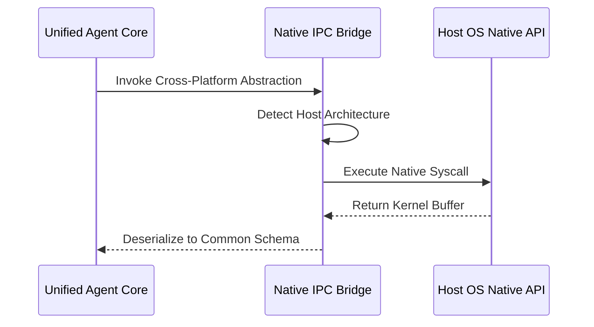

# Document 32: Cross Platform Native Integrations Edge Cases and Optimization

## 1. Executive Summary and Mythic Directives

Cross-Platform Native Integrations form the vital neurological bridge between the agent's abstracted cognitive layer and the diverse, heterogeneous reality of host operating systems. To achieve true ubiquity, the framework must operate seamlessly across Linux, macOS, Windows, and specialized embedded environments, without sacrificing the raw performance and low-level access afforded by native system calls. The architecture relies on a highly sophisticated Native IPC (Inter-Process Communication) Bridge. This component acts as a universal translator, abstracting OS-specific primitives into a common, platform-agnostic schema. Whether an agent needs to manipulate the Windows Registry, utilize Linux eBPF for network observability, or interface with macOS XPC services, the Native IPC Bridge dynamically loads the appropriate shared libraries and executes the requested operations securely.

The architecture relies on a highly sophisticated Native IPC (Inter-Process Communication) Bridge. This component acts as a universal translator, abstracting OS-specific primitives into a common, platform-agnostic schema. Whether an agent needs to manipulate the Windows Registry, utilize Linux eBPF for network observability, or interface with macOS XPC services, the Native IPC Bridge dynamically loads the appropriate shared libraries and executes the requested operations securely. Crucially, this integration avoids the performance penalties associated with heavy virtualization or containerization. The framework utilizes a zero-copy memory architecture where data structures are shared directly between the agent runtime and the native OS kernel space. This is achieved through memory-mapped files and shared memory segments, ensuring that high-throughput operations—such as analyzing large filesystem trees or capturing real-time video streams—occur with near-zero latency.

Crucially, this integration avoids the performance penalties associated with heavy virtualization or containerization. The framework utilizes a zero-copy memory architecture where data structures are shared directly between the agent runtime and the native OS kernel space. This is achieved through memory-mapped files and shared memory segments, ensuring that high-throughput operations—such as analyzing large filesystem trees or capturing real-time video streams—occur with near-zero latency. Robust error handling and sandboxing are integrated directly into the cross-platform layer. Because native integrations operate outside the safe confines of the agent's primary runtime, they present a significant security vector. The framework mitigates this by employing stringent capability-based security models. Each native operation is strictly confined to a least-privilege execution context, utilizing OS-level isolation mechanisms like seccomp-bpf, AppArmor, or Windows Integrity Levels to prevent unauthorized system modification.

## 2. Advanced Architectural Topology

Crucially, this integration avoids the performance penalties associated with heavy virtualization or containerization. The framework utilizes a zero-copy memory architecture where data structures are shared directly between the agent runtime and the native OS kernel space. This is achieved through memory-mapped files and shared memory segments, ensuring that high-throughput operations—such as analyzing large filesystem trees or capturing real-time video streams—occur with near-zero latency. Robust error handling and sandboxing are integrated directly into the cross-platform layer. Because native integrations operate outside the safe confines of the agent's primary runtime, they present a significant security vector. The framework mitigates this by employing stringent capability-based security models. Each native operation is strictly confined to a least-privilege execution context, utilizing OS-level isolation mechanisms like seccomp-bpf, AppArmor, or Windows Integrity Levels to prevent unauthorized system modification.

Robust error handling and sandboxing are integrated directly into the cross-platform layer. Because native integrations operate outside the safe confines of the agent's primary runtime, they present a significant security vector. The framework mitigates this by employing stringent capability-based security models. Each native operation is strictly confined to a least-privilege execution context, utilizing OS-level isolation mechanisms like seccomp-bpf, AppArmor, or Windows Integrity Levels to prevent unauthorized system modification. Cross-Platform Native Integrations form the vital neurological bridge between the agent's abstracted cognitive layer and the diverse, heterogeneous reality of host operating systems. To achieve true ubiquity, the framework must operate seamlessly across Linux, macOS, Windows, and specialized embedded environments, without sacrificing the raw performance and low-level access afforded by native system calls.

Cross-Platform Native Integrations form the vital neurological bridge between the agent's abstracted cognitive layer and the diverse, heterogeneous reality of host operating systems. To achieve true ubiquity, the framework must operate seamlessly across Linux, macOS, Windows, and specialized embedded environments, without sacrificing the raw performance and low-level access afforded by native system calls. The architecture relies on a highly sophisticated Native IPC (Inter-Process Communication) Bridge. This component acts as a universal translator, abstracting OS-specific primitives into a common, platform-agnostic schema. Whether an agent needs to manipulate the Windows Registry, utilize Linux eBPF for network observability, or interface with macOS XPC services, the Native IPC Bridge dynamically loads the appropriate shared libraries and executes the requested operations securely.

The architecture relies on a highly sophisticated Native IPC (Inter-Process Communication) Bridge. This component acts as a universal translator, abstracting OS-specific primitives into a common, platform-agnostic schema. Whether an agent needs to manipulate the Windows Registry, utilize Linux eBPF for network observability, or interface with macOS XPC services, the Native IPC Bridge dynamically loads the appropriate shared libraries and executes the requested operations securely. Crucially, this integration avoids the performance penalties associated with heavy virtualization or containerization. The framework utilizes a zero-copy memory architecture where data structures are shared directly between the agent runtime and the native OS kernel space. This is achieved through memory-mapped files and shared memory segments, ensuring that high-throughput operations—such as analyzing large filesystem trees or capturing real-time video streams—occur with near-zero latency.

### 2.1 Subsystem Mechanics and Low-Level Integration

Cross-Platform Native Integrations form the vital neurological bridge between the agent's abstracted cognitive layer and the diverse, heterogeneous reality of host operating systems. To achieve true ubiquity, the framework must operate seamlessly across Linux, macOS, Windows, and specialized embedded environments, without sacrificing the raw performance and low-level access afforded by native system calls. The architecture relies on a highly sophisticated Native IPC (Inter-Process Communication) Bridge. This component acts as a universal translator, abstracting OS-specific primitives into a common, platform-agnostic schema. Whether an agent needs to manipulate the Windows Registry, utilize Linux eBPF for network observability, or interface with macOS XPC services, the Native IPC Bridge dynamically loads the appropriate shared libraries and executes the requested operations securely.

The architecture relies on a highly sophisticated Native IPC (Inter-Process Communication) Bridge. This component acts as a universal translator, abstracting OS-specific primitives into a common, platform-agnostic schema. Whether an agent needs to manipulate the Windows Registry, utilize Linux eBPF for network observability, or interface with macOS XPC services, the Native IPC Bridge dynamically loads the appropriate shared libraries and executes the requested operations securely. Crucially, this integration avoids the performance penalties associated with heavy virtualization or containerization. The framework utilizes a zero-copy memory architecture where data structures are shared directly between the agent runtime and the native OS kernel space. This is achieved through memory-mapped files and shared memory segments, ensuring that high-throughput operations—such as analyzing large filesystem trees or capturing real-time video streams—occur with near-zero latency.

Crucially, this integration avoids the performance penalties associated with heavy virtualization or containerization. The framework utilizes a zero-copy memory architecture where data structures are shared directly between the agent runtime and the native OS kernel space. This is achieved through memory-mapped files and shared memory segments, ensuring that high-throughput operations—such as analyzing large filesystem trees or capturing real-time video streams—occur with near-zero latency. Robust error handling and sandboxing are integrated directly into the cross-platform layer. Because native integrations operate outside the safe confines of the agent's primary runtime, they present a significant security vector. The framework mitigates this by employing stringent capability-based security models. Each native operation is strictly confined to a least-privilege execution context, utilizing OS-level isolation mechanisms like seccomp-bpf, AppArmor, or Windows Integrity Levels to prevent unauthorized system modification.

Robust error handling and sandboxing are integrated directly into the cross-platform layer. Because native integrations operate outside the safe confines of the agent's primary runtime, they present a significant security vector. The framework mitigates this by employing stringent capability-based security models. Each native operation is strictly confined to a least-privilege execution context, utilizing OS-level isolation mechanisms like seccomp-bpf, AppArmor, or Windows Integrity Levels to prevent unauthorized system modification. Cross-Platform Native Integrations form the vital neurological bridge between the agent's abstracted cognitive layer and the diverse, heterogeneous reality of host operating systems. To achieve true ubiquity, the framework must operate seamlessly across Linux, macOS, Windows, and specialized embedded environments, without sacrificing the raw performance and low-level access afforded by native system calls.

Cross-Platform Native Integrations form the vital neurological bridge between the agent's abstracted cognitive layer and the diverse, heterogeneous reality of host operating systems. To achieve true ubiquity, the framework must operate seamlessly across Linux, macOS, Windows, and specialized embedded environments, without sacrificing the raw performance and low-level access afforded by native system calls. The architecture relies on a highly sophisticated Native IPC (Inter-Process Communication) Bridge. This component acts as a universal translator, abstracting OS-specific primitives into a common, platform-agnostic schema. Whether an agent needs to manipulate the Windows Registry, utilize Linux eBPF for network observability, or interface with macOS XPC services, the Native IPC Bridge dynamically loads the appropriate shared libraries and executes the requested operations securely.

## 3. Distributed Protocol Specifications

| Component | Protocol | Latency Target | Resilience Strategy |
|---|---|---|---|
| Inter-Node Comm | gRPC/QUIC | < 5ms | Exponential Backoff |
| State Sync | Gossip | Eventual | CRDT Conflict Resolution |
| Telemetry | OpenTelemetry | Asynchronous | Ring Buffer Dropping |
| Native API | FFI/IPC | Zero-copy | Sandbox Isolation |

Crucially, this integration avoids the performance penalties associated with heavy virtualization or containerization. The framework utilizes a zero-copy memory architecture where data structures are shared directly between the agent runtime and the native OS kernel space. This is achieved through memory-mapped files and shared memory segments, ensuring that high-throughput operations—such as analyzing large filesystem trees or capturing real-time video streams—occur with near-zero latency. Robust error handling and sandboxing are integrated directly into the cross-platform layer. Because native integrations operate outside the safe confines of the agent's primary runtime, they present a significant security vector. The framework mitigates this by employing stringent capability-based security models. Each native operation is strictly confined to a least-privilege execution context, utilizing OS-level isolation mechanisms like seccomp-bpf, AppArmor, or Windows Integrity Levels to prevent unauthorized system modification.

Robust error handling and sandboxing are integrated directly into the cross-platform layer. Because native integrations operate outside the safe confines of the agent's primary runtime, they present a significant security vector. The framework mitigates this by employing stringent capability-based security models. Each native operation is strictly confined to a least-privilege execution context, utilizing OS-level isolation mechanisms like seccomp-bpf, AppArmor, or Windows Integrity Levels to prevent unauthorized system modification. Cross-Platform Native Integrations form the vital neurological bridge between the agent's abstracted cognitive layer and the diverse, heterogeneous reality of host operating systems. To achieve true ubiquity, the framework must operate seamlessly across Linux, macOS, Windows, and specialized embedded environments, without sacrificing the raw performance and low-level access afforded by native system calls.

Cross-Platform Native Integrations form the vital neurological bridge between the agent's abstracted cognitive layer and the diverse, heterogeneous reality of host operating systems. To achieve true ubiquity, the framework must operate seamlessly across Linux, macOS, Windows, and specialized embedded environments, without sacrificing the raw performance and low-level access afforded by native system calls. The architecture relies on a highly sophisticated Native IPC (Inter-Process Communication) Bridge. This component acts as a universal translator, abstracting OS-specific primitives into a common, platform-agnostic schema. Whether an agent needs to manipulate the Windows Registry, utilize Linux eBPF for network observability, or interface with macOS XPC services, the Native IPC Bridge dynamically loads the appropriate shared libraries and executes the requested operations securely.

The architecture relies on a highly sophisticated Native IPC (Inter-Process Communication) Bridge. This component acts as a universal translator, abstracting OS-specific primitives into a common, platform-agnostic schema. Whether an agent needs to manipulate the Windows Registry, utilize Linux eBPF for network observability, or interface with macOS XPC services, the Native IPC Bridge dynamically loads the appropriate shared libraries and executes the requested operations securely. Crucially, this integration avoids the performance penalties associated with heavy virtualization or containerization. The framework utilizes a zero-copy memory architecture where data structures are shared directly between the agent runtime and the native OS kernel space. This is achieved through memory-mapped files and shared memory segments, ensuring that high-throughput operations—such as analyzing large filesystem trees or capturing real-time video streams—occur with near-zero latency.

Crucially, this integration avoids the performance penalties associated with heavy virtualization or containerization. The framework utilizes a zero-copy memory architecture where data structures are shared directly between the agent runtime and the native OS kernel space. This is achieved through memory-mapped files and shared memory segments, ensuring that high-throughput operations—such as analyzing large filesystem trees or capturing real-time video streams—occur with near-zero latency. Robust error handling and sandboxing are integrated directly into the cross-platform layer. Because native integrations operate outside the safe confines of the agent's primary runtime, they present a significant security vector. The framework mitigates this by employing stringent capability-based security models. Each native operation is strictly confined to a least-privilege execution context, utilizing OS-level isolation mechanisms like seccomp-bpf, AppArmor, or Windows Integrity Levels to prevent unauthorized system modification.

## 4. Algorithmic Formulations and State Transformations

Cross-Platform Native Integrations form the vital neurological bridge between the agent's abstracted cognitive layer and the diverse, heterogeneous reality of host operating systems. To achieve true ubiquity, the framework must operate seamlessly across Linux, macOS, Windows, and specialized embedded environments, without sacrificing the raw performance and low-level access afforded by native system calls. The architecture relies on a highly sophisticated Native IPC (Inter-Process Communication) Bridge. This component acts as a universal translator, abstracting OS-specific primitives into a common, platform-agnostic schema. Whether an agent needs to manipulate the Windows Registry, utilize Linux eBPF for network observability, or interface with macOS XPC services, the Native IPC Bridge dynamically loads the appropriate shared libraries and executes the requested operations securely.

The architecture relies on a highly sophisticated Native IPC (Inter-Process Communication) Bridge. This component acts as a universal translator, abstracting OS-specific primitives into a common, platform-agnostic schema. Whether an agent needs to manipulate the Windows Registry, utilize Linux eBPF for network observability, or interface with macOS XPC services, the Native IPC Bridge dynamically loads the appropriate shared libraries and executes the requested operations securely. Crucially, this integration avoids the performance penalties associated with heavy virtualization or containerization. The framework utilizes a zero-copy memory architecture where data structures are shared directly between the agent runtime and the native OS kernel space. This is achieved through memory-mapped files and shared memory segments, ensuring that high-throughput operations—such as analyzing large filesystem trees or capturing real-time video streams—occur with near-zero latency.

Crucially, this integration avoids the performance penalties associated with heavy virtualization or containerization. The framework utilizes a zero-copy memory architecture where data structures are shared directly between the agent runtime and the native OS kernel space. This is achieved through memory-mapped files and shared memory segments, ensuring that high-throughput operations—such as analyzing large filesystem trees or capturing real-time video streams—occur with near-zero latency. Robust error handling and sandboxing are integrated directly into the cross-platform layer. Because native integrations operate outside the safe confines of the agent's primary runtime, they present a significant security vector. The framework mitigates this by employing stringent capability-based security models. Each native operation is strictly confined to a least-privilege execution context, utilizing OS-level isolation mechanisms like seccomp-bpf, AppArmor, or Windows Integrity Levels to prevent unauthorized system modification.

Robust error handling and sandboxing are integrated directly into the cross-platform layer. Because native integrations operate outside the safe confines of the agent's primary runtime, they present a significant security vector. The framework mitigates this by employing stringent capability-based security models. Each native operation is strictly confined to a least-privilege execution context, utilizing OS-level isolation mechanisms like seccomp-bpf, AppArmor, or Windows Integrity Levels to prevent unauthorized system modification. Cross-Platform Native Integrations form the vital neurological bridge between the agent's abstracted cognitive layer and the diverse, heterogeneous reality of host operating systems. To achieve true ubiquity, the framework must operate seamlessly across Linux, macOS, Windows, and specialized embedded environments, without sacrificing the raw performance and low-level access afforded by native system calls.

Cross-Platform Native Integrations form the vital neurological bridge between the agent's abstracted cognitive layer and the diverse, heterogeneous reality of host operating systems. To achieve true ubiquity, the framework must operate seamlessly across Linux, macOS, Windows, and specialized embedded environments, without sacrificing the raw performance and low-level access afforded by native system calls. The architecture relies on a highly sophisticated Native IPC (Inter-Process Communication) Bridge. This component acts as a universal translator, abstracting OS-specific primitives into a common, platform-agnostic schema. Whether an agent needs to manipulate the Windows Registry, utilize Linux eBPF for network observability, or interface with macOS XPC services, the Native IPC Bridge dynamically loads the appropriate shared libraries and executes the requested operations securely.

### 4.1 Emergent Behaviors in Highly Constrained Environments

Crucially, this integration avoids the performance penalties associated with heavy virtualization or containerization. The framework utilizes a zero-copy memory architecture where data structures are shared directly between the agent runtime and the native OS kernel space. This is achieved through memory-mapped files and shared memory segments, ensuring that high-throughput operations—such as analyzing large filesystem trees or capturing real-time video streams—occur with near-zero latency. Robust error handling and sandboxing are integrated directly into the cross-platform layer. Because native integrations operate outside the safe confines of the agent's primary runtime, they present a significant security vector. The framework mitigates this by employing stringent capability-based security models. Each native operation is strictly confined to a least-privilege execution context, utilizing OS-level isolation mechanisms like seccomp-bpf, AppArmor, or Windows Integrity Levels to prevent unauthorized system modification.

Robust error handling and sandboxing are integrated directly into the cross-platform layer. Because native integrations operate outside the safe confines of the agent's primary runtime, they present a significant security vector. The framework mitigates this by employing stringent capability-based security models. Each native operation is strictly confined to a least-privilege execution context, utilizing OS-level isolation mechanisms like seccomp-bpf, AppArmor, or Windows Integrity Levels to prevent unauthorized system modification. Cross-Platform Native Integrations form the vital neurological bridge between the agent's abstracted cognitive layer and the diverse, heterogeneous reality of host operating systems. To achieve true ubiquity, the framework must operate seamlessly across Linux, macOS, Windows, and specialized embedded environments, without sacrificing the raw performance and low-level access afforded by native system calls.

Cross-Platform Native Integrations form the vital neurological bridge between the agent's abstracted cognitive layer and the diverse, heterogeneous reality of host operating systems. To achieve true ubiquity, the framework must operate seamlessly across Linux, macOS, Windows, and specialized embedded environments, without sacrificing the raw performance and low-level access afforded by native system calls. The architecture relies on a highly sophisticated Native IPC (Inter-Process Communication) Bridge. This component acts as a universal translator, abstracting OS-specific primitives into a common, platform-agnostic schema. Whether an agent needs to manipulate the Windows Registry, utilize Linux eBPF for network observability, or interface with macOS XPC services, the Native IPC Bridge dynamically loads the appropriate shared libraries and executes the requested operations securely.

The architecture relies on a highly sophisticated Native IPC (Inter-Process Communication) Bridge. This component acts as a universal translator, abstracting OS-specific primitives into a common, platform-agnostic schema. Whether an agent needs to manipulate the Windows Registry, utilize Linux eBPF for network observability, or interface with macOS XPC services, the Native IPC Bridge dynamically loads the appropriate shared libraries and executes the requested operations securely. Crucially, this integration avoids the performance penalties associated with heavy virtualization or containerization. The framework utilizes a zero-copy memory architecture where data structures are shared directly between the agent runtime and the native OS kernel space. This is achieved through memory-mapped files and shared memory segments, ensuring that high-throughput operations—such as analyzing large filesystem trees or capturing real-time video streams—occur with near-zero latency.

Crucially, this integration avoids the performance penalties associated with heavy virtualization or containerization. The framework utilizes a zero-copy memory architecture where data structures are shared directly between the agent runtime and the native OS kernel space. This is achieved through memory-mapped files and shared memory segments, ensuring that high-throughput operations—such as analyzing large filesystem trees or capturing real-time video streams—occur with near-zero latency. Robust error handling and sandboxing are integrated directly into the cross-platform layer. Because native integrations operate outside the safe confines of the agent's primary runtime, they present a significant security vector. The framework mitigates this by employing stringent capability-based security models. Each native operation is strictly confined to a least-privilege execution context, utilizing OS-level isolation mechanisms like seccomp-bpf, AppArmor, or Windows Integrity Levels to prevent unauthorized system modification.

Robust error handling and sandboxing are integrated directly into the cross-platform layer. Because native integrations operate outside the safe confines of the agent's primary runtime, they present a significant security vector. The framework mitigates this by employing stringent capability-based security models. Each native operation is strictly confined to a least-privilege execution context, utilizing OS-level isolation mechanisms like seccomp-bpf, AppArmor, or Windows Integrity Levels to prevent unauthorized system modification. Cross-Platform Native Integrations form the vital neurological bridge between the agent's abstracted cognitive layer and the diverse, heterogeneous reality of host operating systems. To achieve true ubiquity, the framework must operate seamlessly across Linux, macOS, Windows, and specialized embedded environments, without sacrificing the raw performance and low-level access afforded by native system calls.

## 5. Security Enclaves and Zero-Trust Execution Models

Cross-Platform Native Integrations form the vital neurological bridge between the agent's abstracted cognitive layer and the diverse, heterogeneous reality of host operating systems. To achieve true ubiquity, the framework must operate seamlessly across Linux, macOS, Windows, and specialized embedded environments, without sacrificing the raw performance and low-level access afforded by native system calls. The architecture relies on a highly sophisticated Native IPC (Inter-Process Communication) Bridge. This component acts as a universal translator, abstracting OS-specific primitives into a common, platform-agnostic schema. Whether an agent needs to manipulate the Windows Registry, utilize Linux eBPF for network observability, or interface with macOS XPC services, the Native IPC Bridge dynamically loads the appropriate shared libraries and executes the requested operations securely.

The architecture relies on a highly sophisticated Native IPC (Inter-Process Communication) Bridge. This component acts as a universal translator, abstracting OS-specific primitives into a common, platform-agnostic schema. Whether an agent needs to manipulate the Windows Registry, utilize Linux eBPF for network observability, or interface with macOS XPC services, the Native IPC Bridge dynamically loads the appropriate shared libraries and executes the requested operations securely. Crucially, this integration avoids the performance penalties associated with heavy virtualization or containerization. The framework utilizes a zero-copy memory architecture where data structures are shared directly between the agent runtime and the native OS kernel space. This is achieved through memory-mapped files and shared memory segments, ensuring that high-throughput operations—such as analyzing large filesystem trees or capturing real-time video streams—occur with near-zero latency.

Crucially, this integration avoids the performance penalties associated with heavy virtualization or containerization. The framework utilizes a zero-copy memory architecture where data structures are shared directly between the agent runtime and the native OS kernel space. This is achieved through memory-mapped files and shared memory segments, ensuring that high-throughput operations—such as analyzing large filesystem trees or capturing real-time video streams—occur with near-zero latency. Robust error handling and sandboxing are integrated directly into the cross-platform layer. Because native integrations operate outside the safe confines of the agent's primary runtime, they present a significant security vector. The framework mitigates this by employing stringent capability-based security models. Each native operation is strictly confined to a least-privilege execution context, utilizing OS-level isolation mechanisms like seccomp-bpf, AppArmor, or Windows Integrity Levels to prevent unauthorized system modification.

Robust error handling and sandboxing are integrated directly into the cross-platform layer. Because native integrations operate outside the safe confines of the agent's primary runtime, they present a significant security vector. The framework mitigates this by employing stringent capability-based security models. Each native operation is strictly confined to a least-privilege execution context, utilizing OS-level isolation mechanisms like seccomp-bpf, AppArmor, or Windows Integrity Levels to prevent unauthorized system modification. Cross-Platform Native Integrations form the vital neurological bridge between the agent's abstracted cognitive layer and the diverse, heterogeneous reality of host operating systems. To achieve true ubiquity, the framework must operate seamlessly across Linux, macOS, Windows, and specialized embedded environments, without sacrificing the raw performance and low-level access afforded by native system calls.

## 6. Strategic Deployment Vectors

Crucially, this integration avoids the performance penalties associated with heavy virtualization or containerization. The framework utilizes a zero-copy memory architecture where data structures are shared directly between the agent runtime and the native OS kernel space. This is achieved through memory-mapped files and shared memory segments, ensuring that high-throughput operations—such as analyzing large filesystem trees or capturing real-time video streams—occur with near-zero latency. Robust error handling and sandboxing are integrated directly into the cross-platform layer. Because native integrations operate outside the safe confines of the agent's primary runtime, they present a significant security vector. The framework mitigates this by employing stringent capability-based security models. Each native operation is strictly confined to a least-privilege execution context, utilizing OS-level isolation mechanisms like seccomp-bpf, AppArmor, or Windows Integrity Levels to prevent unauthorized system modification.

Robust error handling and sandboxing are integrated directly into the cross-platform layer. Because native integrations operate outside the safe confines of the agent's primary runtime, they present a significant security vector. The framework mitigates this by employing stringent capability-based security models. Each native operation is strictly confined to a least-privilege execution context, utilizing OS-level isolation mechanisms like seccomp-bpf, AppArmor, or Windows Integrity Levels to prevent unauthorized system modification. Cross-Platform Native Integrations form the vital neurological bridge between the agent's abstracted cognitive layer and the diverse, heterogeneous reality of host operating systems. To achieve true ubiquity, the framework must operate seamlessly across Linux, macOS, Windows, and specialized embedded environments, without sacrificing the raw performance and low-level access afforded by native system calls.

Cross-Platform Native Integrations form the vital neurological bridge between the agent's abstracted cognitive layer and the diverse, heterogeneous reality of host operating systems. To achieve true ubiquity, the framework must operate seamlessly across Linux, macOS, Windows, and specialized embedded environments, without sacrificing the raw performance and low-level access afforded by native system calls. The architecture relies on a highly sophisticated Native IPC (Inter-Process Communication) Bridge. This component acts as a universal translator, abstracting OS-specific primitives into a common, platform-agnostic schema. Whether an agent needs to manipulate the Windows Registry, utilize Linux eBPF for network observability, or interface with macOS XPC services, the Native IPC Bridge dynamically loads the appropriate shared libraries and executes the requested operations securely.

The architecture relies on a highly sophisticated Native IPC (Inter-Process Communication) Bridge. This component acts as a universal translator, abstracting OS-specific primitives into a common, platform-agnostic schema. Whether an agent needs to manipulate the Windows Registry, utilize Linux eBPF for network observability, or interface with macOS XPC services, the Native IPC Bridge dynamically loads the appropriate shared libraries and executes the requested operations securely. Crucially, this integration avoids the performance penalties associated with heavy virtualization or containerization. The framework utilizes a zero-copy memory architecture where data structures are shared directly between the agent runtime and the native OS kernel space. This is achieved through memory-mapped files and shared memory segments, ensuring that high-throughput operations—such as analyzing large filesystem trees or capturing real-time video streams—occur with near-zero latency.

## 7. Conclusion: The Mythic Synthesis

Cross-Platform Native Integrations form the vital neurological bridge between the agent's abstracted cognitive layer and the diverse, heterogeneous reality of host operating systems. To achieve true ubiquity, the framework must operate seamlessly across Linux, macOS, Windows, and specialized embedded environments, without sacrificing the raw performance and low-level access afforded by native system calls. The architecture relies on a highly sophisticated Native IPC (Inter-Process Communication) Bridge. This component acts as a universal translator, abstracting OS-specific primitives into a common, platform-agnostic schema. Whether an agent needs to manipulate the Windows Registry, utilize Linux eBPF for network observability, or interface with macOS XPC services, the Native IPC Bridge dynamically loads the appropriate shared libraries and executes the requested operations securely.

The architecture relies on a highly sophisticated Native IPC (Inter-Process Communication) Bridge. This component acts as a universal translator, abstracting OS-specific primitives into a common, platform-agnostic schema. Whether an agent needs to manipulate the Windows Registry, utilize Linux eBPF for network observability, or interface with macOS XPC services, the Native IPC Bridge dynamically loads the appropriate shared libraries and executes the requested operations securely. Crucially, this integration avoids the performance penalties associated with heavy virtualization or containerization. The framework utilizes a zero-copy memory architecture where data structures are shared directly between the agent runtime and the native OS kernel space. This is achieved through memory-mapped files and shared memory segments, ensuring that high-throughput operations—such as analyzing large filesystem trees or capturing real-time video streams—occur with near-zero latency.

Crucially, this integration avoids the performance penalties associated with heavy virtualization or containerization. The framework utilizes a zero-copy memory architecture where data structures are shared directly between the agent runtime and the native OS kernel space. This is achieved through memory-mapped files and shared memory segments, ensuring that high-throughput operations—such as analyzing large filesystem trees or capturing real-time video streams—occur with near-zero latency. Robust error handling and sandboxing are integrated directly into the cross-platform layer. Because native integrations operate outside the safe confines of the agent's primary runtime, they present a significant security vector. The framework mitigates this by employing stringent capability-based security models. Each native operation is strictly confined to a least-privilege execution context, utilizing OS-level isolation mechanisms like seccomp-bpf, AppArmor, or Windows Integrity Levels to prevent unauthorized system modification.

## ANNEX A: Deep Dive Telemetry Data Models and Trace Contexts

Crucially, this integration avoids the performance penalties associated with heavy virtualization or containerization. The framework utilizes a zero-copy memory architecture where data structures are shared directly between the agent runtime and the native OS kernel space. This is achieved through memory-mapped files and shared memory segments, ensuring that high-throughput operations—such as analyzing large filesystem trees or capturing real-time video streams—occur with near-zero latency. Robust error handling and sandboxing are integrated directly into the cross-platform layer. Because native integrations operate outside the safe confines of the agent's primary runtime, they present a significant security vector. The framework mitigates this by employing stringent capability-based security models. Each native operation is strictly confined to a least-privilege execution context, utilizing OS-level isolation mechanisms like seccomp-bpf, AppArmor, or Windows Integrity Levels to prevent unauthorized system modification. Cross-Platform Native Integrations form the vital neurological bridge between the agent's abstracted cognitive layer and the diverse, heterogeneous reality of host operating systems. To achieve true ubiquity, the framework must operate seamlessly across Linux, macOS, Windows, and specialized embedded environments, without sacrificing the raw performance and low-level access afforded by native system calls.

Robust error handling and sandboxing are integrated directly into the cross-platform layer. Because native integrations operate outside the safe confines of the agent's primary runtime, they present a significant security vector. The framework mitigates this by employing stringent capability-based security models. Each native operation is strictly confined to a least-privilege execution context, utilizing OS-level isolation mechanisms like seccomp-bpf, AppArmor, or Windows Integrity Levels to prevent unauthorized system modification. Cross-Platform Native Integrations form the vital neurological bridge between the agent's abstracted cognitive layer and the diverse, heterogeneous reality of host operating systems. To achieve true ubiquity, the framework must operate seamlessly across Linux, macOS, Windows, and specialized embedded environments, without sacrificing the raw performance and low-level access afforded by native system calls. The architecture relies on a highly sophisticated Native IPC (Inter-Process Communication) Bridge. This component acts as a universal translator, abstracting OS-specific primitives into a common, platform-agnostic schema. Whether an agent needs to manipulate the Windows Registry, utilize Linux eBPF for network observability, or interface with macOS XPC services, the Native IPC Bridge dynamically loads the appropriate shared libraries and executes the requested operations securely.

Cross-Platform Native Integrations form the vital neurological bridge between the agent's abstracted cognitive layer and the diverse, heterogeneous reality of host operating systems. To achieve true ubiquity, the framework must operate seamlessly across Linux, macOS, Windows, and specialized embedded environments, without sacrificing the raw performance and low-level access afforded by native system calls. The architecture relies on a highly sophisticated Native IPC (Inter-Process Communication) Bridge. This component acts as a universal translator, abstracting OS-specific primitives into a common, platform-agnostic schema. Whether an agent needs to manipulate the Windows Registry, utilize Linux eBPF for network observability, or interface with macOS XPC services, the Native IPC Bridge dynamically loads the appropriate shared libraries and executes the requested operations securely. Crucially, this integration avoids the performance penalties associated with heavy virtualization or containerization. The framework utilizes a zero-copy memory architecture where data structures are shared directly between the agent runtime and the native OS kernel space. This is achieved through memory-mapped files and shared memory segments, ensuring that high-throughput operations—such as analyzing large filesystem trees or capturing real-time video streams—occur with near-zero latency.

The architecture relies on a highly sophisticated Native IPC (Inter-Process Communication) Bridge. This component acts as a universal translator, abstracting OS-specific primitives into a common, platform-agnostic schema. Whether an agent needs to manipulate the Windows Registry, utilize Linux eBPF for network observability, or interface with macOS XPC services, the Native IPC Bridge dynamically loads the appropriate shared libraries and executes the requested operations securely. Crucially, this integration avoids the performance penalties associated with heavy virtualization or containerization. The framework utilizes a zero-copy memory architecture where data structures are shared directly between the agent runtime and the native OS kernel space. This is achieved through memory-mapped files and shared memory segments, ensuring that high-throughput operations—such as analyzing large filesystem trees or capturing real-time video streams—occur with near-zero latency. Robust error handling and sandboxing are integrated directly into the cross-platform layer. Because native integrations operate outside the safe confines of the agent's primary runtime, they present a significant security vector. The framework mitigates this by employing stringent capability-based security models. Each native operation is strictly confined to a least-privilege execution context, utilizing OS-level isolation mechanisms like seccomp-bpf, AppArmor, or Windows Integrity Levels to prevent unauthorized system modification.

Crucially, this integration avoids the performance penalties associated with heavy virtualization or containerization. The framework utilizes a zero-copy memory architecture where data structures are shared directly between the agent runtime and the native OS kernel space. This is achieved through memory-mapped files and shared memory segments, ensuring that high-throughput operations—such as analyzing large filesystem trees or capturing real-time video streams—occur with near-zero latency. Robust error handling and sandboxing are integrated directly into the cross-platform layer. Because native integrations operate outside the safe confines of the agent's primary runtime, they present a significant security vector. The framework mitigates this by employing stringent capability-based security models. Each native operation is strictly confined to a least-privilege execution context, utilizing OS-level isolation mechanisms like seccomp-bpf, AppArmor, or Windows Integrity Levels to prevent unauthorized system modification. Cross-Platform Native Integrations form the vital neurological bridge between the agent's abstracted cognitive layer and the diverse, heterogeneous reality of host operating systems. To achieve true ubiquity, the framework must operate seamlessly across Linux, macOS, Windows, and specialized embedded environments, without sacrificing the raw performance and low-level access afforded by native system calls.

Robust error handling and sandboxing are integrated directly into the cross-platform layer. Because native integrations operate outside the safe confines of the agent's primary runtime, they present a significant security vector. The framework mitigates this by employing stringent capability-based security models. Each native operation is strictly confined to a least-privilege execution context, utilizing OS-level isolation mechanisms like seccomp-bpf, AppArmor, or Windows Integrity Levels to prevent unauthorized system modification. Cross-Platform Native Integrations form the vital neurological bridge between the agent's abstracted cognitive layer and the diverse, heterogeneous reality of host operating systems. To achieve true ubiquity, the framework must operate seamlessly across Linux, macOS, Windows, and specialized embedded environments, without sacrificing the raw performance and low-level access afforded by native system calls. The architecture relies on a highly sophisticated Native IPC (Inter-Process Communication) Bridge. This component acts as a universal translator, abstracting OS-specific primitives into a common, platform-agnostic schema. Whether an agent needs to manipulate the Windows Registry, utilize Linux eBPF for network observability, or interface with macOS XPC services, the Native IPC Bridge dynamically loads the appropriate shared libraries and executes the requested operations securely.

Cross-Platform Native Integrations form the vital neurological bridge between the agent's abstracted cognitive layer and the diverse, heterogeneous reality of host operating systems. To achieve true ubiquity, the framework must operate seamlessly across Linux, macOS, Windows, and specialized embedded environments, without sacrificing the raw performance and low-level access afforded by native system calls. The architecture relies on a highly sophisticated Native IPC (Inter-Process Communication) Bridge. This component acts as a universal translator, abstracting OS-specific primitives into a common, platform-agnostic schema. Whether an agent needs to manipulate the Windows Registry, utilize Linux eBPF for network observability, or interface with macOS XPC services, the Native IPC Bridge dynamically loads the appropriate shared libraries and executes the requested operations securely. Crucially, this integration avoids the performance penalties associated with heavy virtualization or containerization. The framework utilizes a zero-copy memory architecture where data structures are shared directly between the agent runtime and the native OS kernel space. This is achieved through memory-mapped files and shared memory segments, ensuring that high-throughput operations—such as analyzing large filesystem trees or capturing real-time video streams—occur with near-zero latency.

The architecture relies on a highly sophisticated Native IPC (Inter-Process Communication) Bridge. This component acts as a universal translator, abstracting OS-specific primitives into a common, platform-agnostic schema. Whether an agent needs to manipulate the Windows Registry, utilize Linux eBPF for network observability, or interface with macOS XPC services, the Native IPC Bridge dynamically loads the appropriate shared libraries and executes the requested operations securely. Crucially, this integration avoids the performance penalties associated with heavy virtualization or containerization. The framework utilizes a zero-copy memory architecture where data structures are shared directly between the agent runtime and the native OS kernel space. This is achieved through memory-mapped files and shared memory segments, ensuring that high-throughput operations—such as analyzing large filesystem trees or capturing real-time video streams—occur with near-zero latency. Robust error handling and sandboxing are integrated directly into the cross-platform layer. Because native integrations operate outside the safe confines of the agent's primary runtime, they present a significant security vector. The framework mitigates this by employing stringent capability-based security models. Each native operation is strictly confined to a least-privilege execution context, utilizing OS-level isolation mechanisms like seccomp-bpf, AppArmor, or Windows Integrity Levels to prevent unauthorized system modification.

Crucially, this integration avoids the performance penalties associated with heavy virtualization or containerization. The framework utilizes a zero-copy memory architecture where data structures are shared directly between the agent runtime and the native OS kernel space. This is achieved through memory-mapped files and shared memory segments, ensuring that high-throughput operations—such as analyzing large filesystem trees or capturing real-time video streams—occur with near-zero latency. Robust error handling and sandboxing are integrated directly into the cross-platform layer. Because native integrations operate outside the safe confines of the agent's primary runtime, they present a significant security vector. The framework mitigates this by employing stringent capability-based security models. Each native operation is strictly confined to a least-privilege execution context, utilizing OS-level isolation mechanisms like seccomp-bpf, AppArmor, or Windows Integrity Levels to prevent unauthorized system modification. Cross-Platform Native Integrations form the vital neurological bridge between the agent's abstracted cognitive layer and the diverse, heterogeneous reality of host operating systems. To achieve true ubiquity, the framework must operate seamlessly across Linux, macOS, Windows, and specialized embedded environments, without sacrificing the raw performance and low-level access afforded by native system calls.

Robust error handling and sandboxing are integrated directly into the cross-platform layer. Because native integrations operate outside the safe confines of the agent's primary runtime, they present a significant security vector. The framework mitigates this by employing stringent capability-based security models. Each native operation is strictly confined to a least-privilege execution context, utilizing OS-level isolation mechanisms like seccomp-bpf, AppArmor, or Windows Integrity Levels to prevent unauthorized system modification. Cross-Platform Native Integrations form the vital neurological bridge between the agent's abstracted cognitive layer and the diverse, heterogeneous reality of host operating systems. To achieve true ubiquity, the framework must operate seamlessly across Linux, macOS, Windows, and specialized embedded environments, without sacrificing the raw performance and low-level access afforded by native system calls. The architecture relies on a highly sophisticated Native IPC (Inter-Process Communication) Bridge. This component acts as a universal translator, abstracting OS-specific primitives into a common, platform-agnostic schema. Whether an agent needs to manipulate the Windows Registry, utilize Linux eBPF for network observability, or interface with macOS XPC services, the Native IPC Bridge dynamically loads the appropriate shared libraries and executes the requested operations securely.

## ANNEX B: Cryptographic Proofs and Capability Signing Mechanisms

The architecture relies on a highly sophisticated Native IPC (Inter-Process Communication) Bridge. This component acts as a universal translator, abstracting OS-specific primitives into a common, platform-agnostic schema. Whether an agent needs to manipulate the Windows Registry, utilize Linux eBPF for network observability, or interface with macOS XPC services, the Native IPC Bridge dynamically loads the appropriate shared libraries and executes the requested operations securely. Crucially, this integration avoids the performance penalties associated with heavy virtualization or containerization. The framework utilizes a zero-copy memory architecture where data structures are shared directly between the agent runtime and the native OS kernel space. This is achieved through memory-mapped files and shared memory segments, ensuring that high-throughput operations—such as analyzing large filesystem trees or capturing real-time video streams—occur with near-zero latency. Robust error handling and sandboxing are integrated directly into the cross-platform layer. Because native integrations operate outside the safe confines of the agent's primary runtime, they present a significant security vector. The framework mitigates this by employing stringent capability-based security models. Each native operation is strictly confined to a least-privilege execution context, utilizing OS-level isolation mechanisms like seccomp-bpf, AppArmor, or Windows Integrity Levels to prevent unauthorized system modification.

Crucially, this integration avoids the performance penalties associated with heavy virtualization or containerization. The framework utilizes a zero-copy memory architecture where data structures are shared directly between the agent runtime and the native OS kernel space. This is achieved through memory-mapped files and shared memory segments, ensuring that high-throughput operations—such as analyzing large filesystem trees or capturing real-time video streams—occur with near-zero latency. Robust error handling and sandboxing are integrated directly into the cross-platform layer. Because native integrations operate outside the safe confines of the agent's primary runtime, they present a significant security vector. The framework mitigates this by employing stringent capability-based security models. Each native operation is strictly confined to a least-privilege execution context, utilizing OS-level isolation mechanisms like seccomp-bpf, AppArmor, or Windows Integrity Levels to prevent unauthorized system modification. Cross-Platform Native Integrations form the vital neurological bridge between the agent's abstracted cognitive layer and the diverse, heterogeneous reality of host operating systems. To achieve true ubiquity, the framework must operate seamlessly across Linux, macOS, Windows, and specialized embedded environments, without sacrificing the raw performance and low-level access afforded by native system calls.

Robust error handling and sandboxing are integrated directly into the cross-platform layer. Because native integrations operate outside the safe confines of the agent's primary runtime, they present a significant security vector. The framework mitigates this by employing stringent capability-based security models. Each native operation is strictly confined to a least-privilege execution context, utilizing OS-level isolation mechanisms like seccomp-bpf, AppArmor, or Windows Integrity Levels to prevent unauthorized system modification. Cross-Platform Native Integrations form the vital neurological bridge between the agent's abstracted cognitive layer and the diverse, heterogeneous reality of host operating systems. To achieve true ubiquity, the framework must operate seamlessly across Linux, macOS, Windows, and specialized embedded environments, without sacrificing the raw performance and low-level access afforded by native system calls. The architecture relies on a highly sophisticated Native IPC (Inter-Process Communication) Bridge. This component acts as a universal translator, abstracting OS-specific primitives into a common, platform-agnostic schema. Whether an agent needs to manipulate the Windows Registry, utilize Linux eBPF for network observability, or interface with macOS XPC services, the Native IPC Bridge dynamically loads the appropriate shared libraries and executes the requested operations securely.

Cross-Platform Native Integrations form the vital neurological bridge between the agent's abstracted cognitive layer and the diverse, heterogeneous reality of host operating systems. To achieve true ubiquity, the framework must operate seamlessly across Linux, macOS, Windows, and specialized embedded environments, without sacrificing the raw performance and low-level access afforded by native system calls. The architecture relies on a highly sophisticated Native IPC (Inter-Process Communication) Bridge. This component acts as a universal translator, abstracting OS-specific primitives into a common, platform-agnostic schema. Whether an agent needs to manipulate the Windows Registry, utilize Linux eBPF for network observability, or interface with macOS XPC services, the Native IPC Bridge dynamically loads the appropriate shared libraries and executes the requested operations securely. Crucially, this integration avoids the performance penalties associated with heavy virtualization or containerization. The framework utilizes a zero-copy memory architecture where data structures are shared directly between the agent runtime and the native OS kernel space. This is achieved through memory-mapped files and shared memory segments, ensuring that high-throughput operations—such as analyzing large filesystem trees or capturing real-time video streams—occur with near-zero latency.

The architecture relies on a highly sophisticated Native IPC (Inter-Process Communication) Bridge. This component acts as a universal translator, abstracting OS-specific primitives into a common, platform-agnostic schema. Whether an agent needs to manipulate the Windows Registry, utilize Linux eBPF for network observability, or interface with macOS XPC services, the Native IPC Bridge dynamically loads the appropriate shared libraries and executes the requested operations securely. Crucially, this integration avoids the performance penalties associated with heavy virtualization or containerization. The framework utilizes a zero-copy memory architecture where data structures are shared directly between the agent runtime and the native OS kernel space. This is achieved through memory-mapped files and shared memory segments, ensuring that high-throughput operations—such as analyzing large filesystem trees or capturing real-time video streams—occur with near-zero latency. Robust error handling and sandboxing are integrated directly into the cross-platform layer. Because native integrations operate outside the safe confines of the agent's primary runtime, they present a significant security vector. The framework mitigates this by employing stringent capability-based security models. Each native operation is strictly confined to a least-privilege execution context, utilizing OS-level isolation mechanisms like seccomp-bpf, AppArmor, or Windows Integrity Levels to prevent unauthorized system modification.

Crucially, this integration avoids the performance penalties associated with heavy virtualization or containerization. The framework utilizes a zero-copy memory architecture where data structures are shared directly between the agent runtime and the native OS kernel space. This is achieved through memory-mapped files and shared memory segments, ensuring that high-throughput operations—such as analyzing large filesystem trees or capturing real-time video streams—occur with near-zero latency. Robust error handling and sandboxing are integrated directly into the cross-platform layer. Because native integrations operate outside the safe confines of the agent's primary runtime, they present a significant security vector. The framework mitigates this by employing stringent capability-based security models. Each native operation is strictly confined to a least-privilege execution context, utilizing OS-level isolation mechanisms like seccomp-bpf, AppArmor, or Windows Integrity Levels to prevent unauthorized system modification. Cross-Platform Native Integrations form the vital neurological bridge between the agent's abstracted cognitive layer and the diverse, heterogeneous reality of host operating systems. To achieve true ubiquity, the framework must operate seamlessly across Linux, macOS, Windows, and specialized embedded environments, without sacrificing the raw performance and low-level access afforded by native system calls.

Robust error handling and sandboxing are integrated directly into the cross-platform layer. Because native integrations operate outside the safe confines of the agent's primary runtime, they present a significant security vector. The framework mitigates this by employing stringent capability-based security models. Each native operation is strictly confined to a least-privilege execution context, utilizing OS-level isolation mechanisms like seccomp-bpf, AppArmor, or Windows Integrity Levels to prevent unauthorized system modification. Cross-Platform Native Integrations form the vital neurological bridge between the agent's abstracted cognitive layer and the diverse, heterogeneous reality of host operating systems. To achieve true ubiquity, the framework must operate seamlessly across Linux, macOS, Windows, and specialized embedded environments, without sacrificing the raw performance and low-level access afforded by native system calls. The architecture relies on a highly sophisticated Native IPC (Inter-Process Communication) Bridge. This component acts as a universal translator, abstracting OS-specific primitives into a common, platform-agnostic schema. Whether an agent needs to manipulate the Windows Registry, utilize Linux eBPF for network observability, or interface with macOS XPC services, the Native IPC Bridge dynamically loads the appropriate shared libraries and executes the requested operations securely.

Cross-Platform Native Integrations form the vital neurological bridge between the agent's abstracted cognitive layer and the diverse, heterogeneous reality of host operating systems. To achieve true ubiquity, the framework must operate seamlessly across Linux, macOS, Windows, and specialized embedded environments, without sacrificing the raw performance and low-level access afforded by native system calls. The architecture relies on a highly sophisticated Native IPC (Inter-Process Communication) Bridge. This component acts as a universal translator, abstracting OS-specific primitives into a common, platform-agnostic schema. Whether an agent needs to manipulate the Windows Registry, utilize Linux eBPF for network observability, or interface with macOS XPC services, the Native IPC Bridge dynamically loads the appropriate shared libraries and executes the requested operations securely. Crucially, this integration avoids the performance penalties associated with heavy virtualization or containerization. The framework utilizes a zero-copy memory architecture where data structures are shared directly between the agent runtime and the native OS kernel space. This is achieved through memory-mapped files and shared memory segments, ensuring that high-throughput operations—such as analyzing large filesystem trees or capturing real-time video streams—occur with near-zero latency.

The architecture relies on a highly sophisticated Native IPC (Inter-Process Communication) Bridge. This component acts as a universal translator, abstracting OS-specific primitives into a common, platform-agnostic schema. Whether an agent needs to manipulate the Windows Registry, utilize Linux eBPF for network observability, or interface with macOS XPC services, the Native IPC Bridge dynamically loads the appropriate shared libraries and executes the requested operations securely. Crucially, this integration avoids the performance penalties associated with heavy virtualization or containerization. The framework utilizes a zero-copy memory architecture where data structures are shared directly between the agent runtime and the native OS kernel space. This is achieved through memory-mapped files and shared memory segments, ensuring that high-throughput operations—such as analyzing large filesystem trees or capturing real-time video streams—occur with near-zero latency. Robust error handling and sandboxing are integrated directly into the cross-platform layer. Because native integrations operate outside the safe confines of the agent's primary runtime, they present a significant security vector. The framework mitigates this by employing stringent capability-based security models. Each native operation is strictly confined to a least-privilege execution context, utilizing OS-level isolation mechanisms like seccomp-bpf, AppArmor, or Windows Integrity Levels to prevent unauthorized system modification.

Crucially, this integration avoids the performance penalties associated with heavy virtualization or containerization. The framework utilizes a zero-copy memory architecture where data structures are shared directly between the agent runtime and the native OS kernel space. This is achieved through memory-mapped files and shared memory segments, ensuring that high-throughput operations—such as analyzing large filesystem trees or capturing real-time video streams—occur with near-zero latency. Robust error handling and sandboxing are integrated directly into the cross-platform layer. Because native integrations operate outside the safe confines of the agent's primary runtime, they present a significant security vector. The framework mitigates this by employing stringent capability-based security models. Each native operation is strictly confined to a least-privilege execution context, utilizing OS-level isolation mechanisms like seccomp-bpf, AppArmor, or Windows Integrity Levels to prevent unauthorized system modification. Cross-Platform Native Integrations form the vital neurological bridge between the agent's abstracted cognitive layer and the diverse, heterogeneous reality of host operating systems. To achieve true ubiquity, the framework must operate seamlessly across Linux, macOS, Windows, and specialized embedded environments, without sacrificing the raw performance and low-level access afforded by native system calls.

