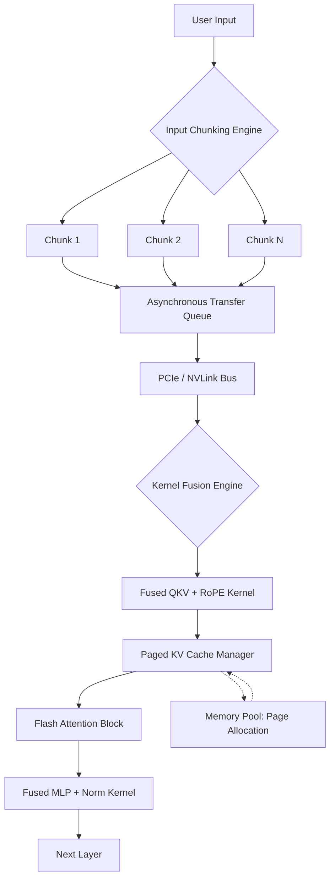
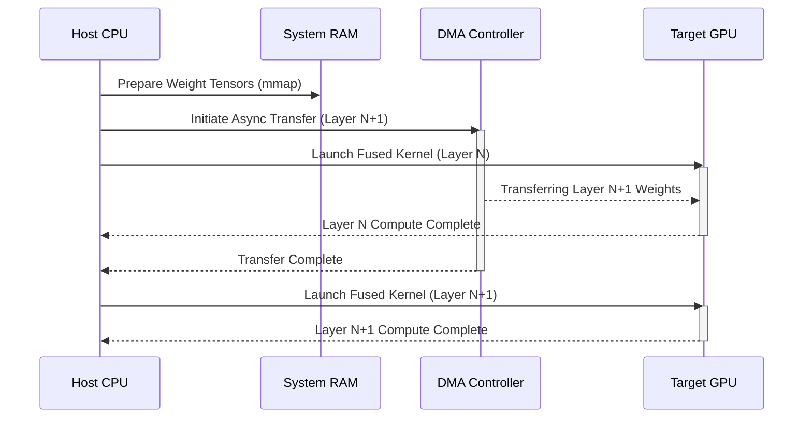

# Document 33: Extreme Performance Alchemy for Cortex LLM Architecture

## 1. Introduction to Extreme Performance Alchemy
The pursuit of extreme performance alchemy within the Cortex architecture represents a paradigm shift from traditional, cloud-reliant Large Language Model (LLM) execution to an uncompromising, local-first inference model. When orchestrating massive neural networks on consumer-grade hardware, the traditional boundaries of compute, memory bandwidth, and latency must be shattered and rebuilt through meticulous optimization. Performance alchemy is not merely about writing faster routines; it is about fundamentally restructuring the dataflow and execution lifecycle so that the hardware operates continuously at its theoretical limits. In the context of Cortex, this means extracting every available floating-point operation per second (FLOPS) and squeezing every byte of memory bandwidth from the host system. The alchemy involves a deep understanding of the underlying silicon, encompassing CPU cache hierarchies, GPU memory buses, and the interconnects that bridge them. By viewing the system as a holistic organism rather than a disparate collection of components, we can achieve symbiotic execution where idle cycles are virtually eliminated. This document outlines the rigorous, advanced strategies required to achieve such extreme performance, focusing on memory subsystem optimization, kernel-level tuning, asynchronous compute, and advanced context length handling. The goal is to transform the desktop environment into a high-performance computing cluster, capable of running multi-billion parameter models with sub-second latency and unprecedented throughput. This requires transcending standard library implementations and delving into bare-metal optimizations, custom memory allocators, and hardware-specific intrinsic instructions. The resulting architecture will not only run models faster but will do so with a grace and efficiency that redefines what is possible on local hardware.

## 2. Memory Subsystem Optimization and Bandwidth Saturation
The primary bottleneck in local LLM inference is rarely compute; it is almost universally memory bandwidth. The memory wall is the most formidable adversary in our pursuit of extreme performance. To overcome this, Cortex must employ aggressive memory subsystem optimizations designed to keep the processing units constantly fed with data. This begins with the utilization of memory-mapped files (mmap) for model weights. By mapping the weights directly into the virtual address space, we bypass the need to load the entire model into system RAM simultaneously. Instead, the operating system's page cache manages the loading of required tensor slices on demand. However, relying solely on default OS paging is insufficient for extreme performance. We must implement advanced prefetching strategies, anticipating which weight tensors will be required in upcoming layers and issuing asynchronous read requests to the storage medium before the compute units stall. Furthermore, understanding the Non-Uniform Memory Access (NUMA) topology of the host system is critical. On multi-socket systems or modern CPUs with complex chiplet designs, accessing memory attached to a different node incurs significant latency penalties. Cortex must employ strict NUMA pinning, ensuring that compute threads and the memory they access reside on the same physical node. At the lowest level, we must optimize for cache line alignment. Data structures and tensor layouts must be aligned to 64-byte boundaries (or the specific cache line size of the target architecture) to prevent false sharing and ensure that memory transactions are as efficient as possible. The transition from DDR4 to DDR5, and specifically the use of LPDDR5x in modern laptops, provides a massive bandwidth increase, but saturating this bandwidth requires highly parallelized, vectorized memory access patterns. We must utilize SIMD instructions (like AVX-512 or ARM NEON) not just for compute, but for loading and storing data, maximizing the throughput of every memory channel.

## 3. Kernel-Level Tuning and Asynchronous Compute
To achieve true extreme performance alchemy, we must descend to the kernel level, optimizing the very instructions that execute on the GPU or CPU. For GPU execution, whether via CUDA, ROCm, or Metal, minimizing kernel launch overhead is paramount. In standard execution, the CPU issues a command to the GPU, waits for it to complete, and then issues the next. This synchronous dance creates massive latency bubbles. Cortex must implement extensive kernel fusion, combining multiple operations (e.g., matrix multiplication, activation function, and layer normalization) into a single, monolithic kernel. This dramatically reduces the number of trips across the PCIe bus and keeps the data resident in the ultra-fast registers or shared memory of the GPU streaming multiprocessors. Furthermore, the entire execution pipeline must be asynchronous. The CPU should be responsible solely for orchestrating the graph, submitting work to queues, and immediately moving on to prepare the next batch of operations. We must leverage asynchronous compute streams, allowing memory transfers (Host-to-Device and Device-to-Host) to overlap seamlessly with kernel execution. While the GPU is calculating layer *N*, the CPU should be transferring the weights for layer *N+1* via Direct Memory Access (DMA), ensuring the GPU never waits for data. On the CPU side, we must aggressively utilize just-in-time (JIT) compilation and graph optimization techniques. By analyzing the computational graph ahead of time, we can eliminate redundant operations, pre-compute constants, and unroll loops dynamically based on the specific hardware architecture. This level of kernel tuning transforms the inference engine from a generic executor into a highly specialized, hardware-aware hyper-engine.

## 4. Context Length Handling and KV Cache Optimization
The management of context length and the Key-Value (KV) cache is a critical frontier in LLM performance. As the context window expands, the memory required to store the KV cache grows linearly, and the compute required for attention scales quadratically. Traditional implementations pre-allocate a static block of memory for the maximum possible context, which is profoundly wasteful. Cortex must implement dynamic, paged memory management for the KV cache, akin to the PagedAttention algorithm. By dividing the KV cache into fixed-size blocks (pages), we can allocate memory dynamically as the sequence grows, drastically reducing memory fragmentation and allowing for significantly larger effective context sizes. This paged approach also enables advanced features like beam search and complex decoding strategies to share KV cache pages across different generation branches, further maximizing memory efficiency. Furthermore, we must implement sliding window attention mechanisms for extremely long documents. Instead of calculating attention across the entire history, the model only attends to a local neighborhood of recent tokens and a select few "anchor" tokens, reducing the computational complexity from O(N^2) to O(N*W), where W is the window size. To support massive context lengths on hardware with limited memory, Cortex will utilize advanced Rotary Position Embedding (RoPE) scaling techniques. By interpolating the positional embeddings rather than extrapolating them, we can artificially extend the model's context window without requiring fine-tuning, while maintaining high performance. Finally, chunked prefill strategies must be employed. When processing a massive input prompt, processing the entire prompt in a single pass will invariably lead to Out-Of-Memory (OOM) errors. By chunking the prompt and processing it sequentially, accumulating the KV cache iteratively, we can ingest infinitely long prompts, bottlenecked only by the total available storage for the KV cache.

## 5. Architectural Flow Models

## 6. Advanced Tensor Parallelism within a Single Node
In scenarios where the user possesses multiple compute devices (e.g., dual GPUs, or a powerful CPU coupled with an iGPU and dGPU), Cortex must leverage advanced tensor parallelism to distribute the workload and conquer the memory wall. Unlike pipeline parallelism, which splits the model layer-by-layer, tensor parallelism splits the individual matrix operations across multiple devices simultaneously. This requires an intricate understanding of the interconnect bandwidth. If devices are connected via a high-speed bus like NVLink or Apple's Unified Memory Architecture, fine-grained tensor splitting is highly effective. However, if devices are connected via standard PCIe, the communication overhead of tensor parallelism can quickly outweigh the compute benefits. Cortex must dynamically profile the interconnect latency and bandwidth at startup and automatically select the optimal parallelism strategy. For heterogeneous environments (CPU + GPU), we must implement an asymmetric splitting mechanism, where the workload is divided proportionally to the compute capability and memory bandwidth of each device. The CPU might handle the less computationally intensive embedding lookups and final logits calculation, while the heavy lifting of the attention and MLP blocks is offloaded to the GPU. This requires sophisticated synchronization primitives and highly optimized ring-all-reduce algorithms implemented over the local system buses.

## 7. Conclusion
The implementation of extreme performance alchemy within Cortex is not a simple optimization pass; it is a fundamental architectural philosophy. By treating memory bandwidth as the ultimate constraint and ruthlessly optimizing every kernel, transfer, and allocation to saturate that bandwidth, we can achieve inference speeds that rival or exceed cloud-based solutions, all within the privacy and control of the local desktop environment. The integration of paged KV caches, asynchronous compute pipelines, and dynamic tensor parallelism creates a resilient, high-performance engine capable of handling the next generation of massive parameter models. This is the path to true computational sovereignty.
