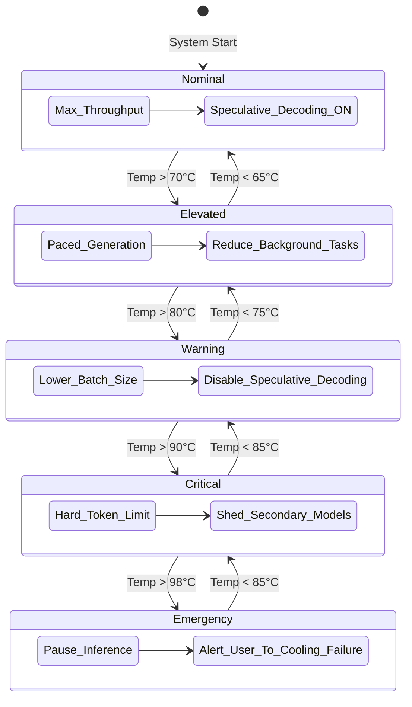

# Document 34: Battery and Thermal Management in Cortex

## 1. Introduction
The deployment of Large Language Models (LLMs) on portable, consumer-grade hardware introduces profound challenges that extend far beyond theoretical floating-point performance: the brutal realities of thermodynamics and electrochemical energy storage. Cortex must operate not merely as an isolated compute engine, but as an environmentally aware agent that dynamically negotiates its resource consumption based on the physical state of the host device. Continuous, unthrottled LLM inference will rapidly deplete modern laptop batteries and drive thermal output to the point of catastrophic thermal throttling or hardware degradation. This document details the advanced battery and thermal management protocols designed to grant Cortex an unprecedented level of environmental self-awareness. By implementing sophisticated thermal state machines, predictive temperature modeling, and aggressive workload shedding techniques, Cortex will maintain operational stability, extend battery life, and preserve hardware longevity, all while striving to minimize the perceptual impact on the user experience. We must move beyond simple "power saving modes" and embrace a dynamic, continuous spectrum of performance scaling that reacts in real-time to internal sensor telemetry.

## 2. Thermal Throttling Triggers and State Machines
The core of Cortex's thermal management system is a highly responsive, multi-tiered thermal state machine. Standard operating systems implement their own thermal throttling, but this is a blunt instrument, often resulting in abrupt, jarring drops in performance. Cortex must proactively manage its own thermal envelope before the OS hardware-level throttles engage. We achieve this by continuously polling CPU, GPU, and memory junction temperature sensors via low-level OS APIs (e.g., SMC on macOS, ACPI/lm-sensors on Linux, WMI on Windows). The state machine operates on multiple defined thresholds: *Nominal*, *Elevated*, *Warning*, *Critical*, and *Emergency*. When temperatures cross into the *Elevated* state, Cortex subtly increases the micro-sleep intervals between token generations, reducing the overall duty cycle of the compute units. In the *Warning* state, Cortex may dynamically reduce the batch size or switch to a more aggressively quantized KV cache to lower memory bandwidth demands, which are a major source of heat. In the *Critical* state, Cortex implements hard token generation rate limits, acting as a software-level governor to halt temperature rise. Finally, in the *Emergency* state, Cortex will gracefully pause generation, checkpoint the current state, and alert the user, preventing hardware damage or a forced system shutdown. This state machine requires careful tuning of hysteresis parameters to prevent rapid oscillation between states when temperatures hover near a threshold. The transition between states must be smoothed using exponential moving averages of temperature readings to filter out momentary sensor noise and provide a stable, predictable response curve.

## 3. Battery Drain Analysis and Workload Shedding
Battery capacity is a finite and rapidly depleting resource during heavy LLM inference. Cortex must analyze the discharge rate (measured in milliwatts) and correlate it directly with inference workloads. By establishing a baseline power profile for the host device, Cortex can accurately predict the remaining runtime under current load. When the battery drops below critical thresholds (e.g., 20%, 10%), Cortex must implement aggressive workload shedding. This is not merely slowing down; it is fundamentally altering the computational path. Workload shedding includes disabling background speculative decoding processes, halting any asynchronous model pre-fetching or background memory defragmentation, and turning off optional secondary models (like the translation or title generation models mentioned in the Cortex architecture). Furthermore, Cortex can dynamically shift the active chat model to a smaller, less power-hungry variant if the user permits, trading a slight reduction in reasoning capability for a massive extension in battery life. The system must also intercept operating system power events (such as unplugging the AC adapter) and immediately drop into a lower-power operational tier, rather than waiting for the battery percentage to fall. This proactive energy conservation ensures that the user can always complete their critical interactions, even when power is scarce.

## 4. Dynamic Clock Scaling and Under-volting Concepts
While direct control over hardware clock speeds and voltages is typically restricted by the operating system and hardware vendors, Cortex can emulate the effects of under-volting and clock scaling through software-level workload pacing. By precisely controlling the submission rate of kernels to the GPU or threads to the CPU, Cortex can force the hardware to remain in lower power states (lower P-states or C-states). Modern processors scale their voltage and frequency dynamically based on demand; by artificially capping the demand generated by the LLM inference engine, we implicitly force the hardware to run at a lower, more power-efficient voltage. Cortex will implement a dynamic "Token Budget" algorithm. Instead of generating tokens as fast as physically possible, Cortex aims for a target generation rate (e.g., 15 tokens per second, which is roughly reading speed). By pacing the compute to exactly match this target rate and sleeping for microscopic intervals between tokens, the hardware is allowed to briefly drop into low-power states, drastically reducing average power consumption and heat generation. This software-defined clock pacing is far more efficient than the "race to sleep" methodology when sustained generation is required, as it prevents the massive power spikes and thermal shocks associated with rapid waking and sleeping of the massive silicon dies used in modern processors.

## 5. Mermaid Diagram: Thermal State Machine

## 6. Predictive Temperature Modeling
Reacting to temperature limits after they have been breached is a reactive, suboptimal strategy. Cortex aims for proactive thermal management through Predictive Temperature Modeling. By utilizing lightweight, fast-executing machine learning models (such as an autoregressive moving average model or a small neural network), Cortex can predict the future thermal state of the system based on the current temperature trajectory, the ambient temperature (if available via sensors), the current fan speed, and the planned computational workload. If the predictive model determines that the system will hit the *Critical* thermal threshold within the next 30 seconds given the current generation speed, Cortex will begin preemptively throttling the workload *now*, smoothly tapering the performance curve rather than hitting a hard thermal wall. This predictive capability requires continuous online learning, as the thermal characteristics of the host machine will change over time due to dust accumulation, thermal paste degradation, or changes in the ambient environment. The predictive model must constantly compare its predictions against actual sensor readings and adjust its internal weights to maintain high accuracy, ensuring that Cortex is always one step ahead of thermal runaway.

## 7. User Experience Adjustments During Low Battery
The implementation of aggressive power saving and thermal throttling must be communicated transparently to the user, managing their expectations regarding performance. When Cortex enters a low-power or thermally throttled state, the UI must reflect this reality. Animations should be simplified to reduce UI rendering overhead, and a subtle, unobtrusive indicator should inform the user that Cortex is operating in an "Efficiency Mode" to preserve battery or manage heat. Furthermore, the generation cadence can be adjusted to feel more deliberate, perhaps outputting larger chunks of text slightly less frequently, which can be computationally more efficient than streaming token-by-token. If a massive prompt is submitted while the system is in a critical thermal state, Cortex should prompt the user, offering to either delay processing until temperatures normalize or proceed at a highly reduced speed. By integrating the physical realities of the hardware directly into the user interface, Cortex transforms from a silent, opaque black box into a collaborative tool that respects the physical limitations of the user's hardware.
