# Document 35: Model Quantization Strategies for Cortex

## 1. Introduction to Extreme Quantization
The operational viability of Large Language Models (LLMs) on consumer desktop hardware hinges almost entirely on the science of model quantization. As parameter counts soar into the tens of billions, storing weights in standard 16-bit float (FP16) or 32-bit float (FP32) formats rapidly exhausts available System RAM and VRAM. Quantization is the cryptographic-esque process of mapping these high-precision, continuous floating-point numbers into a smaller, discrete set of lower-precision integer representations (such as 8-bit, 4-bit, 3-bit, or even 2-bit integers). In Cortex, quantization is not merely a disk-space-saving measure; it is the fundamental enabler of extreme performance. By reducing the memory footprint of the weights, we proportionally reduce the memory bandwidth required to fetch those weights during inference. Since local inference is invariably memory-bandwidth bound rather than compute-bound, a 4-bit quantized model will often run nearly four times faster than its 16-bit counterpart, assuming the decompression overhead is minimal. This document explores the advanced quantization strategies Cortex must support and optimize, delving into K-quants, GPTQ, AWQ, and the nuanced mathematical techniques required to preserve reasoning capabilities while drastically reducing the bits-per-weight (bpw) metric. The goal is to achieve near-lossless compression of the model's knowledge graph.

## 2. Advanced Quantization Formats: GGUF, AWQ, and GPTQ
Cortex must natively support and dynamically switch between the leading quantization formats, understanding the trade-offs inherent in each. The GGUF (GPT-Generated Unified Format) ecosystem, popularized by llama.cpp, utilizes a CPU/GPU hybrid friendly approach with integer-based K-quants. K-quants use varying bit depths for different tensors based on their sensitivity to precision loss. For instance, a `Q4_K_M` model might use 4 bits for most feed-forward networks but 6 bits for the more sensitive attention projection layers. 

GPTQ (Generative Pre-trained Transformer Quantization) takes a different approach, focusing heavily on GPU acceleration. It performs layer-wise quantization using a second-order Hessian matrix approximation, iteratively adjusting the remaining unquantized weights to compensate for the error introduced by quantizing earlier weights. This requires a calibration dataset during the quantization process to understand the activation distributions.

AWQ (Activation-aware Weight Quantization) represents the cutting edge. It observes that not all weights are equally important; a very small fraction (often less than 1%) of salient weights heavily dictates the model's output based on activation patterns. AWQ selectively skips quantizing these highly salient weights (keeping them in FP16) while aggressively quantizing the remaining 99%. Cortex must leverage AWQ for models where the preservation of extreme zero-shot reasoning is paramount, as AWQ often demonstrates lower perplexity degradation at low bitrates compared to GPTQ or standard round-to-nearest (RTN) quantization.

## 3. The Mathematics of Decompression and Scaling Factors
The alchemy of quantization lies in the zero-point and scaling factor math. When compressing an FP16 tensor to INT4, we divide the range of the FP16 values by the available bins in INT4 (16 bins, from -8 to 7, or 0 to 15). The `scale` factor represents the FP16 distance between each integer bin, and the `zero_point` represents the integer value that corresponds exactly to 0.0 in floating-point. 

During inference, Cortex must rapidly decompress these weights back to FP16 (or perform integer matrix multiplication directly if the hardware supports INT4/INT8 Tensor Cores). The decompression formula is `FP16_Weight = (INT_Weight - zero_point) * scale`. To achieve extreme performance, this decompression must happen within the GPU registers or CPU L1 cache, perfectly fused with the matrix multiplication kernel itself. If weights are decompressed into VRAM before multiplication, the entire bandwidth advantage of quantization is instantly destroyed. Cortex must implement block-wise quantization, where scaling factors are calculated and stored for small blocks of weights (e.g., blocks of 32 or 64 parameters), rather than per-channel or per-tensor. Block-wise quantization mitigates the impact of extreme outlier values within a tensor, ensuring that a single massive outlier doesn't compress the rest of the weights into zero.

## 4. Layer-Wise Mixed Precision and Sparse Quantization
To push the boundaries of compression without sacrificing coherence, Cortex will implement Layer-Wise Mixed Precision. Extensive analysis of transformer architectures reveals that the initial embedding layers and the final output unembedding layers are hyper-sensitive to precision loss, while the deep middle layers of the feed-forward network are highly robust. Cortex will dynamically allocate bit budgets, utilizing FP16 or INT8 for the first and last layers, and aggressive INT3 or INT2 for the middle blocks. 

Furthermore, Cortex must explore Sparse Quantization. Many weights in a trained LLM naturally gravitate toward zero. By implementing a sparse matrix representation, we can completely ignore weights that fall below a certain threshold, skipping their computation entirely. When combined with quantization, sparse matrices can yield unprecedented throughput, effectively bypassing the memory bus and the compute ALUs simultaneously.

## 5. Mermaid Diagram: Quantization Dataflow and Decompression

```mermaid
graph TD
    A[VRAM / System RAM] --> B{Quantized Block Fetch}
    B --> C[Block 1: 32x INT4 Weights]
    B --> D[Block 1: FP16 Scale Factor]
    B --> E[Block 1: INT4 Zero Point]
    
    C --> F[Registers / Streaming Multiprocessor]
    D --> F
    E --> F
    
    F --> G{Fused Dequantize & GEMM Kernel}
    
    H[FP16 Activation Input] --> G
    
    G --> I[FP16 Activation Output]
    I --> J[Next Layer]
    
    style F fill:#4f2b1d,stroke:#ff6a00,stroke-width:2px
    style G fill:#4f2b1d,stroke:#ff6a00,stroke-width:2px
```

## 6. Calibration Datasets and SmoothQuant
For advanced quantization methods like GPTQ or AWQ, the choice of calibration dataset is critical. If the dataset used during the quantization process does not reflect the user's actual workload, the model's performance will degrade significantly. Cortex will introduce a novel feature: dynamic, user-specific calibration. Over time, Cortex will securely and privately collect snippets of user interactions (the permanent memory system). This local dataset will be used to run periodic, background SmoothQuant operations. 

SmoothQuant addresses the difficulty of quantizing activations, which often feature massive outliers. It mathematically migrates the difficulty of quantization from the activations to the weights, smoothing the activation distribution. By fine-tuning this smoothing process using the user's own domain-specific text, Cortex ensures that the quantization parameters are perfectly tailored to the user's exact use case, maximizing both speed and reasoning accuracy.

## 7. Conclusion
Quantization is the heavy lifting of local AI. By mastering GGUF, AWQ, and GPTQ, implementing mathematically rigorous fused decompression kernels, and pioneering user-specific calibration via SmoothQuant, Cortex can run models that theoretically demand 140GB of VRAM on standard 24GB or even 16GB systems. This is the essence of extreme resource efficiency: bending the mathematical representation of the neural network to fit the uncompromising physical constraints of consumer hardware.
