# Document 36: Dynamic Compute Distribution in Cortex

## 1. Introduction to Multi-Device Orchestration
The landscape of consumer hardware is inherently heterogeneous. A typical high-performance workstation or modern laptop is not a monolithic compute block, but a chaotic assembly of distinct processing units: a powerful multi-core CPU, an integrated GPU (iGPU) sharing system memory, and often a discrete, high-power GPU (dGPU) with its own dedicated VRAM. Traditional LLM execution paradigms lazily target a single device—usually the dGPU—leaving massive amounts of potential computational power sitting idle. Cortex rejects this monolithic approach. Dynamic Compute Distribution is the engineering discipline of shattering the model's computational graph and weaving it across every available piece of silicon in the system simultaneously. This is the alchemy of turning heterogeneous hardware fragmentation into a unified, high-throughput inferencing mesh. By dynamically splitting layers, balancing memory bandwidth against interconnect latency, and pipelining execution, Cortex will achieve performance metrics previously thought impossible on single-node consumer hardware.

## 2. Splitting the Execution Graph: Tensor vs. Pipeline Parallelism
To distribute work, we must choose how to slice the neural network. Pipeline Parallelism slices the model horizontally, placing layers 1-10 on the dGPU, layers 11-20 on the CPU, and layers 21-30 on the iGPU. This is memory-efficient but suffers from latency bubbles; the CPU must wait for the dGPU to finish before it can start. Tensor Parallelism slices the model vertically; every matrix multiplication is split, with half the matrix computed on the dGPU and half on the CPU simultaneously. 

For Cortex running on standard consumer buses (PCIe), Pipeline Parallelism is generally preferred because it minimizes the volume of data that must cross the slow interconnect. The activation tensors passed between layers are tiny compared to the weight tensors required for Tensor Parallelism. However, Cortex will implement a hybrid approach. The dense, memory-bound Feed-Forward Networks (FFNs) will be pipeline-split, while the highly compute-bound Attention heads may be tensor-split across the iGPU and dGPU if they share a fast Unified Memory Architecture (UMA), as seen in Apple Silicon or modern AMD APUs.

## 3. Bandwidth Bottlenecks and Asynchronous Layer Transfers
The fundamental barrier to multi-device distribution is the PCIe bus. Moving data between system RAM (CPU) and VRAM (dGPU) is orders of magnitude slower than accessing local memory. To mitigate this, Cortex must employ aggressive Asynchronous Layer Transfers and Pipelining. 

While the dGPU is crunching the final layers of Token N, the CPU must be simultaneously pre-calculating the initial layers for Token N+1, and the DMA controller must be silently streaming the activation results of Token N from the dGPU back to the CPU. This creates a continuous, overlapping flow of compute and data transfer. We must eliminate all synchronous `cudaDeviceSynchronize()` calls (or their equivalents in Metal/ROCm). The system operates as a bucket brigade, where no device ever stops to wait; they are constantly receiving data from the previous device and pushing data to the next.

## 4. Micro-Batching and Dynamic Load Balancing
When executing across devices with vastly different compute capabilities (e.g., a 4090 dGPU and a 16-core CPU), static pipeline splits fail. If we give them equal numbers of layers, the dGPU will finish instantly and sit idle, waiting for the CPU to catch up. 

Cortex utilizes Dynamic Load Balancing driven by continuous micro-benchmarking. During the initial prefill phase, Cortex sends dummy tokens through the network, meticulously timing how long each layer takes on each available device. It then solves an optimization problem to calculate the exact layer split ratio that ensures all devices finish their assigned workload at precisely the same microsecond. Furthermore, Cortex implements Micro-Batching for the prefill phase. Instead of sending a 4000-token prompt through the entire network at once, it breaks the prompt into micro-batches of 128 tokens. The dGPU processes the first micro-batch and passes it to the CPU; immediately, the dGPU starts the second micro-batch. This pipelining prevents massive latency spikes and keeps all heterogeneous units fully saturated during massive context ingestions.

## 5. Mermaid Diagram: Asynchronous Pipeline Splitting

```mermaid
graph TD
    subgraph Host Memory / CPU
        A[Input Tokens] --> B[CPU Layers 1-4]
        B --> C{DMA Transfer Out}
        G{DMA Transfer In} --> H[CPU Layers 29-32]
        H --> I[Logits / Output]
    end

    subgraph PCIe Bus / Interconnect
        C -.-> D[PCIe TX]
        F -.-> G[PCIe RX]
    end

    subgraph Discrete GPU / VRAM
        D --> E[GPU Layers 5-28]
        E --> F{DMA Transfer Out}
    end

    style B fill:#1e4d2b,stroke:#4caf50
    style H fill:#1e4d2b,stroke:#4caf50
    style E fill:#4f2b1d,stroke:#ff6a00
```

## 6. Utilizing Integrated Graphics (iGPUs) as Co-Processors
Integrated GPUs are historically ignored in deep learning workflows, dismissed as too weak. However, modern iGPUs possess significant memory bandwidth directly to system RAM and dedicated matrix math execution units. Cortex will actively recruit the iGPU as a dedicated co-processor. 

Rather than putting critical path layers on the iGPU, Cortex will offload parallelizable, non-blocking tasks. For instance, the iGPU can be tasked exclusively with managing and compressing the KV cache, performing speculative decoding verification, or running the smaller, secondary models (like the title generator or the embedding model for memory retrieval) entirely in the background. This frees the dGPU and CPU to focus 100% of their resources on the primary auto-regressive generation loop, effectively increasing overall system throughput without adding any latency to the critical path.

## 7. Conclusion
Dynamic Compute Distribution transforms the consumer PC from a single-engine vehicle into a multi-stage rocket. By meticulously profiling the host hardware, splitting the model pipeline intelligently to minimize PCIe bottlenecks, and recruiting every available silicon die—including the often-ignored iGPU—Cortex maximizes total system utilization. This extreme architectural complexity is hidden from the user, manifesting only as inexplicably fast inference speeds and the ability to run models that simply should not fit on their machine. It is the ultimate expression of software engineering triumphing over hardware fragmentation.
