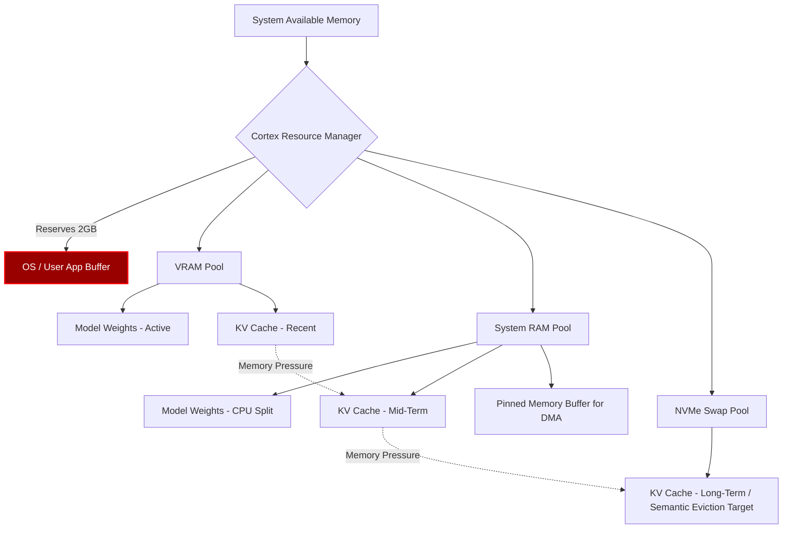

# Document 37: Resource Efficiency Protocols in Cortex

## 1. Introduction to Extreme Resource Restraint
In the context of local AI, assuming infinite resources is a fatal architectural error. A desktop application like Cortex operates in a hostile, shared environment where the OS, background services, and the user's primary applications constantly compete for CPU cycles, RAM, and disk I/O. True performance alchemy is not just about running fast; it is about knowing how to exist quietly and consume the absolute bare minimum required to maintain state. Resource Efficiency Protocols in Cortex represent a draconian set of rules governing memory allocation, context eviction, and background processing. Cortex must act as a perfect guest on the host OS, avoiding the catastrophic performance collapse that occurs when the system is forced into heavy swap-file usage (thrashing) or when Out-Of-Memory (OOM) killers are invoked by the kernel. By implementing semantic cache eviction, page-locked memory limits, and ultra-low-latency idle states, Cortex will feel lightweight and imperceptible when idle, yet instantly responsive when queried, operating perfectly within the tight constraints of consumer hardware.

## 2. Over-Allocation Prevention and Page-Locked Memory
The most common cause of system lockups during LLM inference is VRAM or RAM over-allocation. When a model requires more memory than is physically available, the OS attempts to page memory out to the storage drive (swap). Because LLM inference requires continuous, random access to the entire weight tensor set, falling into swap reduces performance by a factor of 1000x or more, effectively freezing the system. 

Cortex must implement strict, hard-coded limits on memory allocation. At startup, it aggressively queries the OS for *actually available* memory, not just total memory. It reserves a critical buffer (e.g., 2GB) specifically for the OS and other applications. Furthermore, for critical operations like DMA transfers between CPU and GPU, Cortex utilizes page-locked (pinned) memory. Pinned memory cannot be swapped out to disk, ensuring that DMA controllers can access it directly without CPU intervention. However, pinned memory is a scarce resource; over-allocating it will cripple the host OS. Cortex must use a highly optimized memory pool for pinned memory, carefully allocating, reusing, and freeing these buffers with surgical precision to ensure the OS never starves.

## 3. System RAM vs. VRAM Balancing and Swap Utilization
When a model is split between VRAM and System RAM, maintaining balance is paramount. Cortex dynamically monitors memory pressure on both subsystems. If VRAM is nearing its limit, Cortex will automatically offload the KV cache to System RAM. The KV cache is accessed sequentially and is less bandwidth-intensive than the weight tensors, making it an ideal candidate for offloading.

In extreme edge cases where the user demands a massive context window that exceeds even System RAM, Cortex must implement its own highly optimized, asynchronous swap mechanism to an NVMe SSD, bypassing the OS's generic swap file. Because Cortex knows exactly which parts of the KV cache represent older, less frequently attended-to tokens, it can proactively stream those specific memory pages to the NVMe drive in the background. When the attention mechanism needs those tokens, they are streamed back just-in-time. This application-aware swapping is vastly superior to the OS's blind LRU (Least Recently Used) swapping algorithm.

## 4. Context Cache Eviction Policies: LRU and Semantic Eviction
The KV cache grows linearly with every token generated or ingested. To prevent OOM errors during infinite conversations, Cortex must implement advanced eviction policies. A simple sliding window (forgetting the oldest tokens) destroys the model's ability to recall early instructions or context. 

Instead, Cortex utilizes a dual-tier eviction protocol. The first tier is a modified Least Recently Used (LRU) algorithm applied to the local attention window. The second, more advanced tier is Semantic Eviction. Cortex uses a lightweight background thread to analyze the attention weights generated during inference. Tokens that consistently receive very low attention scores across multiple layers—meaning the model deems them unimportant to the current reasoning path (e.g., filler words, redundant formatting)—are flagged for semantic eviction. Their KV representations are deleted from the cache, freeing up space while preserving the high-attention anchor tokens and critical facts. This allows the model to effectively compress its own memory, maintaining a vastly longer functional context window within a fixed memory footprint.

## 5. Mermaid Diagram: Memory Resource Allocation Graph

## 6. Idle State Management and Wake-Up Latency Reduction
When the user is not actively generating text, Cortex must vanish into the background. It must release all high-power GPU states, flush temporary compute buffers, and yield CPU priority. However, if the user returns and types a prompt, Cortex must awaken and begin generating instantly. 

This tension between zero-power idling and zero-latency wake-up is solved via intelligent State Checkpointing. When entering an idle state, Cortex does not unload the model weights (which would cause a massive delay to reload from disk). Instead, it keeps the weights in memory but signals the OS to mark those pages as low-priority, allowing the OS to page them out *only* if another application desperately needs the RAM. Furthermore, Cortex maintains a tiny "keep-alive" kernel resident on the GPU. This kernel does no mathematical work but prevents the GPU driver from completely spinning down the hardware into its deepest, highest-latency sleep state (e.g., D3cold). When a prompt arrives, the keep-alive kernel is immediately replaced by the inference graph, resulting in near-instantaneous first-token latency, bypassing the massive driver initialization overhead typically associated with waking a sleeping GPU.

## 7. Conclusion
Resource efficiency is the invisible architecture that prevents Cortex from collapsing under its own weight. By rigorously defending against over-allocation, implementing application-aware NVMe swapping, and pioneering semantic eviction policies for the KV cache, Cortex can maintain infinite conversational loops on finite hardware. The intelligent idle state management ensures that this immense power is completely hidden until the exact millisecond it is summoned. This discipline transforms a heavy, monolithic AI workload into an agile, cooperative, and highly resilient desktop companion.
