# Document 39: Thermal Throttling Predictive Models in Cortex

## 1. Introduction to Predictive Thermal Management
The fundamental flaw in modern operating system thermal management is its reactive nature. A CPU or GPU runs at maximum turbo frequency until a critical thermal junction point is breached, at which point the hardware aggressively downclocks to prevent physical damage. This creates a highly erratic performance profile: extreme speed followed by sudden, catastrophic stalling. For an LLM inference engine like Cortex, where consistent token generation speed is crucial for a fluid user experience, this reactive behavior is unacceptable. Document 39 introduces the concept of Predictive Thermal Management. By integrating lightweight, continuously learning machine learning models directly into the Cortex execution pipeline, we can forecast thermal runaway before it occurs. Cortex transforms from a passive victim of hardware constraints into an active, intelligent conductor, smoothly regulating its own computational throughput based on predictive telemetry. This ensures sustained, predictable performance over long conversations, maximizes hardware lifespan, and enables sophisticated acoustic management strategies.

## 2. ML Models for Thermal Runaway Prediction
At the core of this system is a dedicated, ultra-lightweight Recurrent Neural Network (RNN) or a fast Gradient Boosted Decision Tree (GBDT) model running concurrently with the main LLM. This predictive model operates on a high-frequency polling loop, digesting an array of telemetry vectors: current CPU/GPU junction temperatures, localized memory temperatures, active fan speeds, estimated power draw (Package Power Tracking/Total Board Power), and critically, the expected computational intensity of the next N tokens in the LLM pipeline. 

The predictive model outputs a temperature trajectory forecast for the next 10, 30, and 60 seconds. If the forecast indicates that the trajectory will intersect with the hardware's critical thermal threshold within the predictive window, Cortex initiates preemptive mitigation. Because this predictive model must consume virtually zero resources, it is heavily quantized (INT8) and designed to execute within microsecond latencies on the CPU, avoiding any contention with the primary LLM running on the GPU.

## 3. PID Controllers for Generation Speed Regulation
When the predictive model forecasts a thermal breach, Cortex does not simply apply a hard throttle. Instead, it utilizes a classic Proportional-Integral-Derivative (PID) controller adapted for software execution. The PID controller's "setpoint" is a safe target temperature (e.g., 5 degrees below the hardware throttle point). The "process variable" is the current temperature reading. The "control variable" is the micro-sleep duration injected between the processing of individual tokens or layers.

- **Proportional (P):** Reacts to the current error. If the temperature is rapidly approaching the setpoint, the sleep duration increases proportionally.
- **Integral (I):** Accounts for past errors. If the temperature has been hovering slightly above the setpoint for a long time, the integral term accumulates and forces a stronger throttle, preventing sustained overheating.
- **Derivative (D):** Predicts future error based on the rate of change. If the temperature is spiking violently (a steep derivative), the D term applies an immediate, aggressive brake to the generation speed, absorbing the thermal shock.

This PID approach ensures that Cortex smoothly asymptotes to the maximum sustainable token generation rate for the specific thermal environment of the host machine, eliminating the jarring start-stop stutter of reactive throttling.

## 4. Environmental Factors and Acoustic Management
True predictive modeling must account for the environment outside the silicon die. The effectiveness of a cooling system is entirely dependent on the ambient temperature and the intake airflow. Cortex's predictive model infers these external factors by analyzing the derivative of the cooling curve. If the fans are at 100% but the temperature is dropping slower than historical baselines, the model infers a high ambient temperature (or a dust-clogged heatsink) and adjusts its throttle setpoints downward accordingly.

Furthermore, Cortex introduces Acoustic Management as a primary user experience metric. Many users find the sudden, high-pitched whine of laptop fans spinning to maximum RPM highly disruptive. Cortex allows the user to set a "Maximum Acoustic Profile." By tying the PID controller not just to temperature, but to the OS-reported fan RPM, Cortex will throttle its generation speed specifically to prevent the fans from exceeding the user's noise tolerance, prioritizing a quiet workspace over absolute maximum generation speed.

## 5. Mermaid Diagram: Predictive Thermal Control Loop

```mermaid
graph TD
    A[Hardware Sensors:<br/>Temp, Power, RPM] --> B(High-Frequency Polling Agent)
    B --> C{Lightweight Predictive ML Model}
    
    D[LLM Pipeline:<br/>Current Batch Size,<br/>Context Length] --> C
    
    C -->|Forecast: Temp @ t+30s| E{PID Controller}
    
    F[User Settings:<br/>Max Temp Target,<br/>Acoustic Limit] --> E
    
    E -->|Calculate Throttle Error| G[Execution Pacing Engine]
    
    G -->|Adjust Micro-Sleep Delay| H(LLM Inference Kernel)
    
    H -->|Generates Heat| A
    
    style C fill:#4f2b1d,stroke:#ff6a00
    style E fill:#1e4d2b,stroke:#4caf50
    style G fill:#1e4d2b,stroke:#4caf50
```

## 6. Hysteresis in Fan Curves and Token Rates
A major flaw in naive throttling systems is oscillation. If the threshold is 80°C, the system throttles at 81°C, cools to 79°C, unthrottles, spikes back to 81°C, and repeats. This creates a highly annoying auditory experience as fans constantly spin up and down, and it creates a highly inconsistent token generation rate.

Cortex solves this via aggressive Hysteresis implemented within the control loop. If Cortex engages a thermal throttle, it will not release that throttle until the temperature has fallen significantly below the trigger point (e.g., dropping to 70°C). Furthermore, the release of the throttle is staged over several seconds, slowly ramping the token generation rate back up to maximum. This hysteresis logic ensures a smooth, stable acoustic and performance profile, masking the turbulent thermal reality of the hardware from the user.

## 7. Conclusion
Predictive Thermal Management elevates Cortex from a brute-force application to a sophisticated, hardware-aware agent. By integrating machine learning to forecast thermal trajectories and utilizing industrial-grade PID control logic to regulate computational throughput, Cortex masters the thermodynamic constraints of consumer hardware. This alchemy of software-defined thermodynamics ensures hardware longevity, minimizes acoustic disruption, and provides the user with the most stable, predictable LLM experience possible on local silicon.
