# Document 40: Hardware Acceleration Synergy in Cortex

## 1. Introduction to Silicon Synergy
The modern consumer computing landscape is rapidly evolving away from general-purpose CPUs and generic GPUs toward highly specialized, domain-specific silicon. To achieve extreme performance alchemy, Cortex must not merely execute code on hardware; it must achieve a perfect structural resonance with the underlying silicon architecture. Document 40 details the absolute imperative of Hardware Acceleration Synergy. This involves writing algorithms that map perfectly to the physical layout of Neural Processing Units (NPUs), Tensor Processing Units (TPUs), and advanced GPU matrix cores (like NVIDIA Tensor Cores or AMD Matrix Core Technology). We must abandon generic matrix multiplication libraries and implement architecture-specific, bare-metal kernels that exploit the unique capabilities of Apple Silicon's AMX blocks, Qualcomm's Hexagon DSPs, and Intel's specific AVX/AMX instruction sets. This document outlines the strategies for writing hyper-optimized attention mechanisms, utilizing hardware-level data movement, and future-proofing the architecture for upcoming exotic silicon.

## 2. Flash Attention and Hardware-Specific Implementations
The Attention mechanism is the defining bottleneck of Transformer architectures. Standard attention implementation requires materializing a massive N x N matrix (where N is the context length) in memory, leading to catastrophic memory bandwidth exhaustion. Flash Attention revolutionized this by fusing the query, key, and value operations into a single kernel, computing the softmax in blocks to ensure the N x N matrix never leaves the ultra-fast SRAM of the GPU streaming multiprocessor.

However, a generic Flash Attention implementation is insufficient for extreme performance. Cortex must implement silicon-specific variants. On NVIDIA hardware, this means writing CUDA kernels that perfectly align memory access patterns with the L1 cache sizes of specific Ampere, Ada, or Blackwell architectures, and utilizing asynchronous memory copy (async-copy) instructions to load data from VRAM into shared memory precisely as the Tensor Cores finish calculating the previous block. On Apple Silicon, we must utilize Metal Performance Shaders (MPS) and directly target the AMX (Apple Matrix Coprocessor) instructions. AMX operates outside the standard GPU pipeline and requires radically different data layout strategies to achieve maximum throughput. By implementing distinct, hyper-optimized Flash Attention paths for every major hardware vendor, Cortex ensures absolute maximum utilization.

## 3. NPU, TPU, and Tensor Core Optimization
The future of local AI lies in NPUs (Neural Processing Units)—dedicated silicon blocks designed specifically for low-power, high-throughput matrix math, now becoming standard in Intel, AMD, and Qualcomm processors. NPUs present a unique challenge: they are often highly restricted in the types of operations they support and possess very complex memory hierarchies.

Cortex will implement an NPU-first delegation architecture. Operations that map cleanly to integer matrix multiplication (like the dense layers of the Feed-Forward Network in a heavily quantized model) are aggressively offloaded to the NPU. This requires compiling parts of the execution graph ahead-of-time using vendor-specific toolchains (like Intel OpenVINO, Qualcomm SNPE, or Windows DirectML). By pushing the heavy, repetitive math to the 5-watt NPU, Cortex frees the 100-watt GPU to handle the complex, memory-bound, and precision-sensitive operations like the Attention mechanism and RoPE scaling. This heterogeneous execution maximizes total system FLOPS while drastically reducing overall power consumption.

## 4. Direct Memory Access (DMA) and Zero-Copy Execution
Moving data between different types of memory (System RAM to VRAM, or CPU Cache to NPU SRAM) is the silent killer of performance. Cortex aims for Zero-Copy Execution wherever physically possible. On Unified Memory Architectures (UMA) like Apple Silicon or integrated APUs, the CPU, GPU, and NPU all share the same physical memory pool. However, if not explicitly programmed, drivers will often still copy data needlessly between different virtual address spaces.

Cortex must utilize low-level OS APIs to allocate unified, shared buffers. When the CPU processes the input text into embeddings, it writes them directly into a buffer that the GPU's attention kernel can read instantly, without any intervening copy operation. For discrete GPUs connected via PCIe, Cortex must utilize advanced DMA engines. The CPU prepares the data and simply gives the GPU's DMA controller a pointer; the DMA controller then independently fetches the data across the PCIe bus while the CPU moves on to other tasks. This meticulous orchestration of data movement ensures that the execution units are never starved waiting for data to traverse the motherboard.

## 5. Mermaid Diagram: Heterogeneous Silicon Dispatch

```mermaid
graph TD
    A[Computational Graph / Model Layers] --> B{Hardware Dispatch Oracle}
    
    B -->|INT8 / INT4 Dense FFN| C[NPU / Neural Engine<br/>High Efficiency, Integer Math]
    B -->|FP16 Attention / RoPE| D[Discrete GPU / Tensor Cores<br/>High Bandwidth, Complex Math]
    B -->|Logits / Sampling / OS Interfacing| E[Host CPU / AVX-512<br/>Sequential Logic]
    
    C -.->|Zero-Copy / DMA| F[(Unified Memory / System RAM)]
    D -.->|Zero-Copy / DMA| F
    E -.->|Zero-Copy / DMA| F
    
    style C fill:#900,stroke:#f00
    style D fill:#4f2b1d,stroke:#ff6a00
    style E fill:#1e4d2b,stroke:#4caf50
```

## 6. RoPE Scaling on Silicon and Int8 Tensor Cores
Rotary Position Embeddings (RoPE) are computationally expensive because they require applying complex sinusoidal rotations to every token vector. Cortex will optimize RoPE by fusing it directly into the initial Query/Key generation matrix multiplication. Furthermore, Cortex will leverage specialized transcendental function units (SFUs) present on modern GPUs to accelerate the sine and cosine calculations required for RoPE.

When utilizing hardware acceleration, we must lean heavily into INT8 and INT4 Tensor Cores. While FP16 Tensor Cores are fast, INT8 cores typically offer double the throughput, and INT4 cores quadruple it. Cortex's advanced quantization techniques (discussed in Document 35) must be perfectly aligned with the hardware layout of these integer cores. If the hardware expects INT4 data packed specifically into 32-bit registers (e.g., 8 weights per register), the quantization decompressor must output data in exactly that format. This level of microscopic alignment guarantees that the silicon operates at its theoretical maximum TOPS (Tera Operations Per Second).

## 7. Conclusion
Hardware Acceleration Synergy is the final, ultimate stage of performance alchemy. It is the realization that software and hardware are not separate domains, but a single, unified organism. By writing architecture-specific kernels, ruthlessly optimizing memory movement via DMA and Zero-Copy, and delegating specific operations to the ideal silicon blocks (NPU, GPU, CPU), Cortex extracts every ounce of capability from the host machine. This uncompromising approach ensures that as consumer hardware evolves—introducing new, exotic accelerators and increasingly complex interconnects—Cortex will remain the premier, most performant local AI orchestration engine in existence.
