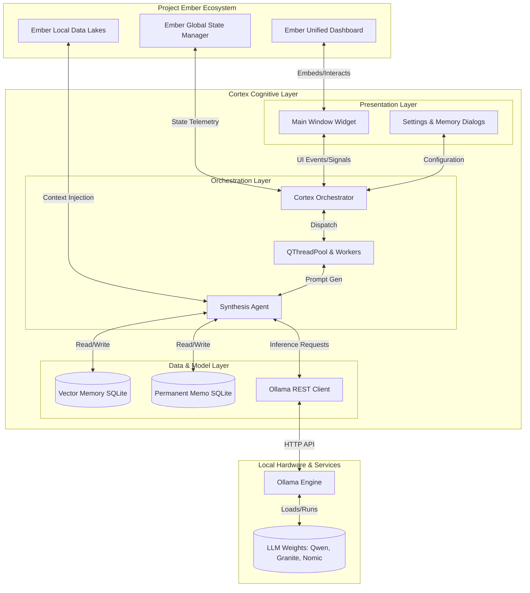

# Document 41: Cortex Integration Master Plan

## 1. Abstract and Executive Vision
The integration of Cortex into the broader Project Ember ecosystem represents a paradigm shift in local-first artificial intelligence orchestration. Cortex is not merely an application; it is a foundational cognitive layer designed to interface seamlessly with the human operator while maintaining absolute data sovereignty. This Master Plan delineates the strategic integration pathways, architectural synergies, and operational dynamics required to weave the standalone Cortex—a PySide6-based, Ollama-powered desktop assistant—into the mythic tapestry of Project Ember. 

The integration effort transcends mere software compatibility; it is an ideological alignment. Cortex brings its localized memory systems, threaded conversational management, and robust orchestration layer into an ecosystem that demands reliability, privacy, and profound analytical depth. By meticulously mapping the data flows, state management, and user experience paradigms, this Master Plan ensures that Cortex will function as the central nervous system of Project Ember, empowering the operator with unparalleled cognitive augmentation.

## 2. Strategic Imperatives
To successfully embed Cortex within Project Ember, several non-negotiable strategic imperatives must be adhered to throughout the lifecycle of the integration.

### 2.1 The Sovereignty Imperative
All data generated, processed, and stored by Cortex must remain strictly local. The integration must not introduce any dependencies on cloud-based telemetry, external API calls for core functionality, or centralized databases. Project Ember relies on the absolute privacy guarantee provided by Cortex's localized architecture (utilizing local Ollama instances and SQLite databases).

### 2.2 The Asynchronous Symbiosis
Cortex must maintain perfect UI fluidity regardless of the computational load exerted by the underlying Large Language Models (LLMs). The integration into Project Ember will likely introduce additional background tasks and complex state synchronizations. The multi-threaded orchestration layer of Cortex must be expanded and hardened to ensure that the PySide6 presentation layer never blocks, thereby maintaining an illusion of instantaneity even during prolonged inferential tasks.

### 2.3 The Contextual Continuity
Project Ember spans vast amounts of structured and unstructured data. Cortex's integration must elevate its existing memory paradigms (Vector Memory and Permanent Memo Memory) to interact with Ember's wider data stores. The integration must establish a continuous contextual thread, allowing Cortex to pull relevant historical data autonomously and synthesize it into coherent, actionable insights for the operator.

### 2.4 The Modular Extensibility
The integration must not turn Cortex into a monolithic, unmaintainable entity. Cortex must be integrated as a highly modular subsystem within Project Ember. Its synthesis agent, memory managers, and UI components must be decoupled through well-defined internal interfaces, allowing Ember's other subsystems to query Cortex's orchestrator without needing to interact with the PySide6 frontend directly.

## 3. Integration Phases
The embedding of Cortex into Project Ember will be executed across four distinct, highly controlled phases, each designed to mitigate risk and ensure architectural integrity.

### Phase 1: Foundational Harmonization
The initial phase focuses on aligning the build systems, dependency management, and local environment configurations. Cortex's existing `requirements.txt` and startup utilities (`Cortex_Startup.py`) will be integrated into Ember's broader deployment scripts. This phase ensures that the Ollama service, model pulling protocols (e.g., `qwen3:8b`, `nomic-embed-text`), and local Python environments are unified. 
- **Objective:** Establish a unified execution environment where Cortex can be launched as a discrete module within the Ember workspace.
- **Key Deliverable:** A unified startup protocol that validates Ollama host availability (`http://127.0.0.1:11434`), checks required model manifests, and initializes the PySide6 environment securely.

### Phase 2: State and Telemetry Bridging
Once the execution environment is unified, the second phase bridges the state management systems. Cortex's internal `QSettings` and SQLite-based memory state will be hooked into Project Ember's centralized state management. This allows Ember to monitor Cortex's operational health, model loading status, and resource consumption.
- **Objective:** Implement a bidirectional telemetry bridge that allows Ember to read Cortex's state without violating the encapsulation of the Orchestration Layer.
- **Key Deliverable:** The Operator Dashboard integration, enabling real-time visualization of Cortex's thread pool, memory usage, and Ollama inference metrics.

### Phase 3: Cognitive Integration (Memory & Synthesis)
This is the most complex phase. Cortex's memory systems (Vector and Memo) will be integrated with Ember's broader data lakes. The synthesis agent will be upgraded to recognize Ember-specific data structures, allowing Cortex to generate responses that are not just contextually aware of the current chat, but holistically aware of the entire Ember project state.
- **Objective:** Fuse the cognitive boundaries between Cortex and Ember, creating a unified intelligence that draws upon all available local data.
- **Key Deliverable:** An advanced synthesis pipeline that injects Ember context into the Ollama generation prompt alongside standard chat history and vector embeddings.

### Phase 4: UI/UX Convergence
The final phase involves styling and interface convergence. Cortex's PySide6 interface will be styled to match the mythic, visionary aesthetic of Project Ember. The standalone Cortex window will be transformed into an embeddable widget or a cohesive fullscreen dashboard mode, tailored to the Operator's workflow.
- **Objective:** Achieve aesthetic and functional unity, ensuring the user experiences Cortex and Ember as a single, indivisible entity.
- **Key Deliverable:** A comprehensive PySide6 stylesheet and layout refactor that aligns with the Ember UX Masterplan.

## 4. Architectural Synergy

To comprehend the integration, one must visualize the architectural synergy between Cortex and Project Ember. The following diagram illustrates the converged topology.

## 5. Operational Dynamics and Workflow
The operational dynamics of the integrated system revolve around non-blocking event loops and rigorous state isolation. When the Operator submits a query via the integrated interface, the following sequence unfolds:

1. **Input Ingestion:** The PySide6 presentation layer captures the input and immediately emits a signal to the `Orchestrator`. The UI remains fully responsive, entering a 'generating' state visually.
2. **Context Assembly:** The `Orchestrator` dispatches a worker thread. This worker communicates with the `Synthesis Agent`, which simultaneously queries the Cortex Vector Memory, the Permanent Memo Memory, and the newly integrated Ember Data Lakes.
3. **Prompt Synthesis:** The `Synthesis Agent` merges the user input with the retrieved historical context, the system prompt, and any active Ember project state, forming a highly dense, optimized prompt payload.
4. **Model Inference:** The payload is sent via the `OllamaClient` to the local Ollama Engine. If translation or title generation is required, secondary worker threads are spun up to handle these requests in parallel, utilizing specialized models (`granite4:tiny-h`, `translategemma:4b`).
5. **Streaming Response:** As the Ollama Engine generates tokens, they are streamed back through the `OllamaClient`, routed through the `Orchestrator`, and emitted as signals back to the Presentation layer, updating the UI in real-time.
6. **Memory Consolidation:** Upon completion of the generation, a background thread asynchronously calculates the embeddings for the new exchange (using `nomic-embed-text`) and stores them in the SQLite databases, ensuring they are available for the very next query without delaying the current user interaction.

## 6. Resource Allocation and Hardware Footprint
The integration must be profoundly respectful of the Operator's local hardware resources. Cortex, by design, relies on local LLM execution, which is intrinsically resource-intensive. Project Ember will implement a dynamic resource allocation protocol:
- **VRAM Monitoring:** Ember will continuously monitor GPU VRAM usage. Cortex will be configured to dynamically unload models if VRAM thresholds are breached by other Ember processes.
- **Model Quantization:** All primary models utilized by Cortex will leverage highly optimized quantization (e.g., 4-bit or 8-bit depending on hardware capabilities) to maximize throughput and minimize memory footprint.
- **Thread Throttling:** The Cortex `QThreadPool` will be dynamically throttled based on overall system load. Background tasks like embedding generation or translation may be deferred if the system is under heavy utilization.

## 7. Risk Mitigation and Contingency Protocols
Integrating a complex, multi-threaded AI orchestration system presents inherent risks. The Master Plan addresses these through strict contingency protocols:
- **Ollama Unavailability:** If the local Ollama service crashes or becomes unresponsive, Cortex will enter a "graceful degradation" mode. The UI will clearly communicate the failure, and the Orchestrator will attempt automated background restarts without locking the PySide6 event loop.
- **Database Corruption:** SQLite databases for memory will utilize Write-Ahead Logging (WAL) and periodic automated backups triggered by Ember's overarching state manager to prevent catastrophic memory loss.
- **Memory Leakage:** The integration will enforce strict garbage collection protocols within the PySide6 layer. Circular references between the Orchestrator, Worker threads, and UI components will be systematically audited to prevent RAM exhaustion over long, persistent sessions.

## 8. Conclusion
The Cortex Integration Master Plan serves as the immutable blueprint for forging a unified, local-first intelligence architecture. By adhering to the strategic imperatives, executing the phased integration meticulously, and understanding the profound architectural synergies, Project Ember will elevate Cortex from a standalone desktop assistant into an omnipresent, cognitive companion. The Operator will be granted unprecedented analytical power, entirely unbounded by the latency, privacy concerns, and limitations of cloud-centric paradigms. The integration is not merely an engineering task; it is the manifestation of the Ember philosophy.
