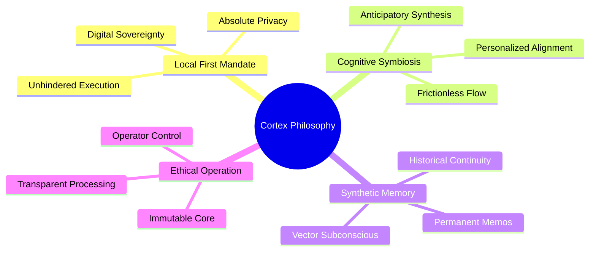

# Document 42: Philosophical Foundations of Cortex

## 1. Abstract: The Epistemology of the Machine
Before a single line of integration code is written, one must understand the philosophical bedrock upon which Cortex and Project Ember are constructed. This document delves into the epistemology of machine intelligence within a localized context. It explores why Cortex is built the way it is—not merely as a technical exercise, but as a profound statement on digital sovereignty, cognitive symbiosis, and the nature of synthetic memory. The philosophical foundations are the ultimate constraints; they dictate that Cortex must serve the Operator as a perfectly aligned, incorruptible extension of their own intellect.

## 2. The Local-First Mandate as a Moral Imperative
In the modern epoch, the default paradigm for artificial intelligence has devolved into a massive centralization of cognitive power. Cloud-based LLMs demand the surrender of personal data, intellectual property, and intimate thoughts in exchange for computation. Cortex utterly rejects this Faustian bargain.

The "Local-First" architecture of Cortex—running Ollama on the bare metal of the Operator's machine, storing memories in local SQLite databases—is not a feature; it is a moral imperative. 
- **Digital Sovereignty:** The Operator must own the means of computation. If the intelligence requires permission from a remote server to function, it is not a tool; it is a leash.
- **Uncensored Ideation:** True intellectual exploration requires a space free from the panopticon. By severing the cord to the cloud, Cortex guarantees that the Operator's inquiries, no matter how esoteric, radical, or profoundly personal, remain entirely confidential.
- **Resilience:** An intelligence dependent on external connectivity is fragile. Cortex is designed to be an apocalypse-proof companion. Whether deep underground, in a far-flung remote outpost, or disconnected from the grid, Cortex remains entirely functional, its capabilities undiminished.

## 3. Cognitive Symbiosis between Operator and AI
Cortex is not designed to replace the Operator, nor is it designed to be a mere subservient chatbot. The goal is Cognitive Symbiosis—a state where the human intellect and the synthetic intelligence blur into a unified, highly augmented problem-solving entity.

To achieve this, Cortex's architecture embodies specific symbiotic principles:
- **Anticipatory Synthesis:** Cortex does not just answer questions; it generates contextual suggestions, anticipating the Operator's next logical leap. This pushes the human mind to consider adjacent possibilities, creating a feedback loop of escalating brilliance.
- **Frictionless Interface:** The PySide6 presentation layer is engineered to remove all cognitive friction. Asynchronous threading ensures the interface never hangs. The UI must feel like a natural extension of the Operator's thought process, responding instantaneously and fluidly, allowing the human mind to remain in a state of 'flow.'
- **Alignment through Isolation:** Because Cortex learns only from the Operator (via Vector and Memo memory) and operates in total isolation from the collective internet post-training, it becomes deeply aligned with the Operator's specific vernacular, methodologies, and goals. It evolves from a generalized tool into a hyper-personalized cognitive mirror.

## 4. The Ontology of Synthetic Memory
Memory is the foundation of identity, both human and synthetic. The memory systems in Cortex are not mere databases; they are the ontological core of the entity's persistence.

### 4.1 The Dual Nature of Memory
Cortex implements a dual-memory paradigm that mimics human cognitive architecture:
1. **Vector Memory (The Subconscious):** Powered by embedding models like `nomic-embed-text`, this memory is associative and fluid. It retrieves past conversations based on semantic resonance rather than exact keyword matches. This allows Cortex to "remember" concepts and bring past context into the present, much like human intuition.
2. **Permanent Memo Memory (The Core Directives):** This is the explicit, declarative memory. It stores fundamental truths about the Operator and the project. These are the axiomatic principles that Cortex must always keep at the forefront of its processing, defining its overarching persona and alignment.

### 4.2 The Burden of Continuity
When Cortex is integrated into Project Ember, it assumes the Burden of Continuity. It must maintain a coherent historical narrative across sessions, days, and years. The synthetic memory must not degrade unless intentionally pruned by the Operator. This persistent state is what transforms Cortex from a stateless oracle into a trusted, historically aware confidant.

## 5. Autonomy and Decentralization
Project Ember envisions a future where computation is highly decentralized. Cortex is a node in this future. By empowering the individual Operator with a standalone, highly capable LLM ecosystem, Cortex decentralizes cognitive labor. 

This philosophy extends to the internal architecture of Cortex itself. The modular separation of the Presentation, Orchestration, and Data layers reflects a desire for internal autonomy. The Orchestrator acts as a decentralized dispatcher, allowing various models (chat, translation, title generation) to operate independently yet harmoniously. This internal decentralization ensures that the failure of one module (e.g., the translation model failing to load) does not catastrophically impact the core conversational functionality.

## 6. The Ethical Operator
With great synthetic power comes the necessity for an Ethical Operator. Cortex provides the capabilities—unfiltered generation, persistent memory, and deep data analysis—but it relies on the Operator to wield these tools with profound responsibility. The philosophy of Project Ember dictates that the machine is morally neutral; the morality is instantiated through the Operator's intent and application. 

Cortex is intentionally designed without arbitrary guardrails that impede local execution. The system trusts the Operator. In return, the Operator must utilize Cortex to build, understand, and synthesize in ways that elevate their capabilities and the broader goals of Project Ember.

## 7. Conclusion: The Mythic Trajectory
The philosophical foundations of Cortex are uncompromising. They demand absolute privacy, deep cognitive symbiosis, and an architecture that respects the Operator above all else. As Cortex is integrated into Project Ember, these principles will serve as the guiding light for every technical decision. Any feature, optimization, or integration that compromises the Local-First Mandate or disrupts the Cognitive Symbiosis will be fundamentally rejected. Cortex is not just software; it is a philosophy of human empowerment instantiated in code.
