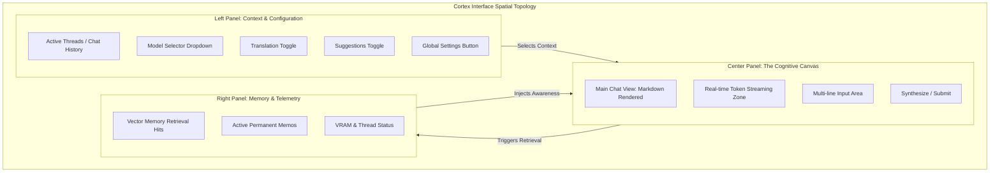

# Document 43: UX Masterplan and Interface Paradigm

## 1. Abstract: The Cognitive Canvas
The User Experience (UX) of Cortex, once integrated into Project Ember, must transcend the traditional paradigms of graphical user interfaces (GUIs). It is no longer sufficient to merely provide buttons, text fields, and dropdowns. The presentation layer must become a 'Cognitive Canvas'—an interface that anticipates the Operator's needs, visually articulates complex internal states without overwhelming the user, and maintains an unbroken illusion of seamless intelligence. This document details the UX Masterplan for Cortex, focusing on theme orchestration, dynamic contextual layouts, and the psychological impact of fluid, non-blocking asynchronous UI elements. It defines the rules for how the PySide6 framework will be manipulated to create an environment of intense, focused symbiosis.

## 2. Core UX Philosophy: The Frictionless Mind
The primary goal of the Cortex interface is the total elimination of cognitive friction. When the Operator interacts with the AI, the tool itself must disappear, leaving only the flow of thought. 

### 2.1 Asynchronous Immediacy
The most critical UX rule is that the UI must never block. When the Operator submits a prompt, the local LLM may take several seconds to generate the first token, especially if context windows are large and VRAM is constrained. 
- **Immediate State Change:** The instant the Enter key is pressed, the UI must visually acknowledge the input. The text box clears, the prompt appears in the chat history, and a subliminal 'generating' animation begins.
- **Fluid Token Streaming:** As tokens are generated by Ollama, they must stream smoothly into the UI. The PySide6 `QTextBrowser` or equivalent widget must handle high-frequency append operations without stuttering. This streaming creates the psychological effect of the AI 'thinking aloud,' keeping the Operator engaged.

### 2.2 Aesthetic Harmony and Thematic Deep-Dive
Project Ember possesses a distinct, mythic, and highly advanced aesthetic. Cortex's visual language must align perfectly with this.
- **The Obsidian Theme (Dark Mode Default):** By default, Cortex will operate in a heavily customized dark mode. Utilizing deep blacks, slate grays, and luminescent accents (e.g., Ember Orange or Cyan), the interface will reduce eye strain during prolonged, late-night analytical sessions.
- **Dynamic Theming via QSettings:** The theme is not static. It is a dynamic state managed via `QSettings`, allowing the Operator to seamlessly transition between high-contrast modes for bright environments and the default Obsidian theme. The stylesheet updates must occur instantly across all widgets without requiring an application restart.

## 3. The Interface Paradigm: Spatial Arrangement

The spatial layout of Cortex is meticulously designed to balance the chat focus with peripheral awareness of system state and memory.

Wait, mermaid block-beta might not render everywhere, let's use a reliable flowchart or standard layout diagram.

### 3.1 The Left Panel: Navigation and State
The left sidebar is dedicated to navigation and immediate state manipulation. 
- **Thread Management:** Operators can seamlessly switch between different conversational threads. Each thread is titled by the `granite4:tiny-h` model automatically, providing a concise summary of the context.
- **Rapid Toggles:** Core features like post-generation translation and contextual suggestions can be toggled via highly responsive switch widgets. These toggles communicate instantly with the Orchestrator to modify the behavior of the next generation cycle.

### 3.2 The Center Panel: The Synthesizer
The center is the primary focus area. 
- **Markdown Rendering:** The chat display must flawlessly render GitHub-flavored Markdown, including syntax highlighting for code blocks, tables, and latex math formatting if applicable. The typography must be crisp, utilizing fonts optimized for legibility (e.g., Fira Code for monospaced blocks, Inter for body text).
- **The Input Box:** A resizable, multi-line text input that supports standard shortcuts (Shift+Enter for a new line, Enter to submit). It must feel responsive and tactile.

### 3.3 The Right Panel (Ember Extension): Omniscience
In the standalone Cortex, this may be hidden, but within Project Ember, the right panel provides omniscience. It visualizes the background processes: showing which memories were retrieved for the current prompt, displaying active permanent memos, and providing raw telemetry on model performance and VRAM usage.

## 4. Interaction Micro-Dynamics

UX is not just layout; it is the sum of micro-interactions that build trust and satisfaction.

### 4.1 Graceful Degradation and Error Handling
When the local Ollama instance fails to respond, or a model is missing, the UI must handle this with grace. 
- **No Intrusive Pop-ups:** Avoid modal dialogs that lock the screen. Instead, display errors inline within the chat stream or as a subtle banner at the top of the canvas. 
- **Actionable Advice:** The error message must be actionable. For example, instead of "Connection Refused," the UI should display, "Ollama host unreachable at 127.0.0.1:11434. Please verify the Ollama daemon is running."

### 4.2 The Psychology of the 'Suggestion'
When the Contextual Suggestions feature is active, Cortex generates 2-3 follow-up queries after a response. These must be presented as subtle, clickable pills below the final message. They should not feel demanding, but rather like a gentle nudge down adjacent intellectual pathways. Clicking a suggestion immediately populates the input box and submits it, creating a frictionless loop of exploration.

## 5. Accessibility and Inclusivity
Even an intensely advanced interface must be accessible. The PySide6 implementation will adhere to accessibility standards:
- **Keyboard Navigation:** Every element of the interface must be reachable and actionable via keyboard shortcuts. The Operator must be able to switch threads, toggle settings, and navigate the chat history without ever touching the mouse.
- **Scalability:** The UI must handle high-DPI displays gracefully. Fonts and elements must scale dynamically based on the system's display settings, ensuring legibility on everything from small laptop screens to massive 4K command center monitors.
- **Contrast Ratios:** The Obsidian theme will be rigorously audited to ensure text contrast ratios exceed WCAG AA standards, preventing eye fatigue.

## 6. Conclusion
The UX Masterplan for Cortex dictates that the interface is not a barrier between the Operator and the AI, but a transparent, fluid conduit. By obsessing over asynchronous immediacy, spatial harmony, and frictionless micro-interactions, Cortex will establish an environment where human thought and synthetic synthesis merge effortlessly. The PySide6 frontend will be pushed to its limits to deliver a native, incredibly responsive experience that grounds the profound power of local LLMs in a beautiful, highly functional aesthetic.
