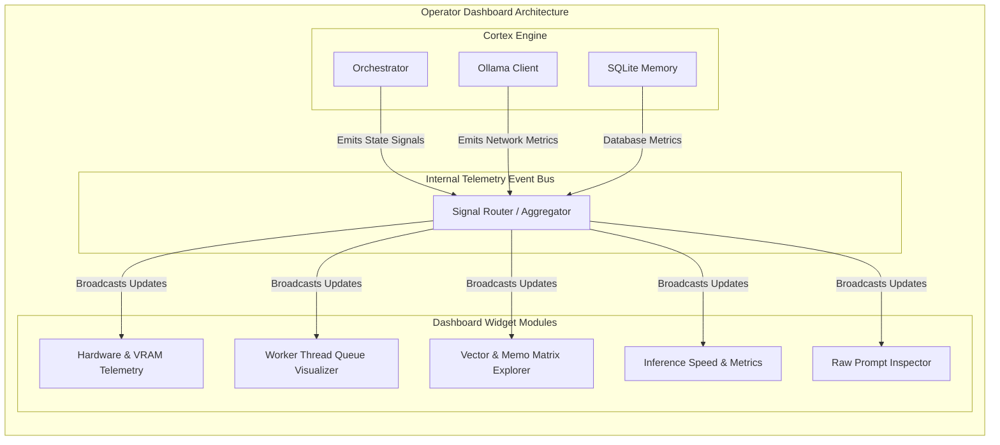

# Document 44: Operator Dashboard Architecture

## 1. Abstract: The Omniscient Command Plane
While Cortex possesses a streamlined chat interface for primary interactions, the true power of its integration into Project Ember is fully realized through the Operator Dashboard. The Dashboard is the omniscient command plane—a highly modular, data-dense interface designed to give the Operator absolute visibility into and control over the AI's internal state. This document details the architecture of this dashboard, outlining its telemetry modules, real-time model state visualizations, memory exploration matrices, and the sophisticated PySide6 widget integration required to sustain this level of transparency without crippling system performance.

## 2. The Necessity of the Dashboard
A standalone LLM chat interface is a black box. The user inputs text, and text is returned. In advanced, localized cognitive augmentation frameworks like Project Ember, the black box is unacceptable. The Operator must understand *why* the AI responded as it did. What memories were retrieved? How long did the inference take? Is the GPU thermal throttling? The Operator Dashboard dismantles the black box, turning internal latent processes into actionable, visible data.

### 2.1 The Philosophy of Absolute Transparency
Every action Cortex takes must be auditable in real-time. If the synthesis agent decides to inject a permanent memo into the prompt, the Dashboard must highlight this injection. If the thread pool is saturated because a massive translation job is running in the background, the Dashboard must visualize this queue. Transparency breeds trust, and trust is the foundation of cognitive symbiosis.

## 3. Dashboard Architectural Topology

The Dashboard is constructed as an independent PySide6 window or a dockable tab within the primary Ember interface. It is architected around a loosely coupled, event-driven telemetry bus that subscribes to signals emitted by the `Orchestrator` and `Memory Managers`.

## 4. Detailed Module Specifications

The Dashboard is comprised of several specialized modules, each a distinct PySide6 widget designed for high-performance data rendering.

### 4.1 Hardware and VRAM Telemetry Module
Running local LLMs is a brutally hardware-intensive process. This module provides real-time polling of system resources.
- **Metrics Tracked:** Total system RAM utilization, GPU VRAM utilization (if detectable via external libraries or Ollama API endpoints), CPU load across all cores, and thermal data.
- **Visuals:** High-refresh-rate line graphs (`pyqtgraph` or similar optimized charting libraries). Color-coded alerts when memory hits critical thresholds (e.g., flashing red when VRAM is > 95% full), allowing the Operator to pause other tasks.

### 4.2 Worker Thread Queue Visualizer
Cortex relies heavily on `QThreadPool` to manage concurrent tasks (chat generation, translation, title generation, embedding calculation).
- **The Problem:** Background tasks can pile up if the LLM is slow.
- **The Solution:** A visual queue displaying all active and pending threads. Each thread is represented as a block, color-coded by task type. The Operator can see immediately if the system is bogged down generating embeddings for a massive document and can choose to flush the queue or kill specific non-critical threads.

### 4.3 Memory Matrix Explorer
The most cognitively profound module on the Dashboard. It allows the Operator to explore the AI's "subconscious."
- **Vector Space Visualization:** A 2D or 3D scatter plot representation (e.g., using t-SNE or PCA dimensionality reduction, processed asynchronously) of the Vector Memory space. The Operator can visually see clusters of related thoughts.
- **Retrieval Trace:** When a prompt is submitted, the Dashboard draws a line from the input coordinate to the nearest neighbors in the vector space, visually demonstrating exactly which historical memories were retrieved to form the context.
- **Memo Management:** A comprehensive list of all active Permanent Memos, with the ability to edit, toggle, or delete them instantly, directly influencing the next prompt payload.

### 4.4 Raw Prompt Inspector
The ultimate debug tool. What exactly was sent to the Ollama API?
- **Feature:** A read-only, syntax-highlighted text area that displays the final, assembled prompt payload. This includes the base system prompt, the injected Permanent Memos, the retrieved Vector Memory context, the chat history, and the user's latest query.
- **Value:** This allows the Operator to fine-tune their prompt engineering by seeing precisely how Cortex synthesizes context.

### 4.5 Inference Statistics
A rolling ticker of performance metrics for the currently loaded model.
- **Metrics Tracked:** Time to First Token (TTFT), Tokens Per Second (TPS), Total Generation Time, and Context Window Saturation (e.g., 4096 / 8192 tokens used).
- **Optimization Loop:** By watching the TPS metric, the Operator can judge whether they need to switch to a smaller, more heavily quantized model for a specific task.

## 5. Performance and Rendering Considerations
A dashboard that visualizes a high-performance system must itself be highly performant. If the Dashboard causes the UI thread to lag, it defeats its own purpose.
- **Signal Debouncing:** The Telemetry Bus will implement debouncing and throttling. For example, VRAM updates might only be broadcast every 500ms, while Token updates are broadcast every 50ms.
- **Off-Screen Rendering:** Complex charts (like the Memory Matrix) will be rendered in background threads and passed to the main GUI thread as pixel maps or lightweight drawing commands to prevent blocking the PySide6 event loop.

## 6. Conclusion
The Operator Dashboard Architecture is the definitive bridge between the machine's latent space and the human's conscious awareness. By exposing the telemetry, memory retrieval mechanics, and thread queues in a highly stylized, performant PySide6 interface, Cortex evolves from a blind assistant into a fully transparent cognitive partner. The Dashboard is not just a tool for debugging; it is an instrument for mastering the local-first AI ecosystem.
