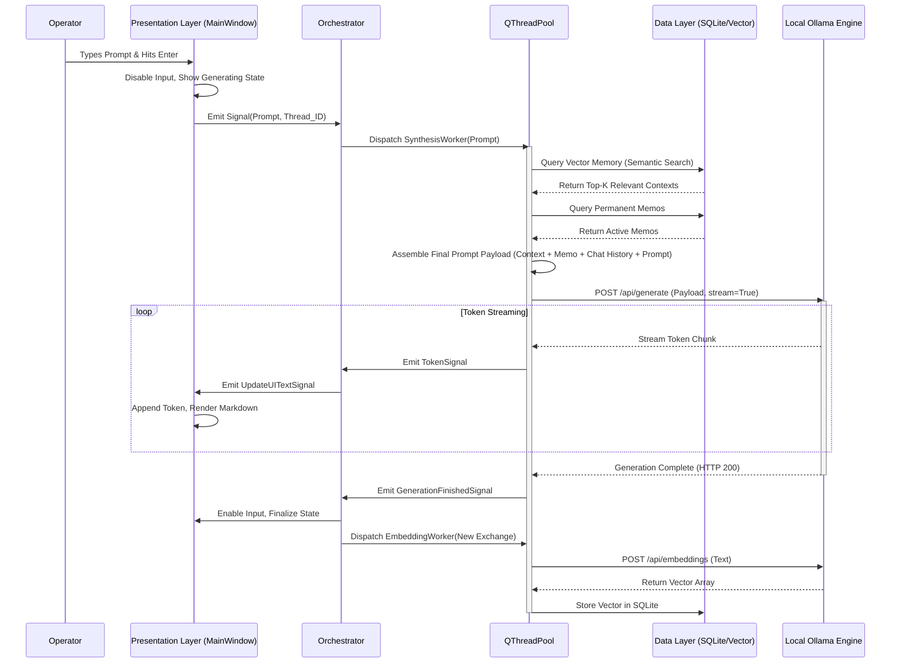

# Document 45: System Architecture and Data Flow

## 1. Abstract: The Tripartite Engine
The structural integrity of Cortex relies on a rigorous, decoupled system architecture. To function seamlessly within the intense computational environments of Project Ember, Cortex is divided into three distinct strata: the Presentation Layer, the Orchestration Layer, and the Data & Model Layer. This document provides a comprehensive technical deconstruction of this tripartite engine. It meticulously maps the topologies of data flow, tracing the lifecycle of a prompt from the user's keystroke, through the labyrinth of semantic retrieval and asynchronous orchestration, to the final synthesized output from the local Ollama backend.

## 2. The Three-Tiered Architecture

The fundamental design philosophy is strict separation of concerns. The GUI must never know how a database query is executed, and the LLM client must never know how text is rendered on the screen.

### 2.1 The Presentation Layer (PySide6)
This is the boundary between human and machine. Comprising the `MainWindow`, dialog widgets, and the overarching stylesheet engine, this layer is responsible solely for capturing intent and rendering state.
- **Responsibility:** Ingest text, trigger UI animations, render markdown, and display system state.
- **Constraint:** This layer must *never* execute blocking operations (file I/O, heavy computation, network requests). All actions are dispatched via Qt Signals.

### 2.2 The Orchestration Layer (The Nervous System)
Centralized in `Chat_LLM.py` (specifically the `Orchestrator` class), this is the logic core. It acts as the grand conductor of the system.
- **Responsibility:** Receive signals from the UI, spawn worker threads (`QRunnable` managed by `QThreadPool`), coordinate tasks, manage feature toggles (Translation, Suggestions), and handle errors.
- **Constraint:** The Orchestrator itself lives on the main thread but delegates all actual work to background threads. It ensures that multiple tasks (e.g., chatting and generating embeddings) do not collide or corrupt shared memory states.

### 2.3 The Data & Model Layer (The Substrate)
This layer houses the persistence engines and the external API clients.
- **Components:** The SQLite-based Vector Memory Manager, the Permanent Memo Manager, and the Ollama REST Client.
- **Responsibility:** Execute SQL queries, calculate cosine similarity for vector embeddings, serialize/deserialize JSON payloads for the Ollama API, and manage the persistent storage of chat histories.

## 3. Comprehensive Data Flow Topology

To truly understand Cortex, one must trace the flow of data through these three layers. The following flowchart illustrates the complex, asynchronous lifecycle of a single user query.

## 4. Detailed Component Analysis

### 4.1 The Threading Model (QThreadPool)
Cortex utilizes PySide6's `QThreadPool` to manage concurrency. This is vastly superior to manually managing raw Python threads, as it provides a manageable queue and limits the maximum number of concurrent threads based on the system's CPU core count.
- **Worker Classes:** Specific `QRunnable` classes are defined for each task type: `ChatWorker`, `TranslationWorker`, `TitleGenerationWorker`, and `EmbeddingWorker`.
- **Signal-Slot Communication:** Workers communicate their progress and results back to the Orchestrator via custom `QObject` signals. This ensures thread-safe communication, as Qt seamlessly marshals the signals across thread boundaries.

### 4.2 The Synthesis Agent Pipeline
Located within the Orchestration Layer, the Synthesis Agent is responsible for constructing the prompt. It is an algorithmic chef, mixing ingredients according to a strict recipe:
1. **Base System Prompt:** The immutable core instructions (e.g., "You are Cortex, a highly capable local AI...").
2. **Permanent Memos:** Injected unconditionally. These frame the AI's overarching persona or project context.
3. **Vector Context:** The results of the semantic similarity search based on the user's current prompt.
4. **Chat History:** The most recent N exchanges in the current thread (sliding window to prevent context overflow).
5. **The User Prompt:** The final, immediate directive.

The Synthesis Agent calculates token limits (using fast heuristic estimations) and gracefully truncates the Chat History or Vector Context to ensure the final payload never exceeds the model's maximum `num_ctx` parameter, preventing fatal API errors.

### 4.3 Data Layer Resilience (SQLite)
The choice of SQLite for local persistence is deliberate. It requires no separate daemon, is incredibly fast for the scale of local chat data, and stores everything in a single, portable file.
- **Vector Storage:** Since native SQLite does not support highly dimensional vector operations out of the box (without extensions like `sqlite-vec`), Cortex may implement a hybrid approach where embeddings are stored as serialized BLOBs, and semantic search (cosine similarity) is calculated in-memory using `numpy` within a background thread. For smaller personal databases, this brute-force calculation is virtually instantaneous and avoids complex dependencies.
- **WAL Mode:** Write-Ahead Logging is enabled on the SQLite connections to allow concurrent reads and writes, crucial when the UI is reading chat history while a background thread is saving a new embedding.

## 5. Conclusion
The System Architecture and Data Flow of Cortex are engineered for absolute resilience and high performance. By strictly isolating the UI from the heavy lifting of data retrieval and API communication via a robust, signal-driven threading model, Cortex ensures a flawless Operator experience. This architecture is not just capable of handling standard chat; it is the robust, modular foundation required to support the massive cognitive expansions planned for Project Ember's future phases.
