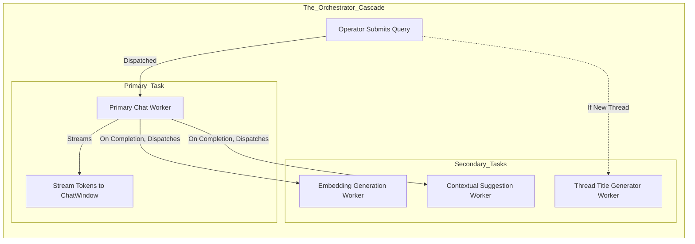

# Document 47: Orchestration Layer and Model Synergy

## 1. Abstract: The Symphonic Conductor
If the Presentation layer is the face of Cortex, and the Data layer is the memory, the Orchestration layer is the central nervous system. It is here, within the `Orchestrator` algorithms, that the true complexity of local-first AI is managed. This document explores the intricate engineering required to coordinate multiple specialized Large Language Models—operating concurrently—without destabilizing the PySide6 UI or overwhelming the Operator's hardware. We detail the mechanics of `QThreadPool`, thread lifecycle management, and the profound concept of 'Model Synergy,' where diverse neural networks are orchestrated to perform parallel tasks seamlessly.

## 2. The Necessity of the Orchestrator
Running a single LLM locally is computationally expensive. Running three or four simultaneously—one for chat, one for embeddings, one for translation, one for title generation—is a logistical nightmare without rigorous orchestration. The Orchestrator acts as the symphonic conductor, ensuring that API requests to the local Ollama daemon are queued, executed, and their responses routed back to the correct UI components safely across thread boundaries.

### 2.1 The Concurrency Mandate
The primary directive of the Orchestrator is absolute concurrency. The PySide6 main event loop (which handles drawing the screen and capturing clicks) must *never* be blocked. Every interaction with Ollama, the SQLite database, or heavy calculation (like `numpy` matrix math) must be relegated to a background thread.

## 3. QThreadPool and the Worker Paradigm
Cortex leverages the `QThreadPool` architecture provided by the Qt framework. This is a highly robust system for managing a pool of reusable worker threads.

### 3.1 The Anatomy of a Worker
Every background task in Cortex is encapsulated in a class inheriting from `QRunnable`.
- **The `run()` Method:** This is where the heavy lifting occurs (e.g., making the HTTP POST request to Ollama).
- **The Signal Emitter:** Because `QRunnable` cannot natively emit Qt signals, it is paired with a companion `QObject` (often called `WorkerSignals`). When the `run()` method has new data (like a streamed token or a final result), it calls `emit()` on the companion object.
- **Thread Safety:** Qt's signal/slot mechanism automatically detects when a signal is emitted from a background thread and delivered to a slot on the main thread (like a UI update). It safely marshals the data across the thread boundary, preventing catastrophic segfaults.

### 3.2 Task Dispatch and Queueing
When the Operator submits a prompt, the Orchestrator doesn't just spawn one task; it may orchestrate a cascade of tasks:

## 4. The Concept of Model Synergy
Model Synergy is the practice of utilizing highly specialized, usually smaller, models to augment the output of a primary, larger model. 

### 4.1 The Primary Heavyweight
The main conversational model (e.g., `qwen3:8b` or `llama3`) requires significant VRAM and compute. It is tasked with deep reasoning, coding, and complex synthesis. It requires maximum context window allocation.

### 4.2 The Specialized Lightweights
While the heavyweight model is generating, or immediately after, the Orchestrator leverages specialized, highly quantized, smaller models for peripheral tasks:
- **`granite4:tiny-h` for Titling:** Instead of asking the massive 8B parameter model to summarize the chat into a 4-word title (which is a waste of its context window and compute time), the Orchestrator silently passes the first exchange to a tiny model optimized specifically for summarization. This happens in the background, updating the sidebar without the Operator even noticing.
- **`translategemma:4b` for Translation:** See Document 48 for a deep dive.
- **`nomic-embed-text` for Memory:** A model structurally designed only to output vector arrays, utterly useless for chat, but perfectly optimized for semantic mapping.

### 4.3 Managing Hardware Contention
The Orchestrator must be intelligent about *when* it requests these synergistic tasks. If it asks Ollama to run `qwen3:8b` and `translategemma:4b` at the exact same millisecond, Ollama will either queue them (causing massive UI delay on one task) or attempt to load both into VRAM simultaneously (potentially causing an Out-Of-Memory crash).
- **Sequential Dispatch:** The Orchestrator strictly controls the timing. Background tasks like embedding and translation are dispatched *only after* the primary chat generation has completed and the heavyweight model has freed up active compute cycles (even if it remains loaded in VRAM).

## 5. Error Recovery and Graceful Degradation
The Orchestrator is responsible for maintaining the illusion of stability even when the backend crumbles.
- **Timeout Management:** HTTP requests to Ollama have strict timeouts. If the daemon hangs, the Worker thread terminates gracefully, emits an error signal, and the Orchestrator updates the UI with an actionable error state, rather than freezing the application indefinitely.
- **Model Absence Handling:** If the Orchestrator attempts to dispatch a Title Generation task, but `granite4:tiny-h` is not installed, it does not crash. It catches the 404 error from Ollama, logs the failure, disables the auto-titling feature for that session, and falls back to a default "New Thread" title.

## 6. Conclusion
The Orchestration Layer is the unsung hero of the Cortex ecosystem. By masterfully managing the QThreadPool, enforcing strict thread safety, and intelligently dispatching tasks across a synergistic suite of specialized models, it allows a standard desktop environment to operate a highly complex, multi-modal AI pipeline. It ensures that the profound capabilities of local LLMs are delivered to the Operator through an interface that remains relentlessly smooth, responsive, and indestructible.
