# Document 48: Translation and Contextual Syntheses

## 1. Abstract: Beyond Primary Generation
A truly advanced cognitive assistant does not merely answer a prompt; it anticipates the adjacent needs of the Operator and provides multi-layered value from a single interaction. Cortex achieves this through sophisticated post-generation pipelines handled by the Synthesis Agent. This document conducts a deep dive into two critical capabilities: the automated post-generation Translation pipeline and the Contextual Follow-Up Suggestions system. We explore how specialized models (like `translategemma:4b`) are utilized to augment the core output, providing side-channel information that enriches the Operator's situational awareness without polluting the primary context window or stalling the main interaction loop.

## 2. The Philosophy of the Side-Channel
In standard LLM interactions, if an Operator wants a response translated, or wants follow-up questions, they must explicitly ask for them in the prompt (e.g., "Answer this, then translate it to Spanish, then give me three more questions"). This is highly inefficient. It consumes vast amounts of the context window, confuses the primary model's instruction following capabilities, and forces the Operator to perform tedious prompt engineering.

Cortex solves this via "Side-Channeling." The primary model focuses *only* on answering the core query. The Orchestrator then automatically uses the resulting output as the input for secondary, specialized models to generate side-channel data (translations, suggestions) asynchronously. 

## 3. The Translation Pipeline

For Operators working in multi-lingual environments, or those utilizing foreign documentation within Project Ember, instant translation is paramount. 

### 3.1 Specialized Model Utilization
Rather than forcing a generalist model like `qwen` or `llama` to translate—which can result in hallucinated cultural idioms or literal, clunky phrasing—Cortex delegates this to a model specifically fine-tuned for linguistic translation, such as Google's `translategemma:4b`.

### 3.2 Asynchronous Execution Flow
The translation toggle in the Cortex UI allows the Operator to activate this pipeline. When active, the flow is strictly controlled to ensure UI fluidity:

1. **Primary Generation:** The Operator submits a prompt. The primary model generates the response in its default language (usually English). This streams to the UI instantly.
2. **The Hand-off:** The moment the primary generation completes, the Orchestrator takes the final plaintext string of the response and dispatches a `TranslationWorker`.
3. **Background Inference:** The `TranslationWorker` connects to Ollama, requesting `translategemma:4b` to translate the payload into the target language defined in `QSettings`.
4. **UI Injection:** Because this happens asynchronously, the Operator can already be reading the primary response. A few seconds later, the UI dynamically expands, inserting the translated text beneath the primary response in a distinctly styled block (perhaps italicized or color-shifted to denote it as a side-channel artifact).

```mermaid
graph LR
    subgraph Primary_Loop
        Prompt -->|Inference| Main_Model[Primary Model e.g. Qwen]
        Main_Model -->|Stream| UI_Response[Main Text Displayed]
    end
    
    subgraph Side_Channel_Loop
        UI_Response -->|Hand-off Trigger| Orchestrator
        Orchestrator -->|Background Dispatch| Trans_Model[translategemma:4b]
        Trans_Model -->|Await Result| Trans_Model
        Trans_Model -->|Inject| UI_Response_Trans[Translated Block Appended]
    end
    
    style Main_Model fill:#1a1a1a,stroke:#ff6600,stroke-width:2px
    style Trans_Model fill:#1a1a1a,stroke:#00ccff,stroke-width:2px
```

## 4. Contextual Follow-Up Suggestions

Cognitive symbiosis requires the machine to help the Operator maintain momentum. Often, a profound answer leads to a moment of hesitation as the Operator decides what to ask next. The Contextual Suggestions pipeline bridges this gap.

### 4.1 The Mechanism of Anticipation
If the Suggestions toggle is active, the Orchestrator dispatches a `SuggestionWorker` upon completion of the primary response.
- **The Prompt:** This worker uses a highly constrained system prompt instructing a fast, lightweight model (or the primary model with a tiny `num_predict` limit) to analyze the preceding exchange and generate three concise, logical follow-up questions.
- **Format Enforcement:** The model is strictly instructed to output a JSON array of strings or a comma-separated list, ensuring the Orchestrator can easily parse the raw output into discrete UI elements.

### 4.2 UX Presentation and Frictionless Continuation
The generated suggestions are not presented as standard chat text. They are injected into the PySide6 UI as styled 'pills' or interactive buttons at the bottom of the chat exchange.
- **The Frictionless Loop:** When the Operator clicks a suggestion pill, the text is immediately transferred to the input box and automatically submitted. The Operator can explore complex topics down deep, branching paths with nothing more than a series of single clicks, vastly accelerating the speed of inquiry and research within the Ember ecosystem.

## 5. Architectural Safeguards
Running these side-channels poses risks regarding hardware saturation. Cortex implements safeguards:
- **Strict Queuing:** Side-channel workers are assigned a lower priority in the `QThreadPool` than user-initiated primary chat requests. If the Operator quickly submits a new prompt before the previous translation has finished, the translation worker may be preempted or its result silently discarded to ensure the new primary request receives maximum hardware resources immediately.
- **Token Limits:** To prevent the translation model from taking minutes to translate a massive, multi-page primary response, the Synthesis Agent enforces a hard token/character limit on the payload sent to the side-channel models. If the primary response is too long, the side-channel tasks are aborted, and a subtle UI indicator notes that the text exceeded translation parameters.

## 6. Conclusion
The Translation and Contextual Synthesis pipelines represent the pinnacle of Cortex's anticipatory architecture. By leveraging model synergy and rigorous asynchronous design, Cortex provides profound, multi-dimensional value from every interaction. The Operator is not just given an answer; they are immediately provided with localized translations and the cognitive stepping stones required to delve deeper into the mystery. This side-channel philosophy ensures Cortex operates not as a passive tool, but as a deeply engaged, proactive cognitive partner.
