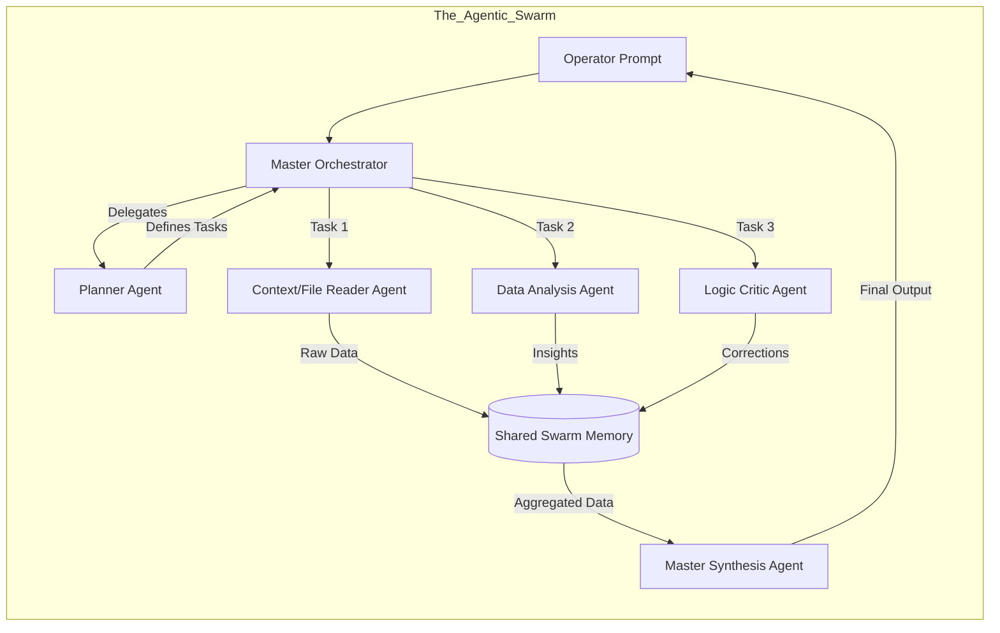

# Document 50: Evolutionary Roadmap and Scaling Strategy

## 1. Abstract: The Horizon of Capability
Cortex, as currently integrated into Project Ember, represents a highly advanced, text-based cognitive synthesizer. However, the architecture is designed to be the foundational substrate for a much grander evolutionary trajectory. This document delineates the future of Cortex. It maps out the upcoming milestones, transitioning the system from a reactive chatbot to a proactive, multi-modal, agentic swarm capable of autonomous research and peer-to-peer synchronization, all while strictly adhering to the Local-First Mandate.

## 2. Phase V: Multi-Modal Sensory Integration
The immediate next step in the evolution of Cortex is the expansion of its sensory capabilities. Text is the foundation of logic, but sight and sound are the foundations of context.
- **Vision Models:** Cortex will integrate support for local Vision-Language Models (e.g., LLaVA or newer quantized vision architectures). The PySide6 UI will be updated to support image drag-and-drop. The Orchestrator will encode the image and pass it to the vision model alongside the text prompt. This allows the Operator to feed UI mockups, architectural diagrams, or system error screenshots directly into the cognitive loop.
- **Local Transcriptions (Whisper):** To further reduce the friction between thought and synthesis, a lightweight, locally executed voice-to-text pipeline (utilizing models like `whisper.cpp`) will be integrated. The Operator will be able to dictate complex thoughts directly into Cortex, bypassing the keyboard entirely.

## 3. Phase VI: The Agentic Swarm
Currently, Cortex operates as a single, monolithic intelligence (despite utilizing specialized models for peripheral tasks). The future is decentralized within the local enclave.
- **Sub-Agent Invocation:** The Orchestrator will be upgraded to support Agentic Swarms. If an Operator asks a highly complex question (e.g., "Analyze the codebase for race conditions and draft a refactoring plan"), the Orchestrator will not just query the primary model. Instead, it will spawn specialized sub-agents.
- **The Swarm Dynamics:** 
  1. A `Planner Agent` breaks down the task.
  2. A `Code-Reader Agent` queries the Vector Memory and scans local files.
  3. An `Analysis Agent` reviews the findings.
  4. The `Synthesis Agent` merges the swarm's work into a final report for the Operator.
- All of this occurs in the background, utilizing `QThreadPool`, with the Operator Dashboard visualizing the swarm's progress in real-time.

## 4. Phase VII: Peer-to-Peer Cognitive Syncing
The ultimate constraint of the Local-First Mandate is isolation. If an Operator has a desktop workstation and a field laptop, their Cortex instances develop separate memories. Phase VII introduces the P2P Sync Protocol.
- **Zero-Trust Synchronization:** Cortex instances on devices owned by the same Operator will be able to discover each other over local network protocols (e.g., mDNS/Zeroconf) or via secure, end-to-end encrypted tunnels (like Tailscale/Wireguard).
- **CRDTs and Vector Merging:** Utilizing Conflict-Free Replicated Data Types (CRDTs), the instances will synchronize their SQLite Vector Memories and Permanent Memos. The field laptop will inherit the profound insights generated by the desktop workstation, ensuring the Operator's synthetic companion is unified across all physical hardware.

## 5. Hardware Acceleration and Scaling
As the capabilities expand, the hardware requirements will scale.
- **Heterogeneous Compute:** Cortex will evolve to utilize multi-backend execution. While Ollama handles LLM inference via GPU, Cortex might leverage NPU (Neural Processing Units) on modern CPUs for background embedding generation, or distribute compute across multiple local GPUs if available.
- **Dynamic Quantization:** The system will intelligently swap model quantization levels based on active VRAM pressure. If the Operator boots up a heavy IDE, Cortex will seamlessly unload a 16-bit model and load a 4-bit model to return VRAM to the host system, minimizing disruption.

## 6. Conclusion
The roadmap for Cortex is relentless. It refuses to stagnate at the level of a mere desktop application. By pursuing multi-modal integration, autonomous agentic swarms, and secure peer-to-peer synchronization, Cortex will become a pervasive, ambient intelligence. It will scale from a simple chat interface into a localized, cognitive operating system that powers the most ambitious endeavors of Project Ember, forever redefining the boundaries of what a single human, augmented by a localized machine intellect, can achieve.
