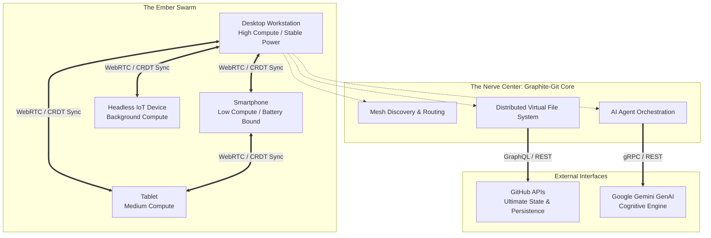

# Project Ember: The Mythic Vision - Graphite-Git as the Nerve Center

## 1. Introduction: The Genesis of Project Ember

In the annals of software engineering, we periodically reach a singularity—a moment where disparate technologies, originally designed for discrete tasks, fuse to create an architecture so profoundly advanced that it redefines the very nature of computing. Project Ember is that singularity. Born from the ashes of centralized, monolithic infrastructure, Project Ember envisions a world where computation is not bound by the physical limitations of a single device, nor shackled to the latency-inducing tethers of cloud-based servers. Instead, it is a fluid, omnipresent entity—a multi-device mesh system that breathes, scales, and thinks across a constellation of interconnected nodes.

At the heart of this revolution lies an unlikely hero: **Graphite-Git**. Originally conceived as a secure, local-first GitHub client with an integrated AI engineering agent (powered by Gemini), Graphite-Git demonstrated the power of bringing complex workflows—repository management, code editing, and AI-assisted refactoring—directly into the browser. It proved that the edge is not just a destination for content delivery, but a potent, sovereign arena for heavy computation and state management.

Project Ember takes the foundational philosophy of Graphite-Git—local-first, secure, and AI-integrated—and extrapolates it to an apocalyptic, awe-inspiring conclusion. We are not just building a better GitHub client; we are utilizing the Graphite-Git architecture as the **Nerve Center** for a decentralized, cross-platform, multi-device mesh compute engine. This document is the first in an eight-part series outlining the "Mythic Plan" to elevate Project Ember into the most advanced computational swarm ever devised.

## 2. The Graphite-Git Paradigm Shift

To understand Project Ember, we must dissect the DNA of Graphite-Git. Graphite operates on a crucial premise: the user's browser is a hyper-capable operating system. By utilizing `localStorage` for sensitive tokens and directly interfacing with the GitHub REST/GraphQL APIs and the Google GenAI API, Graphite eliminates the middleman. There is no intermediary server parsing your code, no database storing your secrets, and no telemetry tracking your keystrokes. It is an airtight, sovereign application.

### 2.1 From Single Node to Infinite Mesh

In its current iteration, Graphite is a single-node application. You open it on your laptop, and your laptop performs the work. The AI agent analyzes code within the constraints of your laptop's memory and CPU. But what happens when you open Graphite on your laptop, your phone, your tablet, and your smart TV simultaneously? 

Project Ember transforms these isolated instances into a **Swarm**. The Graphite-Git core is evolved from a standalone client into a **Mesh Orchestrator**. 

When multiple devices owned by the same user (or authorized within a team's secure enclave) run the Ember-infused Graphite client, they automatically discover each other via WebRTC and peer-to-peer signaling over secure websockets. They form a closed-loop, encrypted mesh network. The Graphite interface you see is no longer just rendering local state; it is a portal into the collective computational power of every device in your mesh.

### 2.2 The Browser as the Universal Execution Context

Why the browser? Because it is the only truly ubiquitous, cross-platform runtime environment. iOS, Android, Windows, macOS, Linux—every modern operating system ships with a high-performance JavaScript engine and WebAssembly (Wasm) support. By anchoring Project Ember within the Graphite-Git browser-based architecture, we achieve instant, zero-install deployment across billions of devices. 

The React 18, TypeScript, and Vite stack of Graphite is enhanced with service workers, WebRTC data channels, and distributed state synchronization protocols (like CRDTs). The browser ceases to be a document viewer; it becomes a node in a global supercomputer.

## 3. Architecture of the Mythic Mesh

Let us visualize the high-level architecture of Project Ember.

### 3.1 The Distributed Virtual File System (DVFS)

In Graphite-Git, when you view a repository, the file tree is fetched from GitHub and held in memory. In Project Ember, this concept is radically expanded into a **Distributed Virtual File System (DVFS)**.

When a large repository is loaded, the mesh does not force every device to download every file. Instead, the DVFS intelligently shards the repository across the available nodes based on their storage capacity and network bandwidth. 
- Your desktop might hold the dense `src/` directory and heavy binary assets.
- Your smartphone might hold the `README.md`, `package.json`, and metadata files required for quick UI rendering.
- When your smartphone needs to view a file residing on the desktop, it requests it over the P2P mesh. If the desktop is offline, the DVFS falls back to fetching it directly from the GitHub API.

This reduces redundant network calls, minimizes memory pressure on weaker devices, and creates a highly resilient, distributed cache. GitHub acts merely as the ultimate source of truth—the cold storage—while the Ember mesh operates as a blazing-fast, distributed L1/L2 cache.

### 3.2 AI Agent Orchestration: The Hive Mind

Graphite-Git's integration of the Gemini model is its crown jewel. The AI agent can read, write, and refactor code. But currently, the agent is constrained by the context window and the processing speed of a single device's API connection.

Project Ember introduces **Hive Mind Orchestration**. When you ask the Ember AI Agent to "Refactor all legacy class components to functional components across the entire repository," the task is too large for a single prompt or a single device to manage efficiently.

The Graphite Nerve Center intercepts this command and breaks it down into micro-tasks:
1. **Task A:** Scan `src/components/auth` (Assigned to Desktop).
2. **Task B:** Scan `src/components/dashboard` (Assigned to Tablet).
3. **Task C:** Scan `src/components/shared` (Assigned to Smartphone).

Each node uses its local Gemini API connection (or a shared mesh-level connection pool) to perform the refactoring. The results are streamed back into the DVFS, merged using CRDTs to prevent conflicts, and presented to the user on whatever device they happen to be viewing. The AI agent is no longer a single assistant; it is a distributed swarm of specialized workers, dramatically reducing the time-to-completion for complex engineering tasks.

## 4. The Core Pillars of Project Ember

To realize this mythic vision, Project Ember is built upon four unshakeable pillars, which will be explored in excruciating detail in the subsequent documents of this series:

### 4.1 Edge-Compute Mesh Architecture (Doc 02)
We will dive deep into the WebRTC signaling mechanisms, the creation of a zero-configuration P2P overlay network, and how Ember nodes dynamically self-organize, elect leaders, and route traffic to minimize latency. We will explore how NAT traversal (STUN/TURN) is handled in a serverless, local-first paradigm.

### 4.2 Variable Performance Scaling (Doc 03)
Not all nodes are created equal. A smartphone cannot compile a large Rust project, but it can parse ASTs or run lightweight linters. We will detail the "Ember Profiler"—a subsystem that continuously evaluates node CPU load, thermal constraints, and battery life, dynamically redistributing work across the mesh in real-time to prevent device throttling.

### 4.3 Multi-Device Distributed Compute (Doc 04)
We will outline the proprietary "MapReduce-in-Browser" algorithm. How do we take a monolithic computation (like searching a massive codebase or running a comprehensive test suite) and shard it across devices? We will explore task stealing, distributed consensus, and fault-tolerance mechanisms when a node unexpectedly drops off the mesh.

### 4.4 The AI Agent Symbiosis (Doc 05)
A deeper look into how the Gemini models are utilized across the mesh. We will discuss distributed prompt generation, context sharing across nodes, and how the AI agent acts not just as a coding assistant, but as the autonomous load-balancer and mesh-optimizer, predicting user intent and pre-warming caches before the user even clicks.

## 5. The Evolution from Client to Engine

Graphite-Git was a beautiful proof of concept. It proved that complex state management and API integration could live entirely within the client. But a client is passive. A client waits for input.

Project Ember is active. It is an engine. 

Imagine you are on a train, looking at a bug report on your phone via the Ember interface. You tap "Fix this." 
- Your phone (Node 1) sends the intent to the mesh.
- Your desktop at home (Node 2), which is asleep but connected to the mesh via a headless Chrome instance, wakes up. 
- The desktop pulls the latest code, asks Gemini for the fix, runs the test suite locally using its massive CPU, verifies the fix, and pushes the commit.
- Your phone receives a tiny notification: "Bug fixed and merged."

This is the power of the mesh. The compute happens where it is most efficient. The data lives where it is most needed. The interface is just a window into the swarm.

## 6. Conclusion: Setting the Stage

The transition from Graphite-Git to Project Ember is akin to moving from single-celled organisms to a complex, multi-cellular consciousness. It requires a radical rethinking of state, network topology, and resource allocation. But the foundation is there. The local-first ethos, the seamless API integrations, the AI-first approach—these are the building blocks of the future.

In the next document, **02_Edge_Compute_Mesh_Architecture_Decentralized_Mind**, we will dive into the brutal technical realities of establishing this mesh. We will tear down the WebRTC protocol, expose the complexities of distributed peer discovery, and architect the neural pathways that will bind these devices together. The singularity is near. Prepare the nodes.
