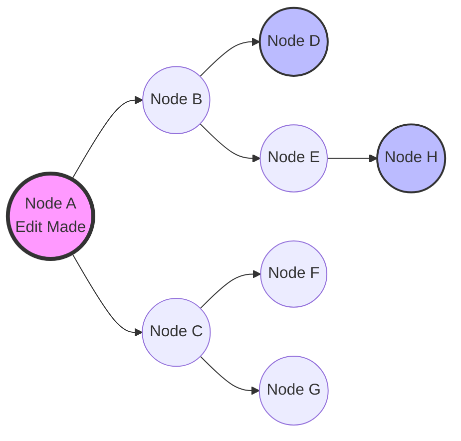

# Project Ember: Edge-Compute Mesh Architecture - The Decentralized Mind

## 1. Introduction: Escaping the Gravity of the Cloud

If Project Ember is a living entity, its nervous system is the Edge-Compute Mesh Architecture. The cloud paradigm—centralized servers processing requests and returning HTML or JSON—has dominated software engineering for two decades. It is comfortable, well-understood, and fundamentally flawed when applied to the goals of a latency-intolerant, high-compute, AI-integrated IDE like Graphite-Git.

The cloud introduces latency at the speed of light, it creates single points of failure, and it centralizes compute costs. Project Ember brutally rejects this model. We are moving the entire compute plane, state management, and orchestration to the absolute edge: the user's devices.

This document, the second in our mythic series, provides a brutally technical exploration of how Project Ember establishes, maintains, and utilizes a secure, peer-to-peer (P2P) mesh network across disparate devices, transforming them from isolated browsers into a cohesive, decentralized supercomputer. We will dissect the WebRTC signaling layer, the creation of a Distributed Virtual File System (DVFS), and the dynamic routing algorithms that make the Ember Mesh a reality.

## 2. The Topological Imperative: Building the Mesh

In a traditional web application, the topology is a simple star graph: clients connect to a central server. In Project Ember, the topology is a fully connected (or highly connected) mesh graph. Every device authorized by the user is a node. 

### 2.1 WebRTC: The Backbone of the Swarm

WebRTC (Web Real-Time Communication) is the only viable protocol for establishing true peer-to-peer connections directly between web browsers without requiring intermediate server relaying for the actual data payload. While primarily known for audio/video streaming, WebRTC's `RTCDataChannel` provides an arbitrary, low-latency, bidirectional binary data pipe perfectly suited for our needs.

However, WebRTC requires a signaling mechanism. Peers must exchange connection information (SDP offers and answers, ICE candidates) before a direct connection can be established. Because Ember is strictly local-first and serverless, we must implement a signaling layer that does not rely on a proprietary, centralized database.

### 2.2 The Serverless Signaling Conundrum

How do two devices find each other if there is no server to act as a matchmaker? Project Ember utilizes a hybrid approach, leveraging GitHub itself as the slow-but-reliable signaling server, and transitioning to local multicast for rapid discovery when devices are on the same local area network (LAN).

#### 2.2.1 Phase 1: GitHub as a Signaling Relay (The Bootstrap)
When a user installs the Ember-enhanced Graphite client on a new device, it must announce its presence to the rest of the user's mesh. 

1. **The Signal Repo:** Project Ember creates a private, hidden repository on the user's GitHub account (e.g., `.ember-mesh-signals`).
2. **The Offer:** Node A (the new device) generates a WebRTC SDP Offer and writes it to a file in the Signal Repo via the GitHub API (`/nodes/node-a/offer.json`).
3. **The Polling:** Node B (an existing, active device like a desktop) periodically polls the Signal Repo using the GitHub API (or uses GitHub Actions/Webhooks to listen for changes if permitted).
4. **The Answer:** Node B sees Node A's offer, generates an SDP Answer, and writes it back to the Signal Repo (`/nodes/node-b/answer_to_a.json`).
5. **The Connection:** Node A reads the answer, and the WebRTC connection process begins.

This process is slow (taking perhaps 5-10 seconds due to API limits and polling), but it only happens *once* per device pairing or when IP addresses change significantly.

#### 2.2.2 Phase 2: Local Discovery (The Fast Path)
If Node A and Node B are on the same Wi-Fi network, bouncing signaling payloads off GitHub is inefficient. Ember implements WebRTC Local Discovery using mDNS (Multicast DNS) where supported, or utilizes a lightweight local signaling relay if the user has a "Home Base" node running a small Node.js daemon. 

Once the initial connection is established, the nodes keep the WebRTC data channels open indefinitely, multiplexing signaling data for *future* node discoveries through the already established secure channels.

```mermaid
sequenceDiagram
    participant NodeA as Smartphone (New)
    participant GitHub as GitHub API (.ember-mesh)
    participant NodeB as Desktop (Active)

    Note over NodeA, NodeB: Phase 1: Bootstrap via GitHub
    NodeA->>NodeA: Generate SDP Offer (ICE Candidates)
    NodeA->>GitHub: PUT /nodes/smartphone/offer.json
    loop Polling (Every 10s)
        NodeB->>GitHub: GET /nodes/smartphone/offer.json
    end
    NodeB->>NodeB: Process Offer, Generate SDP Answer
    NodeB->>GitHub: PUT /nodes/desktop/answer_to_smartphone.json
    NodeA->>GitHub: GET /nodes/desktop/answer_to_smartphone.json
    Note over NodeA, NodeB: WebRTC Negotiation Complete
    NodeA<-->>NodeB: Secure RTCDataChannel Established

    Note over NodeA, NodeB: Phase 2: Direct Mesh Communication
    NodeA->>NodeB: Send Mesh State Sync Request
    NodeB->>NodeA: Stream DVFS Delta Updates
```

## 3. The Distributed Virtual File System (DVFS)

With the WebRTC mesh established, we must solve the problem of data availability. Graphite-Git operates on repositories. In a multi-device scenario, it is wildly inefficient to force every device to independently fetch the entire repository from GitHub, especially for massive codebases.

Enter the **Distributed Virtual File System (DVFS)**. 

### 3.1 Chunking and Sharding

When a user opens a repository in Ember, the repository is not treated as a collection of discrete files, but as a Merkle tree of content-addressed chunks, very similar to Git's internal object model, but optimized for real-time P2P streaming.

1. **Ingestion:** The primary node (usually the desktop) fetches the repo from GitHub. It hashes every file and chunks large files into smaller segments.
2. **The Index:** An index of these hashes (the "Manifest") is created and shared across the mesh.
3. **Lazy Loading:** When the smartphone needs to display `App.tsx`, it checks its local cache. If missing, it queries the mesh: *"Who has chunk `a1b2c3d4`?"*
4. **P2P Streaming:** The desktop responds, *"I have it,"* and streams the chunk over the WebRTC data channel directly to the smartphone.

### 3.2 The Hot/Cold Storage Paradigm

Ember intelligently manages storage based on device capabilities:
*   **Desktop Nodes (High Storage):** Act as "Full Nodes." They store the entire repository, all git history, and the complete DVFS index. They are the hot storage layer of the mesh.
*   **Mobile Nodes (Low Storage):** Act as "Light Nodes." They store only the DVFS index, metadata, and files currently being viewed or edited. They aggressively garbage-collect old files to save space.

If the desktop goes offline, the mobile node falls back to fetching missing chunks directly from the GitHub API. GitHub is the ultimate "Cold Storage." The mesh is a highly volatile, exceptionally fast L1/L2 cache.

```mermaid
graph TD
    subgraph The Ember Mesh
        Desktop[Desktop (Full Node)<br>Holds 100% of Repo]
        Phone[Smartphone (Light Node)<br>Holds 5% of Repo]
        Tablet[Tablet (Light Node)<br>Holds 15% of Repo]
    end

    GitHub[(GitHub API<br>Cold Storage)]

    Desktop <==>|WebRTC: Streams chunks on demand| Phone
    Desktop <==>|WebRTC: Streams chunks on demand| Tablet
    Phone <==>|WebRTC: P2P chunk sharing| Tablet

    Desktop == "Fetches Full Repo" ==> GitHub
    Phone -. "Fallback: Fetches missing file" .-> GitHub
```

## 4. NAT Traversal and the STUN/TURN Dilemma

A brutal reality of P2P networking is Network Address Translation (NAT) and strict firewalls. Two devices on different cellular networks or behind corporate firewalls often cannot establish a direct WebRTC connection.

Standard WebRTC relies on STUN (Session Traversal Utilities for NAT) servers to discover public IP addresses, and TURN (Traversal Using Relays around NAT) servers to relay data if a direct connection fails. 

### 4.1 The Serverless TURN Workaround

Project Ember strives to be serverless. Running our own TURN servers introduces massive costs, centralization, and a single point of failure. How do we traverse strict NATs without our own TURN servers?

1. **Public STUN:** We utilize free, public STUN servers (e.g., Google's `stun.l.google.com:19302`) to handle basic IP discovery. This solves 80% of connection issues.
2. **Mesh Relaying (The Clever Hack):** If Node A (Smartphone on Cellular) and Node B (Laptop on Corporate Wi-Fi) cannot connect directly, Ember looks for a third node, Node C (Desktop at Home). If Node C has open ports or is accessible by both A and B, Node C dynamically acts as a makeshift TURN relay for the mesh. The data flows: A -> C -> B. 
3. **GitHub API as Last Resort Data Channel:** If all P2P connections fail, Ember falls back to utilizing the private `.ember-mesh-signals` repository as an extremely slow data channel. Small, critical payloads (like small code edits or state changes) are base64 encoded and written to JSON files on GitHub, which the other nodes poll. It is agonizingly slow (high latency), but it guarantees delivery.

## 5. Gossip Protocol and State Propagation

In a decentralized mesh, state changes (e.g., a user editing a file, a new issue arriving, or the Gemini agent returning a response) must propagate to all nodes quickly and reliably. Project Ember utilizes an Epidemic Routing / Gossip Protocol.

When Node A makes an edit:
1. Node A updates its local DVFS and increments the logical clock of the file.
2. Node A selects a random subset of its connected peers (e.g., Node B and Node C) and sends the delta (the CRDT diff).
3. Nodes B and C receive the delta, apply it, and then gossip it to a random subset of *their* peers.

This ensures logarithmic propagation time across the mesh. Even if nodes are dropping in and out due to network instability, the gossip protocol ensures eventual consistency. We do not use centralized WebSockets; the mesh heals itself and routes around damaged or slow connections.


*Gossip Protocol Propagation: The edit spreads like a virus through the mesh.*

## 6. Security within the Mesh

Because we are creating a direct data pipe between devices, security is paramount. The WebRTC data channels are intrinsically encrypted via DTLS (Datagram Transport Layer Security). However, Ember adds an application-layer encryption scheme.

1. **Mesh Key Generation:** When a user initializes their Ember mesh, a master cryptographic keypair is generated and stored in the secure enclave of the primary device (or encrypted with a user passphrase).
2. **Device Authentication:** When a new device joins the mesh via the GitHub signaling relay, it must prove cryptographic ownership of a token signed by the master key. This prevents malicious actors who might gain access to the `.ember-mesh-signals` repo from joining the P2P network.
3. **Zero-Trust Payloads:** Even within the trusted mesh, every chunk of data exchanged in the DVFS is hashed and verified against the Merkle tree manifest. A compromised node cannot inject malicious code into the file system without breaking the cryptographic chain of custody.

## 7. The Foundation is Set

We have now established the physical architecture of Project Ember. We have ripped the compute plane out of the cloud and scattered it across the user's devices. We have built a robust, self-healing WebRTC mesh, a distributed file system to share state efficiently, and the gossip protocols to keep it all synchronized.

But raw connectivity is not enough. A mesh where all nodes try to do everything is chaotic and inefficient. In the next document, **03_Variable_Performance_Scaling_Fluid_Resource_Allocation**, we will explore how Project Ember profiles the capabilities of each device. We will learn how Ember intelligently assigns heavy compilation tasks to the desktop, lightweight UI rendering to the phone, and ensures that the swarm operates with maximum thermal and battery efficiency. The Decentralized Mind is awake; now we must teach it how to think.
