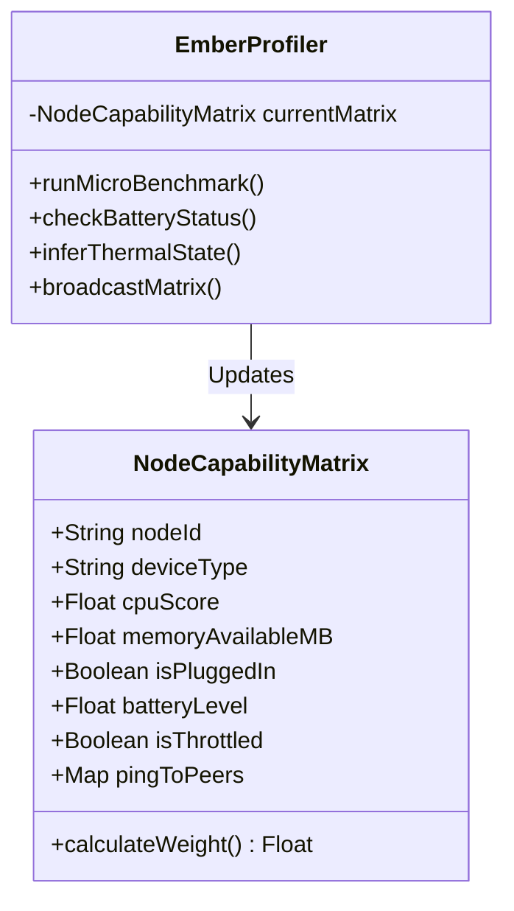
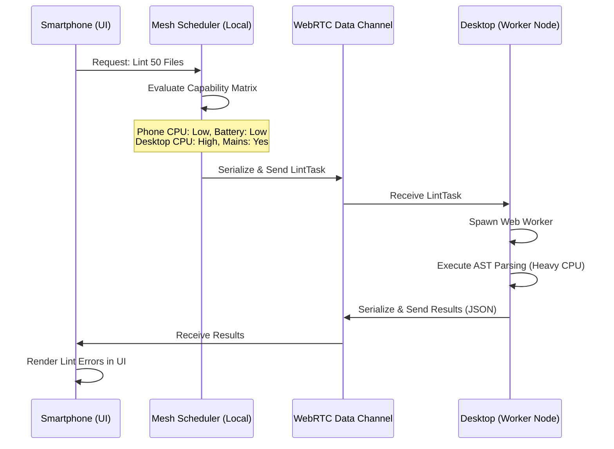

# Project Ember: Variable Performance Scaling - Fluid Resource Allocation

## 1. Introduction: The Heterogeneous Swarm

The fundamental promise of Project Ember is the seamless orchestration of multiple devices into a single, cohesive computational engine. However, the reality of modern hardware is extreme heterogeneity. A user’s mesh might consist of an M3 Max MacBook Pro, a five-year-old Android smartphone, an iPad, and a headless Raspberry Pi sitting in a closet. 

Treating all nodes equally in a peer-to-peer network is a recipe for catastrophic failure. If the mesh assigns a massive TypeScript compilation task or a heavy Gemini prompt evaluation to the old Android phone, the device will thermally throttle, drain its battery in minutes, and bottleneck the entire swarm. Conversely, if the M3 Max is only used to render UI updates, we are wasting immense computational potential.

This is the domain of **Variable Performance Scaling and Fluid Resource Allocation**. This document, the third in the Mythic Plan, dissects the sophisticated profiling, task scheduling, and thermal-aware algorithms that allow Project Ember to distribute workloads dynamically. We will explore how Ember transforms a chaotic collection of devices into an elegant, load-balanced supercomputer that respects the physical constraints of every node.

## 2. The Ember Profiler: Continuous Capability Assessment

Before the mesh can assign work, it must understand what each node is capable of. Static profiling (e.g., checking the `userAgent` or hardcoding device benchmarks) is insufficient. Device performance fluctuates wildly based on battery level, thermal throttling, and background OS tasks.

Project Ember utilizes a continuous, real-time profiling subsystem known as the **Ember Profiler**, running as a background Web Worker on every node.

### 2.1 The Profiling Matrix

The Ember Profiler continuously measures and broadcasts a "Capability Matrix" for its host device. This matrix includes:

1.  **CPU Availability:** Measured via micro-benchmarks (e.g., executing a quick WebAssembly crypto-hash loop) and `requestIdleCallback` timings to determine how much free CPU time the browser actually has.
2.  **Memory Constraints:** Utilizing the `performance.memory` API (where available) to track JS heap size and prevent Out-Of-Memory (OOM) crashes on constrained devices.
3.  **Network Bandwidth & Latency:** Measured via periodic ping/pong messages over the WebRTC data channels to other nodes, and throughput tests when streaming DVFS chunks.
4.  **Power State & Battery:** Utilizing the Battery Status API. A device on battery power is severely penalized in the scheduling algorithm compared to a device plugged into mains power.
5.  **Thermal Throttling Heuristics:** Browsers do not expose direct CPU temperature APIs for security reasons. Ember infers thermal throttling by tracking performance degradation over time. If a node completes the micro-benchmark 50% slower than it did five minutes ago, the Profiler flags the node as "Throttled."

### 2.2 Broadcasting the Capability Matrix

Every 10 seconds, each node broadcasts its Capability Matrix to its peers via the gossip protocol. This ensures that every node in the mesh has a roughly accurate, real-time map of the swarm's total computational power and the status of every participant.



## 3. Dynamic Workload Partitioning

With the capability map established, we must address how work is actually divided. Graphite-Git, at its core, performs several distinct types of computation: UI Rendering, Git Operations (diffing, merging), File System I/O, Code Parsing/Linting (AST generation), and AI Agent Communication.

Project Ember categorizes tasks into a **Scaling Matrix** and utilizes Web Workers and WebAssembly (Wasm) to isolate and migrate these tasks.

### 3.1 The Task Classification Matrix

Tasks are classified by their resource requirements:

| Task Category | CPU Cost | Memory Cost | Network Cost | Execution Location Preference |
| :--- | :--- | :--- | :--- | :--- |
| **UI Rendering** | Low | Low | Low | Local (The device the user is holding) |
| **DVFS Indexing** | Medium | High | Low | High-Memory Node (Desktop/Tablet) |
| **AST Parsing/Linting** | High | High | Low | High-CPU Node (Desktop) |
| **Gemini AI Prompts** | Low | Low | High | Node with best API latency / bandwidth |
| **Git Clone/Merge** | High | High | High | High-CPU + High-Bandwidth Node |

### 3.2 Web Workers and Task Migration

In a single-device architecture, all these tasks run in the local browser (often blocking the main thread if not carefully managed). In the Ember mesh, tasks are encapsulated as serializable objects.

When a user on a Smartphone requests a heavy operation—for instance, running a pre-commit linter across 50 files—the process unfolds as follows:

1.  **Task Generation:** The Smartphone generates a `LintTask` object containing the files to lint (or references to their DVFS chunks).
2.  **Scheduler Evaluation:** The Smartphone consults its local copy of the swarm's Capability Matrix.
3.  **Task Delegation:** The Smartphone sees that it is on battery power (`cpuScore: 200`), but the Desktop node is plugged in (`cpuScore: 3500`) and idle.
4.  **Migration:** The Smartphone serializes the `LintTask` and sends it over the WebRTC channel to the Desktop.
5.  **Remote Execution:** The Desktop receives the task, spins up a Web Worker, downloads the necessary file chunks from the DVFS if it doesn't have them, performs the heavy AST parsing, and generates the linting errors.
6.  **Result Return:** The Desktop sends the lightweight JSON result (the lint errors) back to the Smartphone.
7.  **UI Update:** The Smartphone renders the errors on the screen.

The user tapped a button on their phone, and the heavy lifting was instantly and invisibly outsourced to their desktop machine across the room (or across the world).



## 4. The Fluidity of the Mesh: Handling Node Volatility

The mesh is not a static server cluster; it is highly volatile. Laptops go to sleep. Phones drop Wi-Fi and switch to cellular. Tablets run out of battery. The fluid resource allocation system must be fault-tolerant and capable of instantaneous reorganization.

### 4.1 Work Stealing Algorithm

Instead of a centralized coordinator pushing tasks to nodes (which creates a bottleneck and requires complex leader election), Project Ember utilizes a decentralized **Work Stealing** algorithm.

1.  **The Global Queue:** When a complex job is created (e.g., "Analyze entire repository for security vulnerabilities via Gemini"), it is broken down into hundreds of micro-tasks. These tasks are placed in a Distributed Task Queue managed by CRDTs across the mesh.
2.  **The Hungry Nodes:** Every node constantly looks at its own capability. If a node determines it has free cycles (e.g., the Desktop finishes its current task), it looks at the Distributed Task Queue and "steals" a batch of tasks.
3.  **Variable Batch Sizes:** A powerful Desktop might steal 50 tasks at once. A weaker Tablet might steal 5 tasks. This naturally balances the load without requiring complex central calculation.
4.  **Task Timeouts:** If a node steals a task but suddenly drops off the network (e.g., the laptop lid is closed), the task remains in an "in-progress" state for a timeout period. Once the timeout expires, the task is released back into the queue for another node to steal.

### 4.2 Battery-Aware Scaling and Thermal Evasion

The most critical aspect of edge-compute is respecting the physical device. A server in a data center has massive cooling fans. A smartphone in a user's pocket does not.

If the Ember Profiler detects that a node's battery is dropping rapidly, or if performance degrades indicating thermal throttling, the node initiates **Thermal Evasion**:

1.  The node immediately stops stealing new tasks from the global queue.
2.  It attempts to finish its current tasks. If the thermal situation is critical, it aborts the tasks and pushes them back to the queue.
3.  It broadcasts an emergency update to its Capability Matrix, setting `isThrottled: true` and reducing its `cpuScore` to near zero.
4.  The rest of the mesh immediately routes heavy compute away from the struggling node, allowing it to cool down and conserve battery, reducing its role strictly to UI rendering and basic signaling relay.

## 5. WebAssembly: The High-Performance Engine

To make distributed compute viable in the browser, JavaScript's performance limitations must be bypassed. Project Ember relies heavily on WebAssembly (Wasm) for its heavy lifting. 

Graphite-Git's underlying Git operations (using `isomorphic-git` or similar) and code parsing libraries are compiled to Wasm. This provides near-native performance for critical paths.

When the mesh delegates a task, it ensures that the target node has the appropriate Wasm module cached. Because Wasm modules are just binary files, they are stored and distributed via the DVFS just like any other repository file. This means a node can dynamically download a new Wasm "capability" (e.g., a Rust compiler module) over the P2P network, execute the task, and return the result, effectively turning the browser into a containerized execution environment.

### 5.1 Sandboxing and Security

Running distributed compute means executing code provided by other nodes. Even within a trusted mesh, this presents risks. WebAssembly provides a strict, memory-safe sandbox. 

When a Desktop node receives a `LintTask` from the Smartphone, it executes the Wasm linter module within an isolated Web Worker. The Wasm module has no access to the Desktop's DOM, no access to `localStorage`, and restricted network access. It operates purely on the input data provided in the task payload and returns the result. This Zero-Trust execution model ensures that even if one node in the mesh is compromised, it cannot maliciously hijack the execution environment of other nodes.

## 6. The Orchestration Plane

Let us visualize the complete Orchestration Plane of the Variable Performance Scaling system.

```mermaid
graph TD
    subgraph Node A: Smartphone (Battery 20%, Throttling)
        P1[Ember Profiler] --> M1[Capability Matrix: Low]
        UI1[UI Render Thread]
        T1[Task Generator]
    end

    subgraph Node B: Desktop (Mains Power, Idle)
        P2[Ember Profiler] --> M2[Capability Matrix: High]
        W1[Web Worker Pool]
        WASM[Wasm Execution Engine]
    end

    subgraph Distributed State (CRDT)
        Q[Distributed Task Queue]
        CapMap[Global Capability Map]
    end

    M1 -->|Gossip| CapMap
    M2 -->|Gossip| CapMap

    T1 -->|Creates Heavy Task| Q
    
    CapMap -.->|Read by B| W1
    Q <-->|Work Stealing (Batch of 50)| W1
    W1 --> WASM
    WASM -->|Result| Q
    Q -.->|Update| UI1
```

## 7. Conclusion: The Symphony of Silicon

Variable Performance Scaling transforms Project Ember from a crude collection of connected browsers into a highly tuned, self-regulating organism. By continuously profiling device health, dynamically shifting workloads via WebRTC, and utilizing decentralized work-stealing algorithms, the mesh ensures that every microsecond of available compute power is utilized efficiently, without ever overwhelming a single device.

The user experiences only magic: a massive compilation finishes in seconds, complex AI refactoring happens instantaneously, and their phone remains cool to the touch. The heavy lifting is invisible, distributed across the unseen swarm.

In the next document, **04_Multi_Device_Distributed_Compute_Swarm_Intelligence**, we will take this foundation and apply it to the most complex challenge: breaking down massive, monolithic tasks (like MapReduce jobs over vast codebases) and orchestrating the AI Agent to work in parallel across multiple devices simultaneously. The swarm is ready; now we must teach it to solve the unsolvable.
