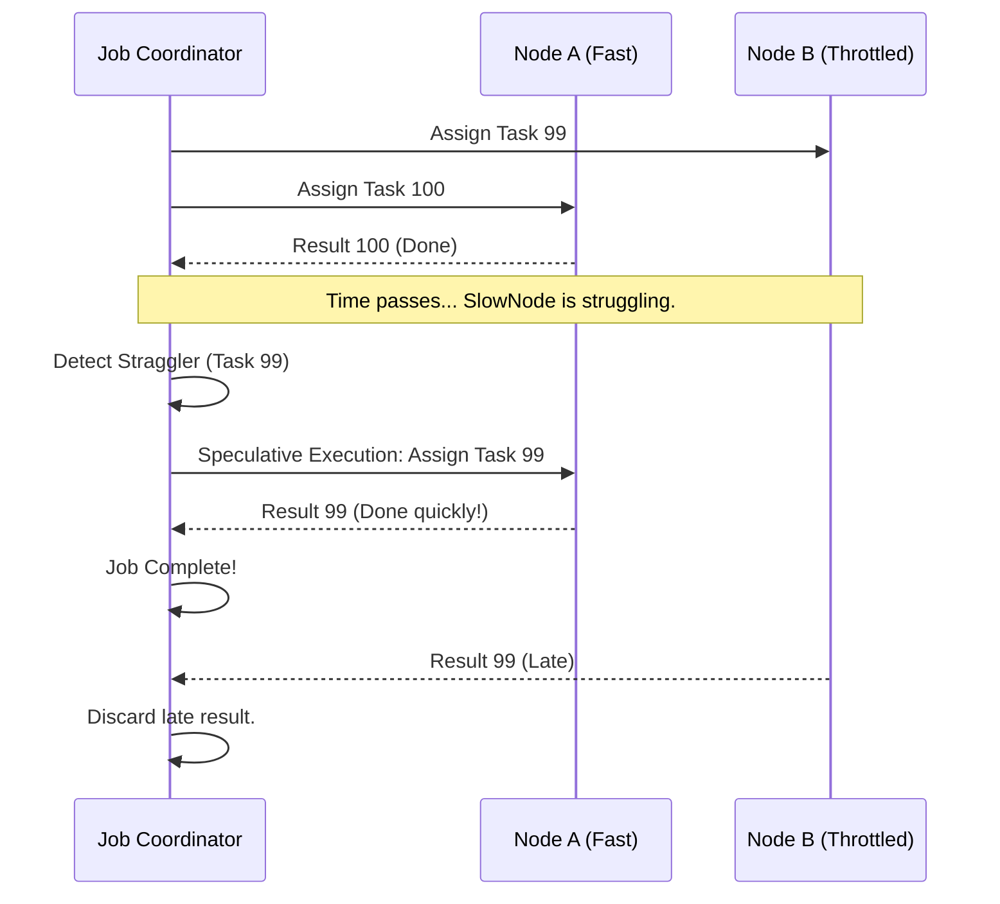

# Project Ember: Multi-Device Distributed Compute - Swarm Intelligence

## 1. Introduction: Shattering the Monolith

The previous documents in the Mythic Plan established the physical architecture of the mesh (WebRTC, DVFS) and the dynamic allocation of resources (Variable Performance Scaling). We now possess a highly connected, self-aware cluster of devices. But raw connectivity and load balancing are insufficient if the software itself cannot utilize a distributed environment. Traditional web applications—and indeed, most desktop IDEs—are inherently monolithic. They expect to execute sequentially on a single thread or a single machine's processor.

To truly unleash the power of Project Ember, we must shatter the monolithic execution model. We must teach the Graphite-Git core to think in parallel, to divide and conquer, and to operate as a swarm. 

This document, the fourth in our series, delves into the **Multi-Device Distributed Compute** engine. We will explore how Ember implements "MapReduce-in-the-Browser," orchestrates complex compilation and search tasks across multiple devices simultaneously, and maintains rigorous fault tolerance when nodes inevitably vanish from the mesh. This is the domain of Swarm Intelligence.

## 2. MapReduce in the Browser: The Ember implementation

The MapReduce programming model, originally designed for massive data centers, is perfectly suited for our heterogeneous edge mesh. In Ember, any task that requires iterating over the repository (searching, linting, compiling, AI analysis) is automatically abstracted into a MapReduce job.

### 2.1 The Coordinator and the Workers

While the mesh is peer-to-peer, a specific job requires a temporary orchestrator. When a user initiates a heavy task (e.g., "Find all instances of an insecure cryptographic hash function across the entire repository"), the node that receives the user input temporarily assumes the role of the **Job Coordinator**.

1.  **Job Definition:** The Coordinator defines the `Map` function (e.g., a WebAssembly regex search module) and the `Reduce` function (e.g., an aggregation and sorting script).
2.  **Input Splitting:** The Coordinator analyzes the DVFS (Distributed Virtual File System). It splits the repository into discrete chunks (e.g., by directory or by file size blocks). These are the input splits.
3.  **Task Distribution (The Map Phase):** The Coordinator pushes these input splits to the Distributed Task Queue (as discussed in Doc 03).
4.  **Parallel Execution:** The hungry nodes in the mesh (the Workers) steal these tasks. 
    *   *Node B (Desktop)* steals the `src/backend` split. It downloads the required file chunks from the DVFS, executes the `Map` Wasm module, and finds 15 matches.
    *   *Node C (Tablet)* steals the `src/frontend` split. It executes the `Map` module and finds 2 matches.
5.  **Intermediate Result Shuffle:** As Workers complete their Map tasks, they do not send the raw data back to the Coordinator immediately. Instead, they emit intermediate key-value pairs (`{ file_path: match_data }`). These are temporarily stored in the DVFS.
6.  **The Reduce Phase:** Once all Map tasks for a specific split are complete, the Coordinator assigns `Reduce` tasks to available nodes. The Reducers pull the intermediate data from the DVFS, aggregate it, and sort the final results.
7.  **Final Output:** The aggregated result is sent back to the Coordinator and rendered in the user's UI.

What would have taken 30 seconds of blocking computation on a smartphone is completed in 3 seconds by distributing the workload across the smartphone, a nearby tablet, and a desktop machine.

```mermaid
graph TD
    subgraph The User Interface Node (Job Coordinator)
        UI[User Input: Global Regex Search]
        Split[Input Splitter]
        Agg[Final Result Aggregator]
    end

    subgraph The Ember Swarm (Workers)
        W1[Worker 1: Desktop<br>High CPU]
        W2[Worker 2: Tablet<br>Med CPU]
        W3[Worker 3: IoT Node<br>Low CPU]
    end

    subgraph Distributed Virtual File System (DVFS)
        Repo[Full Repository Data]
        Intermediate[Intermediate K/V Store]
    end

    UI --> Split
    Split -->|Splits Repo into 100 Tasks| Q[Distributed Task Queue]
    
    Q -->|Steals 60 Tasks| W1
    Q -->|Steals 30 Tasks| W2
    Q -->|Steals 10 Tasks| W3

    W1 -.->|Reads Chunks| Repo
    W2 -.->|Reads Chunks| Repo
    W3 -.->|Reads Chunks| Repo

    W1 -->|Writes Intermediate Data| Intermediate
    W2 -->|Writes Intermediate Data| Intermediate
    W3 -->|Writes Intermediate Data| Intermediate

    Intermediate -->|Reduce Phase| Agg
    Agg -->|Render| UI
```

## 3. Distributed Compilation and AST Generation

Searching text is trivial. True IDE capabilities require compiling code and generating Abstract Syntax Trees (ASTs). Graphite-Git leverages the mesh to build a distributed compilation pipeline.

### 3.1 The Dependency Graph Challenge

Compilation is rarely embarrassingly parallel. File B might depend on File A. You cannot compile File B until File A's types have been resolved.

Ember solves this by utilizing the DVFS to maintain a live, distributed Dependency Graph.

1.  **Phase 1: Distributed AST Parsing.** When a build is triggered, the mesh uses the MapReduce model to parse *every* file into an AST in parallel. AST parsing has no dependencies; it is purely syntactic.
2.  **Phase 2: Graph Resolution.** The Coordinator nodes aggregate the ASTs and construct the semantic Dependency Graph.
3.  **Phase 3: Topological Sort & Execution.** The Coordinator performs a topological sort on the graph to determine the critical path of compilation. It then pushes compilation tasks to the Distributed Task Queue *in order of dependency resolution*. 
4.  **Caching:** As each node compiles a module, it caches the resulting byte-code or type definitions in the DVFS. If another node needs that module to compile a dependent file, it fetches the pre-compiled artifact from the DVFS rather than recompiling it.

This turns the entire mesh into a massive, distributed build cache (similar to Bazel or generic build farms), but executing entirely within the user's web browsers.

## 4. Fault Tolerance: Embracing the Chaos

A traditional server cluster assumes a relatively stable network. The Ember mesh assumes absolute chaos. Devices will run out of battery, users will close browser tabs, and cellular connections will drop without warning. If a distributed compute job fails because one node disconnects, the entire architecture is useless.

Ember implements rigorous fault tolerance using a combination of **Heartbeats, Task Timeouts, and Idempotent Operations**.

### 4.1 The Heartbeat Monitor

Every node in the mesh continuously broadcasts a lightweight UDP-like heartbeat over the WebRTC data channel. The Coordinator node monitors these heartbeats. 

If Node B (the Desktop) is currently processing 50 heavy `Map` tasks, and its heartbeat stops for more than 3 seconds, the Coordinator assumes Node B is dead or disconnected.

### 4.2 Task Re-Assignment and Idempotency

When a node is declared dead, the Coordinator immediately looks at the tasks that were assigned to it.

1.  **Task Revocation:** The Coordinator revokes the assignments and places the 50 incomplete tasks back into the Distributed Task Queue.
2.  **Re-Stealing:** Other hungry nodes (e.g., the Tablet) see the newly available tasks and steal them.
3.  **Idempotent Execution:** To ensure data integrity, every task in Ember *must* be idempotent. Running a linting task twice should yield the exact same result without corrupting the DVFS. If Node B actually completed 40 of the tasks before its network dropped, but failed to send the final acknowledgment, the Tablet will simply overwrite the intermediate data with identical results. There is no risk of double-counting or state corruption.

### 4.3 The "Straggler" Problem

Sometimes a node doesn't die, it just becomes incredibly slow (e.g., thermal throttling kicks in mid-task). This creates the "Straggler" problem, where 99% of a MapReduce job is finished, but the entire swarm is waiting for one ancient smartphone to finish its final task.

Ember implements **Speculative Execution**. If the Coordinator detects that a job is nearing completion, but one node is executing a task significantly slower than the median task completion time, the Coordinator will duplicate that task and push it to the queue for a faster node to steal. Whichever node (the slow one or the fast one) returns the result first "wins," and the other result is discarded. This dramatically reduces the tail latency of distributed jobs.



## 5. Security and Sandboxing the Swarm

When you allow arbitrary devices to execute code on behalf of the mesh, security becomes paramount. As established in Doc 03, all distributed compute happens within WebAssembly sandboxes running in Web Workers.

However, Swarm Intelligence requires further hardening:
*   **Cryptographic Task Signatures:** Every task placed in the Distributed Task Queue is cryptographically signed by the Coordinator using its private mesh key. A rogue node cannot inject malicious tasks into the queue.
*   **Result Verification:** For highly sensitive operations (e.g., compiling a production binary), Ember can employ redundant execution. The Coordinator assigns the exact same task to three different, untrusted nodes. The Coordinator only accepts the result if at least two nodes return an identical, cryptographically hashed output (a basic Byzantine Fault Tolerance mechanism).

## 6. Conclusion: The Living Machine

Multi-Device Distributed Compute transforms the Ember mesh from a synchronized file system into a living, breathing computational entity. By implementing browser-based MapReduce, distributed compilation, and aggressive fault tolerance, we have created an environment where the failure of individual components does not affect the operation of the whole. 

The swarm thinks, computes, and heals itself.

But raw computation is merely processing. It lacks insight. It lacks creativity. In the next document, **05_AI_Agent_Symbiosis_Gemini_Mesh_Overseer**, we will introduce the final catalyst: the Google Gemini model. We will explore how the AI agent is integrated not just as a chatbot, but as the central nervous system of the swarm, orchestrating tasks, predicting user intent, and elevating Project Ember from a tool into a collaborative engineering partner.
