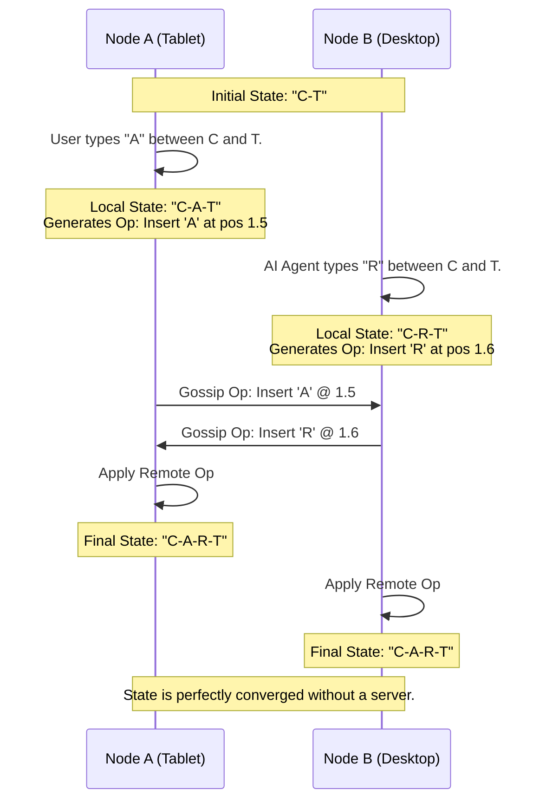

# Project Ember: Data Synchronization - The Quantum Ledger

## 1. Introduction: The Crisis of Consensus

In a centralized architecture, state is trivial. The server is the absolute source of truth. If a database says the value is "X", the value is "X". The clients are merely dumb terminals rendering whatever the server dictates. 

Project Ember’s Edge-Compute Mesh completely destroys this simplicity. When a user is running Graphite-Git on their Desktop, Tablet, and Smartphone simultaneously, there is no central server. What happens when the user edits line 42 of `App.tsx` on their Tablet, while simultaneously, the AI Overseer (running on the Desktop) refactors line 45 of the same file? What happens when the Smartphone drops offline, the user makes changes, and then it reconnects to the mesh three hours later?

Without a rigorous, mathematically sound synchronization protocol, the Distributed Virtual File System (DVFS) will instantly fracture into a chaotic mess of merge conflicts and corrupted data. 

This document, the sixth in the Mythic Plan, details **The Quantum Ledger**. We will explore how Project Ember utilizes Conflict-free Replicated Data Types (CRDTs), Merkle DAGs (Directed Acyclic Graphs), and eventual consistency models to guarantee that no matter how chaotic the network becomes, the swarm will always converge on a single, mathematically provable reality.

## 2. The Failure of Traditional Synchronization

Before we explain the solution, we must understand why traditional methods fail in a peer-to-peer mesh.

*   **Operational Transformation (OT):** Used by Google Docs. It requires a central server to order operations. If two clients edit simultaneously, the server decides which edit happened "first" and transforms the other edit to match. *Ember has no central server.*
*   **Git-style Merge:** Git is fantastic for large, asynchronous commits. But Git is not designed for real-time, character-by-character synchronization. If every keystroke required a `git commit` and `git merge`, the system would grind to a halt under the weight of I/O overhead.
*   **Last-Write-Wins (LWW):** The crudest method. Whichever device has the latest timestamp overwrites the others. This destroys data in collaborative or multi-agent scenarios.

## 3. Conflict-free Replicated Data Types (CRDTs)

The foundation of the Quantum Ledger is the CRDT. A CRDT is a data structure designed specifically for distributed systems. It guarantees **Strong Eventual Consistency**. This means that if two nodes have applied the exact same set of updates—regardless of the *order* in which those updates were received—they are mathematically guaranteed to be in the exact same state.

### 3.1 Text Editing as a Sequence CRDT

In Graphite-Git, text editing is the most critical operation. Ember implements a Sequence CRDT (similar to Yjs or Automerge) for all code files in the DVFS.

Instead of representing `App.tsx` as a contiguous string of text, the CRDT represents it as a doubly-linked list of characters, where each character has a unique, immutable fractional index.

1.  **Unique Identifiers:** When the Tablet inserts the letter "A", it is assigned a globally unique ID (e.g., `Tablet-ID:Clock-1`) and a fractional position between the adjacent characters.
2.  **Commutative Operations:** If the Desktop concurrently inserts the letter "B" nearby, it also gets a unique ID and fractional position.
3.  **The Gossip Merge:** The Tablet and Desktop exchange these minimal insertion/deletion operations via the WebRTC gossip protocol (described in Doc 02).
4.  **Automatic Convergence:** Because the operations are commutative, both devices apply the remote operations to their local CRDT. The math guarantees that "A" and "B" will end up in the exact same order on both devices, without any human intervention or merge conflict dialogues.

### 3.2 State Vectors and Delta Sync

Transmitting the entire CRDT history for every file is inefficient. Ember uses State Vectors (logical clocks) to determine exactly what information a node is missing.

When a Smartphone reconnects to the mesh after being offline:
1.  The Smartphone sends its State Vector: *"I have Tablet's edits up to clock 50, and Desktop's edits up to clock 120."*
2.  A connected node evaluates this vector against its own history.
3.  The node generates a highly compressed "Delta" containing only the specific operations the Smartphone missed (e.g., Tablet clocks 51-60).
4.  The Delta is streamed over WebRTC. The Smartphone applies it and is instantly caught up.

## 4. The Merkle DAG: Cryptographic Proof of State

While CRDTs handle the micro-level synchronization of characters within a file, we need a macro-level system to track the state of the entire repository (thousands of files and directories).

Project Ember utilizes a Merkle DAG (Directed Acyclic Graph), heavily inspired by Git's internal architecture, but optimized for the real-time mesh.

### 4.1 Content Addressing the DVFS

Every entity in the DVFS is content-addressed.
*   **Blob:** The content of a file. Its ID is the SHA-256 hash of its contents.
*   **Tree:** A directory. It contains a list of Blobs and other Trees, along with their hashes. The Tree's ID is the hash of this list.
*   **Root Hash:** The ultimate hash representing the exact state of the entire repository at a given millisecond.

Whenever a CRDT operation modifies a file, that file's hash changes. This cascades up the directory structure, resulting in a new Root Hash for the repository.

### 4.2 The Quantum Ledger Verification

The Merkle DAG provides the "Quantum Ledger"—a cryptographically secure, immutable record of reality.

1.  **The Mesh Root:** Every node in the mesh continuously calculates the Root Hash of its local DVFS.
2.  **The Heartbeat Check:** During the WebRTC heartbeat (described in Doc 04), nodes broadcast their current Root Hash.
3.  **Instant Consensus:** If Node A and Node B have the exact same Root Hash, they mathematically *must* have the exact same repository state. No further checks are required.
4.  **Detecting Divergence:** If Node C broadcasts a different Root Hash, the mesh instantly knows Node C is out of sync. 
5.  **Efficient Reconciliation:** Node A and Node C perform a quick binary search down their Merkle trees. They compare the hashes of their top-level directories, then subdirectories, until they pinpoint the exact file that differs. Node A then generates a CRDT Delta for that specific file and sends it to Node C.

## 5. Bridging the Gap: CRDTs to Git Commits

The Ember mesh operates in a state of fluid, real-time synchronization via CRDTs. However, the ultimate cold storage and permanent record for any software project is a standard Git repository hosted on GitHub.

The Quantum Ledger must translate the chaotic, real-time CRDT state into immutable, sequential Git commits.

### 5.1 The Snapshot Mechanism

Project Ember does not commit every single keystroke to GitHub. That would pollute the git history. Instead, Ember uses a snapshotting mechanism.

1.  **The Trigger:** A snapshot is triggered either manually by the user clicking "Commit", or autonomously by the AI Overseer when it completes a discrete logical task (e.g., "Feature complete: Added Redis Cache").
2.  **The Freeze:** The Coordinator node for the commit operation takes the current CRDT state and "freezes" it, extracting the raw text for all files.
3.  **The Git Translation:** The Coordinator utilizes the browser-based `isomorphic-git` library. It hashes the raw text to create Git Blobs, builds the Git Trees, and creates a Git Commit object.
4.  **The Push:** The Coordinator utilizes the user's stored GitHub token to push this new commit to the remote GitHub repository via the REST/GraphQL API.

### 5.2 Handling Offline Git Operations

Because Ember is offline-first, a user might create several commits while completely disconnected from the internet.

These offline commits are stored in the local DVFS as standard Git objects. When the node reconnects to the internet (even if it cannot find the rest of the P2P mesh), it simply pushes the queued commits directly to GitHub. When the other mesh nodes reconnect, they pull the updated Git history from GitHub, which serves as the ultimate arbiter of state resolution if the real-time CRDT mesh completely collapses.

## 6. Garbage Collection and Tombstones

A major challenge with CRDTs is that they grow indefinitely. Because they must retain the history of operations to ensure commutative merges, deleted text is not truly deleted; it is marked with a "tombstone." Over time, an actively edited file can consume massive amounts of memory.

Project Ember implements an aggressive, distributed Garbage Collection (GC) protocol.

1.  **The Epoch:** Periodically (e.g., after every successful Git push to GitHub), the mesh declares a new "Epoch."
2.  **The Consensus:** If all active nodes in the mesh acknowledge that they have successfully synced up to the new Epoch, the history prior to that Epoch is no longer needed for CRDT conflict resolution.
3.  **The Purge:** The nodes safely delete the tombstones and compress the CRDT state down to its raw text representation, reclaiming memory while preserving perfect synchronization capability for future edits.

## 7. Conclusion: The Immutable Swarm

The Quantum Ledger is the mathematical bedrock that allows Project Ember to exist. By combining the strong eventual consistency of CRDTs with the cryptographic verification of Merkle DAGs, we have created a Distributed Virtual File System that is immune to network partitions, offline devices, and simultaneous multi-agent editing.

The swarm can shatter into a dozen disconnected nodes, and when they reconnect, the math guarantees they will seamlessly weave their disparate realities back into a single, unified state.

We have built a decentralized, highly performant, AI-orchestrated supercomputer in the browser. But such power, if left unsecured, is a massive vulnerability. In the next document, **07_Security_Local_First_Zero_Trust_Mesh**, we will explore the paranoid security architecture required to protect the user's code, API keys, and compute resources from malicious actors and compromised nodes.
