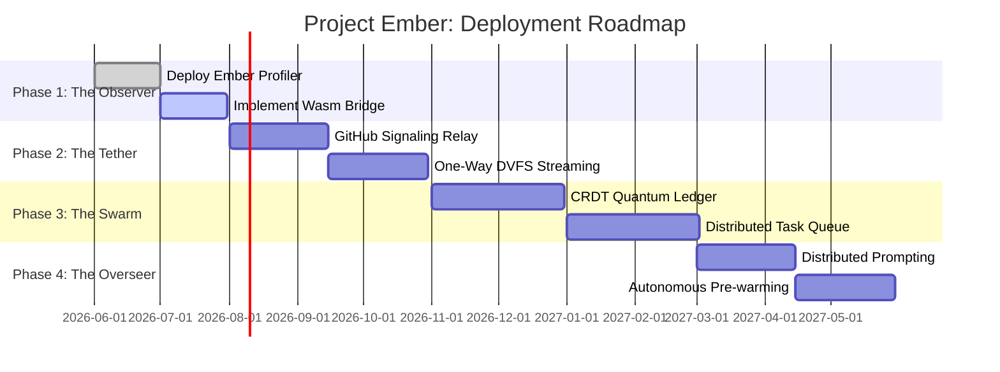

# Project Ember: The Deployment Roadmap & Future Horizon

## 1. Introduction: From Blueprint to Reality

Over the course of the previous seven documents, we have outlined the "Mythic Plan"—a deeply technical, radically ambitious architecture designed to transform Graphite-Git from a local-first GitHub client into Project Ember: a cross-platform, multi-device, AI-orchestrated mesh compute engine.

We have detailed the WebRTC peer-to-peer topology (Doc 02), the Variable Performance Scaling algorithms (Doc 03), the browser-based MapReduce swarm (Doc 04), the Gemini AI Overseer integration (Doc 05), the CRDT-based Quantum Ledger (Doc 06), and the paranoid Zero-Trust Security architecture (Doc 07).

The theory is sound. The mathematics are proven. The protocols exist. 

This final document, the eighth in the series, translates this grand vision into a highly pragmatic, phased execution strategy. We will outline the **Deployment Roadmap**, detailing how we migrate from the current Graphite-Git v1 codebase to the fully realized Project Ember v1 without disrupting existing users. We will also cast our gaze toward the **Future Horizon**, exploring the ultimate, world-altering potential of this technology.

## 2. The Migration Strategy: Evolution, Not Revolution

Rewriting Graphite-Git from scratch is a trap that would result in years of stagnation. Instead, Project Ember will be implemented via a Strangler Fig pattern, progressively enveloping and replacing the existing architecture while maintaining full backwards compatibility.

### 2.1 Phase 1: The Observer (Months 1-2)

The goal of Phase 1 is not to build the mesh, but to build the instrumentation required to understand the user's environment. We must validate the assumptions made in Doc 03 regarding device heterogeneity.

*   **Milestone 1.1: Deploy the Ember Profiler.** Introduce the background Web Worker into the existing Graphite-Git client. It will begin silently benchmarking CPU, memory, and battery states, logging this data locally (without transmitting it, preserving privacy).
*   **Milestone 1.2: Implement the Wasm Bridge.** Refactor the existing heavy Git operations (currently relying on JavaScript implementations) to utilize WebAssembly modules. This establishes the foundation for sandboxed execution (Doc 07).
*   **Milestone 1.3: Opt-in Telemetry.** Allow users to opt-in to an anonymous "Swarm Readiness" telemetry program, providing aggregate data on browser capabilities and local network NAT strictness to help us tune the WebRTC STUN/TURN fallback logic.

### 2.2 Phase 2: The Tether (Months 3-5)

Phase 2 introduces the first multi-device capability, but in a highly restricted, primary/secondary model rather than a full peer-to-peer mesh. This allows us to test the WebRTC signaling and DVFS mechanics in a controlled environment.

*   **Milestone 2.1: The GitHub Signaling Relay.** Implement the `.ember-mesh-signals` repository logic (Doc 02) to allow a user's Smartphone to discover their Desktop.
*   **Milestone 2.2: The One-Way DVFS.** Allow the Smartphone (Secondary Node) to request read-only file chunks from the Desktop (Primary Node) over WebRTC. The Smartphone acts as a remote viewport into the Desktop's memory.
*   **Milestone 2.3: Remote UI Rendering.** Prove that the Smartphone can smoothly render a syntax-highlighted file of 10,000 lines by streaming chunks from the Desktop, rather than crashing the mobile browser.

### 2.3 Phase 3: The Swarm (Months 6-9)

This is the crucible. Phase 3 transforms the tethered devices into a true, multi-way peer-to-peer mesh.

*   **Milestone 3.1: The CRDT Quantum Ledger.** Replace the existing, simplistic React Context state management with the Sequence CRDT engine (Doc 06). All text editing now happens via commutative operations.
*   **Milestone 3.2: Multi-Way Synchronization.** Allow both the Desktop and the Smartphone to edit the same file simultaneously, verifying that the CRDTs converge perfectly over the WebRTC data channels.
*   **Milestone 3.3: Distributed Task Queue.** Implement the Work Stealing algorithm (Doc 03). Allow the Smartphone to trigger a repository-wide search, and have the Desktop node steal the Map tasks, execute them, and return the results.

### 2.4 Phase 4: The Overseer (Months 10-12)

The final phase elevates the AI from a chatbot into the mesh orchestrator.

*   **Milestone 4.1: Distributed Prompting.** Implement the capability to chunk large repositories, distribute the prompt evaluation across multiple devices, and synthesize the results (Doc 05).
*   **Milestone 4.2: Semantic Caching.** Deploy the local embedding models to power the Distributed Semantic Cache, drastically reducing Gemini API calls for repeated queries.
*   **Milestone 4.3: Autonomous Pre-warming.** Grant the Gemini Overseer read-only access to the Profiler matrix and user intent, allowing it to autonomously inject compilation and indexing tasks into the Distributed Task Queue.

## 3. Observability in the Dark

Debugging a monolithic backend application is difficult. Debugging a decentralized, ephemeral, peer-to-peer mesh network operating inside unprivileged web browsers is a nightmare.

If a distributed compilation task fails silently, how do we know if it was a CRDT sync issue, a WebRTC disconnect, a thermal throttling event, or a Wasm memory leak?

Project Ember must build an unprecedented "Observability Plane" that is as decentralized as the compute engine itself.

### 3.1 The Time-Travel Debugger

Because the entire repository state is stored in a Merkle DAG (The Quantum Ledger), Ember inherently possesses a perfect historical record of all state transitions.

If a bug occurs, the developer can enter "Time-Travel Mode." The UI reads the Merkle history and rewinds the entire mesh state—including the exact positions of cursors, the contents of the task queue, and the capability matrix of every node—to the millisecond before the failure. 

### 3.2 Mesh-Wide Trace IDs

Every action, whether initiated by the user or the AI Overseer, is assigned a cryptographically unique Trace ID. When a MapReduce job shatters into 50 sub-tasks across 3 devices, every sub-task carries that Trace ID.

The local logs of every device are indexed by these Trace IDs. If a user opts to share a crash report, the mesh aggregates the logs associated with that specific Trace ID from all participating devices, providing a complete, synchronized timeline of the distributed event.

## 4. The Future Horizon: Beyond the Code

If we successfully execute this Mythic Plan, Project Ember will redefine the software engineering workflow. But the implications of a browser-based, AI-orchestrated mesh supercomputer extend far beyond just writing code.

### 4.1 The Serverless Data Center

Currently, Ember is designed to manage code repositories. But the underlying architecture—the DVFS, the Work Stealing queue, the Wasm sandbox—is agnostic to the data type.

Imagine a future where Project Ember is used by scientists to process massive datasets. A researcher opens Ember. They load a multi-terabyte genomic dataset. The dataset is instantly sharded across the DVFS. The researcher writes an analysis script. The AI Overseer breaks the script into MapReduce tasks. The compute is distributed not just across the researcher's devices, but across a massive, secure, opt-in swarm of thousands of university computers running the Ember client in the background.

We will have accidentally built the most efficient, decentralized, and accessible supercomputer in human history.

### 4.2 The Sentient Mesh

As the Gemini models evolve, the role of the Overseer will expand. Currently, the Overseer predicts user intent and pre-warms caches. In the future, the Overseer will become a true, autonomous participant in the engineering process.

The AI will not just review code; it will propose architectural refactors, create its own feature branches in the DVFS, run the distributed test suites to verify its own logic, and present the user with a fully functional, mathematically proven Pull Request. The mesh will begin to write itself.

## 5. Conclusion: The Ignition

Project Ember is not merely a software update. It is a fundamental paradigm shift. We are rejecting the centralized dogma of the cloud. We are reclaiming sovereignty over our data and our compute. We are treating the physical constraints of our devices not as limitations, but as variables in a fluid, elegant equation.

Graphite-Git was the spark. Project Ember is the conflagration. 

The architecture is defined. The security is absolute. The roadmap is clear. 

Initialize the nodes. The swarm is waiting.
