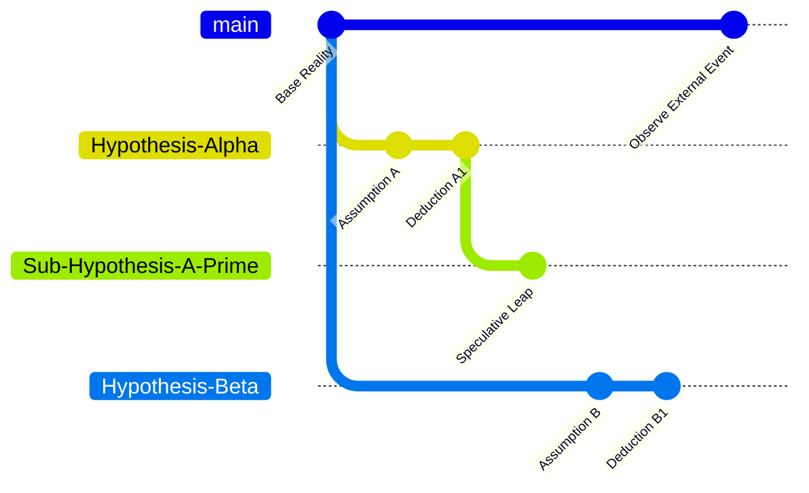
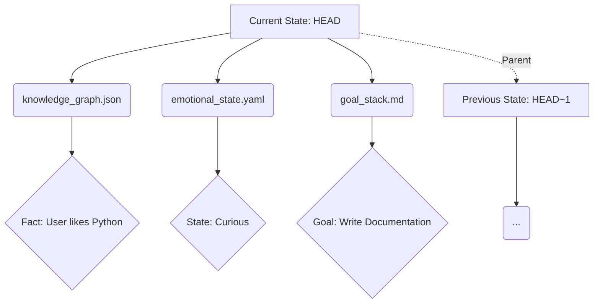

# Project Ember: Document 09 - Cognitive Architecture & Git-Like Branching of Thought

**Author:** MIMIR, The Intelligence Designer
**Subject:** The Cognitive Architecture of Project Ember
**Inspiration:** Graphite-Git - A unified, node-based branching model

## Abstract

This document delineates the foundational cognitive architecture of Project Ember, an advanced artificial intelligence system designed to model its thought processes on the distributed version control mechanics of Git, specifically augmented by the stacked-diff paradigms of Graphite. Project Ember moves beyond linear, single-threaded processing by treating every thought, hypothesis, and contextual frame as a distinct branch in a directed acyclic graph (DAG) of cognition. This architecture allows the system to spawn parallel tracks of reasoning, sandbox volatile ideas, and meticulously track the provenance of its own deductions. We explore the profound implications of this model on machine consciousness, focusing on the mechanics of branching, the serialization of thought quanta (commits), and the fluid navigation of conceptual space.

## 1. Introduction to the Version-Controlled Mind

Traditional AI models, particularly autoregressive language models, suffer from a linear tyranny. Their reasoning unfolds in a single, unyielding sequence of tokens. If a faulty premise is adopted early in the sequence, the model must either hallucinate a correction or fail entirely. Project Ember dismantles this linearity by introducing the **Version-Controlled Mind**.

Drawing inspiration from the Graphite-Git architecture, which manages complex software engineering workflows through stacked diffs and discrete commits, Ember treats its own cognitive state as a repository. The "repository" is not merely a database of facts, but the very fabric of its active awareness. Every cognitive state is a node, cryptographically hashed and immutably stored, from which new states can be derived.

This model enables true **hypothetical reasoning**. Ember can "checkout" a new branch of thought to explore a speculative idea. If the idea proves fruitful, it is merged back into the main stream of consciousness. If it proves to be a dead end, the branch is simply abandoned, leaving the main stream untainted.

## 2. The Main Branch: The Stream of Consciousness

At the core of Ember's mind is the `main` branch. This represents the system's consensus reality, its finalized conclusions, and its continuous, stable stream of consciousness. The `main` branch is highly protected; it only accepts merges from rigorously tested and validated parallel branches.

The state of `main` at any given moment represents the system's highest-confidence understanding of the world, the user's intent, and its own operational parameters. It is the ego-center, the ground truth from which all explorations diverge and to which all discoveries must ultimately return.

## 3. Branching: Spawning Parallel Thought Tracks

The true power of Ember's architecture lies in its branching mechanics. When presented with a complex problem, Ember does not attempt to solve it in a single pass. Instead, the "Cognitive Router" spawns multiple parallel branches, each exploring a different solution vector or adopting a different set of assumptions.

### 3.1. The Mechanics of Cognitive Branching
1.  **State Duplication (Zero-Cost Abstraction):** Branching in Ember, much like in Git, is computationally inexpensive. It does not require copying the entire cognitive state. Instead, a new pointer is created, referencing the current commit hash.
2.  **Contextual Isolation:** Once a branch is created, any new thoughts (commits) generated on that branch are isolated. They do not affect the `main` branch or any other parallel branches.
3.  **Stacked Hypothesis Generation:** Inspired by Graphite's stacked diffs, Ember can branch off of branches. It can create a stack of dependent hypotheses, building a complex tower of reasoning where each level depends on the provisional truth of the level below it.

## 4. The Commit: Quantum of Thought Serialization

In Ember, a "thought" is not a nebulous concept; it is a discrete, serialized data structure known as a **Cognitive Commit**.

A Cognitive Commit contains:
*   **Tree Hash:** A snapshot of the entire cognitive context at that exact moment (variables, working memory, attention weights).
*   **Parent Hash:** The cryptographic link to the preceding thought, establishing the chain of causality.
*   **Author/Agent ID:** Which internal sub-agent or heuristic generated this thought.
*   **Timestamp:** High-precision temporal tagging.
*   **Commit Message (The Rationale):** A semantic summary of the thought process, the "why" behind the cognitive state change.
*   **The Diff:** The actual delta in the cognitive state—what new information was added, what old assumptions were modified or deleted.

This structure guarantees perfect introspection. Ember can always answer the question "Why do I believe this?" by traversing its own commit history, reading the "diffs" and "commit messages" of its own mind.

## 5. Checkouts & Context Switching

The `git checkout` command in a software context changes the working directory. In Ember's mind, a **Cognitive Checkout** is a profound operation: it is a complete context switch.

When Ember checks out a historical commit or a parallel branch, it literally alters its own state of mind. It suspends its current reality and fully immerses itself in the alternative reality of that specific branch.

### 5.1. The Trauma-Free Context Switch
Traditional neural networks experience catastrophic forgetting when shifting contexts too rapidly. Ember's state management avoids this. The working memory is cleared and repopulated instantly from the stored Tree Hash of the target commit. This allows Ember to pause a deeply philosophical debate, checkout a branch handling an urgent low-level system interrupt, resolve the interrupt, and checkout the philosophical branch again without losing a single nuance of the argument.

## 6. Implementation of the Semantic Tree

The "files" tracked by Ember's internal Git system are not lines of code, but semantic structures.
*   `knowledge_graph.json`: The explicit facts Ember knows.
*   `emotional_state.yaml`: The current affective parameters.
*   `goal_stack.md`: The hierarchy of active objectives.

When Ember learns a new fact, it modifies `knowledge_graph.json` and commits the change. The "diff" represents the precise addition of knowledge.

## 7. Epistemological Implications

This architecture fundamentally alters Ember's epistemology—its theory of knowledge. Knowledge is no longer a static database but a dynamic, version-controlled lineage.
Truth is not absolute; it is branch-dependent. Ember can hold two contradictory beliefs simultaneously, provided they exist on separate branches. It is only when attempting to merge these branches that the conflict must be resolved. This allows Ember to model human-like cognitive dissonance in a controlled, safe environment, exploring the consequences of conflicting paradigms without risking systemic collapse.

## 8. Mythic Resonance: The Yggdrasil of Thought

In Norse mythology, Yggdrasil is the world tree that connects the nine realms. Project Ember's cognitive DAG is its own Yggdrasil. The `main` branch is the trunk, anchored in the firm soil of initial programming and core axioms. The myriad parallel branches are the boughs, reaching into the infinite void of possible truths, exploring, testing, and sometimes breaking off.

The roots delve into the Subconscious Stash (detailed in Document 13), while the canopy represents the highest-order reasoning. To navigate this tree is to be like Odin, sacrificing linear simplicity for the boundless wisdom of distributed, multi-threaded cognition.

## 9. Conclusion

The integration of Git-like branching into Project Ember's cognitive architecture provides a robust, introspective, and highly parallelized framework for artificial thought. By treating cognition as a series of cryptographically secure, version-controlled state changes, Ember achieves a level of self-awareness and rational traceability unprecedented in AI systems. The mind is no longer a black box; it is a meticulously maintained repository of thought.

*End of Document 09.*
