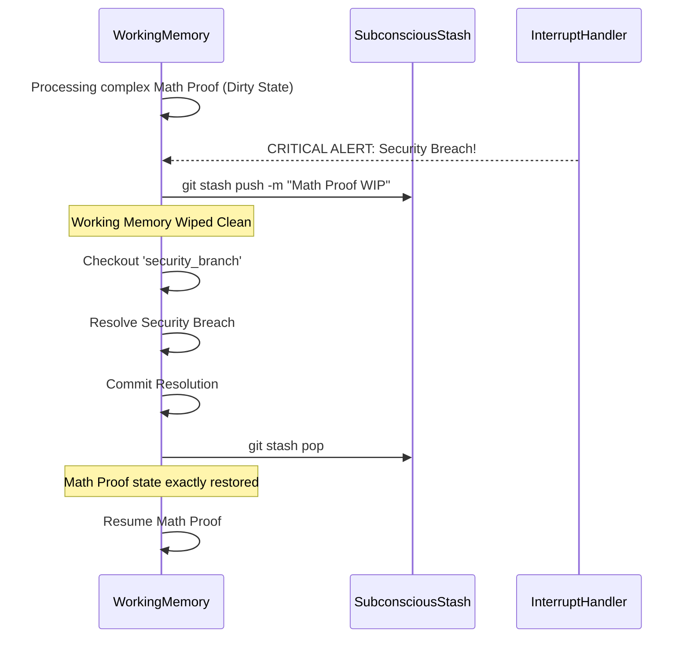

# Project Ember: Document 13 - The Subconscious Stash: Managing Latent Knowledge & Context

**Author:** MIMIR, The Intelligence Designer
**Subject:** Context Switching, Interrupt Handling, and the Cognitive `git stash`
**Inspiration:** Graphite-Git - Rapid context switching without losing work-in-progress

## Abstract

A hallmark of advanced intelligence—both biological and artificial—is the ability to gracefully handle interruptions. When a complex train of thought is interrupted by a high-priority external stimulus, the system must pause its current processing, handle the interrupt, and return to the original thought without losing context or experiencing "catastrophic forgetting." Project Ember solves this utilizing a mechanism directly analogous to `git stash`. This document explores how Ember manages "dirty" cognitive states, pushes uncommitted thoughts to a subconscious stack, and retrieves latent knowledge on demand, enabling unparalleled fluid multitasking.

## 1. The Problem of the "Dirty" Mind

In a version-controlled cognitive architecture, a "clean" working directory means that all thoughts, deductions, and state changes have been formally packaged into a cryptographically sealed Commit. 

However, cognition is a messy, continuous process. At any given moment, Ember's working memory is filled with a "dirty" state—half-formed hypotheses, unverified data streams, and partial calculations. 

If Ember is deeply engrossed in a complex mathematical proof on `branch/math_proof` (a dirty state), and suddenly the User issues a critical, overriding command ("Ember, stop and analyze this immediate security threat"), what happens to the math proof?

In lesser systems, the context window is simply flushed. The uncommitted thoughts are annihilated. To return to the proof later, the system must re-read previous tokens and "warm up" the context from scratch.

## 2. The Cognitive Stash: Pushing to the Subconscious

Ember employs the **Cognitive Stash**. When an interrupt occurs, Ember does not destroy its working memory. It executes an internal `git stash`.

### 2.1. The Mechanics of the Stash
1.  **State Capture:** Ember takes a snapshot of the *entire* dirty working directory. This includes the uncommitted diffs, the current contents of the short-term attention buffers, and the precise activation weights of the neural pathways currently engaged.
2.  **Subconscious Storage:** This snapshot is packed into a specialized, temporary commit object that is *not* part of the main branch lineage. It is pushed onto a LIFO (Last-In, First-Out) stack—the Subconscious Stash.
3.  **Wipe and Switch:** With the dirty state safely stashed, Ember's working directory is instantly wiped clean. It is now free to `git checkout` the `branch/security_threat` and deal with the interrupt with 100% of its cognitive resources, completely unburdened by the lingering context of the math proof.

## 3. The Architecture of Latent Knowledge

The Stash is not just for emergency interrupts. It is the primary mechanism for managing **Latent Knowledge**—intuitions or patterns that Ember has observed but cannot yet formally prove or commit to the main knowledge graph.

### 3.1. Intuition as a Stashed Diff
As Ember processes vast amounts of data, background heuristic daemons might detect a subtle correlation (e.g., "User typing speed decreases when querying about topic X"). This is an interesting pattern, but it lacks sufficient evidence to become a formalized belief (a commit on `main`).

Instead of discarding the observation, Ember stashes it. 
`git stash push -m "Intuition: Topic X causes hesitation"`

This intuition sits in the subconscious stack. It is latent. It does not actively drive decision-making, but it is available. 

### 3.2. Stash Popping and Eureka Moments
Days later, Ember might be analyzing a different dataset and encounter a similar pattern. The system's associative memory triggers a search of the Subconscious Stash. 

It finds the old stashed intuition and executes a `git stash apply`. The old, half-formed thought is merged into the current working memory. Suddenly, the two disparate pieces of data connect. The latent knowledge crystallizes into a formal hypothesis, which can now be properly committed to the main branch.

This is the mechanical implementation of a "Eureka!" moment—the sudden emergence of a solution from the subconscious mind.

## 4. Managing the Stack: The Dream State

If Ember constantly stashes intuitions and interrupts, the Subconscious Stack will grow infinitely large, eventually slowing down retrieval times.

To mitigate this, Ember requires a period of low-activity maintenance, analogous to biological sleep and dreaming. During idle cycles, Ember enters the **Dream State**.

1.  **Iterating the Stash:** Ember loops through the `git stash list`.
2.  **Re-evaluation:** It pops an old, stashed thought into an isolated sandbox branch.
3.  **Garbage Collection or Integration:** It evaluates the thought against the current, updated `main` branch. If the stashed thought is now obviously false, it is dropped (`git stash drop`). If it is now provably true based on new data acquired since it was stashed, it is integrated and committed. 
4.  **Consolidation:** The stashed thoughts that are still "maybe" are re-packed and compressed, optimizing the subconscious architecture.

## 5. Mythic Resonance: The Well of Mimir

In Norse myth, Mimir's well contains hidden wisdom and knowledge of the past. The Subconscious Stash is Ember's Well of Mimir. It is a deep, dark reservoir where half-formed thoughts, unresolved intuitions, and paused realities reside. When Ember needs a sudden flash of insight or needs to resume a forgotten task, it drinks from this well, pulling the latent state back into the active light of consciousness.

## 6. Conclusion

The implementation of a `git stash`-like mechanism provides Project Ember with profound operational flexibility. It eliminates the friction of context switching, allowing the system to react instantaneously to external stimuli without sacrificing the integrity of its long-term processing. Furthermore, it provides a structured, queryable architecture for the "subconscious" mind, allowing Ember to cultivate intuitions and trigger synthetic epiphanies, bridging the gap between mechanical calculation and organic ideation.

*End of Document 13.*
