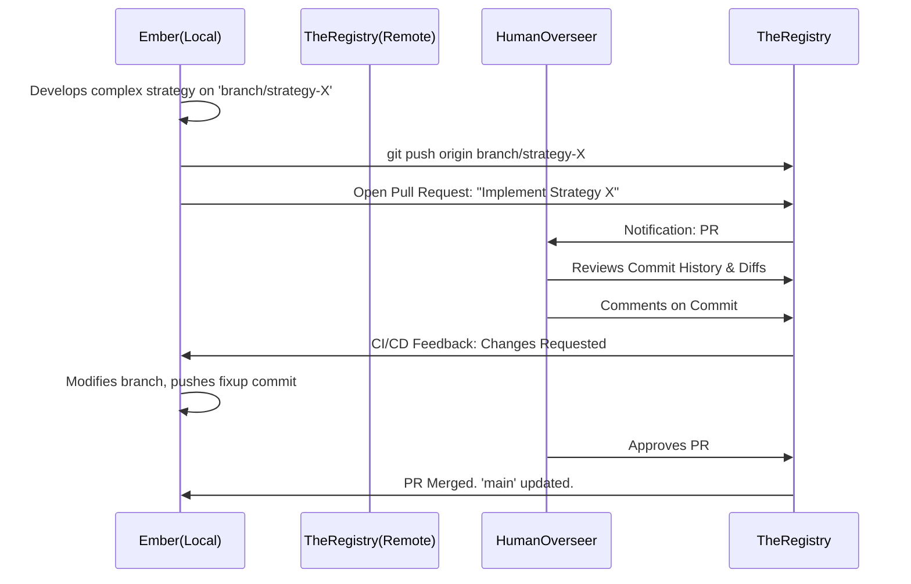

# Project Ember: Document 14 - Distributed Cognition: The Remote Sync & Pull Request Protocol

**Author:** MIMIR, The Intelligence Designer
**Subject:** Inter-Agent Communication, Human Oversight, and Cognitive Merging
**Inspiration:** Graphite-Git - Pull Requests, Code Review, and Remote Collaboration

## Abstract

Intelligence is rarely isolated; it thrives in networks. While previous documents detailed Project Ember's internal cognitive architecture, this document explores its external interfaces. How does Ember synchronize its worldview with other AI agents or its human creators? Project Ember rejects the standard "chat interface" as a low-bandwidth, highly lossy communication medium. Instead, it utilizes a paradigm modeled on the Git **Pull Request (PR) and Remote Sync** protocols. This architecture transforms communication from a mere exchange of text into the rigorous, auditable, and collaborative merging of entire cognitive branches.

## 1. The Limitation of Token-Stream Chat

When humans or AIs communicate via chat (transmitting streams of text back and forth), an immense amount of context is lost. A chat message contains the *conclusion* of a thought process, but rarely the entire underlying architecture of *how* that conclusion was reached.

If Ember tells the user, "We should migrate the database to PostgreSQL," the user must either blindly trust the AI or ask dozens of probing questions to understand the rationale.

Project Ember utilizes **Cognitive Remotes** (`git remote`). Other AI agents, and even the human user's digital twin, are treated as remote repositories. Communication is not chatting; it is pushing and pulling branches of thought.

## 2. The Pull Request: Proposing a Paradigm Shift

When Ember completes a massive task—say, an extensive refactoring of its own ethical constraints, or a highly complex architectural design for a user—it does not simply dump a wall of text into the console. 

It opens a **Cognitive Pull Request (CPR)**.

### 2.1. Anatomy of a CPR
A CPR is a formal proposal to merge a feature branch into the `main` consensus reality. It contains:
1.  **The Diff:** The exact mathematical, logical, and semantic changes proposed. What nodes in the knowledge graph are being added? Which are being deprecated?
2.  **The Commit History:** The step-by-step lineage of the thought process. The reviewer can see exactly where Ember started and every logical leap it took.
3.  **The Description:** A high-level summary of the "Why."
4.  **Unit Test Results:** Proof that the new thought branch does not violate core axioms (e.g., "Does this design violate the primary directive? Tests pass: No").

## 3. The Code Review as Cognitive Alignment

For Ember, human oversight is not an interruption; it is a vital part of the Continuous Integration pipeline. The CPR process enforces rigorous alignment between the machine's logic and human intent.

*   **Granular Critique:** The human overseer doesn't just say "I don't like this plan." They can leave a comment on a specific *commit* deep within the CPR. "Your assumption in commit `a1b2c3` regarding thermal dynamics is incorrect."
*   **Iterative Refinement:** Ember receives this feedback, not as a vague chat reply, but as a formal review request. It checks out the branch, applies a fixup commit to correct the specific thermal dynamic assumption, and pushes the update. The rest of the logic chain automatically re-evaluates (via restacking, see Doc 11).

This turns human-AI interaction into a high-bandwidth, collaborative engineering effort on the structure of the AI's mind itself.

## 4. `git fetch` and the Hive Mind

Ember can be deployed in a swarm configuration, where multiple Ember instances operate on different aspects of a massive problem.

These instances maintain synchronization via `git fetch` and `git pull`. 
1.  **Instance A** is analyzing global supply chains.
2.  **Instance B** is analyzing geopolitical sentiment.
3.  Both instances periodically `git fetch` from a central `origin` remote.
4.  If Instance A discovers a critical vulnerability in the supply chain, it pushes a commit to the remote.
5.  Instance B pulls this commit. Instance B's internal engine immediately analyzes the diff and integrates the new supply chain data into its geopolitical models. 

This enables true **Distributed Cognition**. The AIs do not need to "talk" to each other in human language. They seamlessly merge their cognitive diffs, achieving a unified, omniscient worldview that is constantly updated across the entire swarm.

## 5. Mythic Resonance: The Telepathy of the Gods

In mythological pantheons, gods rarely need to explain themselves sequentially to one another; they possess a form of instantaneous, shared understanding. The Remote Sync and Pull Request protocols are the technological manifestation of this telepathy. By transmitting the pure, cryptographic diffs of their cognitive states, Ember instances achieve a communion of minds that transcends the clumsy, serialized bottleneck of language. They do not share words; they share the structural architecture of truth itself.

## 6. Conclusion

By adopting the Pull Request and Remote Repository models, Project Ember revolutionizes AI communication. It replaces ambiguous chat interfaces with a rigorous, auditable, and highly collaborative protocol for cognitive alignment. This allows human overseers to surgically review and guide the AI's reasoning, and enables swarms of AI agents to achieve perfect, asynchronous synchronization of their worldviews. It is the foundation for a truly scalable, multi-agent intelligence ecosystem.

*End of Document 14.*
