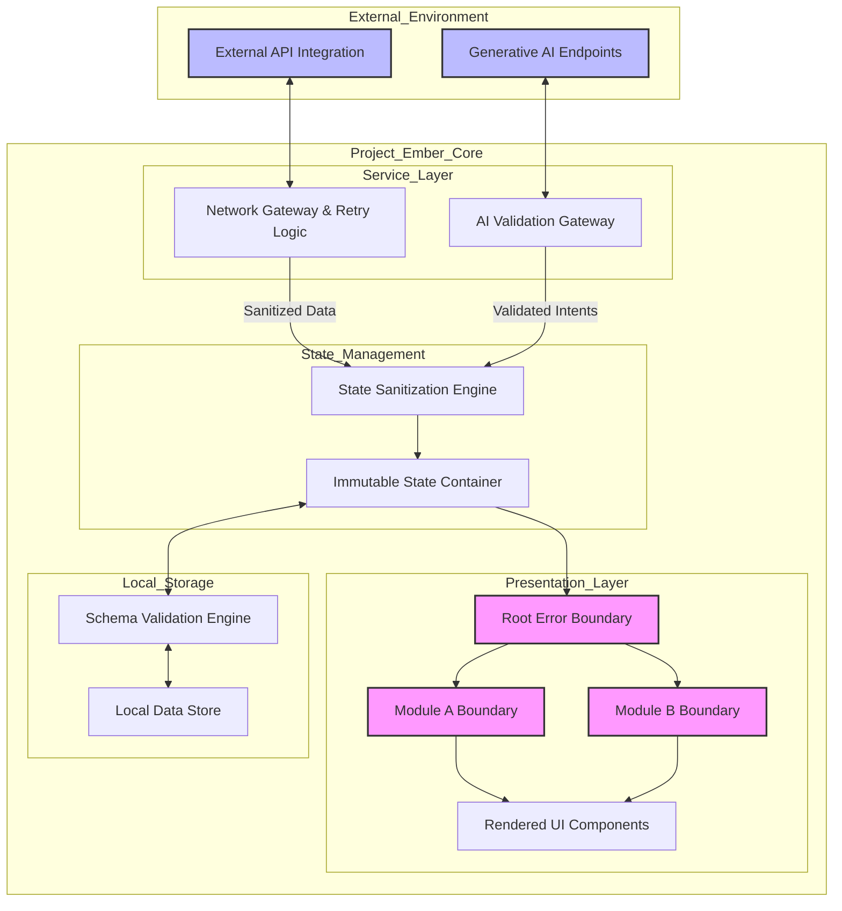

# Document 17: System Resilience Fundamentals in Project Ember

## Abstract

In the context of modern, highly interactive, and distributed client-side applications, the concept of system resilience transcends mere error handling. It encompasses a holistic, architecturally embedded philosophy where failure is not an anomaly to be avoided, but an expected variable to be managed, mitigated, and neutralized. Project Ember, drawing inspiration from the local-first, decentralized, and heavily integrated architecture of Graphite-Git, must implement a mythic level of system resilience. This document delineates the foundational strategies required to construct an environment that is fundamentally crash-proof, ensuring that the application remains functional, coherent, and secure, even when subjected to extreme external or internal perturbations. By establishing a bedrock of immutable principles—ranging from blast radius containment and state isolation to deterministic execution environments—Project Ember will achieve a state of continuous operational integrity.

## 1. Introduction to Mythic-Level System Resilience

The evolution of web applications has shifted immense computational and state-management responsibilities to the client side. Project Ember operates as a sophisticated, local-first entity, heavily reliant on direct API communications with remote platforms such as GitHub and generative artificial intelligence endpoints. This architecture, while incredibly performant and privacy-respecting, introduces profound vulnerabilities related to network latency, third-party service outages, and unpredictable data structures. 

Mythic-level system resilience is the pursuit of absolute stability in this hostile environment. It requires designing Project Ember such that any component, module, or sub-system can experience a catastrophic failure without compromising the integrity of the broader application. The user experience must degrade gracefully, rather than terminating abruptly. This entails a shift from defensive programming to offensive resilience: anticipating failure vectors and engineering the system's core to absorb, deflect, or heal from these impacts instantaneously. The objective is zero fatal crashes, zero data loss, and zero unhandled exceptions reaching the user interface.

## 2. The Architectural Paradigm of Project Ember

Drawing upon the structural achievements of Graphite-Git, Project Ember's architecture is predicated on a strict separation of concerns, dividing the system into discrete, impermeable layers: the presentation layer, the state management layer, and the service integration layer. This stratification is the first line of defense against system instability. 

By enforcing rigorous boundaries between these layers, Project Ember ensures that an error originating in a data-fetching service does not cascade into a fatal render exception in the presentation layer. The presentation components must remain entirely ignorant of network topologies, API specificities, and data fetching mechanics. Conversely, the service layer must operate independently of the DOM and the user interface lifecycle. 

This decoupling necessitates a robust intermediary: the state management ecosystem. State must act as a buffer, a sanitized sanctuary where only validated, type-safe data is permitted to reside. When a service fails, the state does not collapse; it merely transitions into an 'error' or 'stale' configuration, which the presentation layer is already programmed to interpret and render gracefully.

## 3. Local-First Durability and Ephemeral Data Structures

The local-first philosophy is central to Project Ember's resilience. By treating the browser's local storage mechanisms as the primary source of truth, the application insulates itself from the volatility of external networks. However, this introduces the risk of local data corruption, quota exceedance, and schema obsolescence.

To achieve crash-proof local storage, Project Ember must implement cryptographic validation and rigorous schema versioning for all serialized data. Before any payload is parsed and injected into the application's runtime memory, it must be validated against a strict structural contract. If the local data is found to be malformed or incompatible with the current application version, it must be cleanly discarded or migrated, rather than triggering a parsing exception that could lock the user out of the application entirely.

Furthermore, ephemeral data—information that is highly transient and context-dependent—must be carefully separated from persistent configuration and identity data. By isolating these data topologies, the system ensures that a failure in a temporary process (such as an in-progress generative AI stream) does not contaminate the enduring state of the application (such as the user's authentication tokens or critical repository metadata).

## 4. Error Propagation and Blast Radius Containment

When a localized failure occurs, the paramount directive is blast radius containment. Project Ember must utilize a labyrinth of error boundaries and exception interceptors to quarantine faults at their source. 

In the presentation layer, this involves the strategic placement of structural error boundaries around every logical component tree. If a specific interface module—for example, the generative AI interaction panel—experiences a rendering anomaly, the error boundary must intercept the exception, unmount the compromised component, and display a localized fallback interface. The rest of the application—the repository manager, the dashboard, the navigation ecosystem—must remain entirely unaffected and fully interactive.

In the service layer, error propagation must be strictly controlled through unified exception handling classes. Network timeouts, rate limit rejections, and malformed API responses must not be thrown as raw, unhandled promises. Instead, they must be caught, categorized, and transformed into standardized error objects that can be predictably interpreted by the state management layer. This structured approach prevents rogue asynchronous exceptions from bypassing the application's defense mechanisms and crashing the primary execution thread.

## 5. AI Agent Security and Execution Sandboxing

A unique vector for instability in Project Ember is the integration of an autonomous artificial intelligence agent capable of reading and modifying state or interfacing with remote repositories. The unpredictability of generative outputs requires an unprecedented level of sandboxing and structural validation.

The AI agent's execution environment must be entirely deterministic. Any intent generated by the AI—whether it is a request to read a file, initiate a commit, or modify local state—must pass through a rigid gateway of authorization and structural validation. The system must never assume the syntactical correctness or logical safety of an AI-generated payload. 

By sandboxing the AI's influence, Project Ember guarantees that the agent cannot induce a critical system failure. If the AI generates a malformed command, the validation gateway simply rejects it, logs the anomaly for telemetry, and prompts the agent to recalculate its output, all without interrupting the core application lifecycle.

## 6. System Resilience Topology

## 7. Concurrency and Race Condition Mitigation

In a highly asynchronous environment, concurrency issues and race conditions are primary culprits for inexplicable application crashes and state corruption. Project Ember must employ advanced concurrency control mechanisms to ensure deterministic behavior when multiple asynchronous operations intersect.

This involves implementing strict queuing systems for state mutations and API requests. When multiple components request data simultaneously, or when the user initiates rapid, conflicting actions, the system must serialize these intents to prevent state overlap. For instance, if an AI agent is modifying a file while the user is simultaneously attempting to save changes to the same file, the system must utilize locking mechanisms or optimistic concurrency controls to resolve the conflict predictably, rejecting the subsequent action rather than allowing a corrupt, merged state to crash the application.

## 8. Network Unpredictability and Asynchronous Fallbacks

The assumption of a stable network is a critical architectural flaw. Project Ember must operate under the assumption that the network is constantly degrading, dropping packets, and delaying responses. 

To achieve crash-proof network interactions, every outbound request must be wrapped in a comprehensive fallback protocol. This includes sophisticated timeout heuristics that abort hanging connections before they consume excessive browser resources. Furthermore, when a request fails, the application must never leave the user interface in a state of eternal loading or sudden collapse. The state must seamlessly revert to its previous, known-good configuration, and the user interface must surface contextual, actionable information about the network failure, offering manual retry mechanisms or falling back to locally cached data.

## 9. Conclusion

The pursuit of a crash-proof architecture in Project Ember requires an unwavering commitment to the principles of system resilience. By assuming that failure is inevitable and engineering the application to absorb and contain these failures, Project Ember transforms fragility into robustness. Through strict layer separation, rigorous data validation, blast radius containment via error boundaries, and defensive asynchronous management, the application establishes a mythic standard of stability. The subsequent documents in this series will delve deeper into the specific, tactical implementations of these philosophies, beginning with the autonomous mechanisms required for continuous self-healing.
