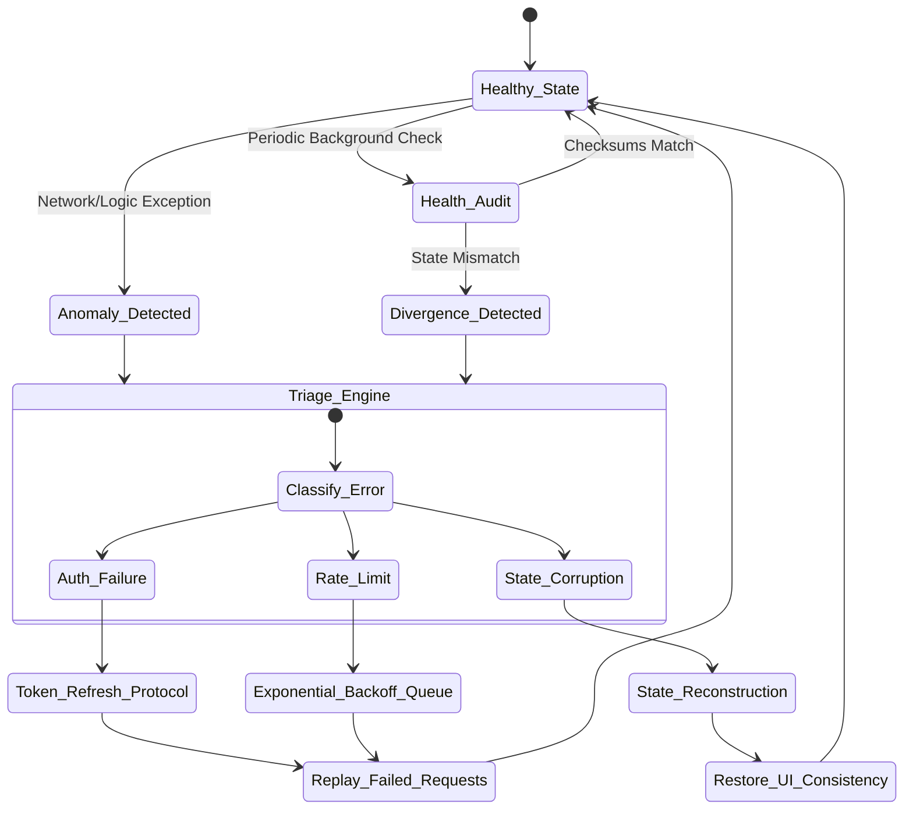

# Document 18: Self-Healing Mechanisms for Project Ember

## Abstract

A crash-proof application is not merely one that resists failure; it is one that actively repairs itself when localized failures inevitably occur. This document details the Self-Healing Mechanisms required for Project Ember. Moving beyond static resilience, self-healing introduces an autonomous, biological paradigm to software engineering. When state becomes corrupted, when authentication tokens expire unexpectedly, or when third-party rate limits are suddenly enforced, Project Ember must detect these anomalies, formulate a remediation strategy, and execute a seamless recovery without requiring user intervention or initiating a catastrophic page reload. This document outlines the architectural patterns, state reconciliation loops, and background synchronization protocols necessary to achieve continuous, autonomous system regeneration.

## 1. The Philosophy of Autonomous System Healing

In traditional web applications, an error state is typically a terminal condition requiring manual user intervention—usually in the form of a hard refresh. For Project Ember, this approach is fundamentally unacceptable. The application must possess introspective capabilities, constantly monitoring its own health, state integrity, and environmental constraints.

Autonomous system healing is predicated on the concept of homeostasis: the ability of an organism to maintain internal stability despite external volatility. In software, this translates to the continuous verification of application invariants. If an invariant is violated—for example, if a component expects an array but receives a null value due to a network anomaly—the system must immediately intercept the violation, trace it back to its origin, and apply a restorative patch, such as providing a default empty array or re-initiating the data fetch, before the violation can trigger a rendering exception.

## 2. State Reconciliation and Divergence Correction

The local-first architecture of Project Ember means that the application state is distributed across browser memory and persistent local storage, while ultimately synchronizing with remote endpoints. This distribution creates vectors for state divergence, where the in-memory state, the local storage, and the remote server fall out of sync, leading to logical errors and application instability.

To combat this, Project Ember requires a continuous state reconciliation engine. This engine acts as a background auditor, periodically comparing the application's runtime memory against its persistent storage and calculating checksums of critical data structures. If a divergence is detected—perhaps due to a browser tab being suspended and resuming out-of-sync—the engine must forcefully reconcile the state. It determines the most authoritative source of truth (usually the remote server or the most recently validated local snapshot) and silently reconstructs the runtime state to match, healing the application before the user perceives an inconsistency.

## 3. Authentication and Session Longevity

One of the most frequent causes of sudden application failure is the unexpected expiration or invalidation of authentication tokens. In a seamless, integrated environment like Project Ember, an expired GitHub or generative AI token should never result in a crashed view or a sudden, aggressive redirect to a login screen that destroys unsaved work.

Self-healing authentication requires a preemptive, multi-tiered approach. The application must monitor token lifecycles and initiate silent refresh protocols in the background long before expiration occurs. If a token is unexpectedly revoked by the remote server, the resulting API rejection must be intercepted at the lowest network layer. The network gateway must pause all outbound queues, suspend the application's interaction state, surface a non-intrusive re-authentication modal, and upon successful re-authentication, replay the suspended request queue. This ensures zero data loss and a rapid return to productivity.

## 4. Rate-Limit Recovery and Backoff Heuristics

Project Ember's reliance on external APIs, particularly for AI generation and repository synchronization, makes it highly susceptible to rate-limiting architectures. A standard application crashes or halts indefinitely when encountering a `429 Too Many Requests` response. A self-healing application dynamically adapts to these constraints.

When the network layer intercepts a rate-limit response, the healing mechanism immediately extracts the `Retry-After` headers. It then places the initiating service into a 'hibernation' state, queuing any further requests intended for that specific endpoint. The user interface must gracefully degrade, perhaps showing a 'synchronization paused' indicator, while the rest of the application remains fully functional. Once the backoff period expires, the healing mechanism automatically flushes the queue, re-initiating the delayed processes and restoring full functionality without user prompting.

## 5. Self-Healing State Reconciliation Loop

## 6. Corrupt Data Interception and Sanitization

Data flowing from external sources, or even from local storage, cannot be trusted implicitly. Malformed JSON, unexpected schema changes from third-party APIs, or corrupted local files are guaranteed to occur. If ingested directly into the application state, these anomalies will cause fatal runtime exceptions.

The self-healing architecture demands a rigorous sanitization boundary at the edge of the state management layer. Every piece of incoming data is forced through validation schemas. If the data fails validation, the system does not throw an error; instead, it attempts to heal the data. This might involve stripping unrecognized fields, providing sensible defaults for missing critical properties, or rolling back to the last known good snapshot of that specific data entity. The application heals the structural integrity of the payload before it ever reaches a component, rendering the application impervious to bad data.

## 7. Component Lifecycle Resilience

In the React paradigm, component lifecycles are vulnerable to mounting and unmounting race conditions, especially when dealing with heavy asynchronous data fetching. If a component initiates a data fetch but is unmounted before the data resolves, attempting to update the state of that unmounted component will result in memory leaks and potential application crashes.

Self-healing component lifecycles require strict, automated cleanup mechanisms. Every asynchronous operation tied to a component must be wrapped in a cancellation token or an abort controller. When the component unmounts, the healing mechanism must automatically broadcast a cancellation signal, instantly neutralizing any pending promises or timeouts associated with that component. This automated garbage collection prevents phantom state updates and ensures the application's memory profile remains pristine and stable.

## 8. Background Synchronization Protocols

For a local-first application, the illusion of instantaneous speed is maintained by performing heavy operations in the background. However, background operations are inherently prone to silent failures. If a background synchronization of repository data fails, the user may be unaware that they are operating on stale information, leading to catastrophic merge conflicts or data loss later.

Self-healing background syncs require robust retry queues and conflict resolution algorithms. If a background push fails due to a network drop, the action is automatically appended to an offline mutation queue. The system then monitors the `navigator.onLine` status and continuously polls for connectivity. Once the connection is restored, the system sequentially replays the mutation queue. If a conflict is detected during the replay (e.g., the remote file was changed while the user was offline), the healing mechanism pauses the queue and surfaces a unified conflict resolution interface to the user, ensuring data integrity is never compromised silently.

## 9. Conclusion

Self-healing mechanisms elevate Project Ember from a robust application to an autonomous, regenerative system. By implementing continuous state reconciliation, dynamic rate-limit handling, automatic token regeneration, and rigorous data sanitization, the application actively combats entropy. It neutralizes errors at their inception, reconstructs corrupted state dynamically, and ensures that the user experience remains unbroken even in highly volatile environments. This biological approach to software stability is the hallmark of mythic-level engineering, guaranteeing that Project Ember remains not just functional, but perpetually healthy.
