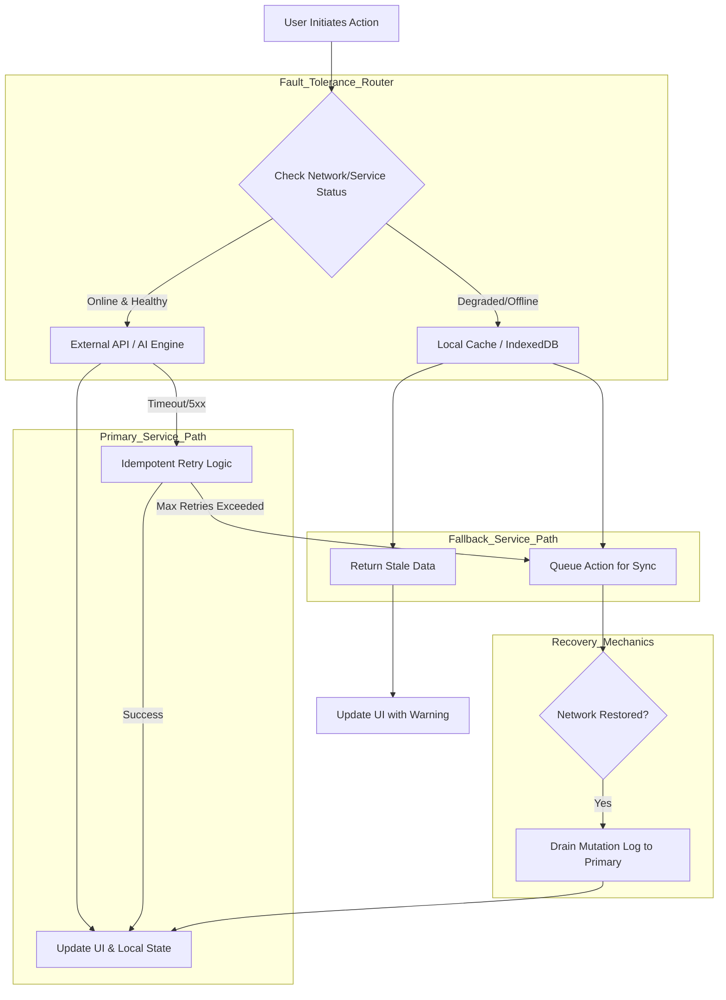

# Document 19: Fault Tolerance Strategies for Project Ember

## Abstract

Fault tolerance is the architectural guarantee that a system will continue to operate, possibly at a reduced level, rather than failing completely, when some part of it fails. In the highly integrated, distributed environment of Project Ember, components and external dependencies will inevitably degrade or become unresponsive. This document outlines the advanced fault tolerance strategies required to keep Project Ember operational under duress. By employing idempotent operation designs, strategic redundancies, local fallback logic, and offline-first capabilities, Project Ember will achieve a state of invulnerability against partial system outages. This ensures that users retain access to critical functionalities, even when the broader digital ecosystem is experiencing significant turbulence.

## 1. The Imperative of Fault Tolerance

Project Ember sits at the nexus of local processing, generative AI services, and global repository management (GitHub). Each of these nodes represents a potential point of failure. If the GitHub API experiences an outage, or if the user's connection to the AI engine drops, a fragile system would collapse, presenting the user with fatal error screens and halting all productivity.

Fault tolerance dictates that these external failures must be anticipated and circumvented. The system must possess the intelligence to recognize a failing dependency, isolate the failure, and reroute the application's logic through alternative pathways. This requires a shift from binary operational states (working vs. broken) to a spectrum of degraded, yet functional, operational modes. The goal is to provide the user with continuous value, maximizing the utility of the application based on the currently available resources.

## 2. Idempotency and Safe Retry Mechanics

A cornerstone of fault tolerance is the ability to safely retry failed operations without causing unintended side effects or data corruption. In distributed systems, it is often impossible to know whether a request failed because it never reached the server, or because the server processed it but the response was lost in transit.

To achieve fault tolerance, all critical state-mutating operations in Project Ember must be designed for idempotency. An idempotent operation is one that can be applied multiple times without changing the result beyond the initial application. For example, rather than sending a request to "increment the commit count," the system must send a request to "set the commit state to X." 

When a network anomaly occurs, the network gateway can aggressively retry idempotent operations without fear of duplication. This logic is crucial for background synchronizations, where the system must guarantee that a local change is eventually mirrored to the remote repository, regardless of intermittent network failures or dropped connections, ensuring absolute data consistency.

## 3. Strategic Redundancy and Local Fallbacks

Project Ember's local-first architecture provides a natural foundation for strategic redundancy. Because the application aggressively caches data locally, it possesses a continuous, albeit potentially stale, snapshot of the global state. 

When an external service fails, the system must execute a graceful failover to this local redundancy. If the dashboard attempts to fetch the latest repository statistics and the GitHub API times out, the application must not crash or display an empty widget. Instead, the fault tolerance routing logic must intercept the timeout, redirect the query to the local IndexedDB or `localStorage` cache, and render the dashboard using the most recently available data. The user interface must subtly indicate that the data is cached (e.g., "Last updated 10 minutes ago"), preserving transparency while maintaining full application functionality.

## 4. Offline-First Capabilities as Ultimate Fault Tolerance

The ultimate test of fault tolerance is the complete severance of external connectivity. Project Ember must be engineered as an offline-first application, capable of launching, operating, and mutating local state without any network access.

This requires comprehensive offline mutation queuing. When a user creates a branch, commits a file, or modifies a gist while offline, the application must immediately apply these changes to the local state, providing instant feedback and preserving the user's momentum. Simultaneously, these actions must be serialized and appended to a highly durable, localized mutation log. 

Upon the restoration of network connectivity, a dedicated background worker must begin draining the mutation log, sequentially applying the offline actions to the remote servers. This architecture ensures that a complete loss of internet access is merely a temporary degradation of synchronization, not a fatal interruption of the user's workflow.

## 5. Fault Tolerance Routing Architecture

## 6. Managing Third-Party API Outages

Project Ember's heavy reliance on the GitHub API means it must be highly resilient to GitHub's own operational anomalies. If GitHub experiences a severe outage, returning 500-level errors or simply dropping connections, Ember must protect itself from cascading failures.

This involves implementing strict timeout policies on all outbound requests, ensuring that a hanging connection to a degraded GitHub server does not consume all available browser threads and freeze the application. Furthermore, the system must utilize exponential backoff strategies when encountering 5xx errors, reducing the load on the failing remote system while continuously probing for recovery. During these outages, the application must seamlessly switch to a 'Read-Only Local' mode, disabling actions that require immediate remote validation while keeping all local browsing, editing, and analytical features fully operational.

## 7. AI Generation Redundancy

The integration of generative AI introduces a highly non-deterministic point of failure. AI endpoints can experience sudden latency spikes, hallucinate unparseable responses, or trigger aggressive safety filters that block requests. 

Fault tolerance in the AI layer requires multi-model redundancy and strict semantic fallbacks. If the primary, highly capable AI model (e.g., Gemini Pro) times out or returns an invalid structure, the system must automatically failover to a faster, more reliable, but perhaps less sophisticated model (e.g., Gemini Flash) to attempt the generation again. If all remote AI generation fails, the system must possess deterministic, hard-coded fallback logic—such as standard regex-based parsing or template-based code generation—to fulfill the user's request, ensuring that the feature degrades to a traditional programmatic solution rather than failing entirely.

## 8. State Immutability and Rollbacks

When a complex operation fails mid-execution, it can leave the application in a fractured, inconsistent state. To achieve true fault tolerance, the state management architecture must be strictly immutable, allowing for precise, atomic rollbacks.

When a user initiates an action, such as merging a complex pull request via the AI agent, the system must first take a snapshot of the current state. The mutations are then applied to a cloned, transient state object. Only when all asynchronous steps of the operation complete successfully is the transient state committed as the new application truth. If any step fails—due to a network error, a validation failure, or an AI anomaly—the transient state is discarded, and the application instantly reverts to the pre-action snapshot. This transactional approach guarantees that partial failures never pollute the application's core data structures.

## 9. Conclusion

Fault tolerance in Project Ember is the rigorous application of redundancy, idempotency, and isolation. By anticipating the failure of every external dependency and engineering sophisticated local fallbacks, the application guarantees continuous operational availability. Whether facing minor network latency, severe third-party API outages, or complete offline scenarios, Project Ember's architecture absorbs the impact, degrades gracefully, and maintains the integrity of the user's workflow, cementing its status as an invulnerable, local-first powerhouse.
