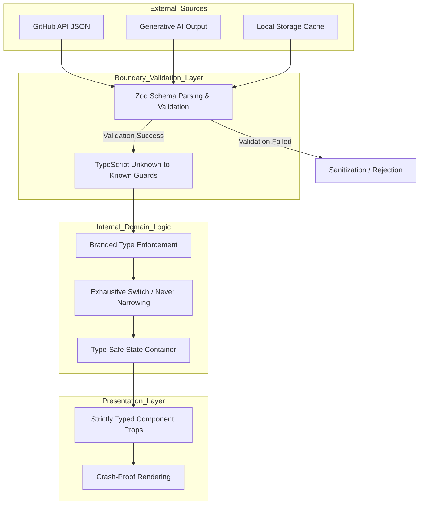

# Document 20: Bug Resistance through Typing and Static Analysis

## Abstract

A crash-proof architecture is fundamentally reliant on the elimination of preventable runtime errors. In modern JavaScript ecosystems, the vast majority of application crashes stem from type mismatches, undefined properties, and malformed data structures. Project Ember must implement a mathematically rigorous approach to bug resistance by maximizing the utility of advanced typing and comprehensive static analysis. This document details the strategies for constructing an impenetrable type safety net, utilizing strict TypeScript configurations, runtime schema validation via Zod, branded types for domain modeling, and the total eradication of unsafe type assertions. By shifting the detection of anomalies from runtime to compile-time, Project Ember will achieve a mythic level of internal stability, ensuring that invalid states are structurally impossible to represent.

## 1. The Eradication of the `any` Type

The foundational rule of bug resistance in Project Ember is the absolute and unconditional prohibition of the `any` type, implicit or explicit. The `any` type is a viral contagion that disables the compiler's safety checks, allowing invalid data structures to propagate through the application until they inevitably trigger a fatal runtime exception (e.g., `Cannot read properties of undefined`).

Project Ember's TypeScript configuration must enforce `noImplicitAny` and utilize linting rules to ban explicit `any`. Where the structure of data is truly unknown—such as when parsing arbitrary JSON from a deeply nested GitHub API response—the `unknown` type must be used. Unlike `any`, the `unknown` type forces the developer to perform exhaustive type checking and narrowing before the data can be accessed or manipulated. This seemingly draconian restriction is the primary mechanism for preventing unpredictable runtime crashes.

## 2. Runtime Schema Validation with Zod

Static typing is only effective if the data entering the system matches the compiler's expectations. Because Project Ember interacts extensively with external APIs (GitHub, Generative AI), it constantly ingests data that the TypeScript compiler cannot verify. If an API unexpectedly changes its response format, or if local storage becomes corrupted, the static types will lie, and the application will crash.

To achieve true bug resistance, Project Ember must implement an aggressive runtime validation layer using libraries like Zod. Every payload crossing the network boundary or retrieved from local storage must be parsed through a highly specific Zod schema. 

This process transforms unsafe, unknown data into guaranteed, structurally sound objects. If a payload fails validation, Zod intercepts the anomaly instantly, preventing the malformed data from polluting the application state. This transforms mysterious, hard-to-debug runtime rendering errors into clear, predictable, and easily handled validation exceptions at the system boundary.

## 3. Branded Types for Domain Integrity

Standard TypeScript types (string, number) are often insufficient for preventing logical bugs. For example, a GitHub Repository ID, a User ID, and a Commit SHA are all represented as strings. Without advanced typing, a developer could accidentally pass a User ID into a function expecting a Repository ID, and the compiler would allow it, resulting in a subtle, potentially catastrophic logical bug or a 404 API error.

Project Ember must utilize Branded Types (or Opaque Types) to enforce domain integrity. By intersecting a primitive type with a unique symbol (e.g., `type RepoId = string & { readonly __brand: unique symbol }`), the compiler treats `RepoId` as a distinct, incompatible type from a standard `string` or a `UserId`. This technique structurally prevents the accidental conflation of distinct domain entities, ensuring that functions receive exactly the specific identifiers they require, thereby neutralizing a massive category of logical bugs before code is even executed.

## 4. Advanced Type Narrowing and Exhaustive Checks

Bug resistance requires that all possible states and variants be accounted for within the application's logic. When dealing with complex state machines or discriminated unions (such as an API response that can be `Success`, `Loading`, or `Error`), the compiler must enforce that the developer handles every single possibility.

Project Ember must leverage exhaustive `switch` statements and the `never` type to guarantee comprehensive state handling. When analyzing a discriminated union, the `default` case of the switch statement must assign the variable to the `never` type. If a new state variant is added to the union in the future, and the switch statement is not updated, the compiler will instantly throw an error, because the unhandled variant cannot be assigned to `never`. This ensures that as the application evolves and new states are introduced, it is mathematically impossible to forget to handle them, preventing unhandled state crashes.

## 5. Type Validation Pipeline Architecture

## 6. Nullability and the Option Pattern

The billion-dollar mistake—null reference exceptions—must be structurally eradicated from Project Ember. The TypeScript configuration must enforce `strictNullChecks`, ensuring that variables cannot implicitly hold `null` or `undefined`.

However, simply enforcing null checks is insufficient for complex domain logic. Project Ember should heavily utilize the Option pattern (or Maybe monad concepts, implemented via utility types or libraries). By wrapping potentially absent values in explicit `Option<T>` structures, the system forces developers to explicitly unwrap the value and handle the `None` case before accessing the underlying data. This transforms dangerous, implicit nullability into explicit, structurally enforced handling, completely neutralizing `Cannot read properties of null` exceptions across the entire codebase.

## 7. AI Payload Type Enforcement

The most chaotic variable in Project Ember is the output generated by the integrated AI agent. AI models are inherently non-deterministic and can easily deviate from requested JSON schemas, causing severe parsing and logical errors.

Bug resistance against AI requires an ironclad, multi-pass validation strategy. First, the prompt must mandate strict JSON formatting according to a specific schema. Second, the raw output must be aggressively sanitized to strip conversational artifacts (e.g., markdown code blocks surrounding the JSON). Third, the sanitized string must be parsed through a highly restrictive Zod schema. If the AI deviates from the schema (e.g., providing a string instead of an array), the validation layer rejects the payload and automatically triggers a silent retry to the AI engine, feeding the specific Zod error back to the model as a correction prompt. This ensures that the internal application state is never contaminated by hallucinatory or structurally invalid AI outputs.

## 8. Static Analysis and Automated Auditing

The final layer of bug resistance is the continuous, automated auditing of the codebase. Human diligence is insufficient to maintain mythic-level stability; the machine must constantly verify itself.

Project Ember must implement a rigorous CI/CD pipeline featuring aggressive static analysis tools. Beyond standard TypeScript compilation, the pipeline must utilize advanced linters (like ESLint with strict TypeScript rules) to detect anti-patterns, cyclomatic complexity anomalies, and potential memory leaks (such as un-cleared effect hooks). Furthermore, automated dependency auditing must run continuously to detect vulnerabilities or breaking changes in third-party libraries before they are integrated into the primary branch. This automated paranoia ensures that structural weaknesses are identified and neutralized before they ever reach a production environment.

## 9. Conclusion

Bug resistance in Project Ember is not an afterthought; it is a fundamental, structural imperative enforced at the compiler level. By eradicating unsafe types, mandating strict runtime schema validation, utilizing branded types to protect domain integrity, and employing exhaustive state handling, the application becomes inherently hostile to logical errors. This paranoid, mathematically rigorous approach to data structure ensures that invalid states cannot exist within the application's runtime, providing the bedrock necessary for true, mythic-level system resilience.
